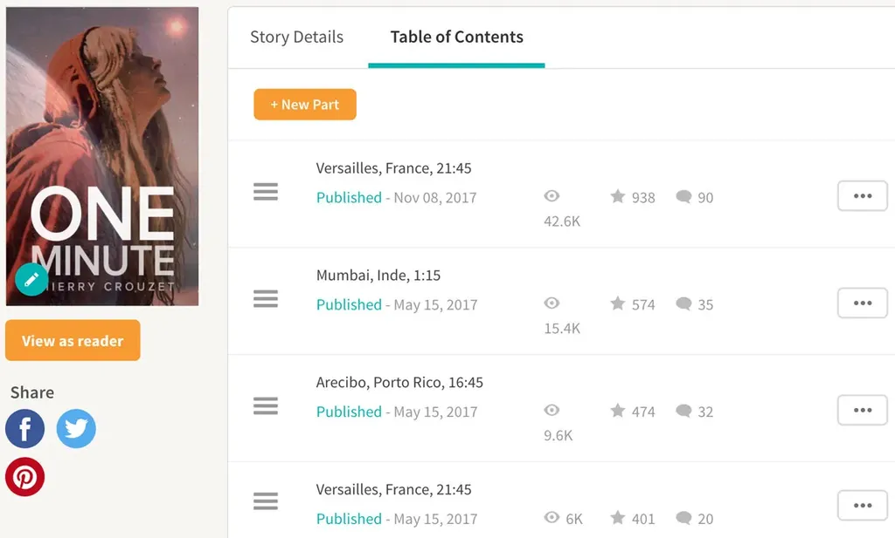

# Wattpad expliqué aux éditeurs

[*Did I mention I love you*](https://www.wattpad.com/story/38150997-did-i-mention-i-love-you) d’Estelle Maskame en 2012, [*After*](https://www.wattpad.com/story/5095707-after) d’Anna Todd en 2013, [*Chassing Red*](https://www.wattpad.com/story/18024139-chasing-red) d’Isabelle Ronin 2014… cette série de succès Wattpad transformée en série de succès en librairie a donné des idées à tous les éditeurs. En 2017, Hachette a [signé un contrat avec la plateforme d’autopublication](https://www.actualitte.com/article/monde-edition/hachette-romans-publiera-les-histoires-de-wattpad/83973) sans qu’elle soit pour autant son territoire de chasse gardé.

J’ai une amie traductrice à qui les éditeurs demandent sans cesse de lire des romans publiés sur Wattpad, en anglais et en Espagnol (et c’est pour elle aussi que j’écris ce billet). Ils veulent savoir si oui ou non ils doivent publier tel ou tel texte qui a recueilli des centaines de milliers de lectures. Ça rend folle mon amie. « Je leur dis toujours que c’est mauvais. Je n’ai jamais rien lu de bon. »

C’est logique. Wattpad est avant tout un réseau social. Quand un auteur réussit à obtenir une grande quantité de chapitres lus, c’est parce qu’il a réussi à fédérer une immense communauté. Quand cette communauté se compte en millions, il est fort à parier qu’une partie non négligeable de la communauté suivra l’auteur en librairie.

Mais il ne faut pas s’emballer. Quand un texte de cent chapitres reçoit 1 million de lectures, cela nous donne 10 000 lecteurs en moyenne par chapitre, et probablement que le dernier chapitre n’en recueille pas plus que 1 000. Ce nombre mesure la taille de la communauté des fans. Si la partie non négligeable de ceux qui suivent en librairie est de 10 %, cela se traduira par peu de ventes.

> Conseil pour les éditeurs : en dessous de 10 000 lectures pour le dernier chapitre, passez votre chemin.

Par ailleurs, le nombre d’amis d’un auteur n’est pas très significatif. Par exemple, j’ai plus de 3 000 amis sur Wattpad, mais mon texte le plus lu, *[One Minute](../../page/une-minute)*, n’a recueilli sur son dernier chapitre que 200 lectures (OK, j’ai retiré 95 % du texte quelques jours après la clôture du projet). La taille réelle de ma communauté Wattpad ne dépasse donc pas les 200 lecteurs, tout cela parce que je ne cultive pas ma communauté et ne passe pas plus de temps à me faire de nouveaux amis qu’à écrire.

J’en ai déduit que je ne pouvais utiliser Wattpad que comme plateforme de test. Désormais, j’y publie quelques pages et vois comment mes lecteurs réagissent. De toute façon, je n’écris pas pour le public de Wattpad. En voici la preuve. Comme *[One Minute](../../page/une-minute)* a fait le buzz, beaucoup de lecteurs traditionnels de Wattpad ont débarqué sur le premier chapitre. Ils ont tous lu la première phrase : « Les gens sont extraordinaires d’abnégation. » Plusieurs m’ont reproché d’utiliser des mots compliqués. En gros, ils avaient l’impression d’être en cours de français. J’ai mis du temps à comprendre qu’« abnégation » pouvait poser problème.

Par reverse ingenering, on peut en déduire la bonne façon d’écrire sur Wattpad : un style parlé, très simple, sans que les fautes ne soient nuisibles. Voilà donc pourquoi mon amie traductrice n’y trouve pas son compte, pas plus que moi quand je parcours les titres à succès. Tout n’est finalement qu’une question de taille de communauté et surtout pas de littérature, même si la littérature peut bien sûr se cacher sur Wattpad.

> Conseil pour les éditeurs : une communauté numérique se convertit mal en communauté non numérique, tablez donc sur de très grosses communautés.
>  
>  Conseil pour les éditeurs : Wattpad reste un vivier à explorer pour qui s’intéresse à la littérature, mais alors les statistiques n’ont guère d’utilité.

#edition #wattpad #dialogue #y2017 #2017-12-20-10h31
