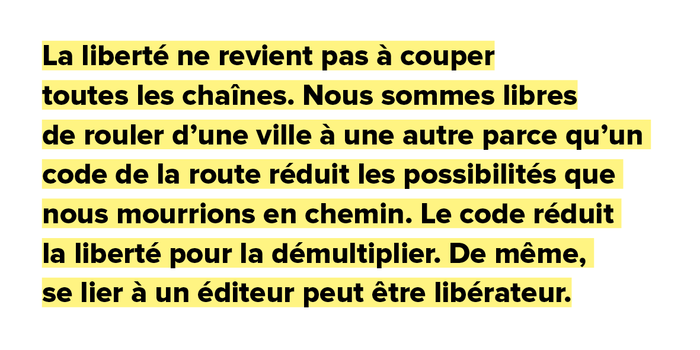

# Pourquoi signer avec un éditeur s’il faut faire tout le boulot ?

Cory Doctorow est pour beaucoup d’auteurs indépendants un modèle : contre les DRM, pour le Creative Commons, les livres distribués gratuitement même s’ils sont par ailleurs édités… Quand, soudain, il évoque [une plateforme pour aider les auteurs à vendre en direct les livres qu’ils éditent avec des éditeurs](http://www.publishersweekly.com/pw/by-topic/digital/content-and-e-books/article/73044-london-book-fair-2017-cory-doctorow-unveils-his-latest-publishing-experiment-fair-trade-e-books.html), [certains observateurs ne comprennent plus](http://the-digital-reader.com/2017/03/16/cory-doctorow-launches-bookstore-authors-sell-behalf-publishers-wait/).

Pourtant, c’est très simple. Doctorow est, je crois, un pragmatique. Il y a quelques années, il avait publié lui-même un de ses livres en auteur indépendant, avant de constater que la tâche était épuisante, qu’elle lui imposait de faire un travail qui n’était pas le sien, revenant à créer une pseudo maison d’édition. Il a donc renoncé à cette piste, préférant céder une part plus grande de ses revenus à ses éditeurs plutôt que de se substituer à eux.

La liberté ne revient pas à couper toutes les chaînes. Nous sommes libres de rouler d’une ville à une autre parce qu’un code de la route minimise les chances que nous mourrions en chemin. Le code réduit la liberté pour la démultiplier. De même, se lier à un éditeur peut être libérateur comme l’a démontré Doctorow.

Libérateur, mais aussi rémunérateur. Il ne faut pas se voiler la face. Nous gagnons souvent plus avec un éditeur qu’en solo. Quand les gourous du web, moi compris, avons prévu l’avènement de l’artisanat numérique, nous nous sommes plantés. Ce n’est pas parce que la technologie offre une possibilité qu’elle advient. Le web est devenu une métaplateforme pour d’autres plateformes qui avalent les indépendants, les noient, les dépouillent de leur valeur ajoutée. J’ai appelé ça la [plateformisation](../../2014/9/la-fin-de-lartisanat-numerique.md), d’autres ont parlé plus tard d’ubérisation.

Dans *La société hyperindustrielle*, [essai magnifiquement commenté par Hubert Guillaud](http://www.internetactu.net/2017/03/16/vers-une-societe-hyper-industrielle/), Pierre Veltz montre que nous nous éloignons toujours plus vite d’une société d’artisans interconnectés en réseau. Au contraire, tout se recentre autour des mégalopoles, autour des plateformes de plus en plus surpuissantes (et qu’importe l’infime nuée turbulante qui les entoure). Si nous autres auteurs voulons vivre, nous devons accepter cette évolution du monde, nous glisser dans les structures qui le construisent, aujourd’hui.

Au nom de l’idéologie, on peut refuser cette apparente soumission. On peut rester un intégriste du libre, de la gratuité, prétendre haut et fort que c’est la seule manière de tendre vers une société plus égalitaire et plus respectueuse.

Je continue de penser que, si nous avions été plus nombreux à appliquer nos principes, nous aurions changé le monde, mais notre minorité n’a pas empêché le [Winner-take-all](../../2014/11/sans-gouvernance-internet-devient-une-dictature.md) de tout balayer. Nous avons compris trop tard que davantage de réseau implique davantage de nœuds surpuissants. Notre rêve même a engendré ses pires cauchemars.

Chaque fois que nous donnons un contenu, et je le fais à l’instant avec ce billet, [nous alimentons le capitalisme cognitif](../1/la-liberte-2-0-mene-t-elle-droit-a-lesclavage-1-0.md), nous donnons aux plateformes plus de force, plus de pouvoirs, une position de plus en plus prééminente au centre de la société.

Doctorow a peut-être compris ça. Donner, libérer, n’est peut-être pas le meilleur moyen de créer une société plus égalitaire, bien au contraire. Pierre Veltz note que plus le réseau se développe, plus les inégalités grandissent.

Pour moi, il me paraît non seulement important de pouvoir dire ce que je vois, ce que je constate, mais aussi de pouvoir être entendu. Dans la forme hypercentralisée que prend le monde, l’écoute n’est souvent possible qu’en passant par un centre. Voilà le rôle des éditeurs dans cette logique.

En signant avec eux, nous ne renonçons pas à nos idées. Nous comprenons simplement que nous ne pouvons pas les défendre en niant la topologie centralisée du réseau. Quand je blogue, je ne suis lu que par des lecteurs qui réussissent à vivre hors des centres, je ne parle qu’à des convaincus, qu’à des initiés… dont les plus aveugles contesteront mon constat.

Que propose Doctorow ? Que les auteurs collaborent avec leurs éditeurs. C’est certes beaucoup de travail, mais pas plus de travail que s’autopublier, et c’est bien souvent plus rentable. C’est une position pragmatique, pas celle d’un arc-bouté sur un rêve devenu pour un temps impossible, sinon à le cantonner sur les marges, dans l’attente que ses conditions de possibilité renaissent.

Je ne me renie pas. Je constate simplement que ma route vers un monde plus juste était sans issue. C’était une projection mentale, une sorte de fantasme, que la réalité du terrain a contredite, exactement comme la réalité du terrain a contredit le communisme.

Il n’est pas question ici de juger de la beauté de ce qu’était notre idéologie. Il est temps d’admettre qu’elle était dans ses fondements impraticables, à moins de se donner pour son avènement plusieurs vies humaines, ce que je n’ai pas à ma disposition.

Des auteurs bien plus jeunes que moi, et que Doctorow, peuvent peut-être s’accrocher à la rampe et perpétuer notre illusion. Mais il me paraît plus utile, plus pragmatique de regarder l’Histoire et d’éviter de répéter nos erreurs. Un réseau sans gouvernance se centralise mécaniquement, jusqu’à créer des monstres. Sur un tel réseau non régulé, distribuer des contenus gratuits revient à nourrir la bête.

En refusant la gratuité de nos ouvrages, en les commercialisant à travers des éditeurs, nous ne nous soumettons pas à cette bête. Nous utilisons sa force pour la détourner contre elle-même, pour stimuler les consciences, pour que la renaissance advienne, avec de nouveaux principes, qui cette fois, espérons-le, sauront s’appuyer sur des faits plutôt que sur du jus de crâne de quelques illuminés.

### Notes sur l’indépendance

Il existe trois types d’auteurs.

1. Ceux qui ont des éditeurs.
2. Ceux qui tantôt passent avec les éditeurs (quand ils veulent bien de leurs textes) et tantôt y vont en solo (quand personne ne veut d’eux).
3. Ceux qui n’ont pas d’éditeur (et qui n’ont pas d’autre choix que l’indépendance s’il veulent publier leurs livres).

L’attitude de Doctorow est sans doute incompréhensible pour les auteurs de cette troisième catégorie. Il est facile pour eux de se revendiquer d’une idéologie du libre et de l’indépendance, étant donné qu’ils n’ont pas d’autres choix, en tout cas, provisoirement, jusqu’à ce qu’ils signent leur premier contrat, qu’ils commencent peut-être à gagner de l’argent, puis peu à peu révisent leur position.

C’est une vieille histoire. Celle du gauchiste qui se droitise avec l’âge. Mais pas seulement, c’est aussi bêtement que l’expérience apprend. Le plus dangereux pour une société, c’est de refuser de se retourner sur son passé. Quand un truc ne marche pas, il faut en inventer un autre.

#capitalisme_cognitif #edition #dialogue #y2017 #2017-3-17-10h25
