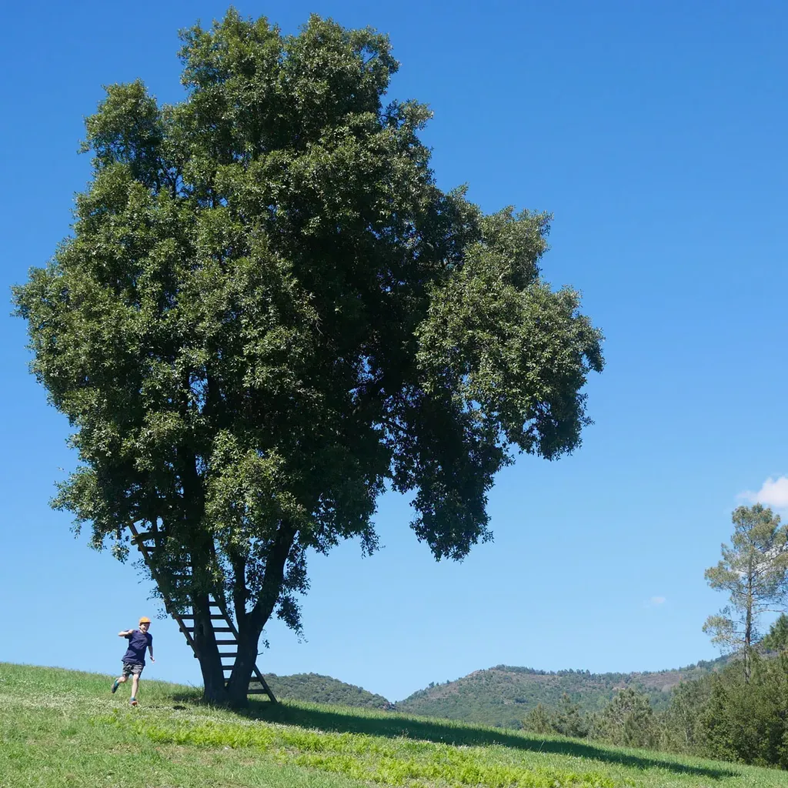

# Le dilemme de l’électeur à la veille du second tour

Nous souffrons de notre démocratie, nous rêvons d’une société plus harmonieuse, plus responsable, plus écologique en même temps que plus technologique. Nous avons même parfois démontré la possibilité, et même la nécessité, de nouveaux modes d’organisation sociale pour affronter la complexité nouvelle de nos sociétés, et pourtant, élection après élection, aucune de ces idées puissantes et optimistes ne se font entendre.

C’est en soit plutôt inquiétant. Pourquoi le vent de réforme et l’espoir de renouveau, que je pense ne pas être le seul à ressentir, ne font pas leur chemin dans les opinions, et surtout dans les urnes ? Pourquoi finissons-nous par avoir des duels entre conservateurs, voire ultraconservateurs, surtout quand ils se prétendent réformateurs ?

Sans doute nous ne nous posons pas assez souvent cette question ? À laquelle je peux trouver de multiples réponses…

1. Le modèle représentatif avec ses élections qui imposent la dictature de la majorité n’est pas propice aux idées nuancées, les seules adaptées à un monde complexe.
2. Les hommes et les femmes conscients de la complexité ne peuvent pas s’engager dans le combat électoral, ça leur fait trop mal, ça reviendrait pour eux à mettre un temps en veilleuse leurs idées dans l’espoir de plus tard y revenir. Ce serait comme demander à un pacifiste de faire la guerre pour en suite imposer le pacifisme. Faire volte-face est une chose, préméditer la volte-face est par trop machiavélique.
3. Pour réformer pacifiquement le système, il faut être part du système, donc élu, donc passer par le combat électoral, une modalité moins agressive que la guerre, mais une modalité qui reste agressive, surtout si on veut l’emporter, ce qui paraît nécessaire.
4. [J’ai écrit](les-abstentionnistes-sont-ils-irresponsables.md) : « J’ai donc le choix entre m’abstenir ou voter contre le mal incarné [le fascisme] en même temps que pour une idéologie dominante qui, partout dans le monde, approche sans cesse davantage ce mal du pouvoir, tout en augmentant sa dangerosité. » Ce dualisme s’efforce d’écarter toute véritable alternative. Les conservateurs ont tout intérêt à se créer un adversaire encore plus conservateur, encore plus désuet et effrayant, pour faire taire toute réelle alternative, et nous forcer par dépit à le soutenir (je ne pense pas à une théorie du complot, tout cela est fait dans la totale inconscience, tant les conservateurs sont persuadés qu’il n’existe à eux-mêmes aucune alternative, c’est leur croyance qui fabrique leurs adversaires fascistes, prêts à accepter leurs règles).
5. Puisque les idées nouvelles ont du mal à faire surface dans les débats politiques, on voit ce qui est arrivé à l’idée de revenue de base un temps soutenue par Benoit Hamon, il faut bien admettre que le système représentatif n’est pas propice à ces idées. Et donc, si ces idées sont pertinentes, nécessaires, vitales, nous devons nous attendre à ce que le système représentatif se perpétue jusqu’à ce qu’il s’effondre faute de pouvoir s’adapter à la complexité du monde. Ce n’est pas être oracle : un système qui n’admet pas son renouvellement est condamné. Ce n’est peut-être pas une raison suffisante pour précipiter son effondrement en laissant les fascistes atteindre le pouvoir. Gagner du temps, c’est se donner une chance d’éviter l’effondrement.
6. Les systèmes complexes sont quasiment ingouvernables. Donc tous ces candidats qui recherchent le pouvoir ne sont que des bouffons. « Autant les laisser s’épuiser, peuvent se dire les véritables réformateurs qui souvent agissent au niveau local. » Mais ce faisant, les pitres politiques occupent le champ médiatique, ils donnent à croire qu’ils ont de l’importance, ils détournent l’attention des idées novatrices, ils nous font perdre un temps précieux, et malheureusement ils conservent leur capacité de nuisance.
7. Nos idées de réformes sont peut-être encore trop utopiques, trop lointaines pour qu’elles émergent. Et dans cette situation, il faut faire preuve de patience, continuer à militer dans l’ombre, accepter de laisser la scène à des rétrogrades. C’est assez douloureux, je l’avoue.
8. Nos adversaires nous traitent de perdants parce que nous refusons le combat suivant les modalités qu’ils nous imposent. Ils n’acceptent pas notre volonté de changer les règles du jeu, ce qui théoriquement impose une révolte armée, ce à quoi pourtant nous nous refusons. Comment donc agir sinon en travaillant au niveau local, à notre échelle, avec nos moyens et nos armes, pour moi les mots ?
9. Chaque fois, j’en arrive à la conclusion que la voie pacifiste passe par l’ombre, et donc hors d’une élection, alors même que nous disposons des médias numériques pour nous faire entendre, mais, là encore, les idées conservatrices et les discussions qu’elles entraînent brouillent le bouillonnement optimiste. Le problème paraît sans issue, désespérant, il m’incite souvent à me réfugier dans mon jardin, en bon épicurien.
10. Le constat de l’impuissance à court terme, terme propre à la démocratie représentative, est douloureux, car dans le même temps notre durée de vie n’est pas extensive à l’infini, ce qui diminue la probabilité pour nous de voir advenir les changements auxquels nous aspirons. Alors l’envie est toujours présente de vouloir accélérer les choses d’une manière ou d’une autre. Pour un écrivain, ce serait écrire le livre qui provoquerait un déclic. Une autre utopie : car il n’existera pas un déclic, mais presque autant de déclics que d’individus.

Je ne peux pas conclure ce billet, je suis obligé de suspendre ma réflexion pour le moment sans issue.

#politique #dialogue #y2017 #2017-4-26-9h43
