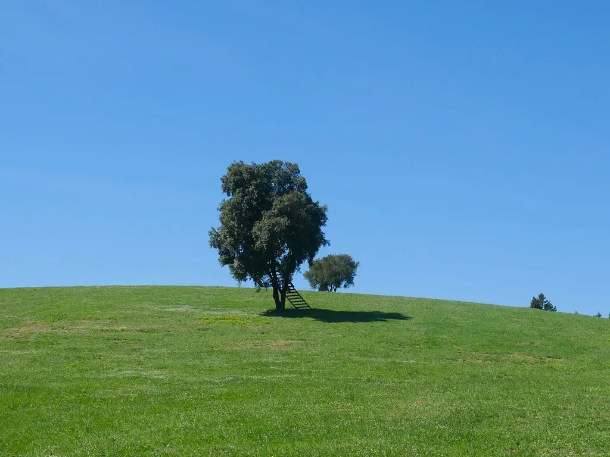
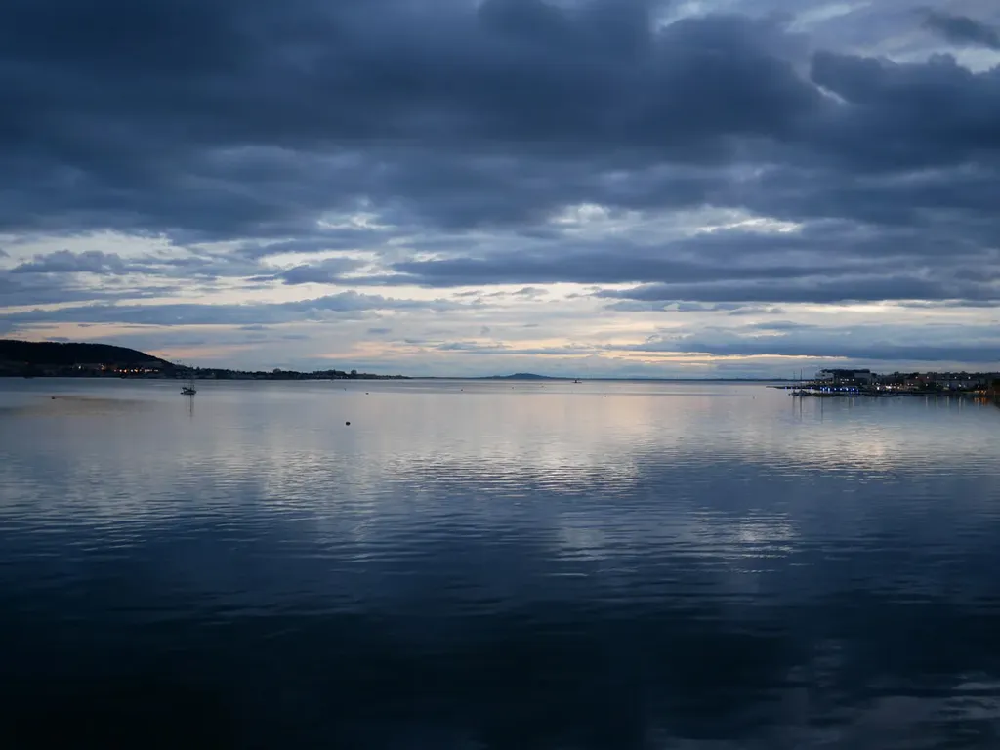
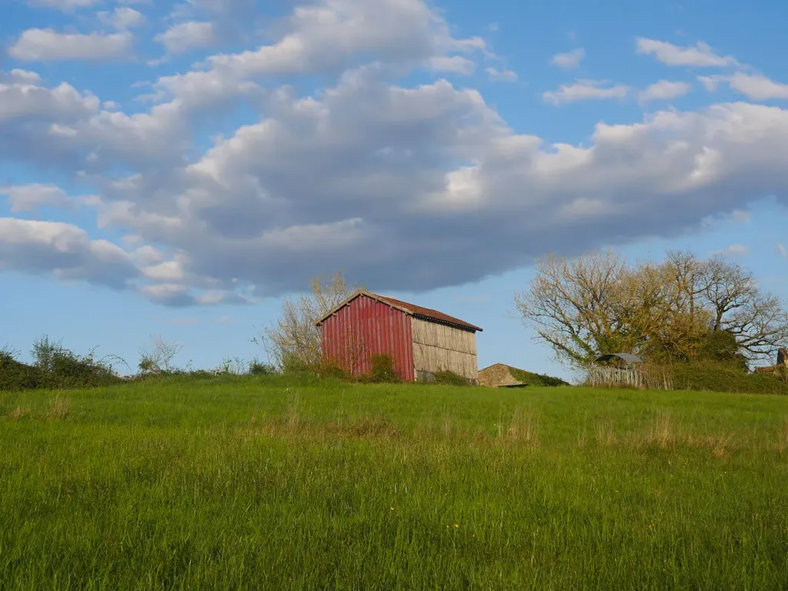
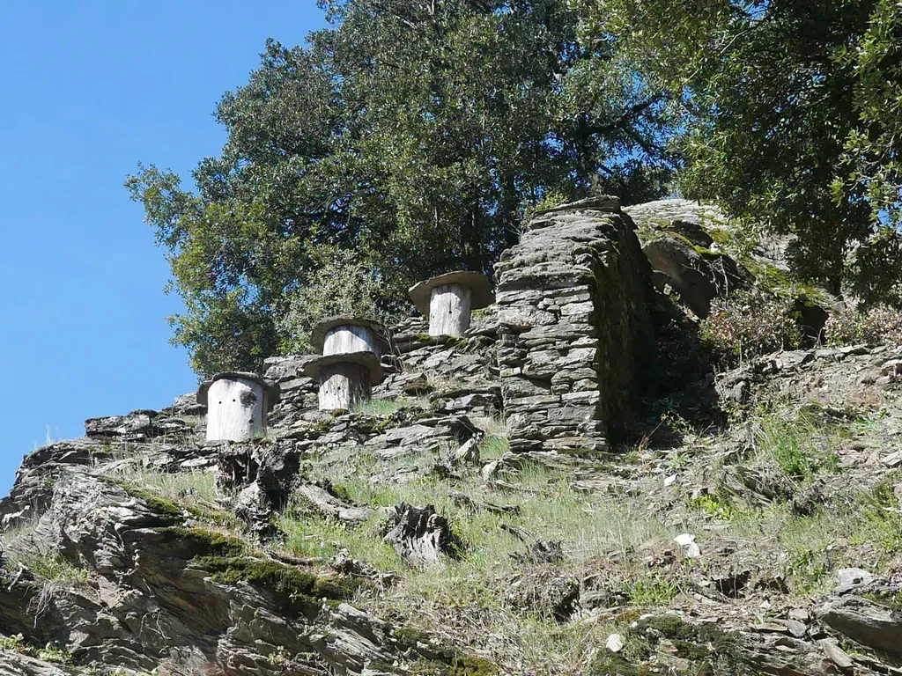
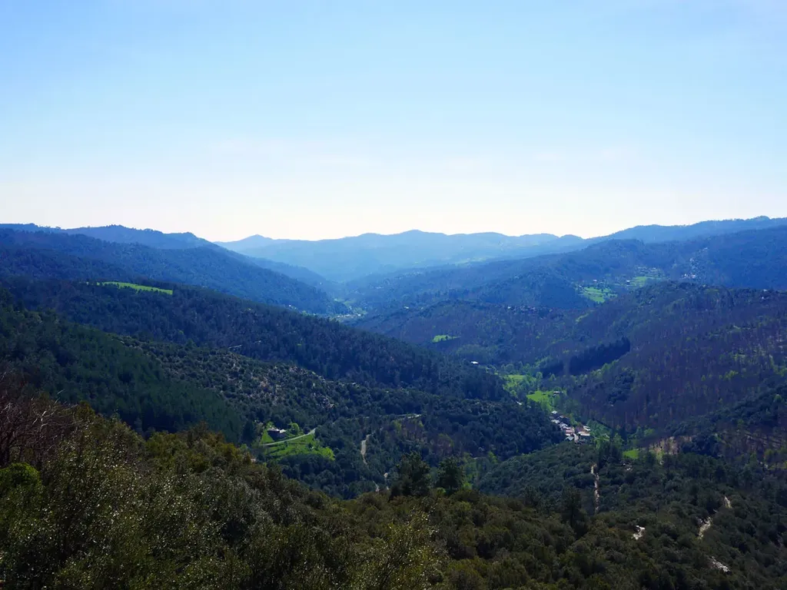
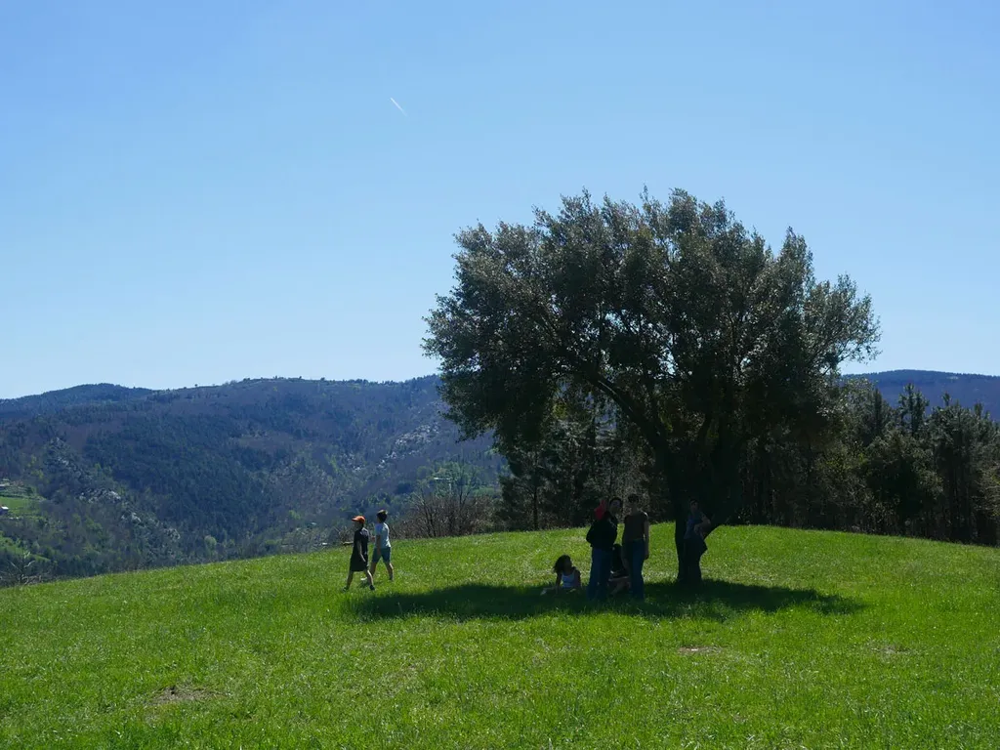

# Avril 2017

### Samedi 1er avril, Balaruc

### Lundi 3 avril, Maillardou

### Jeudi 6, Maillardou

Je cours, je fais du vélo, je traficote une vague promo pour *Résistants*, je n’écris pas, je n’en ai pas envie, j’en suis au point où même inscrire quelques mots dans ce carnet me pèse, c’est comme si plus jamais je n’écrirai. Je ne fais cette remarque que pour mémoire.

### Vendredi 7, Maillardou

Matinée passée à optimiser mon site pour les portables. Le Web devient de plus en plus compliqué en même temps que de moins en moins intéressant.

---

Depuis le début de la semaine, toutes les fins d’après-midi, je joue à *Donjons & Dragons* avec les enfants, ils adorent. Ils ne parlent que de ça. Voilà peut-être pourquoi je n’écris pas, je leur fais vivre des histoires.

### Lundi 10, Balaruc

Quand un livre est publié, les plateformes en ligne diffusent gratuitement son début. Je récupère *Résistants* et le copie-colle sur Facebook. De voir mes mots, auxquels je ne peux plus toucher, et auxquels j’ai déjà trop touchés pour qu’ils me touchent encore, j’ai ressenti l’écœurement (le même qu’avec une personne aimée avec laquelle on n’est plus capable de faire l’amour).

Tous mes livres ont provoqué en moi une réaction identique. Les autres auteurs ne ressentent pas ça ? Je les vois lire leurs textes en public comme s’ils en éprouvaient du plaisir, parfois comme s’ils étaient contents d’eux. Sont-ils hypocrites ?

### Mercredi 12, Sainte-Croix-Vallée-Française

Nous poursuivons les vacances dans les moutonnements tortueux des Cévennes. Je ne sais même pas si je serai capable de photographier. C’est juste magnifique, d’une beauté qui me semble inaccessible, comme si j’étais incapable de hausser ma beauté intérieure à la même hauteur ; bien sûr par manque d’énergie.

Je n’ai pas encore tourné la page *Résistants*. Le livre sort dans une semaine et le silence qui accueille la plupart des livres me fait peur. Ça pourrait être mon dernier livre ? Celui qui réduira à néant la possibilité des suivants par la vague d’indifférence qu’il aura déclenchée.

Ou au contraire, par ce silence, me libérer définitivement. Parce que *Résistants* était tout sauf à ma tête. C’était un livre de commandes, un livre d’artisan, un livre de militant, un livre sur lequel j’ai accepté, et même réclamé, les pires interventions. Depuis longtemps il n’est plus de moi. J’ai accouché d’un étranger. Les femmes éprouvent souvent le même sentiment lorsqu’elles donnent naissance. Je ne connais rien de ce livre, j’ignore tout de qu’il deviendra, je ne veux pas y penser, alors j’affronte un grand vide, et il me paralyse, m’empêche de le franchir, pour découvrir d’autres chemins, au moins aujourd’hui j’affronterai ceux des Cévennes, heurtant mon corps aux cailloux, aux senteurs des sapins, au bleu délavé du ciel.

Un écrivain, c’est une mère qui enfante sans fin dans l’espoir qu’elle comprendra mieux son prochain enfant. Ou c’est une mère qui fait l’amour en oubliant les conséquences tangibles de l’amour.

J’en suis à un embranchement assez ordinaire de ma vie d’écrivain. Sa simplicité me terrifie.

1. *Résistants* marche suffisamment pour me donner le droit, et l’envie, de publier un nouveau livre avec un éditeur.
2. *Résistants* ne marche pas, et je n’ai vraiment plus aucune raison d’embêter les éditeurs avec ma camelote. Ce qui implique de continuer seul, librement, mais seul.

### Jeudi 13, Sainte-Croix-Vallée-Française

### Lundi 17, Balaruc

Depuis deux jours, je code un script qui parcourt dix ans de mails à la recherche de tous ceux qui m’ont écrit ou dont j’ai été en copie. Près de 8 000 adresses trouvées, je vais leur envoyer une pub pour *Résistants*, tout en sachant que ça n’aura que peu d’effet.

---

Je critique Google depuis des années, mais je dois reconnaître qu’ils sont forts. Leur environnement de développement est génial. Je charge mes mails, les dissèque, enregistre les adresses découvertes dans un tableur, tout ça avec quelques lignes de code.

### Mercredi 19, Balaruc

*Résistants* est sorti sans le moindre tremblement de terre pendant que ma newsletter spamme mes contacts. C’est comme si l’élection de dimanche paralysait la France. Fait en lui-même assez inquiétant : les gens attachent donc de l’importance à cette mascarade.

### Jeudi 20, Balaruc

Je dois passer à autre chose… sans encore trouver la force.

### Vendredi 21, Balaruc

Depuis des années, j’avais envie de reprendre *Le pleuple des connecteurs*, *Le cinquième pouvoir*, *Les crapauds fous* et *L’alterative nomade*… et de les réunir dans une quadrilogie. Je viens d’ouvrir le chantier.

### Samedi 21, Balaruc

Sortie VTT. Je pète la forme. Je suis les jeunes dans une descente endiablée au fond d’un canyon, ma roue avant se plante contre une pierre, je passe par-dessus le guidon, magnifique soleil, je cogne mon casque contre les cailloux, le vélo retombe sur moi. Mes amis me libèrent. J’ai du mal à me relever. Je sais déjà que je me suis fêlé une côte et j’ai mal à la main. Je rentre tant bien que mal à la maison. Quatre heures plus tard, je sors de l’hôpital avec une attelle à la main gauche, où j’ai une petite fracture ouverte. Quelque chose a transpercé mon gant pour aller m’arracher un morceau dos. Au moins dix jours d’immobilisation. Vieillir, c’est apprendre la prudence. Je dois retenir la leçon.

### Mardi 25, Balaruc

La chute en VTT a entraîné la chute d’une couronne qui chevauchait une de mes prémolaires. Le dentiste me nettoie tout ça, m’enlève l’ancien pivot et me donne une ordonnance avec des antibiotiques, au cas où. Je devrais déjà être sous antibiotiques si j’avais écouté les médecins, samedi. Tout ça la semaine où je sors *Résistants*. Tous ces médecins devraient lire mon roman, ils en ont autant besoin que leurs patients.

### Vendredi 28, Genève

Nous venons d’arriver chez Didier Pittet, au moment où le Salève s’embrase. En route, après Valence, nous avons longé les contreforts du Vercors, sous un ciel orageux, parfois violet, traversé de saignées lumineuses qui partaient du plateau enneigé jusqu’aux alpages éclatants.

### Samedi 29, Genève

Nous acceptons les jougs des structures hiérarchiques parce que tout au long de notre histoire nous avons accepté le joug des forces naturelles, forces contre lesquelles nous nous sommes pourtant révoltés, avec nos technologies. Il est temps de nous révolter contre les forces sociales, d’autant plus qu’elles n’ont rien d’inflexible contrairement aux forces naturelles.

### Dimanche 30, Genève

Publier un livre, c’est comme avoir un enfant en accéléré : il faut le voir grandir et quitter la maison à toute vitesse, et ne plus vouloir influer sur sa vie. Je préfère écrire que publier, je préfère promouvoir mes livres en ligne que derrière une table dans un salon, exercice auquel je me prête de temps à autre, pour garder ma carte du parti des auteurs traditionnels.

---

Une idée me contamine peu à peu, celle d’Adam vivant sur une planète sauvage, ponctuée de vestiges dont l’ancienneté relative ne fait pas de différence, et lui est là, tranquille, qui profite de la vue, de la brise marine… alors une troupe débarque pour l’assassiner, sans y réussir, puis des scientifiques veulent l’étudier, puis une femme le séduire… Ce serait une histoire sur le mode narratif de *One Minute*. Tout le monde dans l’humanité interstellaire se demande qui est Adam et, peu à peu, en croisant des perspectives, on découvre son secret, celui d’un philosophe qui est en même temps le dernier et le premier homme. J’ai envie de parler d’une humanité heureuse, d’une humanité dans laquelle j’aimerais vivre.

#carnets #y2017 #2017-5-2-8h14
