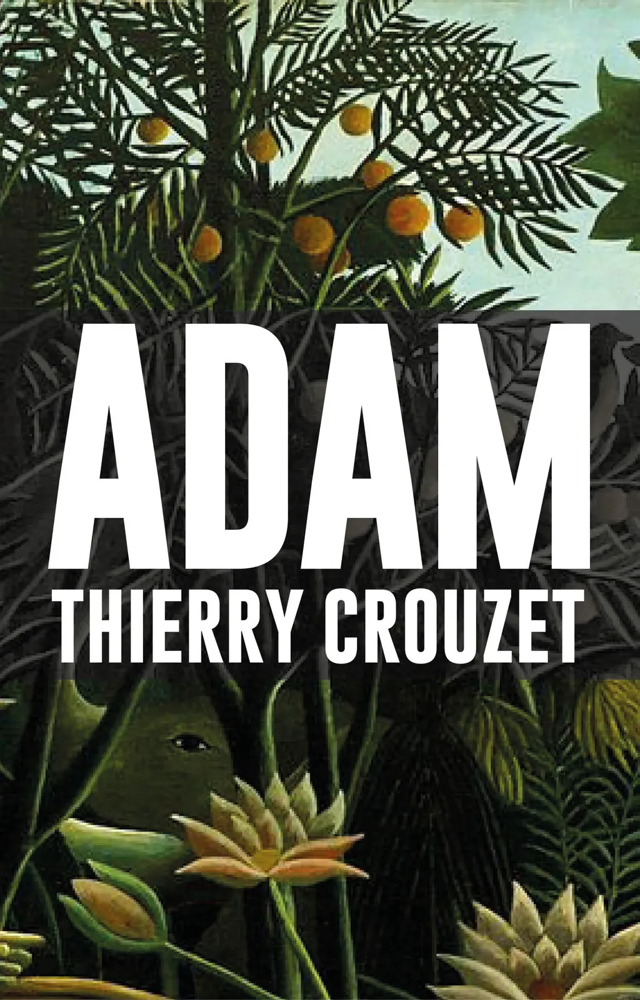

# Fin des écritures sur le blog

Ne vous réjouissez pas, je n’ai pas décidé d’arrêter de bloguer, simplement de ne plus pousser sur mon blog mes expériences d’écriture. À l’avenir, en tout cas pour un certain temps, je dédie ces pages à [mon carnet de route](#carnet-de-route/?serial=1), [mes vagabondages](#vagabondage/?serial=1) et mes diverses réflexions sur [l’écriture](#netlitterature/?serial=1), [l’édition](#edition/?serial=1), [le Net](#netculture/?serial=1), [la politique](#politique/?serial=1)…

Aujourd’hui, je débute la publication sur Wattpad d’un nouveau projet romanesque, [Adam](http://my.w.tt/UiNb/PnbtfTA1YC). Je ne sais pas encore quelle tournure il prendra. Il n’a fait que s’imposer à moi, et ça me fait du bien d’enfin me remettre à la fiction, tout en ouvrant les portes de mon atelier.

*PS : Je renonce à publier mes textes narratifs sur le blog parce que la forme blog ne leur apporte rien, ne me stimule en rien, et même au contraire me nuit.*

#cuisine #dialogue #y2017 #2017-5-8-17h18
