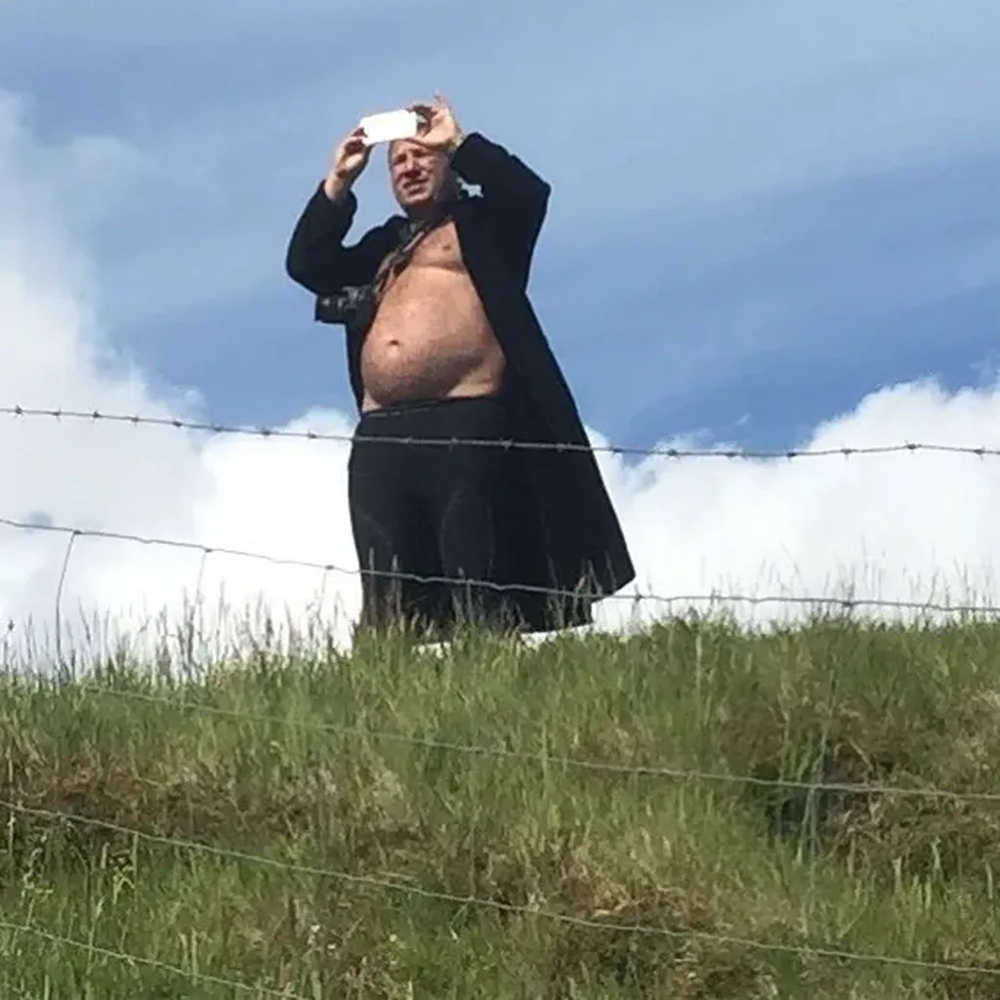
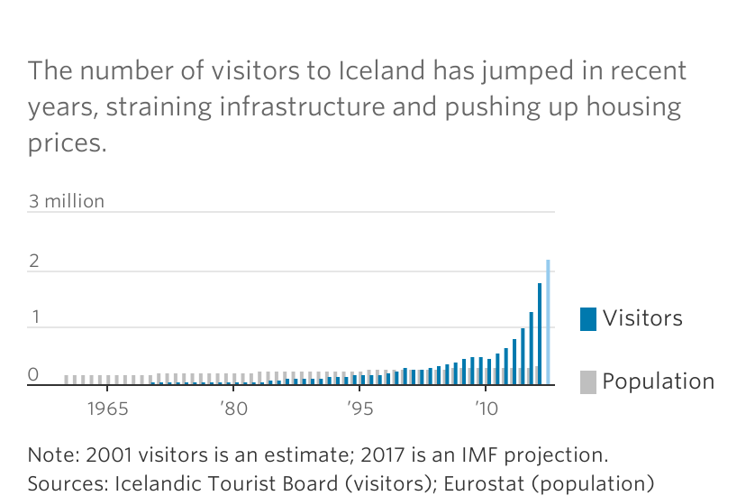

# 20 raisons de ne pas voyager en Islande

1. Tout le monde vous dira que l’Islande c’est génial, raison d’être soupçonneux et pas tomber dans un piège marketing savamment orchestré (d’autant que quand on a dépensé une fortune pour ses vacances, on a du mal à en dire du mal contre l’avis de tous).
2. En 2017, l’Islande devrait [accueillir au moins 2,2 millions de touristes](https://www.wsj.com/articles/tourism-saved-iceland-but-now-its-a-headache-1503223203#), soit six touristes par Islandais. En comparaison, [la France accueille 1,2 touriste par Français](http://www.lefigaro.fr/flash-eco/2017/02/10/97002-20170210FILWWW00141-france-pres-de-83-millions-de-touristes-etrangers-en-2016.php) (et c’est déjà souvent l’enfer pour eux). Cette haute densité touristique fait ressembler l’Islande à Saint-Tropez ou à Saint-Paul-de-Vence.
3. Entre 2015 et 2016, le nombre de touristes a augmenté de 40 %, et ça continue.

4. Les Islandais se transforment en marchands de sommeil, aménageant leur maison en guesthouse où ils entassent les touristes ou bien ils investissent dans des complexes hôteliers qu’ils posent n’importe où au bord des routes, sans manifester le moindre art de vivre.
5. Faute de main d’œuvre locale, les Islandais importent des travailleurs européens, surtout de l’Europe de l’Est, qui pour la plupart ne cachent pas leur mauvaise volonté. Accueil déplorable. Il est très rare d’avoir affaire à des Islandais.
6. L’Islande se situe juste sous le cercle polaire, donc quand vous y voyagez vous jouez vos vacances à la roulette, risquant même en été de passer deux semaines dans la brume et la pluie.
7. L’Islande n’est pas un pays sauvage. Hors des hauteurs désertiques, et parfois glacées, hors des champs de lave, on ne rencontre que des prairies tondues par les moutons, ce qui finit par lasser.
8. De l’Islande, on voit souvent de magnifiques photos de cascades et de geysers, les photographes oublient d’élargir le cadre et le fixer le parking rempli de bus.
9. La croissance a fait grimper les prix. Un Français plutôt aisé s’y sent comme un pauvre malheureux, incapable de payer un véritable repas à sa famille (il faut compter pour boisson, plat et dessert, pas moins de 50 €/personne, soit 400 €/jour pour une famille de quatre). Donc, prévoyez de manger le plus souvent dans les supermarchés, ce qui vous coûtera déjà le prix d’un très bon repas en France (un fish & chips à l’huile rance, c’est 15 €).
10. Les infrastructures ne suivent pas la croissance. Beaucoup de routes ne sont pas goudronnées, ce qui impose de rouler en 4x4 à moins d’accepter de se traîner à une allure d’escargot.
11. Pisser coûte souvent 5 €. Si toute la famille y va, ça commence à faire. Donc, sautez les barrières ou pissez dans la nature.
12. Visiter une vulgaire grotte basaltique coûte 40  €/personne. C’est un exemple. Tout est à ce niveau. Passer trois heures sur un bateau pour voir le dos d’une baleine, c’est 80 €/personne (et vous êtes quarante sur le bateau).
13. Si vous aimez courir, ce sera au bord des routes, parce qu’il y a très peu de voies aménagées pour les piétons, et aussi très peu de chemins de randonnée. Certains coins en sont totalement dépourvus, rien d’autre à faire que de prendre sa voiture, s’arrêter aux points de vue, repartir (quand la pluie s’en mêle, c’est génial).
14. À cause des conditions climatiques difficiles, il est quasi impossible de prendre son temps (et, souvent, il n’existe pas de café où se poser pour lire, des petits coins près du feu seraient appréciables). Ce qui entraîne un tourisme très automobile (à moins de se lancer dans un tour de l’Islande à vélo, ce qui vu la monotonie des routes ne présente guère d’intérêt, sauf pour les masochistes, assez nombreux).
15. Hors de Reykjavik, n’attendez pas à trouver de la vie. Tous les villages sont morts, on n’y croise personne, surtout après 18 heures, on a même l’impression qu’une alerte atomique a retenti sans qu’on en soit averti (même les touristes sont invisibles puisqu’ils roulent pour rentabiliser leur séjour).
16. Ne croyez pas que les choses s’amélioreront à brève échéance. L’aéroport international de Reykjavik va tripler sa capacité, passant de 5 millions de voyageurs/an à 15 !
17. Les Islandais sont en train de manger la poule aux œufs d’or du tourisme. Des routards qui ont visité l’île dix ans plus tôt disent qu’ils ne la reconnaissent plus et qu’ils n’y reviendront jamais. Avoir quelques beaux paysages et quelques phénomènes naturels exceptionnels ne suffit pas à faire oublier des conditions de voyage déplorables.
18. Les tours opérateurs sont en train de prendre le pouvoir, car eux seuls sont désormais capables de tirer les prix, ce qui explique les innombrables bus sur les parkings des sites naturels.
19. Les marchands de sommeil n’ont peur de rien. Ils vous font payer 200 € une mansarde éclairée par un minuscule velux ou vous font dormir dans un rez-de-chaussée qui donne sur un parking, ça pour 400 € (tout ça sous prétexte que vous avez à disposition du mobilier Ikea flambant neuf). Pour ce prix en Europe du Sud, vous avec une chambre dans un hôtel de charme avec piscine, le repas gastronomique compris.
20. L’Islande, ça devait être bien avant, et ça le sera peut-être demain, en attendant, il existe des dizaines d’autres destinations plus spectaculaires à moindre prix (un voyage de 15 jours en Islande revient plus cher qu’un voyage d’un mois aux USA, et franchement les grands parcs américains pulvérisent en *scenerie* les paysages islandais).

*PS1 : Texte écrit dans l’avion qui me ramène d’Islande. Pas malheureux de rentrer à la maison. Pour plus de détails sur mon voyage, [lisez mon journal de juillet](../8/carnet-de-route-juillet-2017.md).*
*PS2 : Pour tous ceux qui m’accusent d’avoir déliré, de mentir, d’être de mauvaise foi, le Wall Street Journal a publié le 20 août [un article qui dit plus ou moins la même chose que moi](http://www.cetusnews.com/news/Tourism-Saved-Iceland--but-Now-It%E2%80%99s-a-Headache---.BkmkNlkPO-.html).*

#buzzlitt #y2017 #2017-7-25-15h22
