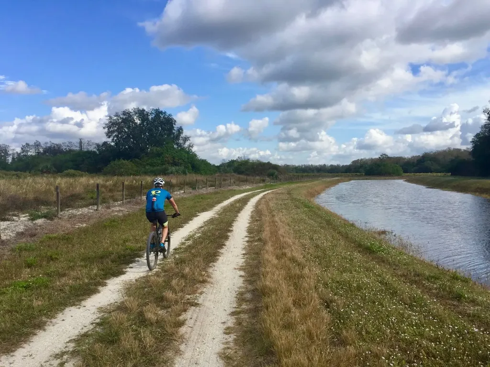
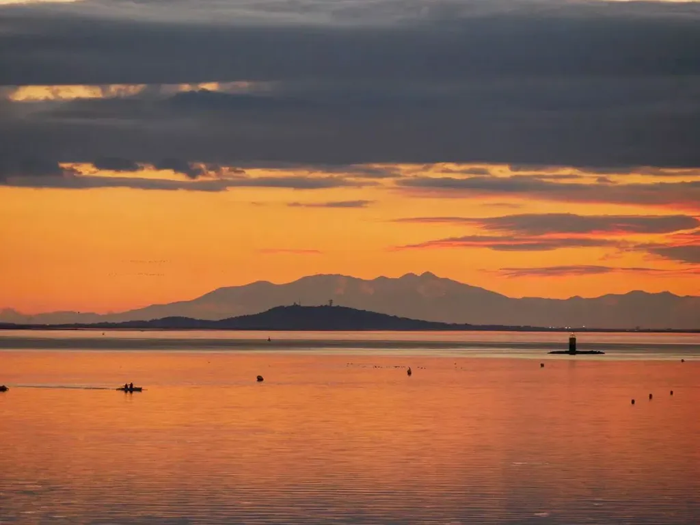
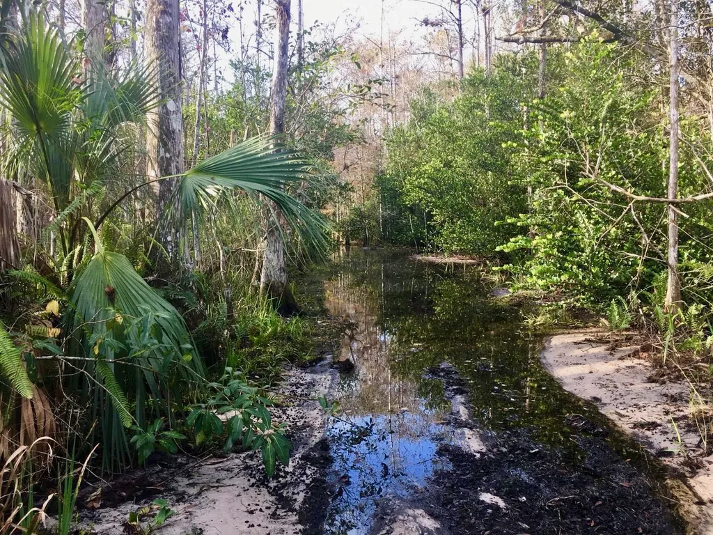

# Être territoire

Quand nous faisons du vélo, [nous travaillons les dimensions sportive, sociale, pilotage et esthétique (voir chapitre 1)](../11/lart-du-velo.md). Mais le vélo lui-même n’est-il pas un obstacle entre nous et la nature ? Un skieur pourrait se poser la même question au sujet de ses skis, un navigateur au sujet de son bateau, tous les aventuriers au sujet de leur équipement. Même les coureurs se la posent. Dans [*Born to Run*](https://www.amazon.com/Born-Run-Hidden-Superathletes-Greatest/dp/0307279189/), [Christopher McDougall](https://en.wikipedia.org/wiki/Christopher_McDougall) nous parle des adeptes de la [course à pied minimaliste](https://fr.wikipedia.org/wiki/Course_%C3%A0_pied_pieds-nus), notamment de [Barefoot Ted](#), qui pensent que leurs chaussures les éloignent de la nature et qui choisissent de courir pieds nus ou avec des [sandales](https://fr.wikipedia.org/wiki/Chaussure_%C3%A0_orteils). Alors, le vélo nous éloigne-t-il de la nature ? Avant de répondre à cette question, il me paraît intéressant de comprendre le choix de coureurs minimalistes.
[D’après les recherches du professeur Daniel Lieberman menées à Harvard](https://www.youtube.com/watch?v=7jrnj-7YKZE), quand on court avec des chaussures, le talon touche d’abord le sol, ce qui provoque un impact vertical qui remonte tout au log du corps avec une énergie deux fois supérieure à celle du poids du coureur. En revanche, quand on court pieds nus, on pose d’abord l’avant du pied, qui alors pivote jusqu’à ce que le talon touche le sol, ce qui réduit l’impact et minimise les risques de traumatismes : moins de problèmes à la voûte plantaire (j’ai souffert d’une [fasciite plantaire](https://www.passeportsante.net/fr/Maux/Problemes/Fiche.aspx?doc=fasciite_plantaire_epine_lenoir_pm)), moins de problèmes aux genoux (j’ai eu ma dose de [syndrome de l’essuie-glace](https://fr.wikipedia.org/wiki/Syndrome_de_la_bandelette_ilio-tibiale)), moins de problèmes aux hanches (j’ai eu droit à une belle inflammation du [psoas iliaque](https://www.personal-sport-trainer.com/blog/psoas/))…

Si certains coureurs choisissent le minimalisme pour des raisons de santé, d’autres effectuent un choix philosophique. Par exemple, Barefoot Ted court pieds nus [parce que les hommes courent pieds nus depuis deux millions d’années](https://www.youtube.com/watch?v=Y2rWf7DuOtQ). Selon lui, quand on en revient à un mode de vie plus simple, plus originel, on est en meilleure santé, on est plus heureux, plus épanoui. Si Barefoot Ted a raison, je dois abandonner le vélo, car je n’ai aucune chance de travailler la dimension esthétique. Mais Barefoot Ted a-t-il raison ?

Le lien entre santé et bonheur me paraît évident. J’ai longtemps souffert de crampes intestinales, et je ne pouvais m’empêcher de gamberger, de croire que j’avais une maladie mortelle, même si les médecins me disaient le contraire. À la longue, la douleur se communique du corps à l’esprit, et j’avais tendance à tout voir en noir. C’est d’ailleurs une des raisons qui m’a poussé à courir parce que la course en secouant l’intestin a tendance à le détendre. Je ne connais pas de meilleur massage.

Le début du raisonnement de Barefoot Ted est donc difficile à contester : la santé contribue au bonheur. Reste à savoir si le retour aux sources, autrement dit le minimalisme, contribue à la santé ? Les paléontologues ont découvert que l’espérance de vie humaine s’est effondrée au moment de la révolution néolithique quand nos ancêtres se sont sédentarisés, basculant d’un régime de chasseurs-cueilleurs à un régime d’éleveurs-cultivateurs qui impliquait une nourriture moins diverse et une plus grande proximité entre les hommes et les animaux, ce qui favorisait la propagation des maladies.

Si on s’arrête à cette constatation, on peut en conclure que la sédentarisation est mauvaise. On peut même généraliser en affirmant que toute forme de progrès technologique, l’urbanisme du néolithique étant une technologie, est mauvaise. Aller dans ce sens serait oublier que nous avons fait quelques progrès sanitaires depuis le néolithique. Aujourd’hui, l’espérance de vie est bien supérieure à cette des époques antérieures. Nous pouvons tourner l’équation dans tous les sens, nous sommes en meilleure santé que nos ancêtres. Ce qui ne veut pas dire que nous ne devons pas nous intéresser à leur mode de vie. Mais regarder vers le passé sous prétexte que ce serait nécessairement mieux est une démarche plus idéologique que rationnelle.

### Homo habilis avant tout

Pourquoi se contenter de courir pieds nus ? Pourquoi ne pas dormir par terre, ne pas manger avec les doigts, ne pas renoncer au savon ? Où s’arrêter ? Les raisonnements de type « [paléo](https://fr.wikipedia.org/wiki/R%C3%A9gime_pal%C3%A9olithique) » ont un corollaire implicite chez ceux qui les colportent : tout instrument technologique, même aussi simple qu’une chaussure, s’interpose entre nous et la nature, nous empêche de la saisir et de communier avec elle.

Ce point de vue extrême est facile à réfuter. Je porte des lunettes avec des verres progressifs ultralégers traités antireflet. Une belle prouesse technologique qui, loin de m’éloigner du monde, m’aide à mieux l’appréhender, à mieux le naviguer, à mieux l’apprécier. Pour rien au monde, je n’échangerais ma place avec celle d’un chasseur-cueilleur bigleux, qui d’ailleurs se serait à mon âge déjà fait bouffer par un tigre à dents de sabre.

Mes lunettes bien que technologiques me rapprochent du monde comme les microscopes nous rapprochent de l’infiniment petit et les télescopes de l’infiniment grand. Si la technologie était une entrave à la création, nous n’aurions pas le cinéma, pas la photographie, pas la musique, pas la peinture, pas les jeux vidéo, pas même la littérature, car l’écriture est une technologie contre laquelle Aristote déjà s’insurgeait.

Grisés par les promesses d’un retour aux sources, nous ne devons pas oublier qu’avant d’être des *Homo sapiens* nous étions des [*Homo habilis*](https://fr.wikipedia.org/wiki/Homo_habilis), autrement dit des hommes habiles capables d’utiliser des outils de pierre. La technologie fait corps avec nous depuis l’apparition du genre *Homo*. Vouloir vivre sans technologie n’est pas humain.

### En quête de la symbiose

Dans le Midi, entre Montpellier et Sète, avec mon VTT et mes copains, je grimpe dans [le massif de la Gardiole](https://fr.wikipedia.org/wiki/Massif_de_la_Gardiole). Nous remontons les pistes qui nous amènent sur le plateau venteux. Au sud, à nos pieds, s’étend l’arc bleu de la Méditerranée. Au nord, les montagnes du Haut Languedoc déroulent leur rempart violet. En hiver, par temps clair, nous apercevons à l’ouest la chaîne des Pyrénées dominées par le Canigou enneigé. Nous voilà partis dans les singles, sautant de marche en marche, crachant nos poumons dans les raidillons, reprenant de la vitesse quand nous dévalons un coupe-feu, avant de bifurquer sous une pinède et d’enchaîner des virages serrés entre les pins. Avec le soleil couchant, nous plongeons dans le canyon qui nous ramène vers chez nous. Après les entablements calcaires, nous rejoignons le cours asséché d’un ruisseau et nous glissons sous les arbustes.

Je vole au-dessus de la terre ocre, je ne ressens plus la fatigue, je ne suis qu’un souffle dans la fin du jour. Le temps paraît s’être arrêté, la descente immobilisée dans un instant infini. Je me confonds avec le canyon, avec chacune des branches qui se dressent sur mon passage, chacune des pierres qui deviennent les compagnes de ma descente plutôt que de se transformer en obstacle. Je suis un homme, en même temps un animal, je suis une force primitive, en même temps moderne, car je ne poursuis aucune proie, juste mon plaisir, et plus que mon plaisir, une expérience de communion avec la nature et mes copains, une expérience spirituelle qui donne à la vie une dimension épique.

J’oublie le vélo au-dessous de moi, j’oublie mes jambes et mon corps. Moi et mon vélo ne faisons qu’un, qu’un avec le canyon, qu’un avec les collines qui l’enserrent, qu’un avec l’ensemble du massif, qu’un avec l’univers. Dans le [*Zen dans l’art chevaleresque du tir à l’arc*](https://fr.wikipedia.org/wiki/Le_Zen_dans_l’art_chevaleresque_du_tir_%C3%A0_l’arc), [Eugen Herrigel](https://fr.wikipedia.org/wiki/Eugen_Herrigel) écrit : « L’archer cesse d’être conscient de lui-même en tant que personne appliquée à atteindre le cœur de la cible qui lui fait face. » L’archer devient l’arc, la flèche, la cible. Je deviens mon vélo (mon arc et ma flèche à moi), je deviens le terrain sur lequel je roule (ma cible à moi). Je suis unifié, un avec moi-même et le monde.

Le vélo n’entrave pas « l’expérience », il la rend possible et l’intensifie. Il en devient le vecteur, catalyseur d’une réaction dont la dimension spirituelle ne peut être niée. Je ne suis d’ailleurs pas surpris que mon ami cycliste le plus âgé, Jean, se soit mis au tir à l’arc. Il y a une proximité entre les deux sports, comme entre tous les sports qui mettent entre nous et le monde une technologie que nous devons apprivoiser, puis transformer en une extension de nous-mêmes jusqu’à l’oublier. Alors elle n’est plus une vitre opaque qui brouillerait notre vision, mais en même temps un microscope et un télescope, une loupe qui magnifie nos sensations et nos expériences. Mon objectif est de creuser cette dimension esthétique de l’existence.

### Une démarche expérimentale

Mais il ne suffit pas d’enjamber un vélo et de se jeter dans un canyon pour atteindre la symbiose homme-machine. Avant de me remettre sérieusement au vélo, chaque fois que je roulais j’avais des fourmis dans les bras et les pieds ainsi qu’une douleur lombaire. Mon vélo étant sous-dimensionné, j’en ai changé sans rien changer à mes difficultés.

Lorsqu’Olivier m’a entraîné avec ses copains dans les singles de la Gardiole, ils ont tout de suite jugé ma position bizarre. Jean a sorti ses outils, a repositionné mes poignées de freins pour qu’elles s’alignent avec mes bras et il a reculé mon chariot de selle tout en ajustant sa hauteur. Miracle, mes maux ont disparu. J’ai commencé à rouler plus longtemps et une autre douleur a surgi, une douleur familière des cyclistes, le mal aux fesses.

Au début, je me suis dit que c’était à cause du manque de pratique. Comme la douleur persistait, j’ai acheté un nouveau cuissard sans noter une réelle amélioration. On m’a suggéré de monter en gamme et ma douleur a diminué sans disparaître. J’ai fini par effectuer une étude posturale. Résultat : ma distance entre [ischions](https://www.passeportsante.net/fr/parties-corps/Fiche.aspx?doc=ischion), les deux os des fesses en appuie sur la selle, est de 117 mmm, il me faut donc une selle de 143 mm de large, mais vu la cambrure de mon dos, il vaut mieux une selle relevée sur l’arrière. Avec ma nouvelle selle, mon mal aux fesses s’est réduit à une légère inflammation au pli de la cuisse gauche, survenant lors des longues sorties.

Je me débrouillais avec ce désagrément, badigeonnant la zone sensible avec de la pommade protectrice avant le départ, puis au retour avec de la pommade réparatrice. C’est une fois en Floride que j’ai finalement découvert une solution à ce problème. Mes nouveaux copains cyclistes ont remarqué que mes chaussures étaient trop souples et que je perdais ainsi de la puissance. J’ai acheté des chaussures plus rigides et, dès la première sortie, j’ai constaté que mon inflammation avait disparu. La symbiose s’atteint peu à peu, pas à pas, par essais et erreurs.

Il va de même pour l’écrivain avec ses outils d’écriture, avec le langage lui-même, pour le skieur et ses skis, le tennisman et sa raquette, avec tous nos instruments. Ils commencent par nous entraver avant de nous augmenter. C’est parce que je connais ce processus que j’ai accepté les désagréments initiaux du vélo et que je m’évertue à les dépasser, pour avec lui me dépasser moi-même, et vivre des expériences qui sinon me seraient interdites.

### La symbiose homme-territoire

Mais pourquoi faire autant d’efforts à régler mon vélo, pourquoi dépenser autant en cuissards, chaussures, pommades, en mille autres gadgets ? Pourquoi ne pas courir pieds nus, pourquoi privilégier l’approche technologique ?

Deux raisons. La première est d’ordre physiologique. Après des heures de vélo, je suis rincé, épuisé, mais je n’ai mal nulle part, surtout maintenant que mon problème de selle est résolu. Quand je courais trois fois par semaine, j’avais mal à toutes les articulations. J’éprouvais un mélange amour-haine pour la course, amour pour la liberté offerte, amour de pouvoir courir en ville comme dans la nature, amour de pouvoir courir autour de chez moi aussi bien que quand je suis en voyage, mais en même temps détestation de la souffrance inhérente pour moi à ce sport, la souffrance « articulaire ». Voilà qui m’a convaincu de basculer vers le vélo et de ne plus pratiquer la course à pied qu’en dilettante.

La seconde raison est plus profonde, plus vitale, au cœur même de mon projet *[Born to Bike](../../page/borntobike)*. Quand je descends le canyon près de chez moi dans le Midi, je deviens le canyon, j’entre en symbiose avec lui et avec le territoire. C’est vrai à la course à pied comme à vélo. Mais il y a une différence de taille, ou de surface pour être plus précis. À vélo, je vais plus vite, plus loin, je peux parcourir mon environnement de manière quasi exhaustive, finissant par avoir une connaissance intime du territoire.

Hemingway a décrit ce sentiment dans [un de ses articles](https://en.wikiquote.org/wiki/Cycling) : « C’est en faisant du vélo qu’on découvre le mieux le relief d’un pays, parce qu’on doit suer en grimpant les collines avant de les descendre… Ainsi on se souvient d’elles telles qu’elles sont, alors qu’en voiture seul un haut sommet nous impressionne, et on garde un souvenir bien plus précis d’un pays traversé à vélo qu’en voiture. »

Là où je peux rouler, je me sens chez moi comme si j’y étais né. Dans le Lot-et-Garonne où je passe souvent mes vacances, j’ai parcouru plus de routes et de chemins que la plupart des autochtones. En Floride où je vis en ce moment, j’ai une connaissance plus détaillée de ce plat pays que la plupart des natifs, et même des cyclistes dont je suis sur le Net les trajectoires stéréotypées et répétitives.

Le vélo me permet d’oser, de prendre des embranchements inconnus et de les explorer aussi loin qu’ils mènent parce que dans tous les cas j’aurais la force de rentrer. Le vélo étend le cercle de mes pérégrinations. Il peut le faire de façon démesurée parce que je peux y charger une tente, un sac de couchage et de quoi me sustenter pour plusieurs jours, tout en gardant une grande légèreté grâce aux équipements modernes.

À vélo, je vais plus loin qu’à la course, je vais où les voitures ou les motos ne peuvent pas aller, ou n’ont pas droit d’aller, je m’approprie l’espace au point d’avoir le sentiment que j’en suis le démiurge. Je suis le dépositaire des traces que je laisse sur la carte. Je la signe, je la tague, je la fais mienne. D’autres peuvent recouvrir mes arabesques, les croiser, les faire déborder de ma zone d’exploration habituelle, me donnant envie de les suivre, et de les étendre à mon tour.

Il s’agit d’un jeu et, à la fois, d’une philosophie de vie dans une époque où notre rapport au monde s’effectue le plus souvent par écrans interposés. Grâce au vélo, je me sens être, je me sens exister, ancré à la terre, plutôt que projeté dans une dimension éthérée, un peu flottante, souvent désincarnée. Je suis un aborigène qui chante sur les pistes du monde pour mieux les voir et ne négliger aucune de leurs ramifications.

Même les cavaliers n’ont pas éprouvé ce sentiment, parce que les chevaux sont moins endurants que nous autres cyclistes ([difficile de leur faire parcourir plus de 160 km en une journée](https://www.ouest-france.fr/normandie/argentan-61200/ca-peut-galoper-combien-de-temps-un-cheval-4374255), et surtout de recommencer le lendemain).

Dans [*Énergie et Équité*](http://olivier.hammam.free.fr/imports/auteurs/illich/energie00.htm), Ivan Illich écrit : « À bicyclette, l’homme va de trois à quatre fois plus vite qu’à pied, tout en dépensant cinq fois moins d’énergie. En terrain plat, il lui suffit alors de dépenser 0,15 calorie pour transporter un gramme de son corps sur un kilomètre. La bicyclette est un outil parfait qui permet à l’homme d’utiliser au mieux son énergie métabolique pour se mouvoir : ainsi outillé, l’homme dépasse le rendement de toutes les machines et celui de tous les animaux. (…) Le vélo élève la mobilité autogène de l’homme jusqu’à un nouveau degré, au-delà duquel il n’y a plus en théorie de progrès possible. »

Le vélo démultiplie la puissance mise en nous par l’évolution. Il est plus rapide que la course, mais pas suffisamment pour que nos yeux ne perçoivent pas les détails du territoire, surtout lorsque nous suivons des sentiers. Nous pouvons même ajuster nos coups de pédales pour une prise de conscience optimale, ce qui est plus difficile à la course. Le vélo est l’ultime instrument d’exploration et il n’a peut-être pas fini de nous surprendre : [les vélos roulent même sur l’eau.](https://www.youtube.com/watch?v=KQ9oazS0slc) Pourquoi ne pas en rester au canoë ? Encore cette question de temps, d’autonomie, de rendement. Le vélo, c’est la course démultipliée, avec la juste vitesse pour percevoir. Une fois que le vélo est devenu une seconde peau, il transforme le territoire en terrain de jeu dont nous prenons possession avec une jubilation enfantine et une plénitude de moine zen.

### L’extension du domaine d’existence

Au quotidien, nous utilisons le territoire : nous allons de chez nous au supermarché, de chez nous au métro, de chez nous à l’école ou au travail. Parfois, nous allons nous promener, mais le plus souvent selon des parcours convenus, organisés, balisés, que ce soit en ville ou dans la nature. Face à cet usage utilitariste du territoire, je tente un usage esthétique.

Ce projet est chez moi une marotte. Dès l’ouverture publique d’Internet, j’ai joué à l’explorateur, remontant les liens pour aller à la rencontre des créateurs de contenus. Dans une deuxième phase, alors que le Net se recentralisait sous l’effet gravitationnel de Google, j’ai exploré les routes sociales qui nous interconnectaient. [J’ai comparé cette méthode au nomadisme](../../books/alternative-nomade.md), un nomadisme hors des sentiers battus. J’ai même démontré que [plus nous créons de liens entre nous, plus nous complexifions le monde, ce qui a pour effet de le rendre ingouvernable et donc d’augmenter nos libertés](../../2010/5/la-liberte-le-lien.md).

Dans une troisième phase, j’ai été déçu parce que nous n’avons pas utilisé nos outils numériques pour créer davantage de liens, mais pour tous vénérer les mêmes icônes sur YouTube ou Facebook, pour en faire des stars, donc des centres d’attractions, d’uniformisation, de conformation. Leur attraction est si grande que nos libertés peuvent s’en trouver réduites.

De quoi être effrayé. J’ai aussi enfourché mon vélo pour éviter ce piège, pour en revenir au territoire physique, à la bonne vielle cartographie, au réseau des chemins et des routes, qui a la propriété remarquable d’être décentralisé et même distribué, ce qui implique qu’il existe une infinité de traces pour relier deux points, sans la nécessité de passer par des points de contrôle.

Cette infinité me donne le vertige. J’ai parfois l’envie folle de parcourir toutes les possibilités, de voir tous les points de vues. Sous certaines lumières, à certaines heures, j’en éprouve une frustration douloureuse. Il me faut prendre la route, essayer des voies nouvelles, connecter des lieux à ma façon, ouvrir des sentes, y entraîner mes amis. J’ai l’impression que j’établis alors de nouveaux chemins pour la circulation sanguine sociale, que j’effectue un travail d’irrigation, installant des bypass en cas d’incident cardiaque. Chacune des traces, pour le coup partagées en ligne, est une possibilité offerte aux autres, une chance de se libérer des parcours stéréotypés, une chance d’éprouver des sensations neuves, cela parfois tout à côté de chez soi. Peut-être que tout commence par le territoire, s’y sentir libre avant de pouvoir étendre ce sentiment à tout l’espace existentiel. Faire du vélo avec art devient alors aussi politique.

#velo #y2018 #2018-12-10-16h52
