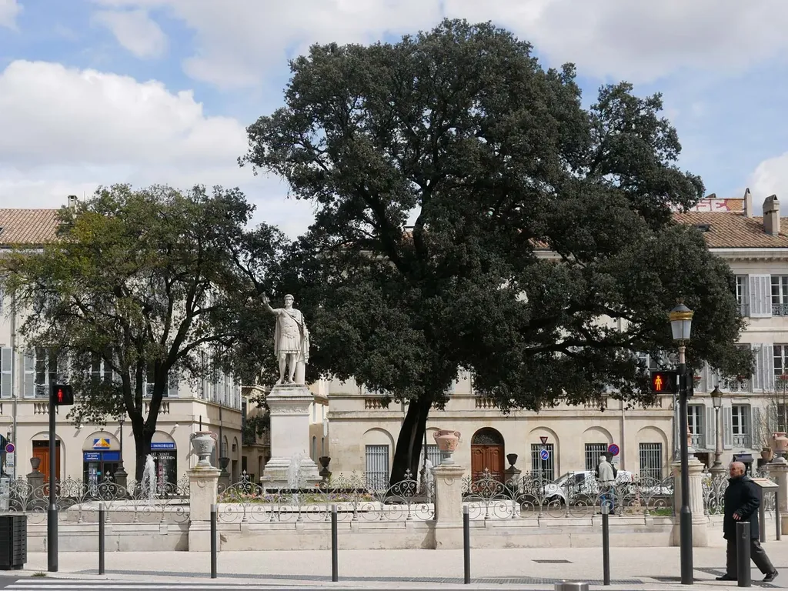
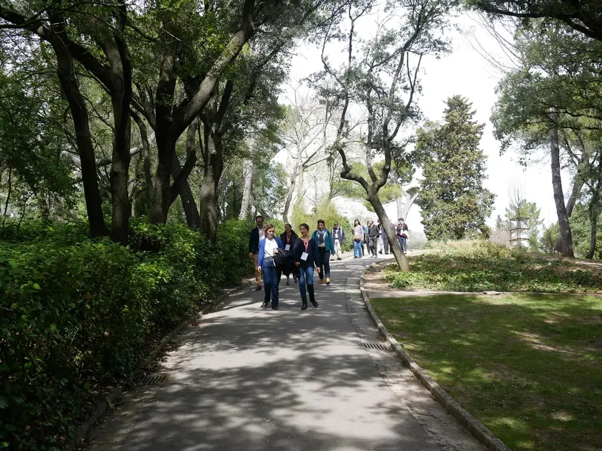
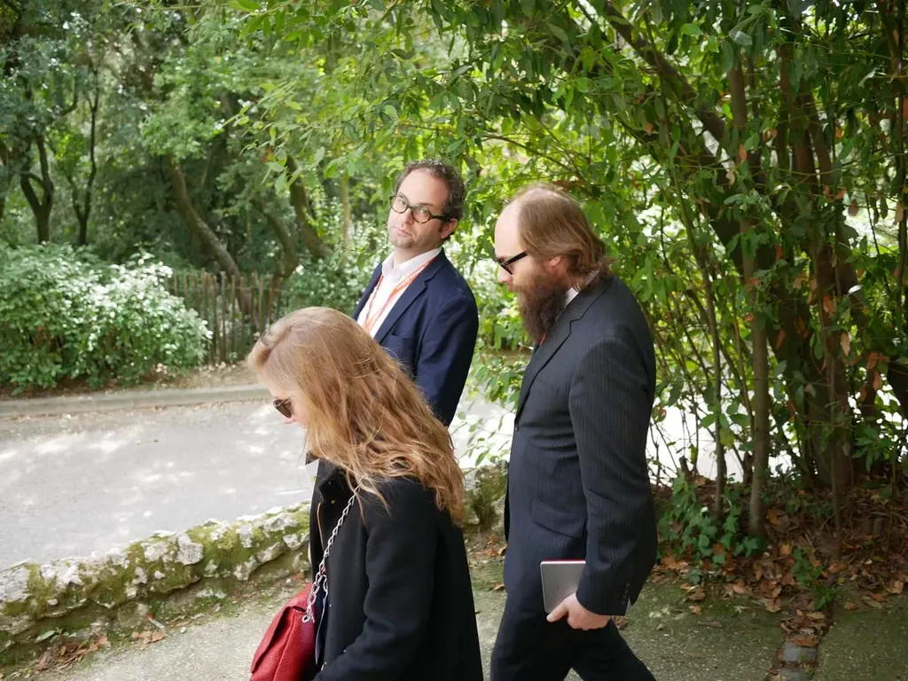
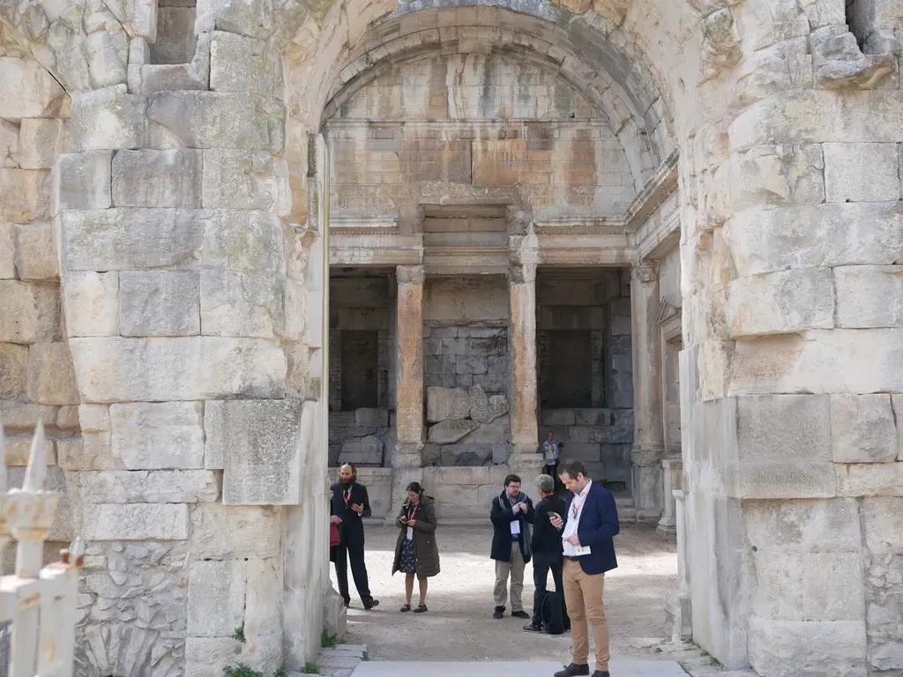
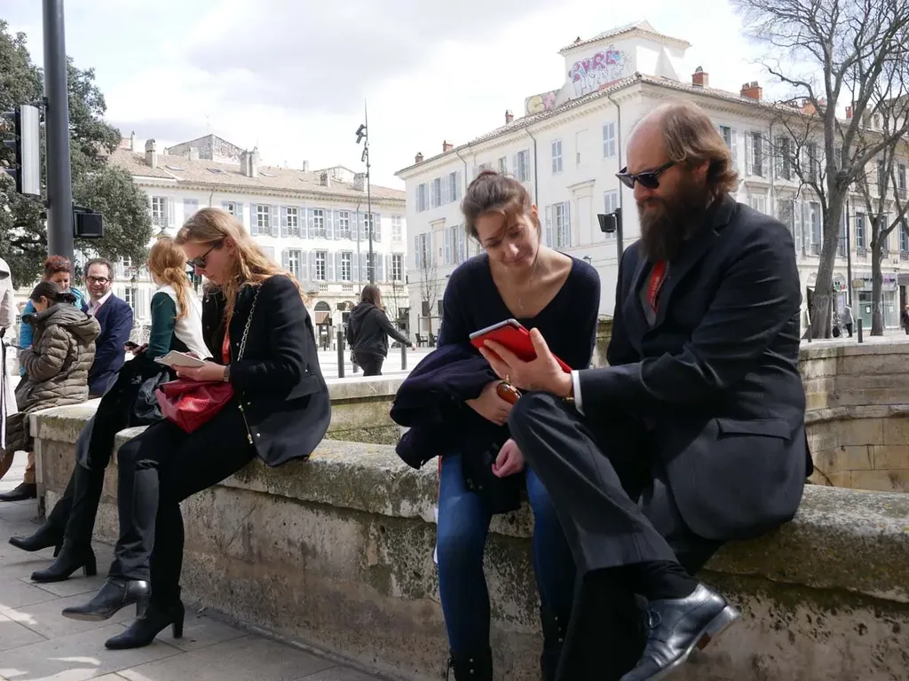

# Sans outil, on n’écrit pas

La littérature n’existe pas dans l’idéalité de textes qui passeraient d’esprit à esprit. La littérature se fait avec nos doigts, parfois notre voix, notre corps entier, se matérialise en lettres sous nos yeux, se véhicule par des ondes électromagnétiques avant d’atteindre d’autres cerveaux. La littérature implique une technologie. Et bien plus que ça, elle implique une technologie pour être pensée.

Un exemple. Début 2017, j’ai reçu une bourse de la région Occitanie pour créer une [géolecture sur Montpellier](../../page/geolecture). Dans le projet initial, je devais écrire le texte, [Via Fabula](http://www.viafabula.com/) devait écrire le code. Sauf que sans ce code, j’étais incapable d’écrire, et sans mon texte, Via Fabula était incapable d’écrire le code.

J’ai dû esquisser un code, imaginer une forme, designer une interface, avant que les mots arrivent, que je réussisse à écrire, puis à perfectionner le code, texte et code se nourrissant l’un l’autre.

Sans stylo, on n’écrit pas. Ce n’est pas plus compliqué que ça. Le stylo peut être un stylet antique ou un logiciel, ça ne change rien et ça change tout.

Dans ma géolecture nîmoise, j’ai écrit :

> Écrire tout en sachant l’endroit exact où je serai lu change l’écriture elle-même, transforme mon dispositif d’écriture, parce que je vois ce que vous verrez dès que vous lèverez les yeux. Je n’ai donc pas besoin de décrire ce qui d’emblée se présente à vous, je n’ai pas besoin d’évoquer le mouvement des pins au-dessus du temple.

Je n’aurais jamais écrit cette phrase si je n’avais pas d’abord écrit le code pour la rendre possible, c’est-à-dire forgé mon propre stylo. De même, l’effet de cette phrase sur le lecteur ne trouve sa mesure que si elle est lue devant le temple où mène la géolecture, après un périple où le lecteur se déplace dans le monde, rematérialisant la littérature, un peu comme au théâtre, alors que nos écrans tentent de nous faire oublier nos corps ([leçon pour moi comprise quand j’étais déconnecté](../../page/jai-debranche)).

Autre exemple. Il suffit que je modifie le template de mon blog pour que mon écriture se transforme. J’ai relevé ce point quand j’ai adopté le mode rouleau, les billets se déroulant à l’infini les uns à la suite des autres, technique qui les replace dans une continuité et les arrache au modèle de la presse. Dès que j’ai rendu effectif ce code, j’ai eu envie d’écrire des billets qui formaient des ensembles et je me suis mis à publier une fois par mois [mes carnets de route](carnet-de-route-fevrier-2018.md).

Quand j’améliore la mise en page des images, les positionne mieux dans mes textes, je photographie davantage, j’illustre davantage, ma pensée devient plus visuelle, ce qui transforme mes promenades, me force à penser toujours à l’image et au texte. Quelques lignes de codes transforment donc ma pensée durablement ce qui influence tout ce que j’écris, même les textes destinés à être publiés en livre.

J’ai discuté de ce rôle de l’outil dans la littérature tout au long de *[La mécanique du texte](../../page/la-mecanique-du-texte)*, c’est une conviction expérimentale, une conviction lue dans les mots d’autres auteurs, mais une conviction peu partagée, la plupart des auteurs refusant d’interroger leurs outils, refusant de voir à quel point ils influencent nos écrits. La seule façon de s’en convaincre, c’est de changer d’outil, de les expérimenter dans leur diversité pour voir à quel point cela nous pousse dans une diversité de formes.

Ce refus de changer d’outil m’apparaît souvent comme un manque de curiosité, un refus de se faire mal, un refus de se confronter à l’altérité, un refus pur et simple d’aujourd’hui. Bien des auteurs sont de petits bourgeois bien installés dans leur train train. Ils poussent des mots comme nous autres des chariots dans les supermarchés. Mais attention, les robots arrivent, et ils seront bientôt capables de produire une honnête littérature de pousse-chariots.

Je n’écris pas juste pour écrire, juste pour gagner ma vie, j’écris pour vivre, et qu’une machine puisse écrire mieux que moi ne changera rien au fait que j’ai besoin d’écrire, à condition que cette écriture se joue toujours à la frontière du possible.

PS : Billet dédié à [Stephane Vial](http://www.stephane-vial.net/) qui m’a révélé la particularité de ma phrase « le mouvement des pins au-dessus du temple » et à [Marcello Vitali Rosati](http://vitalirosati.com/) qui doit souvent convaincre ses interlocuteurs sur la prégnance de l’outil en littérature. [Vous pouvez lire mes géolectures à distance en basculant en mode test.](../../page/geolecture)

#geolecture #netlitterature #dialogue #y2018 #2018-3-30-13h28
