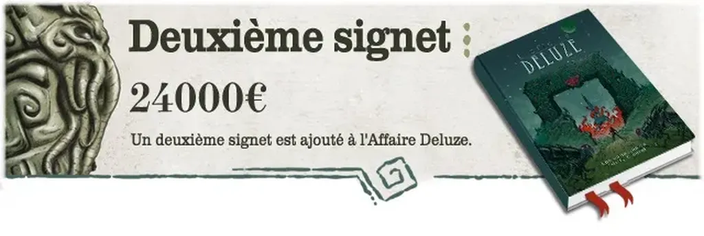
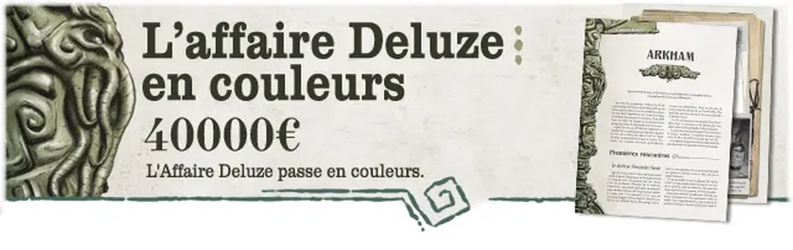

# Renverser le modèle de financement de l’édition

Depuis [le lancement du financement participatif](https://www.gameontabletop.com/crowdfunding-118.html#project-block-details) de *[L’affaire Deluze](../../books/deluze.md)*, une idée me trotte dans la tête. Ne serait-il pas possible de reprendre ce mécanisme pour stimuler l’écriture d’un livre ?

Comment ça marche pour *[L’affaire Deluze](../../books/deluze.md)* ? [L’éditeur](http://www.les12singes.com/) a proposé un financement avec un premier palier à 8 000 €, puis il a proposé des options qui se débloquent peu à peu au fur et à mesure des souscriptions.

Grâce aux options qui se débloquent au fil des souscriptions, l’édition de *[L’affaire Deluze](../../books/deluze.md)* sera de plus en plus luxueuse. Ce système des options à débloquer pourrait aussi bien concerner le contenu. Dans un cadre littéraire, les souscripteurs pourraient débloquer des chapitres, puis débloquer des thèmes. Voici à quoi pourrait ressembler un tel projet.

Titre : *L’île aux immortels*

Contexte : J’aime me promener virtuellement autour du monde, j’aime explorer les destinations improbables. Je les repère du ciel, puis zoome et regarde les photos publiées par les gens de passage. J’aime par-dessus tout les îles, surtout les îles tropicales, difficiles d’accès. Kouro, j’y suis tombé dessus par hasard, parce qu’elle se situe au milieu du Pacifique, en un endroit où il y a bien peu d’îles. J’ai zoomé, j’ai découvert le lagon, des routes, deux bourgades, l’une portuaire, l’autre située en surplomb d’une falaise. J’ai zoomé, mais je n’ai découvert aucune photo. J’ai cherché des informations sur le Net, je n’ai rien trouvé. Kouro existe sans exister. C’est comme ça que j’ai réussi à m’y faire envoyer par la rédaction de *National Geographic*.

Les options pourraient se présenter ainsi :

1. 5 chapitres, 1000 €
2. Option immortels, 2000 €
3. 10 chapitres, 3000 €
4. Option biotech, 4000 €
5. 20 chapitres, 5000 €
6. Option archéologique, 6000 €
7. 30 chapitres, 7000 €
8. Option jeu de rôle, 8000 €

Les souscripteurs devraient payer 20 € pour recevoir un livre dédicacé en avant-première, avec leurs noms listés dans les remerciements.

Bien sûr, il faudrait travailler l’argumentaire, ajouter des options, bien régler les paliers des options. La souscription serait ouverte durant trois semaines, à la fin de laquelle on verrait à quelle hauteur le projet serait financé et quelle ampleur il aurait.

Ce n’est qu’une idée, une technique possible pour mettre à l’envers le modèle de financement de la création littéraire, qui, avec l’approche options, donnerait en quelque sorte aux lecteurs le moyen de façonner l’avenir du livre, avant même que celui-ci soit écrit.

#edition #dialogue #y2018 #2018-6-3-11h31
