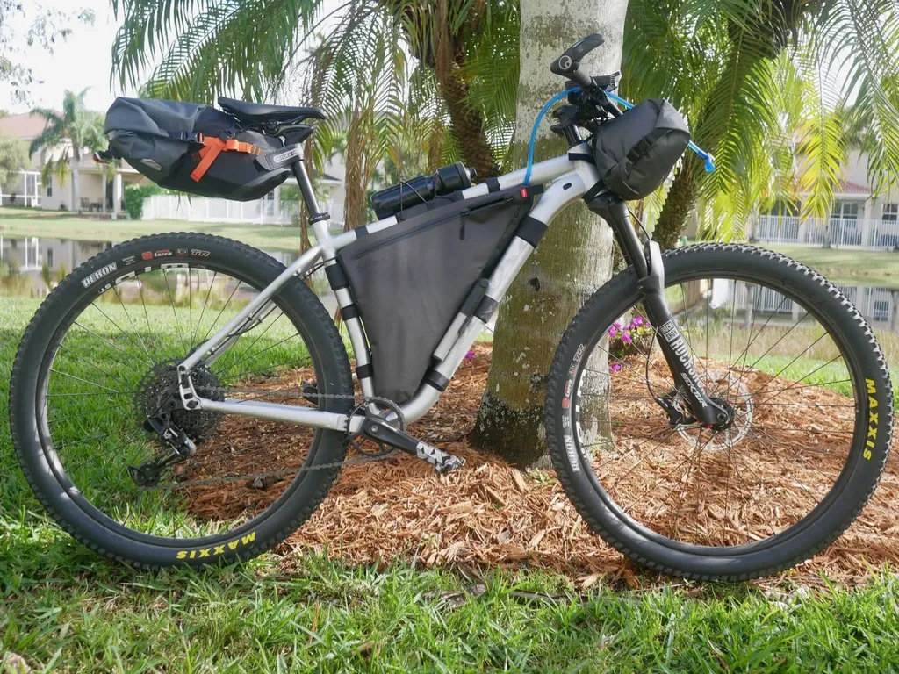
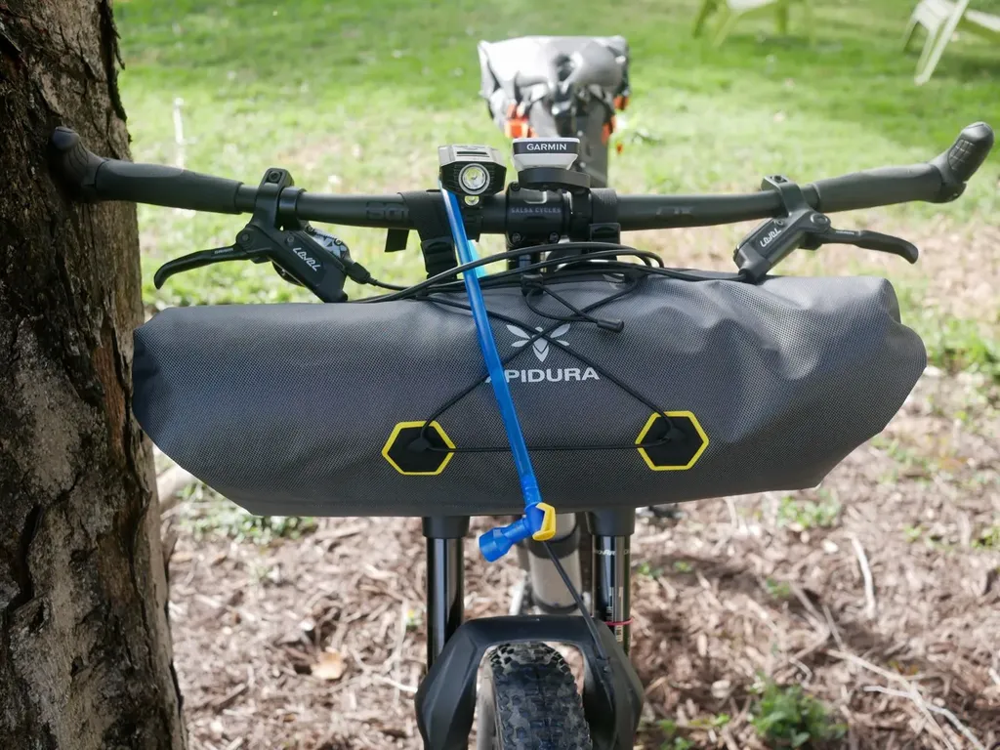
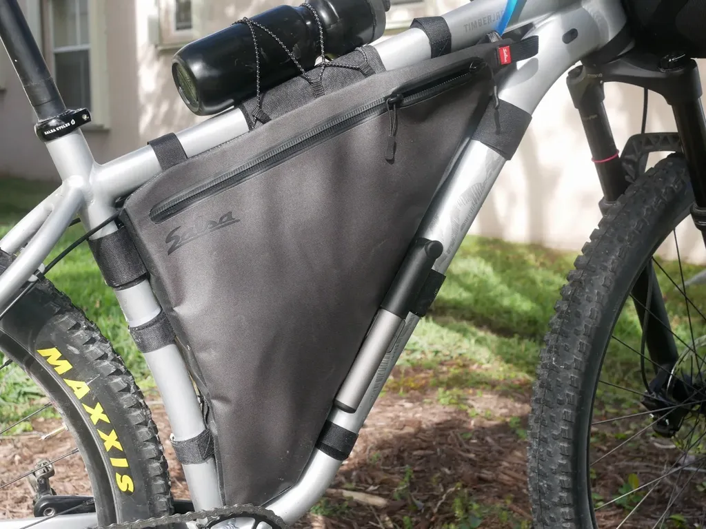
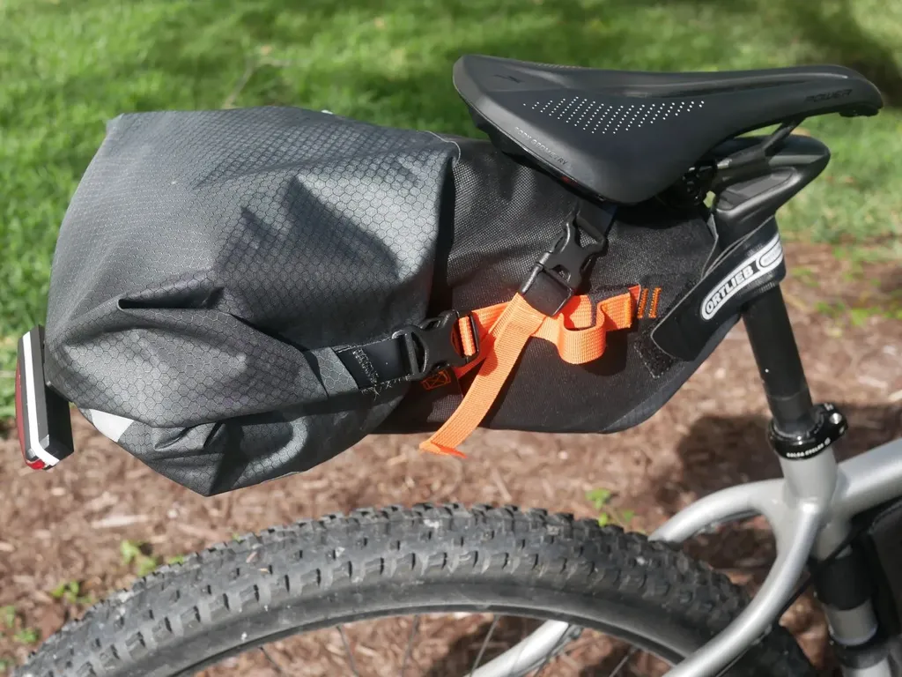
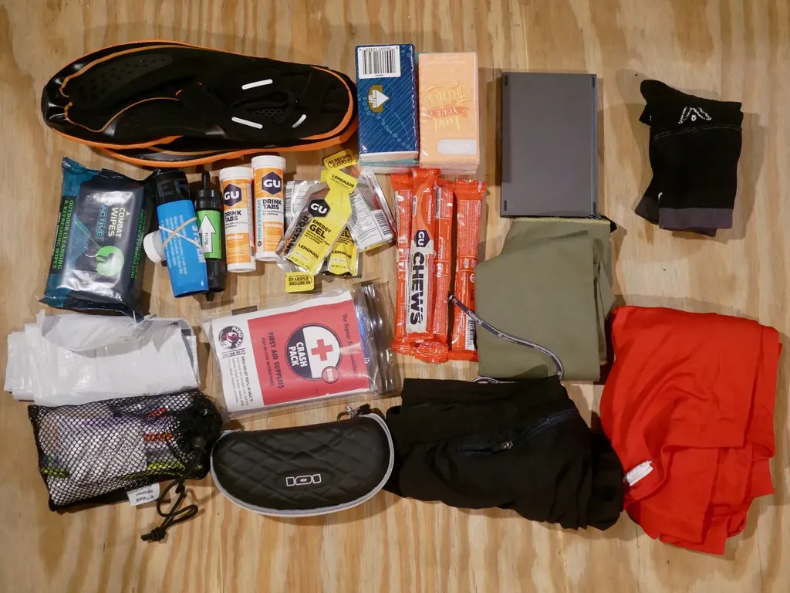
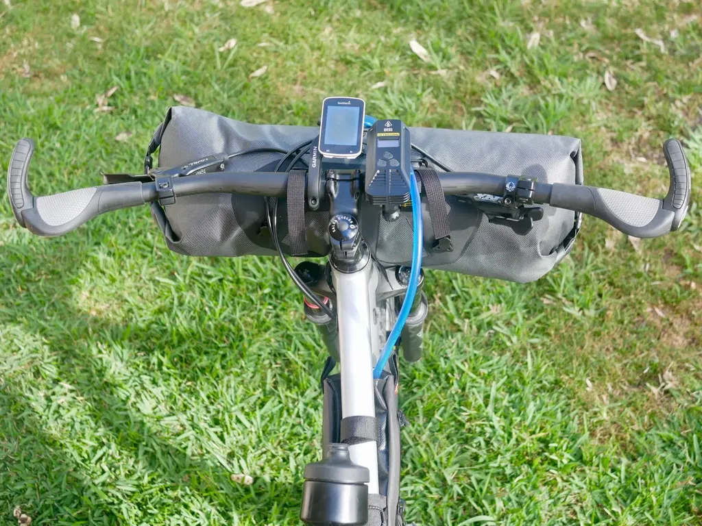
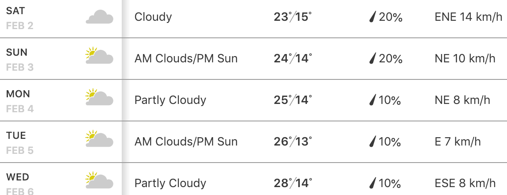
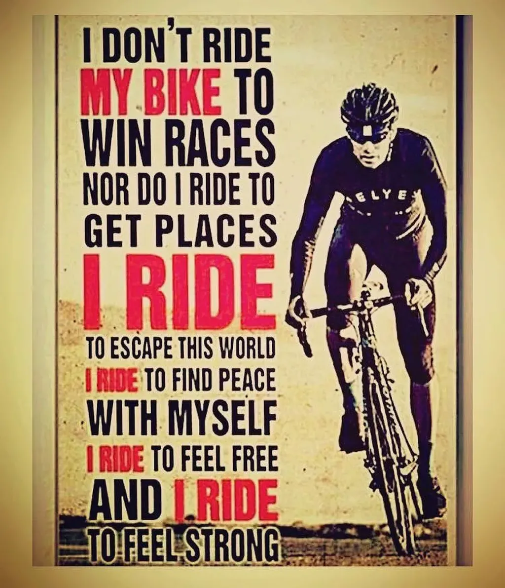

# Prêt pour le bikepacking

[Depuis que je suis en Floride](../../2018/9/carnet-de-route-aout-2018.md), je tourne en rond, surtout à vélo. Alors j’ai cherché des balades plus fun. Très vite, j’ai découvert vers Orlando un raid appelé [l’HuRaCan 300](https://www.singletracksamurai.com/huracan-300/) défini comme « the ULTIMATE OFF-ROAD ENDURANCE EXPERIENCE in the state of Florida ». Plus de 600 km de singles et de routes forestières, de rivières à franchir, de marécages à traverser, avec nécessité de camper dans la nature. C’est ainsi que j’ai découvert le [bikepacking](http://www.bikepacking.com/).

Je connaissais le backpacking, la randonnée à pied avec sac à dos. Je connaissais le cyclotourisme ou *bike touring*, le vélo de route chargé de lourdes sacoches à l’avant et à l’arrière. J’étais en train de comprendre que depuis quelques années ces deux disciplines s’étaient accouplées pour donner naissance au bikepacking.

L’idée prendre un gravel ou un VTT, lui adjoindre des sacs fixés grâce à des velcros, les remplir avec le moins de matos possible pour rester léger et prendre la route, et de préférence les chemins de traverse, où les cyclotouristes le plus souvent ne peuvent pas s’aventurer. Tout cela est désormais possible grâce aux progrès du matériel de camping.

Intimidé par l’HuRaCan, et aussi par son échéance lointaine début février 2019, j’ai essayé de dessiner une boucle qui en quatre jours m’amènerait à Key West avant de me ramener chez moi à Weston. Après avoir passé des heures sur Google Earth, j’ai renoncé à cause de routes trop dangereuses à mon goût. J’ai alors lorgné du côté de la Big Cypress Preserve, où [j’ai fini par entraîner JP début décembre 2018](../../2018/12/lesprit-freerider.md). Ce bref périple d’une demi-journée a réveillé des envies.

J’ai envoyé un mail à Karlos l’organisateur de l’HuRaCan pour savoir si je pouvais m’engager dans son raid avec mon gravel. Sa réponse ferme et définitive : « Non. Il te faut un VTT, sinon tu vas beaucoup trop marcher. » J’avais bien ici en Floride un VTT, mais un all moutain de 15 kg, que je me voyais mal charger avec au moins dix kilos de matos. J’ai donc vendu ce vélo et j’ai acheter un [Salsa Timberjack](https://salsacycles.com/bikes/timberjack/2019_timberjack_nx_eagle_29), un VTT hardtail commercialisé par la plus célèbre des marques spécialisées dans le bikepacking.

Ce vélo n’a donc pas de suspension à l’arrière, ce qui libère le triangle du cadre pour y loger un sac (si j’avais eu avec moi mon Specialized Epic, il aurait fait l’affaire, bien que tout suspendu). Sur le Timberjack, on peut aussi monter une [cage de type cargo](https://salsacycles.com/components/category/racks/anything_cage_hd) sous le cadre (on peut monter une telle cage sous tous les vélos, mais ils n’offrent pas nécessairement assez d’espace pour y loger du matos). En prime, des roues de 29 pouces avec des pneus de 2,6 pouces offrent du grip et un amorti appréciable quand le vélo est chargé.

Le cadre en aluminium pèse environ 2 kg. J’ai écarté les vélos en carbone parce que j’ai cassé une fois mon Specialized Epic et qu’il me paraît important d’avoir une monture solide et fiable pour m’engager lourdement chargé pour plusieurs jours. Après avoir monté la selle et le tube de selle de mon gravel, des pneus [Maxxis Rekon](https://www.maxxis.com/catalog/tire-559-140-rekon) plus légers que ceux d’origine ainsi que des [grips ergonomiques](http://www.ergon-bike.com/en/product.html?a=griffe#gptouring-42410031), mon Tiberjack pèse environ 12 kg.

Je n’ai reçu le Timberjack que deux semaines avant le départ du raid (le 2 février 2019). J’ai donc attendu le dernier moment pour commander le matériel de camping, en m’inspirant des [comptes rendus des bikepackers d’expérience](https://www.facebook.com/groups/1396341304006680/), ainsi que ceux des [anciens participants de l’HuRacAn](https://www.singletracks.com/blog/mtb-gear/how-do-you-pack-for-an-epic-340-mile-bikepacking-route/), l’épreuve ayant été créée en 2012. J’ai aussi roulé avec le Timberjack autant que j’ai pu, sans pour autant me griller.

J’ai tenté une sortie de 70 bornes avec mon Camelbak lesté de 3 kg d’eau, de barres de céréale et d’outils, et j’ai très vite compris que j’étais incapable d’enchaîner ainsi plusieurs journées de plus de cent bornes avec 6 kg sur le dos. J’ai donc décidé de ne rien porter dans mon dos à part mon téléphone (contrairement à mon habitude quand je fais du VTT).

Pour loger le matos, j’ai opté pour trois sacs, dans le but d’équilibrer le vélo et de mettre le plus de poids possible à l’intérieur du cadre.

Dans le sac de guidon, un [Apidura Expedition 14L](https://www.apidura.com/shop/expedition-handlebar-pack/), j’ai logé mon matériel de camping (le tout pèse 2,435 kg, ce qui est assez extraordinaire).

* [Sac de couchage](http://www.westernmountaineering.com/sleeping-bags/extremelite-series/nanolite-top-quilt/).
* [Matella](https://www.thermarest.com/mattresses/neoair-xlite).
* [Tente Nemo Blaze 1p](https://www.youtube.com/watch?v=hTTfSpHlo-M).
* [Doudoune Decathlon](https://www.decathlon.fr/gilet-trek500-h-marine-id_8397299.html).
* Bonnet.
* [Collants de récupération/Pyjama](https://www.2xu.com/us/p/refresh-recovery-compression-tights/MA4419b.html?dwvar_MA4419b_color=BLACK_NERO#start=1).

Dans le sac de cadre, un [Salsa Exp Series HT 7,7L](https://salsacycles.com/components/category/bags_frame_packs/exp_series_ht_framepacks), j’ai logé le matériel de première nécessité (la pompe étant accrochée au-dessous, une gourde de secours au-dessus).

* Poche à eau de 3L de mon Camelbak.
* Trousse à outils (une chambre à air, une valve, liquide tubeless, kit de réparation tubeless, huile, tissus microfibre, brosse à dents (coupée), [multitools](https://www.topeak.com/global/en/products/mini-tools/340-mini-20-pro), [Leatherman](https://www.leatherman.com/squirt-ps4-22.html?dwvar_22_color=11&cgid=multi-tools#start=1), 5 cerflex, 2 mètres de Duke tape, 2 attaches rapides, adaptateur presta/shader utilisable avec les compresseurs des stations-service, 1 démonte-pneu, 2 cartouches de CO2, adaptateur CO2, rustines autocollantes, sifflet réglementaire pour donner l’alerte).
* Coupe-vent/imperméable.
* Manchons.
* [Batterie de secours](https://www.anker.com/products/variant/powercore-20100/A1271012), chargeur et câbles.
* Clavier bluetooth de mon iPhone (j’espère avoir la force d’écrire le soir).
* Frontale.
* Flacon de Solution hydro-alcoolique.
* Barres de céréales, [Gu energy gel](https://shop.guenergy.com/products/roctane-energy-gel?variant=8445372792883&_ga=2.65573990.917866616.1548781439-1182131596.1547689723) et [Gu Chews](https://shop.guenergy.com/products/energy-chews-for-runners-cyclists-triathletes?_ga=2.141426801.278263009.1548712630-101406505.1548712630&variant=28401459661) (pour la journée).
* [Chamois crème](https://www.assos.com/chamois-creme-boxf-20).
* Antivol.

Dans le sac de selle, un [Ortlieb 11L](https://www.ortlieb.com/us/seatpack), j’ai casé tout le reste.

* Mouchoirs.
* Une paire de pieds nus (rivières à traverser).
* Un sac poubelle (pour ranger mes fringues lors des traversées)
* Un short (pour ne pas être à poil lors des traversées).
* Une paire de chaussettes de rechange.
* Un t-shirt thermique (je pars avec un manches courtes et un manches longues que je changerai en fonction du temps).
* Jambières.
* [Purificateur d’eau](https://sawyer.com/water-filtration/).
* [Kit de secours](https://www.amazon.com/gp/product/B00DV4H45Q/).
* [Crème réparatrice pour les fesses](https://www.assos.com/skin-repair-gel?quantity=1&g=W).
* [GU drinks tabs](https://shop.guenergy.com/products/hydration-drink-tabs?variant=11432979265),
* Réserve de GU energy gel et chews.
* Lingettes biodégradables.
* Savon.
* Dentifrice et brosse à dents.
* Étuis à lunettes.
* Serviette microfibre.
* Une seconde chambre à air.
* Bombe antimoustique.
* À l’extérieur, feu arrière.

Sur le guidon, j’ai mon Garmin 820 et ma lampe [Nitcore BR35](https://flashlight.nitecore.com/product/br35) que je peux relier à ma batterie de secours. Voilà, c’est beaucoup, et pas grand-chose. Je n’ai pas de cuissard de rechange, pas de maillot de rechange, je fais confiance aux lingettes pour me tenir à peu près propre. Je ne transporte quasiment rien à manger, car il y a des points de ravitaillement sur le parcours, et même des restaurants.

Après avoir roulé une centaine de kilomètres avec le vélo ainsi chargé, je sais qu’il me sera difficile d’effectuer l’HuRaCan en quatre jours. Même si le Timberjack est équilibré, le poids change la dynamique. Je pense donc effectuer la boucle en cinq jours. Je n’ai d’ailleurs aucune raison de me presser, d’autant qu’il a beaucoup plu le week-end dernier et que les chemins seront très lourds.

Maintenant, je passe mon temps à scruter la météo. L’état du ciel se précise peu à peu. De jour en jour, le risque de pluie s’amenuise, avec des températures ne descendant pas au-dessous de 14°C le matin et pouvant dépasser les 25°C l’après-midi.

Comment mon corps réagira-t-il ? Et mon esprit ? Je n’en ai aucune idée. Ma dernière sortie de 70 km avec le Timberjack a été désastreuse. Je venais d’installer un [guidon en carbone ergonomique](https://sqlab-usa.com/products/3ox-16-degree-carbon-mtb-handlebar?variant=41726033612). Je suis rentré avec des fourmis dans les bras et mal aux fesses. Je n’aurais jamais dû modifier mes réglages à trois jours du départ. J’ai tenté de revenir à ma configuration antérieure sans être très sûr de moi. Du stress ajouté au stress, mais je reste excité.

Je suis attiré par l’exercice, comme si le besoin était inscrit en moi depuis toujours et qu’il avait attendu des années avant de s’exprimer. Je ressens ce qu’il faut de crainte pour ne pas me lancer tête baissée dans le raid. J’ai [bossé la carte](https://drive.google.com/open?id=1_Up-vkTOf9FQricNRjAjMikkZLh_bEkt&usp=sharing). Je sais où se situent les points de ravitaillement et les campements possibles. J’ai [discuté avec les autres concurrents](https://www.facebook.com/groups/655069387938777/). Je suis prêt même si j’aurais aimé deux semaines de plus pour fignoler les réglages du vélo.

Pourquoi tout ça ? [Une affiche publiée dans le forum bikepacking France](https://www.facebook.com/groups/1396341304006680/permalink/1956994644608007/) résume ma position. « Je ne fais pas du vélo pour gagner des courses ou même me placer. Je fais du vélo pour échapper à ce monde. Je fais du vélo pour trouver la paix en moi-même. Je fais du vélo pour me sentir libre. Je fais du vélo pour me sentir fort. » Je peux remplacer « faire du vélo » par « écrire », ça marche aussi.

#velo #y2019 #2019-1-31-16h23
