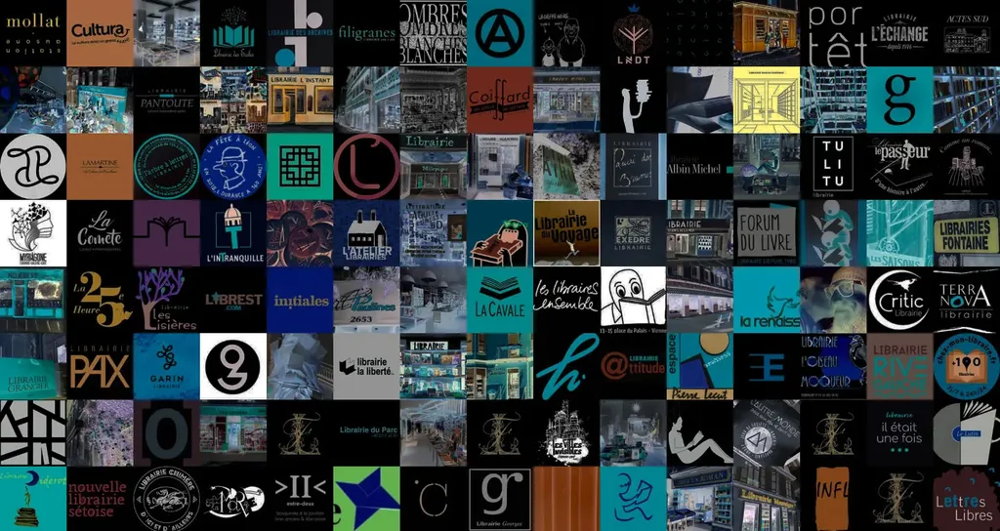
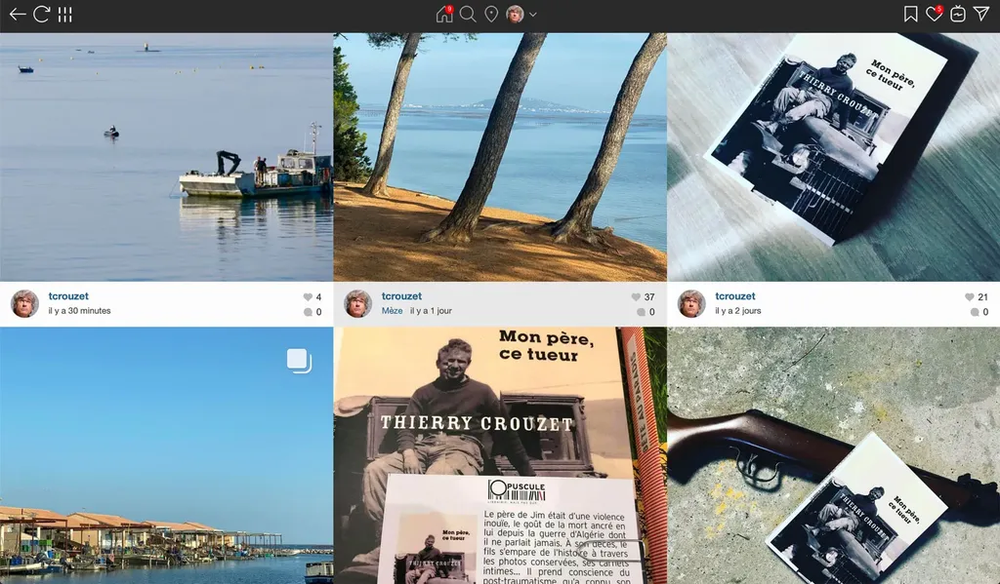
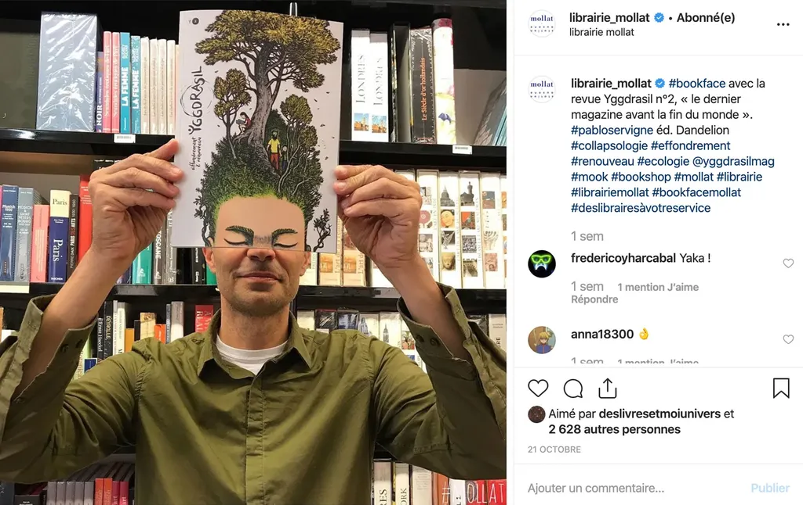
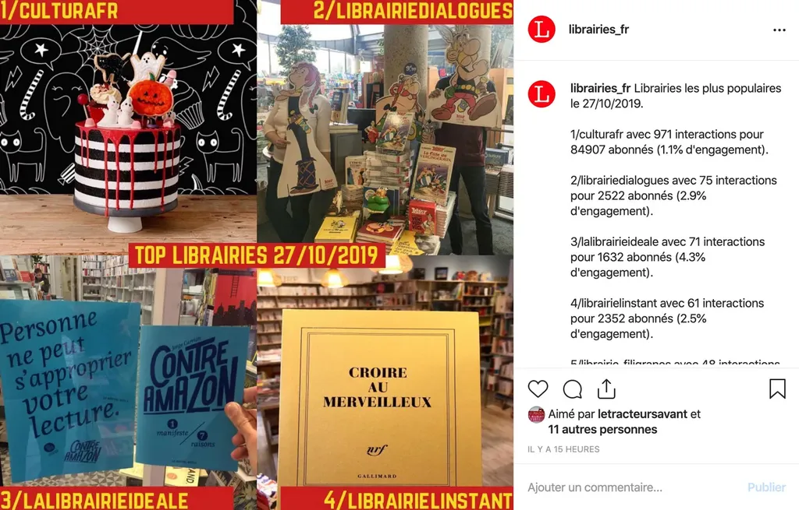
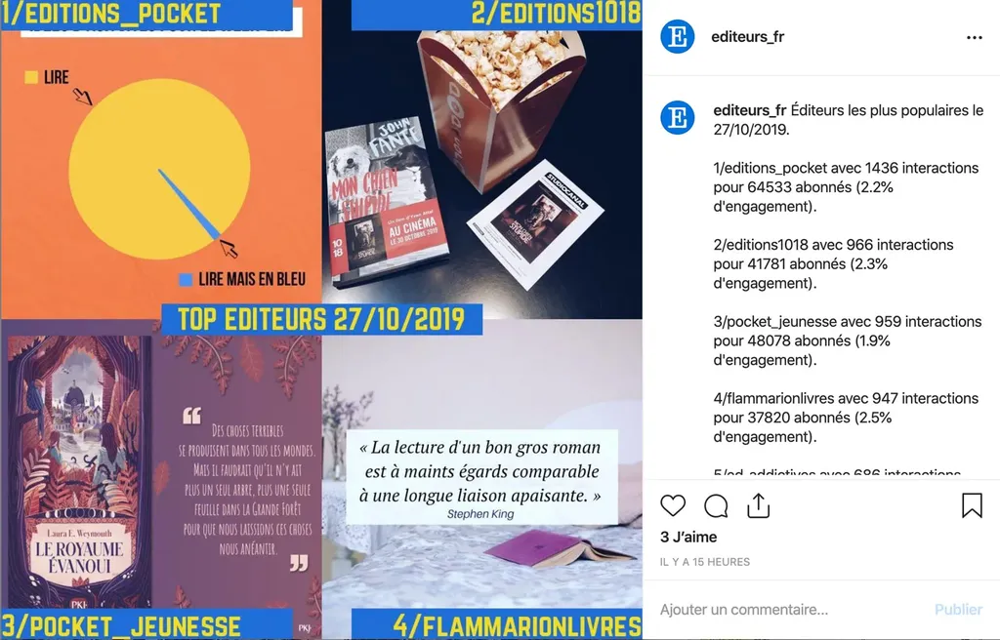

# Bookstagram, arnaque ou pas ?

Après un an en Floride loin de mes amis auteurs et éditeurs, puis quelques semaines bloqué chez moi par [ma fracture du col du fémur](../8/un-auteur-se-fracture-le-femur-pour-faire-parler-de-lui.md), j’ai fini par repointer le bout de mon nez en librairie et en salon. Et là, surprise, tout le monde parlait d’Instagram.

Les auteurs se vantaient d’avoir été bookstagramés, les libraires photographiaient leurs coups de cœur, les éditeurs voyaient leurs comptes de plus en plus suivis, et ceux qui n’avaient pas encore pris le train se disaient qu’ils n’avaient plus d’autre choix. Tout cela m’a rappelé le Twitter de la fin des années 2000.

Moi qui utilise [mon Instagram pour partager des couchers de soleil](https://www.instagram.com/tcrouzet/) et faire bisquer mes amis parisiens, je n’avais pas prêté attention à cette explosion marketing. J’avais bien tenté [un instaroman en 2016](../../2016/4/des-livres-sur-instagram.md) pour la version préliminaire de *[Résistants](../../page/resistants)*, mais depuis je ne m’étais pas davantage intéressé au phénomène, un peu fatigué des réseaux sociaux commerciaux.

Mais comme je n’avais toujours pas l’autorisation de poser le pied droit au sol et donc disposais de pas mal de temps, j’ai commencé à explorer l’Instagram du livre, où on retrouve auteurs, éditeurs, libraires et chroniqueurs bien nommés bookgrameuses (pardon pour les rares bookgrameurs). Là, je décrouvre des comptes avec des dizaines de milliers d’abonnés, récoltants des centaines de likes pour le moindre post, des comptes courtisés par les auteurs comme les éditeurs.

C’était presque trop beau pour être vrai. Je suis d’un naturel méfiant, surtout depuis que j’ai révélé [une fameuse arnaque pratiquée sur Twitter](../../2009/9/qui-a-la-plus-grosse-quequette-sur-twitter.md). J’ai donc créé un Instagram bidon et j’ai commencé à jouer. Il m’a suffi de poster une image en utilisant une ribambelle de hashtags à la mode du genre « #lecturedumoment #livre #lecture #livrestagram #bookstagram #instalivre #instabook #enlibrairie » pour récolter des likes dans la même seconde en provenance de bookgrameuses ou d’éditeurs. Essayez, vous verrez.

Un temps de réaction aussi rapide n’est possible qu’à l’aide de robots, vite trouvés comme [Fanbump](https://www.fanbump.co), [Followadder](https://followadder.com/), [Instaboss](https://instaboss.app), [Alfred](https://alfred.fm) (je me suis mis à tester ce dernier sur mon compte bidon profitant des trois jours d’essai gratuits). Ces services valent le détour, ils nous expliquent comment récolter des abonnées. Les règles sont les mêmes que sur Twitter et tous les réseaux sociaux :

1. Suivre un max de comptes dans son domaine (ainsi les suivis découvrent que nous les suivons et sont tentés de nous suivre en retour).
2. Au bout d’une semaine, ne plus les suivre s’ils ne suivent pas en retour, et même ne pas suivre d’une manière générale parce qu’il est important d’avoir plus d’abonnés que d’abonnements (sinon, c’est louche, ça met en évidence la technique de suivre pour être suivi).
3. Aimer les messages des autres pour attirer l’attention, surtout de ceux qui ne nous suivent pas et que l’on trouve grâce aux hashtags (on peut même liker avec un peu de retard pour ne pas paraître trop louche).
4. Poster des commentaires bidons genre une série de cœurs. Tout est bon pour attirer l’attention, voire envoyer des messages directs.

Les robots proposent ce genre de services, en veillant à ne franchir aucune des [limites de la bienséance fixées par Instagram](https://instazood.com/blog/instagram-rules-restrictions-and-limits/) (mais avec la possibilité de liker mille fois par jour, on a de la marge). Si vous utilisez des hashtags, ne vous étonnez plus de recevoir des encouragements de comptes prestigieux qui ne vous suivent pas. Il s’agit de robots recruteurs.

J’ai donc joué avec Alfred, mais je le trouvais pataud tout en n’ayant pas envie de payer un service plus performant. Comme j’aime coder, question de ne pas perdre la main, j’ai regardé du côté de l’API-Instagram, l’interface offerte aux développeurs de services tiers comme les promoteurs de robots, mais aussi de très belles applications comme [Grid](http://gridsapp.net/) que j’utilise sur Mac pour poster mes couchers de soleil.

Pour mieux comprendre ce qui se passait, j’ai programmé un robot qui repostait sur mon compte bidon les images les plus populaires des bookgrameuses. Tout de suite, j’ai récolté plus de likes que sur mon [Instagram personnel](https://www.instagram.com/tcrouzet/), j’ai vu des gens me suivre automatiquement, puis se désinscrire quand je ne les suivais pas.

La lecture de dizaines de reposts m’a familiarisé avec l’usage des hashtags et un jargon propice au recrutement d’abonnés. Mais bien vite, j’imagine parce que j’avais outrepassé les règles de la bienséance, mon compte a été blacklisté, assez tard toutefois pour que j’aie compris le manège.

Sur Instagram, pour connaître le succès, il faut certes publier des contenus de qualités, mais aussi souvent utiliser des robots si on veut étendre sa communauté au-delà d’une masse critique de quelques milliers d’abonnés. Quelle est alors la valeur d’une telle communauté artificiellement boostée ?

Une chose est sûre, elle n’est pas proportionnelle à sa taille. La meilleure façon de s’en persuader est d’analyser le taux d’engagement des abonnés. Par exemple, sur un post prendre le nombre de likes et de commentaires, c’est-à-dire le nombre d’interactions, et le diviser par le nombre d’abonnés du compte. Plus cette valeur est élevée, plus la communauté réagit. Si tous les abonnés d’un compte likent une image, l’engagement est de 100 %. Un compte avec dix fois moins d’abonnés mais un engagement dix fois supérieur génère donc autant d’interactions (et donc a le même potentiel marketing pour un éditeur qui voudrait communiquer à travers lui).

Ainsi j’ai constaté que les comptes les plus fédérateurs ne sont pas nécessairement ceux qui ont le plus d’abonnés. D’une manière générale, le taux d’engagement baisse avec la taille de la communauté, ce qui est logique, puisque les gros comptes attirent les suiveurs comme les lampadaires les insectes et il est bien connu que les insectes commentent peu.

Attention : je ne dis pas que toutes les bookgrameuses utilisent des robots, certaines oui, mais sans abus. Tout n’est donc pas bidonné. Conclusion : il faut toujours évaluer le nombre d’abonnés au regard de l’engagement.

### Les libraires sur Instagram

Comme je commençais à maîtriser l’API, j’ai continué à jouer. Après la publication de [ma lettre d’amour aux libraires](../9/retomber-amoureux-des-librairies-une-necessite.md), je me suis dit que je pourrais utiliser mon robot pour les fédérer sur Instagram, et en même temps découvrir leur travail en ligne.

1. J’ai créé un compte Instagram [@librairies\_fr](https://www.instagram.com/librairies_fr/).
2. Avec, je me suis abonné manuellement à des centaines de libraires (et je continue de le faire et j’espère que les libraires oubliées se signaleront, je ne suis pas devin).
3. J’ai créé un premier robot qui scrute leur publication et relève le nombre d’interactions suscitées (uniquement les images, j’ignore les vidéos et les carrousels).
4. Quotidiennement, un deuxième robot recherche les images qui la veille ont suscité le plus d’interactions (popularité brute) et le plus d’engagement. En fin d’après-midi, il publie deux images de synthèse sur [@librairies\_fr](https://www.instagram.com/librairies_fr/), avec les données récoltées en commentaires (ainsi qu’un rappel de la méthodologie).
5. Un troisième robot [classe des libraires en fonction de leur nombre d’abonnés](../../page/librairies) et génère ainsi un annuaire Instagram des libraires.

C’est très bête, mais j’ai ainsi pris le pouls des libraires, constaté leur dynamisme numérique. Certains m’ont tout de suite dit que mon initiative était une façon pour eux de découvrir leurs confrères. La bonne surprise : certaines librairies réussissent à se classer en tête en engagement et popularité, ce qui démontre la santé et à la qualité de leur compte Instagram.

### Éditeurs et bookgrameuses

Comme j’étais lancé, je me suis dit que je pouvais créer d’autres robots sur le même modèle.

* [@editeurs\_fr](https://instagram.com/editeurs_fr) suit les éditeurs ([leur classement](../../page/editeurs)).
* [@bookstagram\_fr](https://www.instagram.com/bookstagram_fr/) suit les bookgrameuses ([leur classement](../../page/bookstragram)).
* J’ai un peu calé sur [@les\_auteurs\_fr](https://www.instagram.com/les_auteurs_fr), car il n’y a aucun moyen simple de découvrir nos Instagram (nous n’utilisons pas ou peu de hashtags, en restant à un usage artisanal). Et puis qui est auteur ? Qui ne l’est pas. Je ne suis pas allé plus loin dans cette direction.

Je ne tire aucun enseignement profond suite à cette petite exploration, sinon de ne pas trop attacher d’attention aux chiffres, surtout bruts tels que le nombre d’abonnés, trop faciles à gonfler artificiellement à l’aide de robots (les plus audacieux proposant de gagner des centaines d’abonnés par jour).

Je ne ressors pas trop déprimé de ce petit voyage en automatisation sociale. De toute évidence, beaucoup de gens aiment encore les livres. Je ne peux que reconnaître que la créativité visuelle fonctionne à plein régime, mettre en scène les livres devient un art, suffit de jeter un œil [au travail de la librairie Mollat](https://www.instagram.com/librairie_mollat/) ou à l’unité visuelle des images de [Mademoisellelit](https://www.instagram.com/mademoisellelit/).

À titre personnel, je me suis mis à reposter sur mon compte les mises en scène de mes livres effectuées par les libraires et les bookgrameuses, à suivre des libraires et bookgrameuses, mais je ne vais pas cesser de publier mes couchers de soleil. Si nous autres auteurs étions obsédés par les chiffres nous chercherions tous à imiter les Musso, Levy et Chattam, plutôt que de creuser notre trou (OK, parfois il s’apparente à une tombe, mais on est un rien masochiste).

Pour la santé d’internet, et surtout des réseaux sociaux, il faudrait que les scores disparaissent. Exit les nombres de likes ou de partages, d’abonnés ou d’abonnements. Ne publier que le travail. C’est un vœu aussi pieux qu’une société sans argent, les scores étant la monnaie du Net (et ce qui incite les éditeurs à envoyer des services de presse, par exemple). Voilà pourquoi j’ai poussé l’investigation jusqu’à créer moi-même des robots qui ajoutent des nombres à des nombres. Quand on ne peut pas changer un système, on en joue.

Plusieurs bookgrameuses m’ont demandé de les retirer de mon analyse, sous prétexte que les chiffres ne les intéressent pas, mais sont-elles pas les premières à utiliser des hashtags pour accroître leur visibilité et à se réjouir publiquement quand elles franchissent les barres symboliques des 5k, 10k ou 50k abonnés ? Nous vivons tous avec nos contradictions, mais vous avez raison, les chiffres n’ont aucune importance, reste qu’étant publics nous avons tous le droit de les exploiter, de les faire parler, puis d’en tirer nos conclusions. Nous avons le droit de comparer popularité et engagement, par exemple.

Si je ne m’étais pas lancé dans cette analyse, je n’aurais pas découvert l’existence de nombreuses maisons d’édition, librairies et bookgrameuses. Les chiffres peuvent avoir des vertus, comme les compteurs de vitesse sur nos tableaux de bord. Après libre à nous de ne pas les regarder et d’ignorer les limitations de vitesse, mais ça n’empêchera pas les radars de fonctionner. Mes robots sont en quelques sortes des radars qui ne verbalisent pas et publient des données brutes sans la moindre analyse. Ils se contentent de relever deux mesures différentes les vitesses de certaines images.

*PS : Comme j’ai lancé le compte [@bookstagram\_fr](https://www.instagram.com/bookstagram_fr/) tardivement et que je me suis abonné à trop de bookgrameuses d’un seul coup, j’ai réussi à le bloquer. Je reprendrais les abonnements quand Instagram le débloquera.*

#edition #coup_de_gueule #y2019 #2019-10-29-10h4
