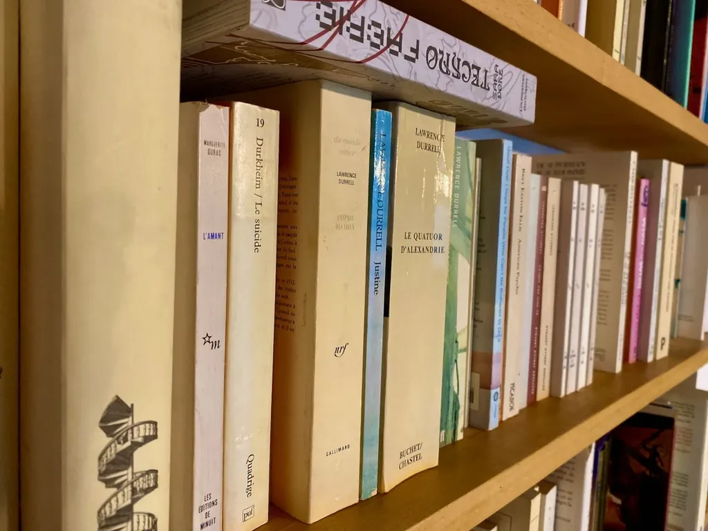

# Libraires : non, je n’ai pas tourné ma veste

Je savais que mes copains du Web littéraire me reprocheraient [ma lettre d’amour aux libraires](../9/retomber-amoureux-des-librairies-une-necessite.md), qu’ils n’entendraient pas [mon argumentation technique](auteurs-pas-de-salut-hors-des-librairies.md) et qu’ils m’accuseraient de traîtrise, sans lancer le débat comme c’était le cas à l’époque où le Net se portait bien.

Ai-je tourné ma veste ? Malheureusement, non, je suis même du genre psychorigide. Quand en 2006, j’ai publié *[Le peuple des connecteurs](../../page/le-peuple-des-connecteurs)* (chez Bourin, un éditeur traditionnel), c’était un manifeste pour la décentralisation, pour l’auto-organisation, la mise en réseau de la société, pas seulement avec des câbles, mais avant tout avec des liens de personne à personne.

Je ne défendais pas cette position par lubie, mais parce que la décentralisation favorise l’intelligence collective là où la centralisation, autrement dit les structures pyramidales, crée des goulets d’étranglement, les connaissances et les décisions descendant d’en haut, ce qui présuppose que le haut est tout-puissant, quasi divin, sait répondre à toutes les questions. Mais dans un monde toujours plus complexe, confronté à des problèmes globaux, cette approche verticale ne peut apporter de solutions (envenimer les problèmes, oui, nous ne cessons de le constater — la tentation de la guerre étant de plus en plus forte en même temps que les puissants découvrent leur incapacité à gouverner).

Je suis donc un fervent partisan de la décentralisation, de toutes les solutions ou initiatives qui conduisent à plus d’intelligence collective. J’ai embrassé internet et le Web parce qu’ils sont de merveilleuses technologies de décentralisation. Je suis devenu blogueur parce que je pouvais publier quand je le voulais ce que je voulais sans demander l’avis de personne, non par un quelconque désamour envers la chaîne du livre.

Mais le Web est-il toujours décentralisé ? Techniquement, oui, ou plus ou moins, dans les faits, dans la pratique, non. Des géants s’y sont imposés. Je les compare souvent à des trous noirs, attirant tout à eux. De décentralisé, le réseau s’est peu à peu centralisé selon la loi du [Winner-Take-All](https://en.wikipedia.org/wiki/Winner-take-all_(computing)).

Si initialement j’ai rejoint le réseau parce que je pouvais y entretenir une voix indépendante, si j’y publiais des textes et des livres pour être le seul maître à bord, je dois reconnaître qu’aujourd’hui c’est techniquement et politiquement de plus en plus difficile. Pour vendre des livres en ligne, il faut passer par Amazon et Apple et Google (et YouTube) et Facebook (et Instagram). Il faut donc renforcer ces nœuds, mais surtout il faut subir leurs règles qui souvent s’apparentent à des réglementations (les libéraux sont très forts pour prôner l’abolition des régulations, mais eux-mêmes en abusent quand elles leur servent).

Pour être indépendant en ligne, je devrais donc désormais passer mon temps chez les GAFA. Faisant ainsi, je cultiverais les centres, me rendant de plus en plus dépendant d’eux. J’œuvrerai contre la décentralisation. Et si par chance, je gagnais une certaine notoriété, je m’élevais dans la hiérarchie du monde centralisé, continuant à prêcher que ma méthode vaut pour tous alors qu’elle n’amène au firmament que quelques heureux élus dont le succès est destiné à berner les crédules. Dans le but de son propre éloge, devenir un apôtre indirect des GAFA est une attaque frontale contre la décentralisation, contre la seule arme à notre disposition pour sauver la mise globale de l’humanité. Si je me prétendais indépendant en faisant ma pub sur TF1, ça ne vous ferait pas rire ? C’est pourtant à ce seul prix que l’indépendance numérique est possible, les GAFA étant bien plus gigantesques que TF1.

Quand le Web était franchement indépendant, totalement décentralisé, nous autres auteurs numériques étions nos propres diffuseurs, nous avions court-circuité les libraires et, je l’avoue, il nous arrivait de les traiter d’archaïques résistants. Mais qu’ils ont bien fait de résister. Parce que notre rêve en ligne a vite fait de capoter, de se scléroser, de se gangréner autour de quelques nœuds incontournables. Contre cette évolution du Net, tout défenseur de la décentralisation ne peut qu’encourager les librairies indépendantes à le devenir toujours davantage, à tisser un réseau de terrain qui compense les failles du réseau numérique aux excroissances de moins en moins bien irriguées (et qui risquent l’AVC à tout moment).

Je ne vais pas continuer à dire que les libraires sont morts, les éditeurs des cons, et que nous sommes nos propres maîtres quand ce n’est plus le cas. Je ne vais pas continuer à encourager de jeunes auteurs à faire ce qui en ce moment n’est plus une bonne idée, surtout politiquement. Bien sûr, vous devez utiliser le Net, ses services, mêmes ceux des GAFA, il faut redoubler d’ingéniosité avec eux, tricher avec eux, déjouer leur stratégie, mais notre responsabilité d’intellectuel est de cultiver une pensée réticulaire, transversale, nous devons jardiner avec les libraires parce hier résistants ils résistent toujours.

Si je me contentais de bloguer, de publier depuis mon serveur, si je n’utilisais pas les GAFA pour la promotion de mes articles personne ou presque ne les lirait. Voilà pourquoi il est d’autant plus vital pour moi que mes livres circulent selon une autre logique, qu’ils se retrouvent chez les libraires indépendants, qu’ils circulent en réseau, de main en main. C’est une façon d’entretenir les routes de campagne, ce que je fais aussi à vélo, un peu pour les mêmes raisons. Continuer à se vouloir indépendant avec le concours presque exclusif GAFA, c’est comme pédaler sur une autoroute avec interdiction d’en sortir (tout en se criant libre).

#edition #winner-take-all #dialogue #y2019 #2019-10-22-11h14
