# Bikepacking : mini aventure

J’aime partir, suivre une trace, m’éloigner, ne plus trop savoir où je suis, ouvrir grand les yeux, franchir des ponts, traverser des villages… et je découvre qu’il suffit d’une demi-journée pour me plonger dans cet état.

Aujourd’hui, d’après les prévisions météo, il doit pleuvoir, mais pour le moment le ciel est encore dégagé au-dessus de [l’étang de Thau](gravel-le-tour-de-letang.md). Alors pédaler ou pas ? Je consulte [Ventusky](https://www.ventusky.com/), mon appli météo favorite, et découvre que si chez moi un orage risque de frapper à tout moment, la situation devrait rester favorable une bonne partie de la journée à une trentaine de kilomètres à l’ouest, de l’autre côté de l’étang en direction d’Agde et au-delà.

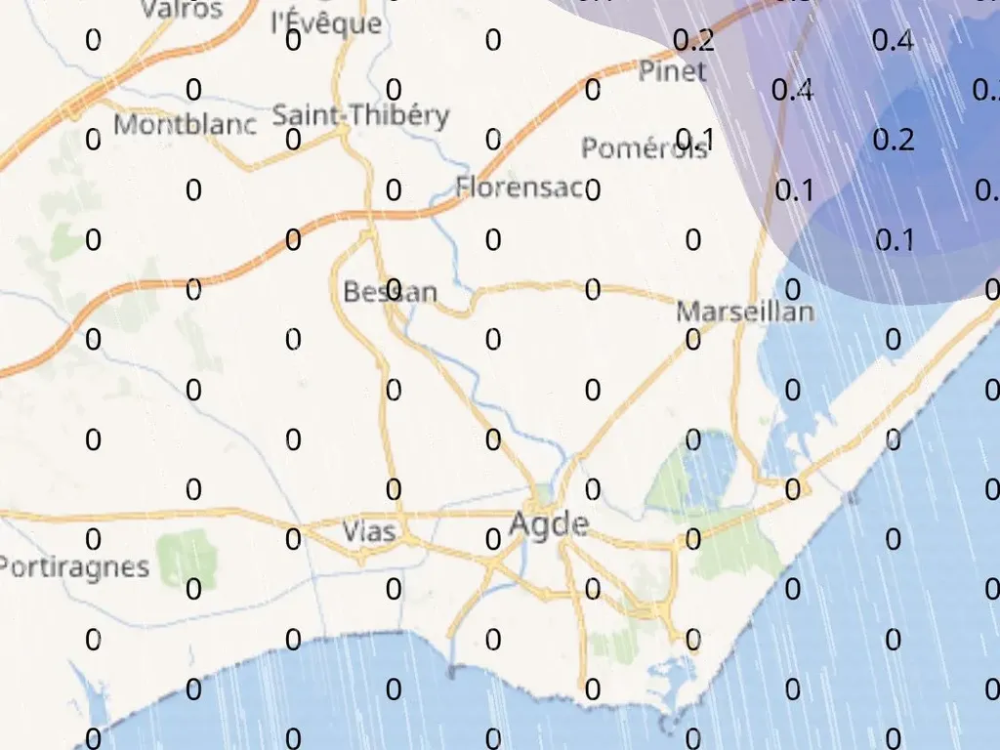

J’appelle Philippe : « On tente par là-bas ? J’ai une trace. » Je l’ai dessinée il y a quelques mois, puis les vacances sont arrivées, puis [je me suis fracturé le col du fémur](../8/un-auteur-se-fracture-le-femur-pour-faire-parler-de-lui.md), puis je l’ai oubliée. C’est une boucle d’une bonne cinquantaine de kilomètres interconnectant [des pistes labélisées FFC](https://sitesvtt.ffc.fr/sites/herault-canaldumidi-mediterranee/), d’autres découvertes sur [VTTrack](http://www.vttrack.fr/), d’autres repérées par images satellites.

[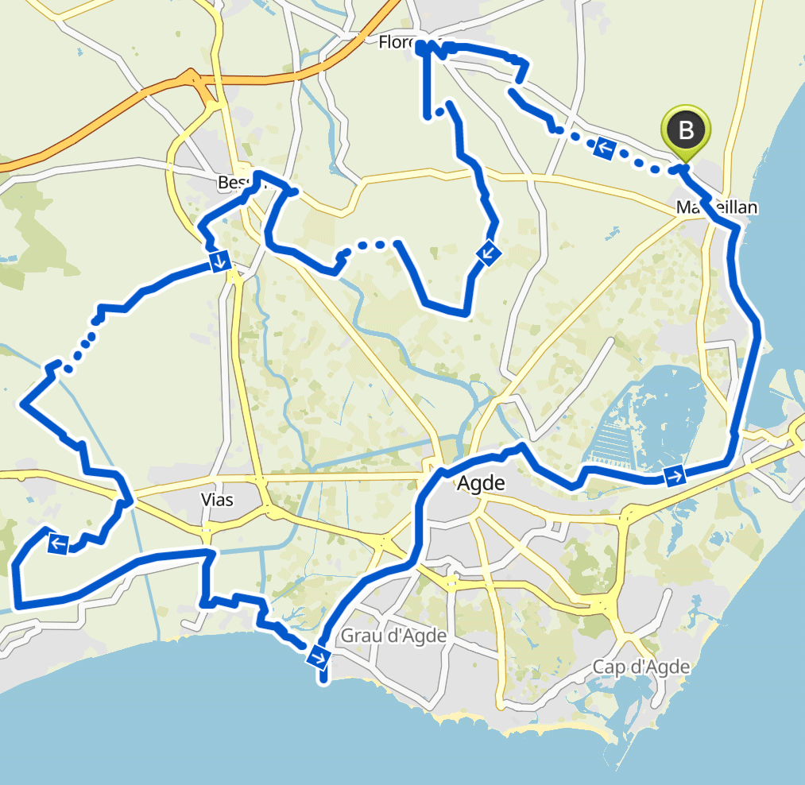](https://www.komoot.com/tour/104014401/)

Philippe trépigne. Comme il n’a pas fait de sport depuis trois semaines suite à une petite intervention chirurgicale, il n’a pas l’intention de laisser passer cette chance, d’autant que les jours à venir s’annoncent maussades. « Viens me chercher », me dit-il. Je m’habille aussitôt, charge mon VTT dans mon antique Kangou, fonce chez lui et nous voilà partis.

Il fait un beau soleil, mais nous roulons vers une gigantesque barre nuageuse, d’un noir de plus en plus menaçant au-dessus de l’ancien volcan d’Agde, le mont Saint-Loup. Avons-nous fait le mauvais choix ? Quand nous nous garons à Marseillan, trente minutes plus tard, il tombe quelques goûtes. Nous autres méridionaux ne sommes pas fans de la pluie. Chez nous, elle a toute l’apparence d’une brutale douche froide qui vous laisse grelottant. Nous en viendrions presque à apprécier le crachin breton.

Aussi bien notre périple sera de courte durée, mais nous nous élançons en direction du village de Florensac, par chemins et minuscules routes humides, vent marin dans le dos. Nous avons l’impression de rouler sous une falaise de nuages. Nous longeons le front qui peu à peu se décale vers l’est, alors que nous obliquons vers l’ouest, et presque soudainement retrouvons le soleil, en même temps qu’une bonne poignée de degrés.

Après la traversée de Florensac, un village labyrinthique à l’empattement médiéval, mais sans le moindre charme, nous repiquons vers le sud à travers les vignes rougeoyantes. Mon compteur indique 14°. Il est temps d’enlever une couche, puis de poursuivre dans un paysage vallonné, plus champêtre que par nos garrigues. Le front nuageux s’épaissit sans cesse, un ventre noir, surmonté d’une épaisse couche de crème chantilly. Nous grimaçons parce de là où nous venons et devons retourner, ça ne doit pas rigoler. Pour le moment, nous sommes au chaud, dans une bulle de douceur, dans la campagne, sans la moindre voiture en vue.

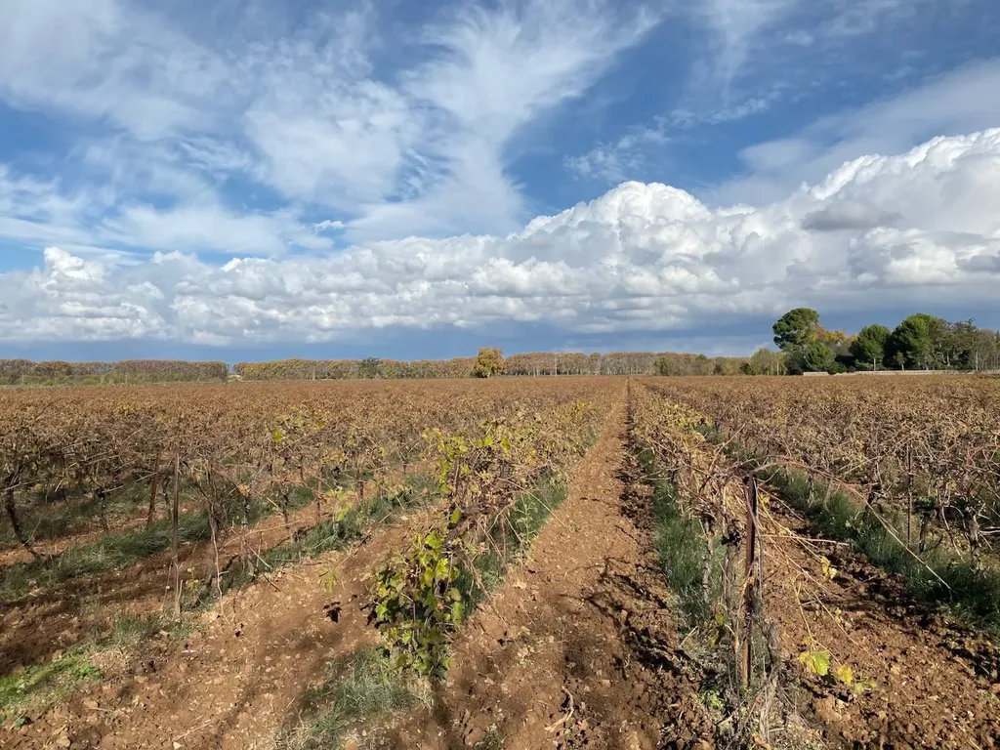

« Je suis perdu », me dit Philippe. Je ne me repère guère mieux que lui. Je n’ai pas étudié la trace avant de la charger dans mon GPS. Nous nous contentons de la suivre, comme si nous lisions un roman captivant, à l’issue incertaine. Nous avons la sensation d’être ailleurs, dans un pays lointain. Décaler de trente kilomètres notre point de départ a bouleversé nos repères, a changé notre dynamique. Nous ne sommes plus en train de faire du sport, mais d’explorer, de voyager, de nous gorger d’images nouvelles.

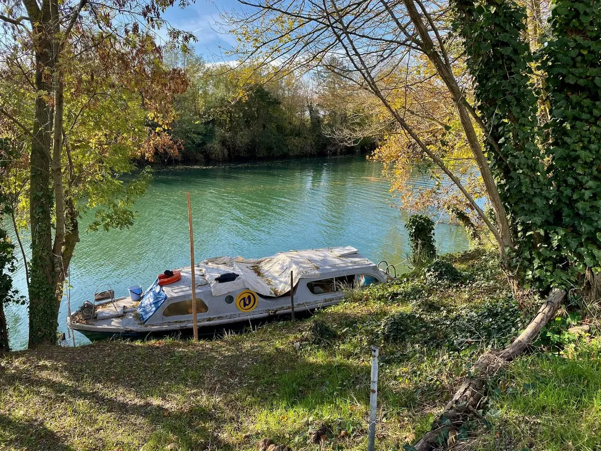
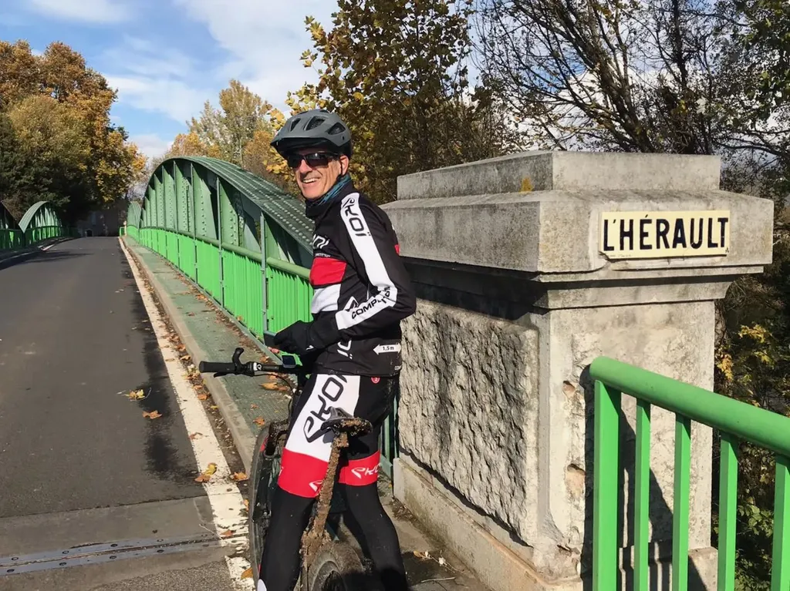
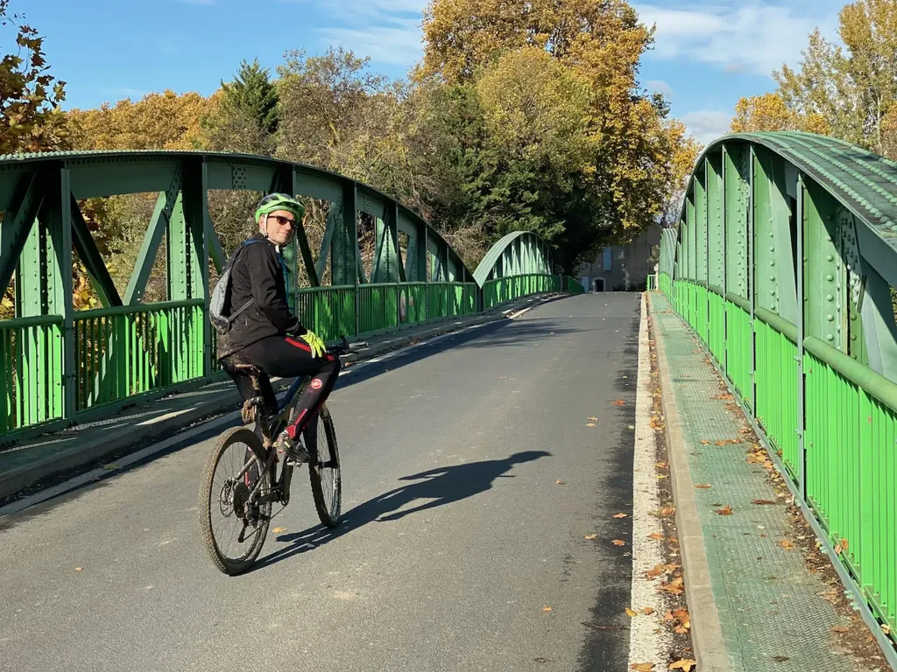
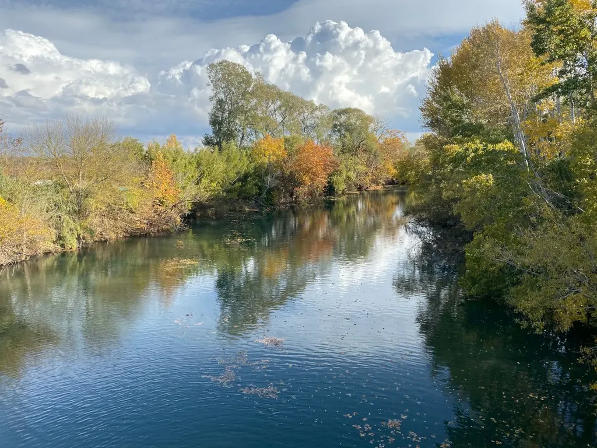
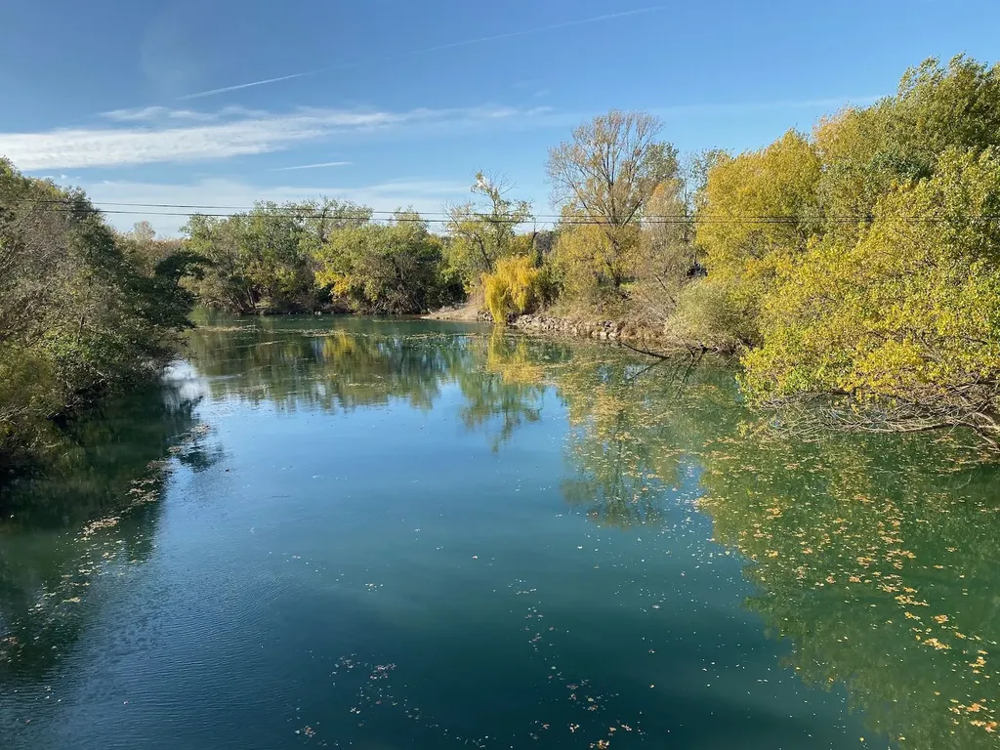

Nous atteignons les berges de l’Hérault, que nous suivons sur une digue avant d’atteindre un magnifique pont métallique, peint d’un vert éclatant, à l’entrée de Baissan. L’automne se donne en spectacle. Il pleut des feuilles ambre vers la surface émeraude de l’eau. Nous entrons dans le village, d’un charme discrètement surprenant. Nous avisons une boulangerie où nous achetons sandwiches et croissants magnifiques, que nous dégustons sur un banc au soleil. Nous n’en revenons pas de notre chance.

Je prends conscience que je suis dans le même état d’esprit qu’en bikepacking. Je retrouve la durée du voyage, le rythme de pédalage, qui nous tient loin de la zone rouge, les arrêts pour photographier, regarder, prendre de temps de discuter avec la boulangère, puis de s’arrêter pour manger, sans le moindre sentiment d’urgence (ce qui me fait regarder d’un mauvais œil les raids chronométrés). J’éprouve une sensation de vie, un alignement avec le monde, avec ses forces les plus anciennes.

Nous repartons vers le sud-ouest. Dépassons des domaines opulents, un manoir aux toits d’ardoises, un parc arboré, puis enfilons une allée de platanes vestige d’une ancienne entrée royale. Par un gué, nous franchissons le ruisseau du Libron, en sous-bois, avec des jeux de lumière sur l’eau, une douceur printanière, une végétation ample révélant des frétillements mystérieux.

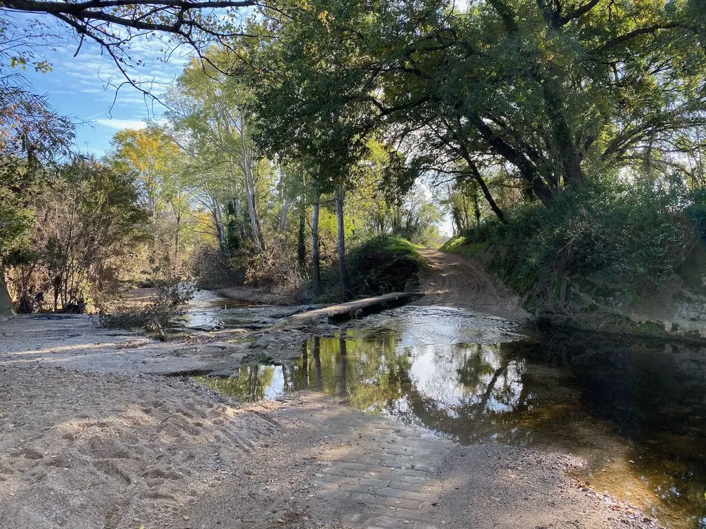
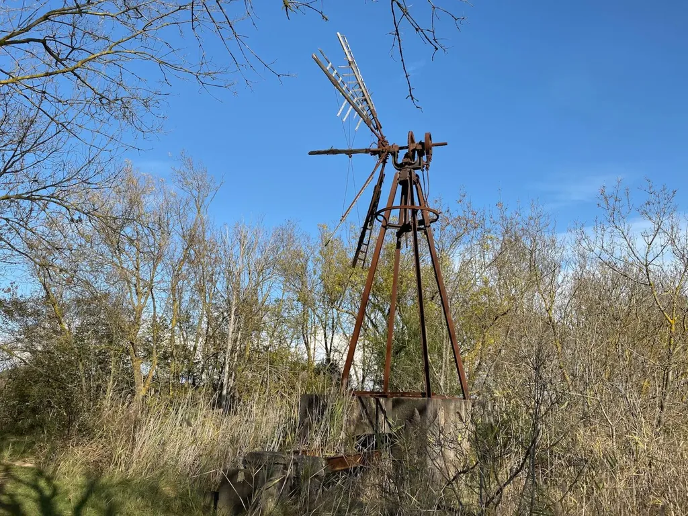

Revenus en enfance, nous roulons dans l’eau pour nettoyer nos vélos chargés de boue. La trace nous a fait glisser dans un autre monde par un passage secret. Toujours plus loin de notre point de départ, nous passons sous la voie ferrée Sète-Béziers, chemin inondé, nos pédales frôlent l’eau jaunâtre, puis, après une dernière boucle vers l’ouest, nous rejoignons le canal du Midi, repiquant vers l’est, droit vers le front nuageux. Un agréable sentier nous amène aux monumentales écluses sur le Libron, une intersection entre deux cours d’eau, un enchevêtrement de poulies et de chaînes, avec un arrière-plan de platanes rouges.

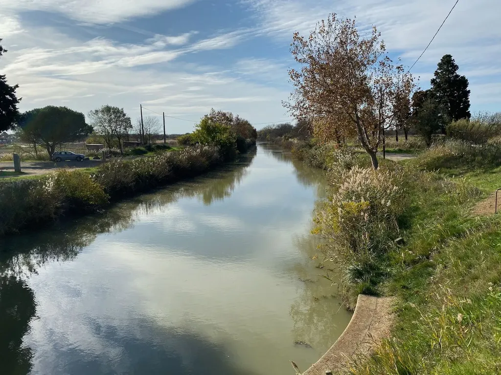
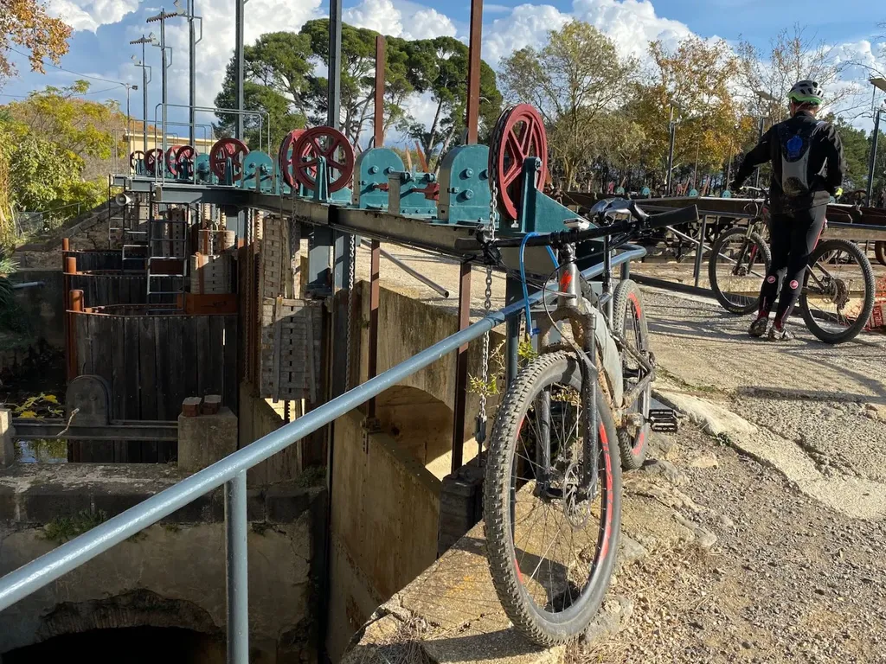

Nous avons cassé notre routine de cycliste, mais aussi de vie. Nous avons laissé dans une simple journée de la place pour un voyage. Nous sous sommes autorisés une parenthèse loin de nos habitudes, peut-être contrant une tendance à l’enferment qui se révèle quand on analyse les distances auxquelles nous autorisons nos enfants à s’éloigner de nos domiciles.

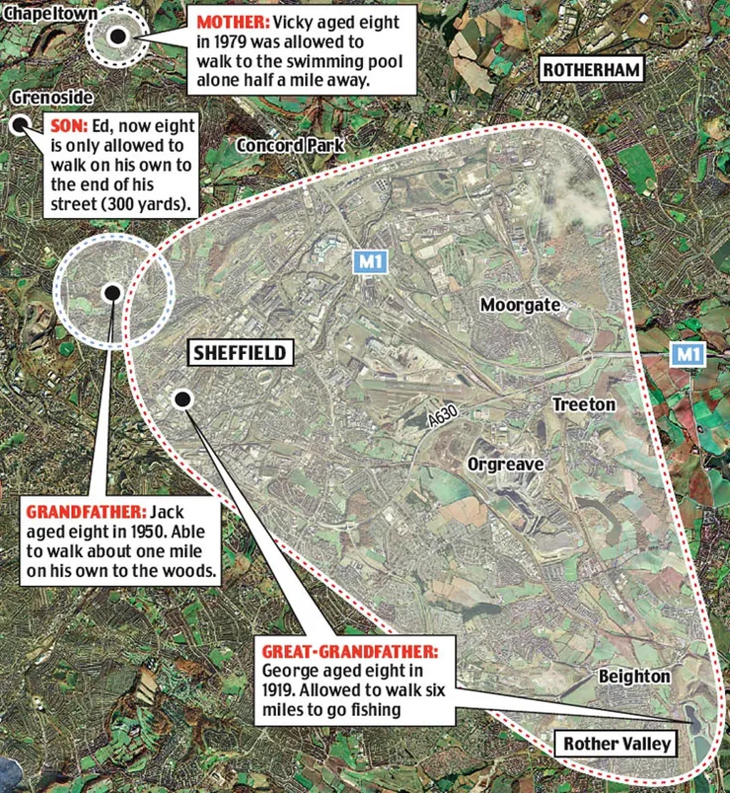
[Une étude](https://www.dailymail.co.uk/news/article-462091/How-children-lost-right-roam-generations.html) montre qu’ils avaient le droit de parcourir seuls 10 km en 1919, plus que 2 km en 1950, moins de 1 km en 1979, plus que 250 m aujourd’hui (au fait de cette étude, j’ai toujours laissé les miens explorer). Sans nous en rendre compte, nous avons l’imité nos possibilités (et même nous autres cyclistes, vite pris par la routine). Alors que nous quittons le canal du Midi pour rejoindre le bord de mer et les dunes sauvages de La Tamarissière, nous prenons conscience qu’autant nous sommes prêts à prendre un avion pour un oui ou un rien, autant nous avons du mal à envisager notre propre région au-delà du bout de notre nez.

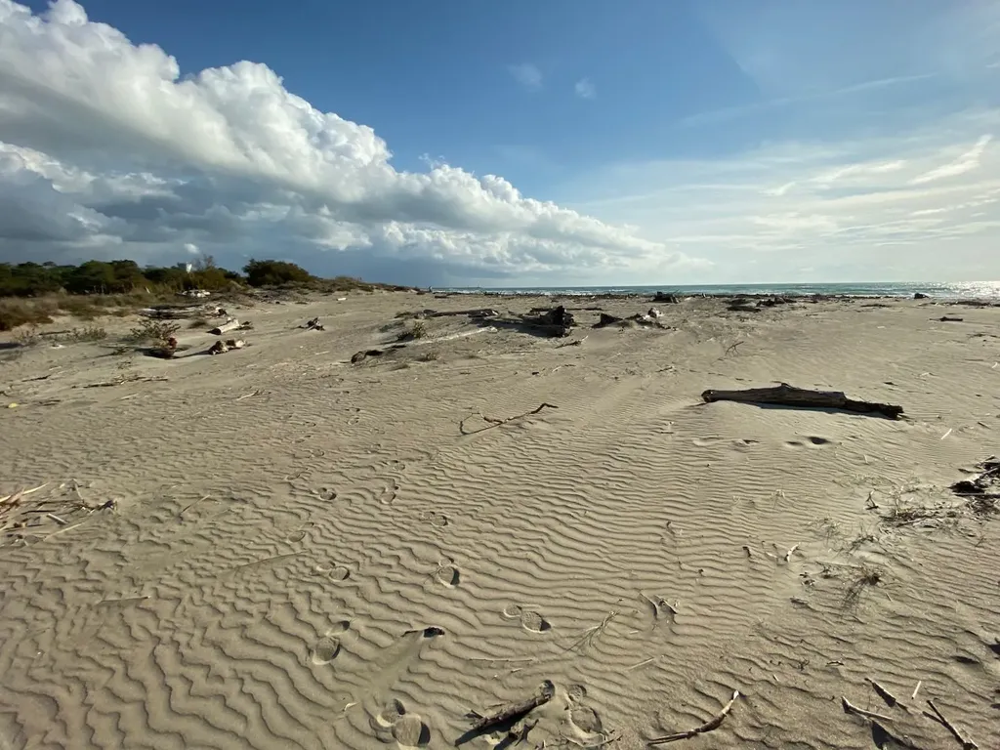
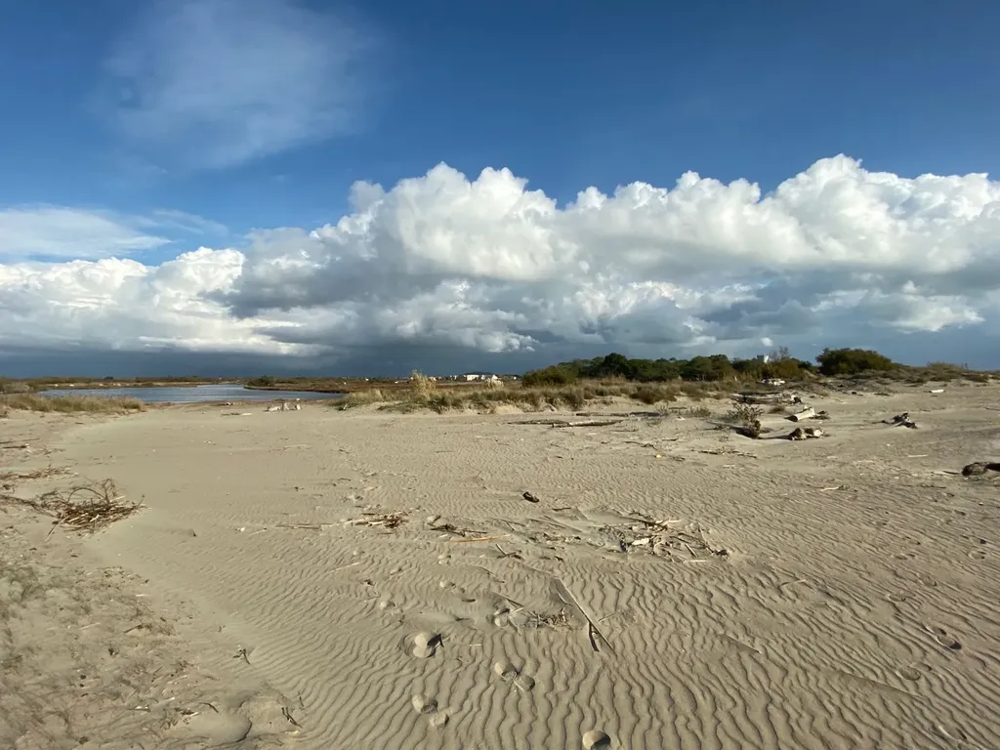

Nous retrouvons l’Hérault au Grau d’Agde, le remontons vers Agde et son église noire, toujours sous une lumière éblouissante, mais vers le mont Saint-Loup, les nuages s’accumulent. Nous accélérons quand nous retrouvons le sentier le long du canal du Midi, puis les bords de l’étang de Thau. Les premières gouttes nous touchent quand nous atteignons la Kangou. Nous ne sommes pas à l’abri que des seaux d’eau nous tombent sur la tête.

Alors peut-être que la menace du front nuageux tout au long de notre boucle a coloré nos sensations, créant une tension, une menace, une excitation qui en nous s’est transformée en urgence à apprécier le répit qui nous était offert. Peut-être, mais je suis presque sûr que si dans une semaine nous reprenons la voiture, roulons trente ou quarante kilomètres avant de pédaler sur une trace inconnue et joueuse, nous éprouverons les mêmes sensations. Voilà sans doute la meilleure façon de s’initier au bikepacking. Vivre une de ces journées, puis se dire qu’elle peut se répéter jour après jour, se tendre jusqu’à la nuit, avec la sensation de liberté offerte par la possibilité de camper n’importe où ou presque.

Une fois de retour chez Philippe, la brouette dans son jardin s’était remplie d’eau. Nous, nous étions secs, bien que boueux, fatigués et heureux. Nous avons vécu une trace comme nous pouvons vivre un roman, dans une durée comparable à celle de la lecture. Si un guide familier des lieux nous avait accompagnés, il nous aurait révélé des perspectives, raconté des histoires, mais nous aurait aussi imposés son impatience, et surtout nous n’aurions pas été livrés à nous-mêmes, seuls avec le GPS en quelque sorte.

À un moment, j’ai dit à Philippe qu’il était dangereux d’affirmer que la technologie était une aliénation, surtout quand on pense à nos enfants qui passent trop de temps sur leurs jeux vidéo. La technologie peut parfois nous faire sortir de chez nous, elle peut nous pousser dehors, et même là où nous n’aurions jamais osé aller sans elle. Notre boucle avec une carte nous aurait procuré moins de plaisir, parce que la carte nous aurait toujours dit où nous étions, parce que sa lecture aurait sans cesse détourné notre attention. Au contraire, la trace sur le petit écran du GPS est un scénario, un fil rouge minimaliste sur lequel nous avons roulé en équilibristes, en bikepackers, même si nos vélos n’étaient pas chargés de nos bagages.

[Traces et variantes sur Google Map…](https://drive.google.com/open?id=1F2f9N3wKvtDhRG7OhlFi9yl2szTu3QVX&usp=sharing)

#livre_2 #mini_aventures #velo #y2019 #2019-11-22-11h13
