# Octobre 2019

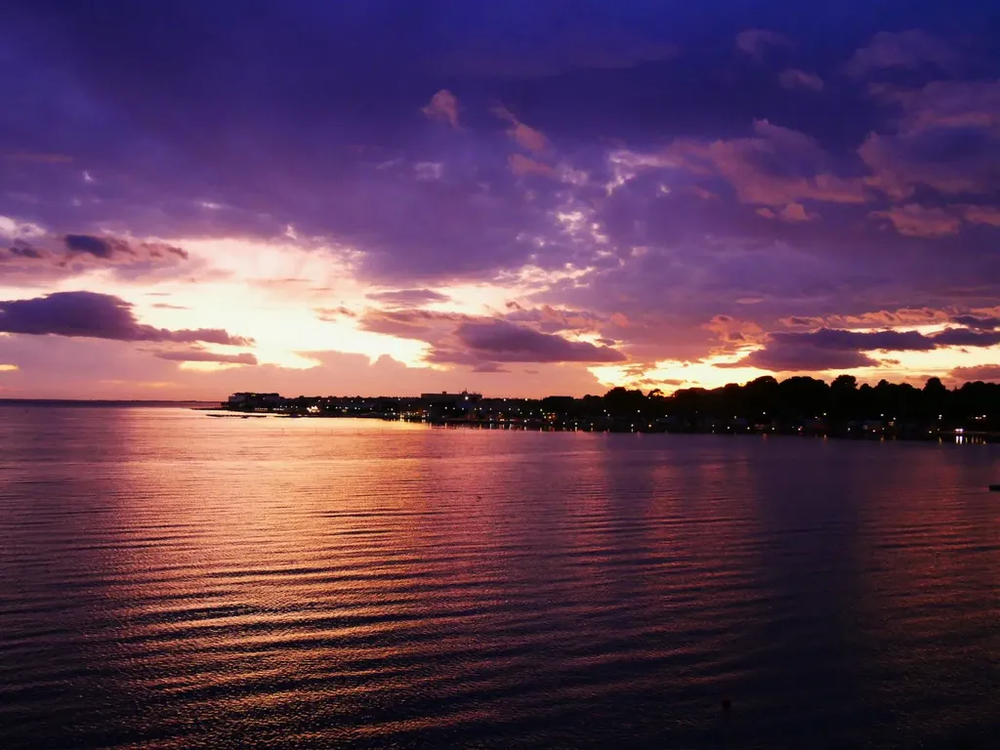

### Mardi 1er, Balaruc

Seconde séance home-trainer : 6 km en 22 minutes, trois minutes de mieux que la veille et moins de douleurs. Je réapprends la normalité.

### Mercredi 2, Balaruc

Troisième séance home-trainer : 7 km en 25 minutes.

---

De retour de chez Sauramps Montpellier. Soirée rentrée littéraire. Nous autres auteurs sommes tous persuadés d’être géniaux. Par delà les chapelles, l’engagement plus ou moins profond en littérature, nous n’avons qu’un point commun : poursuivre la reconnaissance.

### Jeudi 3, Balaruc

Hier soir, ma cicatrice tiraillait, encore ce matin, nouvelle étape de la guérison, douleur peut-être provoquée parce que je bouge davantage, parce que les muscles et ma peau frottent sur les ferrailles plantées dans mon fémur. Home-trainer : 8 km en 27 minutes.

---

Parfois, des gens que je ne connais pas m’envoient des mails pour me donner des conseils du genre « Cesse d’écrire sur tel ou tel sujet pour te concentrer sur tel ou tel autre. » Quand je leur demande d’être précis, de m’expliquer ce qui leur déplaît, souvent ils ne me répondent pas, mais je sens que mes incursions dans des domaines où ils se prétendent experts les dérangent, sans que ce soit très clair pour eux. Ce matin, je suis obligé de préciser : « J’écris pour voir, pas pour briller. »

---

Suite à un billet de [Lionel Davoust](https://lioneldavoust.com/2019/les-modes-sombres-nuisent-a-la-productivite-essayez-le-solarise-a-la-place/) sur [le mode solarized](https://ethanschoonover.com/solarized/), j’ai ajusté les couleurs de mon template Ulysses et, après deux ou trois heures, j’ai l’impression d’avoir toujours travaillé ainsi. C’est plus doux, plus reposant.

### Vendredi 4, Intercités

Je ne sais plus trop, des sentiments contradictoires, des discussions en ligne, des échanges, des projets, puis le présent, le train arrêté, « en pleine voie » comme s’il pouvait s’arrêter ailleurs, pendant que ma correspondance à Toulouse s’échappe peut-être. Un manque, celui de ne plus pouvoir photographier avec mon iPhone à l’objectif récalcitrant. Cette fonction m’est devenue indispensable sans que j’en prenne conscience. Un bout de garrigue au-delà de la fenêtre, oliviers sauvages, cyprès, puis les roches à nue, de ce gris du Midi que je ne sais même pas nommer, granit peut-être, avec de la terre ocre, et puis la végétation rase au-dessus des chênes verts. Une route aussi, le long de la voie. J’aurais photographié, je n’aurais pas décrit. Le train repart, le paysage avec lui. Des vignes, des voitures, des parcelles replantées de pins.

---

J’essaie de dormir sans y parvenir, je pense à ce roman que je dois écrire à tout prix. Il sera au présent, à la première personne, avec le défi d’entrer dans la peau d’une femme qui vit ses deux dernières années. *Vivre à mort*, c’est-à-dire vivre à fond jusqu’à la mort, et même vivre sa mort puisque l’histoire se terminera par un suicide.

### Samedi 5, Pau

Le vieux monde n’est pas nécessairement celui auquel on pense. Aujourd’hui, le net s’est féodalisé. Impossible de faire caca sans demander l’autorisation à Google, Facebook, Amazon… Je n’y suis plus à ma place, sauf sur mon blog et dans quelques niches où on nous laisse aboyer. Suis-je à ma place parmi les auteurs traditionnels, dans les salons « littéraires », où tout le monde fait clan et famille ? Guère mieux.

---

Je ne me suis pas installé en terrasse de café que le garçon range chaises et tables. Il n’est que dix-neuf heures. Ai-je le temps de boire mon Perrier ?

Une femme voilée avec poussette fait demi-tour devant moi, longe la terrasse, va jusqu’à un paquet de cigarettes abandonné, l’écrase pour voir s’il ne serait pas plein, puis repart en me jetant un regard noir.

Je n’ai rien de particulier à voir, sinon la flèche d’une église sur fond de nappes nuageuses craquelées de nacre, de coulées bleues et d’iridescences jaunes, au-dessous quelques arbres dont certains se teintent d’automne, et un manège.

Les salons mettent ma patience à rude épreuve. Je suis forcé de supporter cet exercice masochiste maintenant que le net n’est plus mon ami. Je cherche hors de lui de nouvelles relations, une recherche douloureuse, parce qu’elle n’a rien de naturel pour moi.

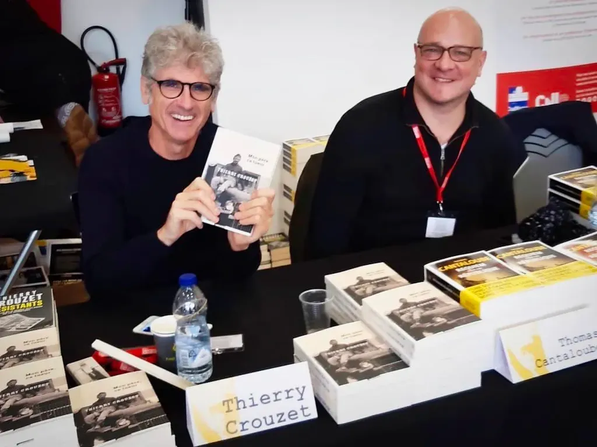

### Dimanche 6, Pau

Dans ma chambre d’hôtel, le lit est plus bas que chez moi. Victime d’un excès de confiance, je m’y assois un peu rudement sur le côté droit, ressentant une brève douleur dans la hanche. Depuis, impossible de penser à autre chose.

---

Malgré ma frayeur de ce matin, et une douleur lointaine, mais persistante, j’ai passé un agréable week-end à Pau pour [Un aller-retour dans le noir](https://www.unallerretourdanslenoir.com/), avec Marie-Anne de La manufacture, Thomas Cantaloube mon voisin de table, Olivier Truc, mon compatriote méridional exilé en Scandinavie, Colin Niel, pas même invité cette année, mais aimant la grande famille du Noir à laquelle je me retrouve parfois mêlé parce que mes livres y sont versés (à croire qu’une force répulsive me tient éloigné de la littérature générale).

### Lundi 7, Balaruc

Dix kilos, je peux exercer une pression de dix kilos sur ma jambe droite. Terminé le pied en l’air, je marche maladroitement avec mes béquilles. Pas de quoi faire des kilomètres, mais je vais reprendre une vie normale, c’est presque trop rapide, un peu effrayant, je m’étais coulé avec facilité dans la peau d’un assisté.

---

J’explore l’Instagram des livres, analyse les hashtags. Je fabrique un compte factice pour mener une expérience. Suis-je capable de le faire monter vite, artificiellement, [comme jadis avec Twitter](../../2009/9/qui-a-la-plus-grosse-quequette-sur-twitter.md) ? Suis-je capable de faire croire aux éditeurs que c’est un compte influent ? Suis-je capable de me faire envoyer des services presses ? Ça pourrait être un jeu pour démontrer l’absurdité d’un système.

### Mardi 8, Balaruc

Je grimpe jusqu’à mon bureau et reprends ma vie d’avant. Mes *Ravissements* approchent les 120 000 signes, encore une dizaine de chapitres à écrire.

---

Séance kiné sportive, je monte en tour, transpire, passe à quinze kilos de pression. Quelques raideurs avant l’échauffement, puis ça roule. Quand je rentre à la maison, le ciel explose. La plus belle saison commence.

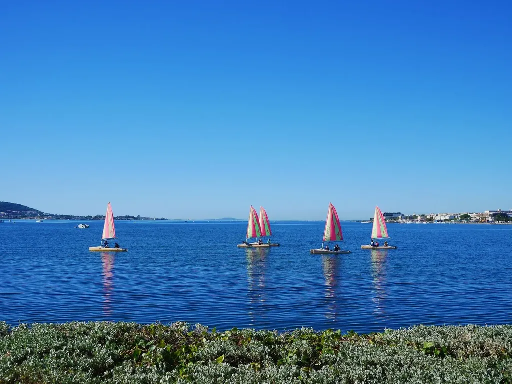
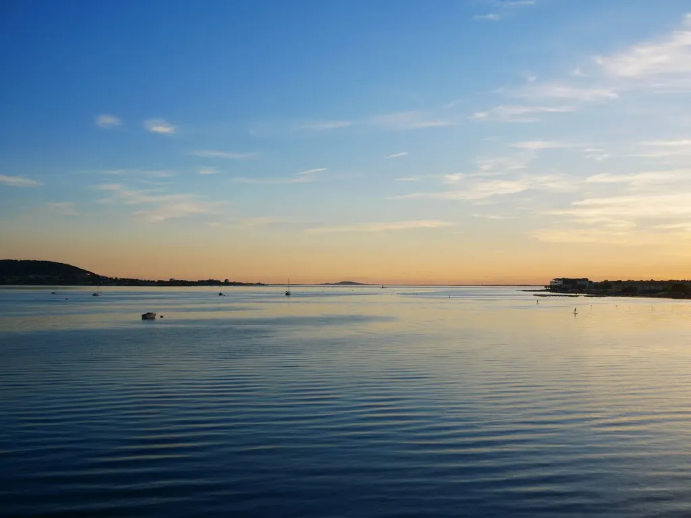
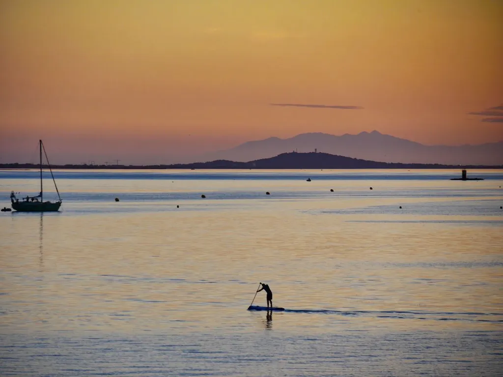
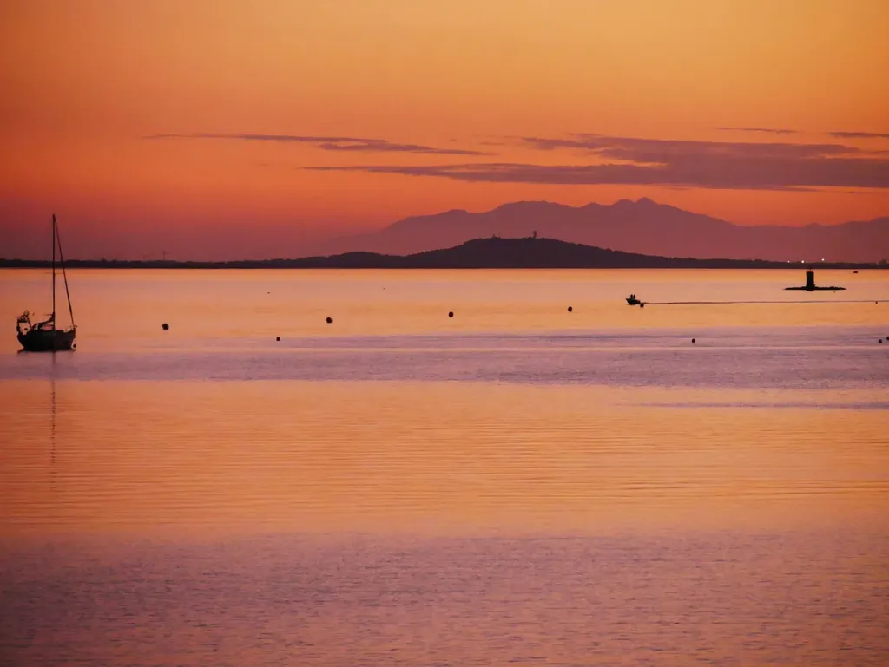

### Mercredi 9, Balaruc

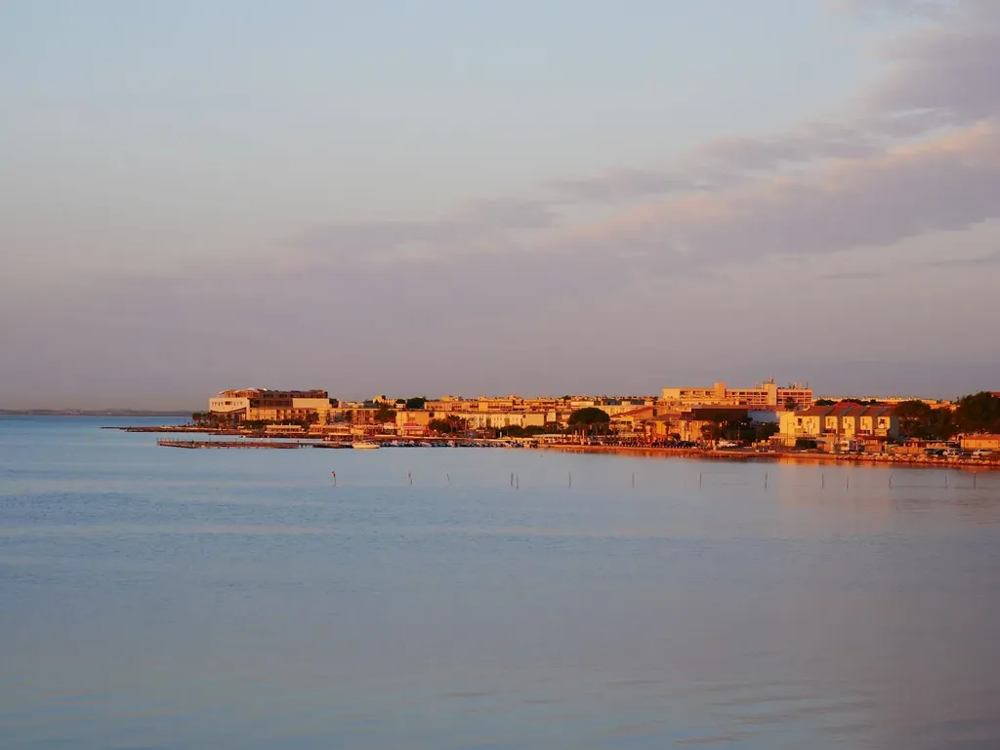
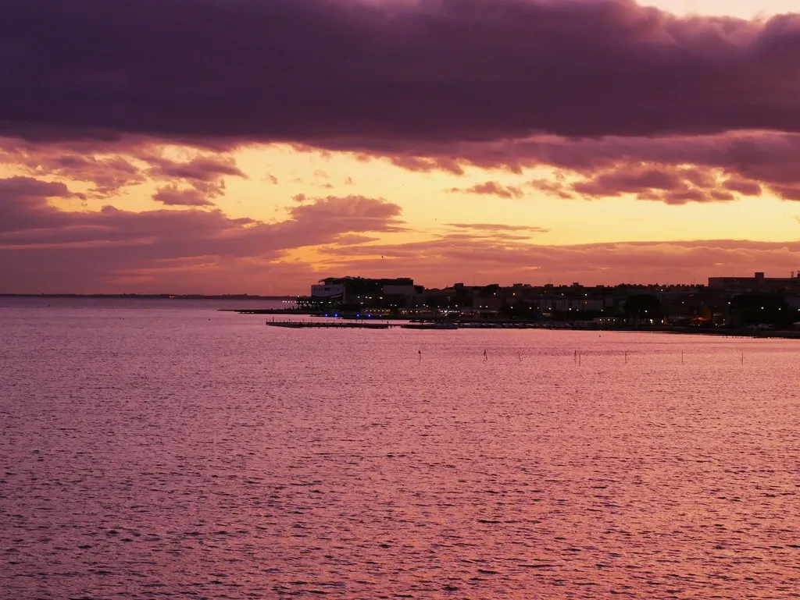

### Jeudi 10, Balaruc

Sorte de folie du like sur [mon éloge des librairies](../9/retomber-amoureux-des-librairies-une-necessite.md) : 16K ce matin, 21K ce midi, 32K ce soir. J’ignore quel influenceur a mis ce texte en avant, mais l’effet de levier a été soudain. Le truc amusant, et plutôt déprimant, c’est que seulement 15 % des likers lisent l’article. Plus dramatique encore, il ne se passe rien, aucune discussion, sinon avec un zozo qui me cherche des noises parce que je ne mettrais pas assez en avant [les librairies physiques dans ma page libraires](../../page/en-librairie).

Je continue de jouer avec Instagram, mes bouts de code republient sans cesse des images sur des comptes auxquels des gens commencent à s’abonner. Je ne sais pas encore où cette expérience mènera, peut-être une fois de plus à mesurer la vacuité des réseaux sociaux.

Côté jambe, je progresse. Deux kilomètres de marche aujourd’hui et des séances kiné de plus en plus sportives. Reprendre des forces, reprendre confiance, appuyer sur la jambe, mais ne jamais avoir mal, un juste milieu délicat.

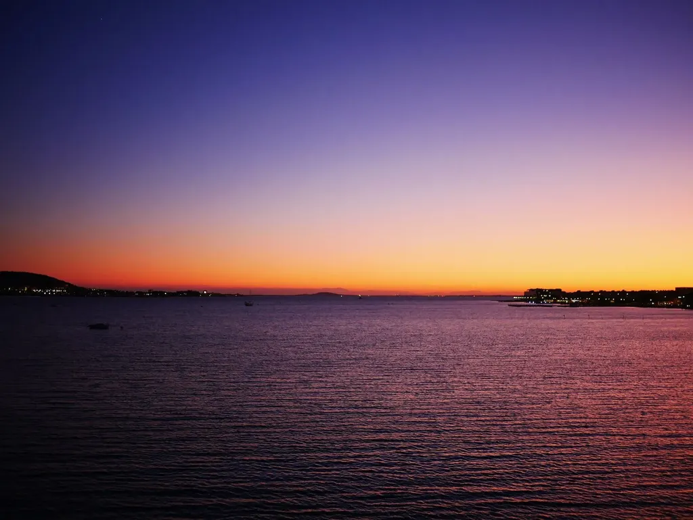

### Vendredi 11, Balaruc

L’interphone sonne. Je décroche. « Bonjour, c’est monsieur un tel et un tel. » Moi : « Oui, mais encore ? » Eux : « On vient pour parler des écritures. » Il me faut un instant pour comprendre qu’il ne s’agit pas de mes écritures.

---

Plus que trois ravissements dans ma liste, j’arrive au bout de ce projet. Aucune idée de que faire de ce texte ? Isa le lira, quelques amis, je verrai bien.

---

Je tiens le 20 km/h de moyenne sur le home-trainer, avec 2 km au niveau 3. Séance terminée en nage. Je passe le reste de la journée à jouer avec l’API Instagram.

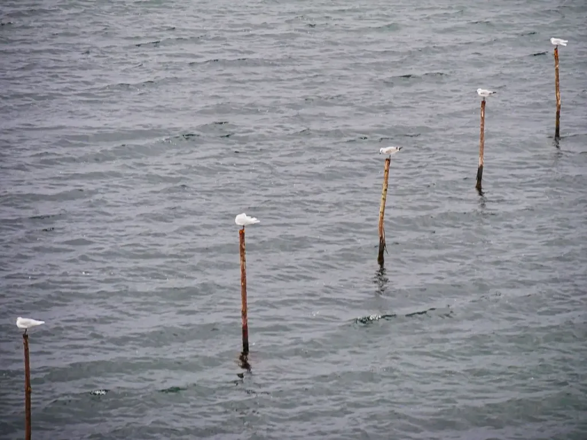

### Samedi 12, Balaruc

Le déferlement de likes faiblit sans encore s’arrêter : 45K désormais, toujours pas de réaction, rien d’autre de perceptible à part l’affolement du compteur au pied de mon article, à croire que les likers sont des robots, ou que les humains sont devenus des robots, ou que le like est devenu une petite récompense donnée à celui qui poste ou reposte un message, une façon de l’énergiser, parce que lui sans doute a fait l’effort de lire.

### Dimanche 13, Balaruc

La littérature n’est pas au sujet de la littérature (sauf quand elle se perd), elle est au sujet de la vie, de ce qui nous entoure. Aujourd’hui, elle doit aussi être au sujet de la technologie ou de son refus. Et donc pratiquer la technologie est une façon de fabriquer de la matière littéraire. Je code pour écrire.

### Lundi 14, Balaruc

De bon matin, la souffrance peut justifier de rester au lit, puis le corps se rouille, puis c’est de plus en plus difficile et je devine comment on finit par ne plus se lever, puis par se laisser mourir. Sept semaines depuis mon opération et j’entre dans une phase nouvelle de ma convalescence. Je ne marche plus qu’avec une béquille, tout en ressentant des douleurs articulaires.

---

Je relis mes *Ravissements* sur l’iPad quand je laisse tomber mon stylet, me lève par réflexe pour le ramasser, fais trois pas, puis reviens précipitamment m’asseoir, conscient d’avoir imposé à mon fémur une pression excessive. Au moins, je ne me suis pas écroulé.

### Mardi 15, Balaruc

Écriture, codage, kiné, codage, retour des enfants, lecture, parfois un film : la routine.

### Mercredi 16, Balaruc

Rencontre avec Serge Barnel, le truculent pape du VTT en France, co-organisateur des premiers championnats du monde en 1987 et du Rock d’Azur, aujourd’hui avant tout adepte du gravel et du bikepacking.

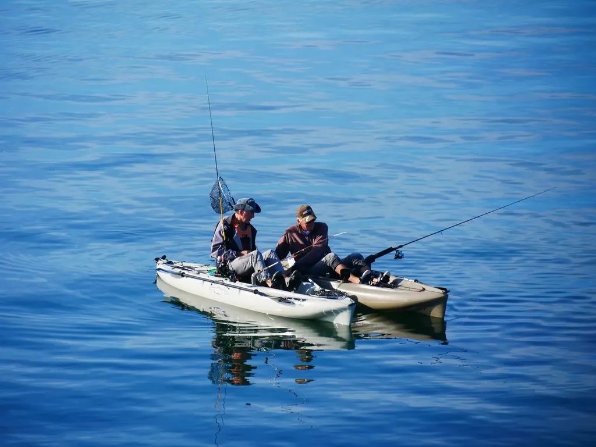

### Jeudi 17, Balaruc

Une étoile située dans la proche banlieue du soleil serait [plus vieille que l’âge de l’univers](https://www.space.com/how-can-a-star-be-older-than-the-universe.html). Soit il y a erreur sur son âge, soit sur celui de l’univers… ou commence un récit de SF, cette étoile est un leurre, un fanal positionné par des extraterrestres qui attend que nous découvrions sa véritable nature et commencions à décoder les informations qu’il nous transmet.

---

J’abandonne mon vieil iPhone 6 pour un iPhone 11 Pro, qui j’espère me durera aussi cinq ans : l’iPhone 6 n’était plus mis à jour par Apple, il plantait sur de nombreuses app et faisait des photos floues. Je suis fatigué par cette obsolescence programmée. Reste que le nouvel iPhone est d’une fluidité remarquable, qu’il fait de superbes photos, mais bon, à part ça, je ne vais pas crier à la révolution (si, tout de même, j’entends à nouveau mes interlocuteurs quand ils me téléphonent).

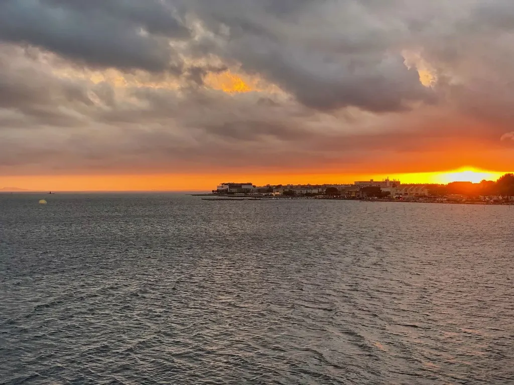

### Vendredi 18, Balaruc

Je fais quelques pas sans béquille. Olivier m’annonce que la semaine prochaine je pourrais conduire et faire du vélo (mais en douceur bien sûr, pas question encore de ressortir le VTT).

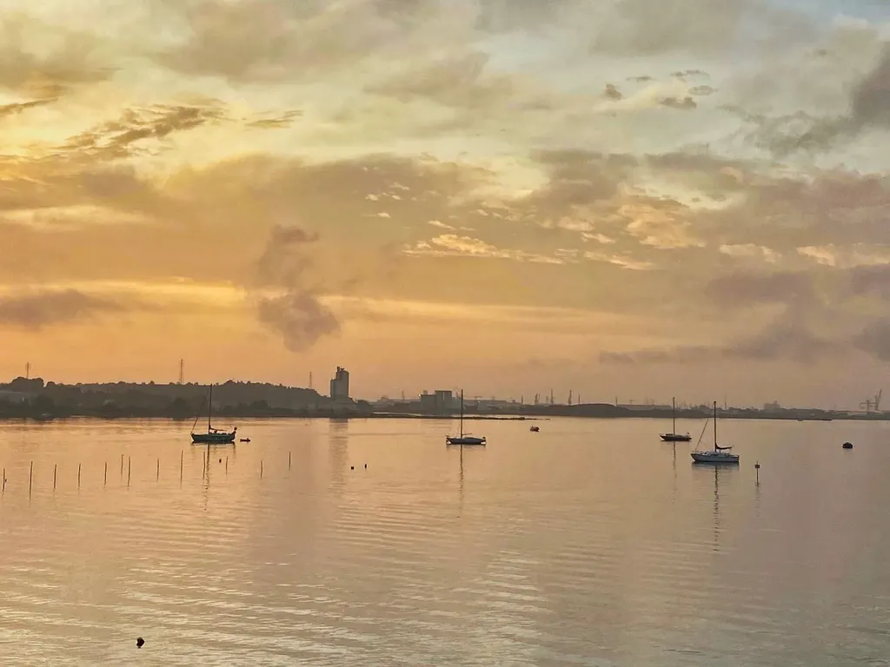

### Samedi 19, Balaruc

L’écriture de mes *Ravissements* aura rythmé ma convalescence et je me retrouve dans le post-partum de l’après-texte. J’aurais aimer écrire davantage, mais voilà, j’en suis arrivé au bout, je ne choisis pas la taille de mes livres, à un moment donné j’ai dit ce que j’avais à dire.

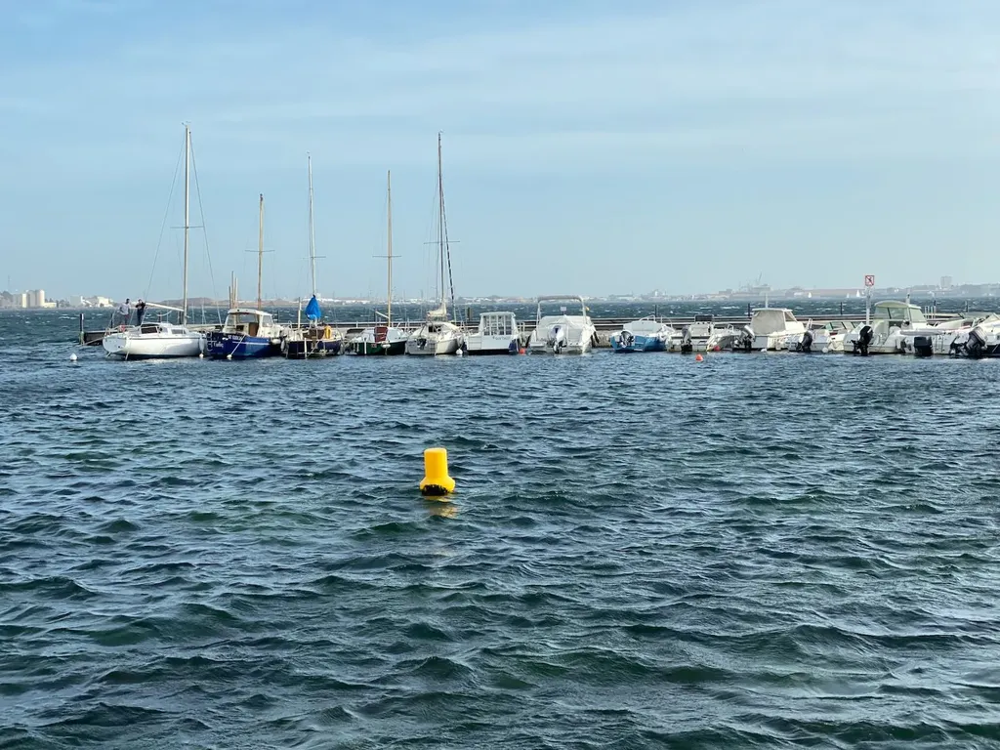
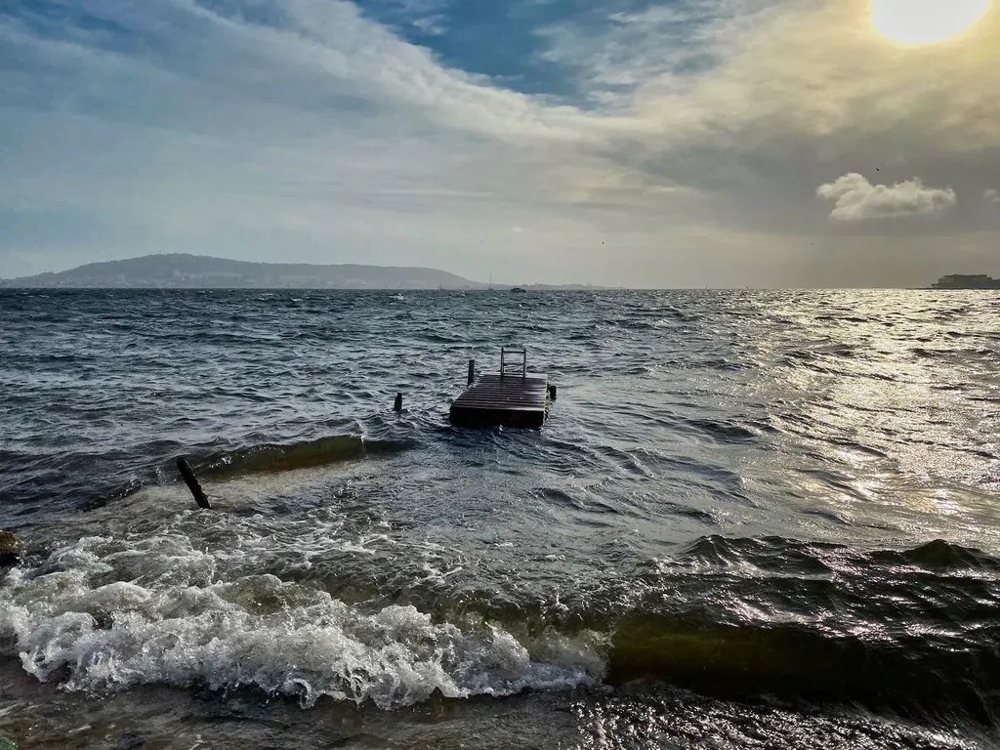
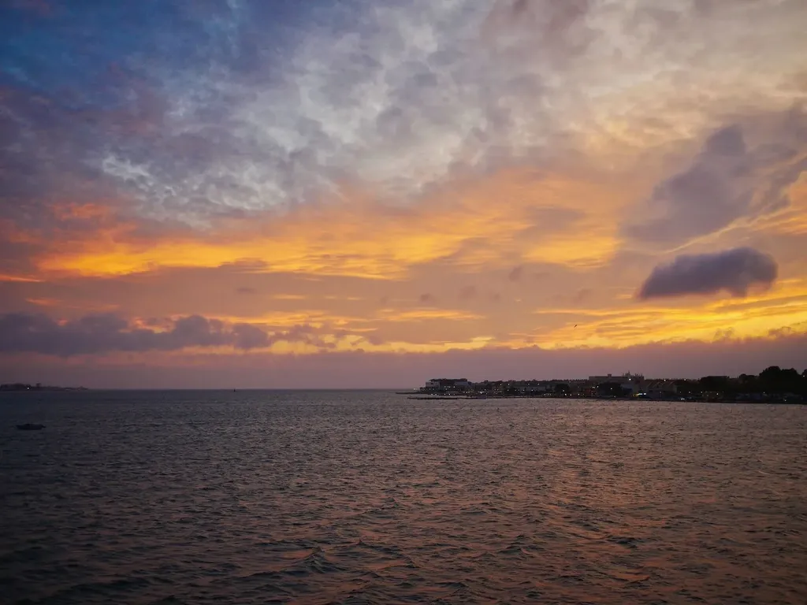

### Dimanche 20, Balaruc

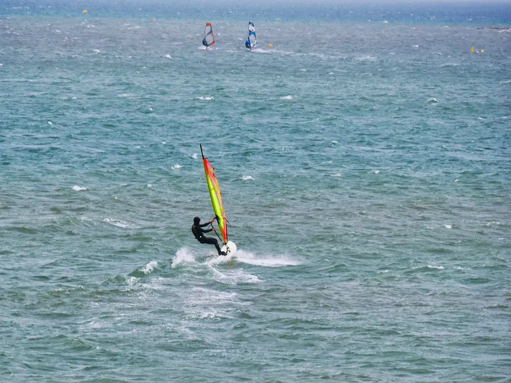
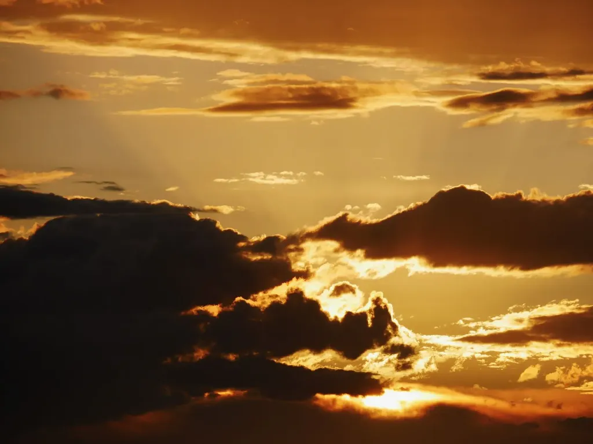
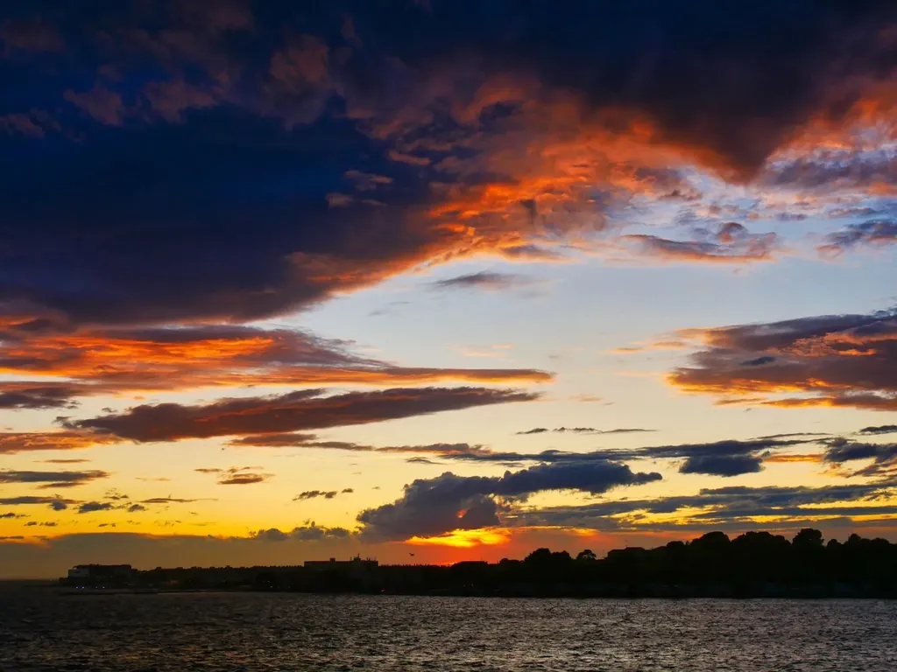

### Lundi 21, Balaruc

De nouveaux ravissements s’imposent alors que je relis l’ensemble. Je continue de jouer avec l’API Instagram. Certaines me le reprocheront.

---

Je peux marcher sans béquille, plus facile quand mon articulation est chaude. Il y a de l’étrangeté à retrouver un fonctionnement normal, jusqu’à vider la machine à laver et à étendre le linge.

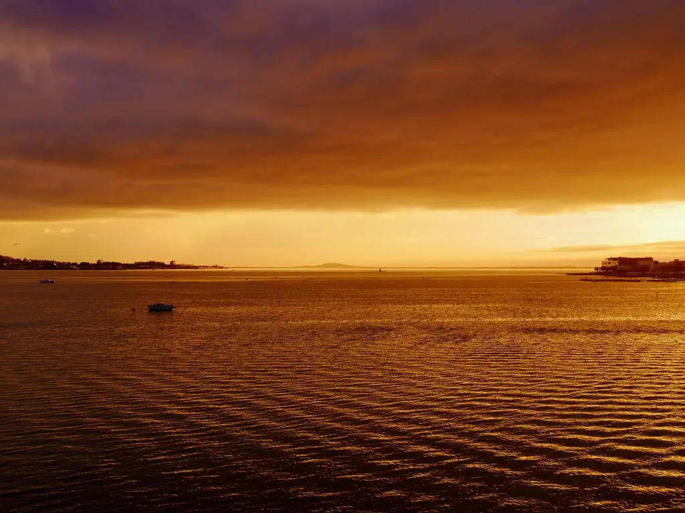
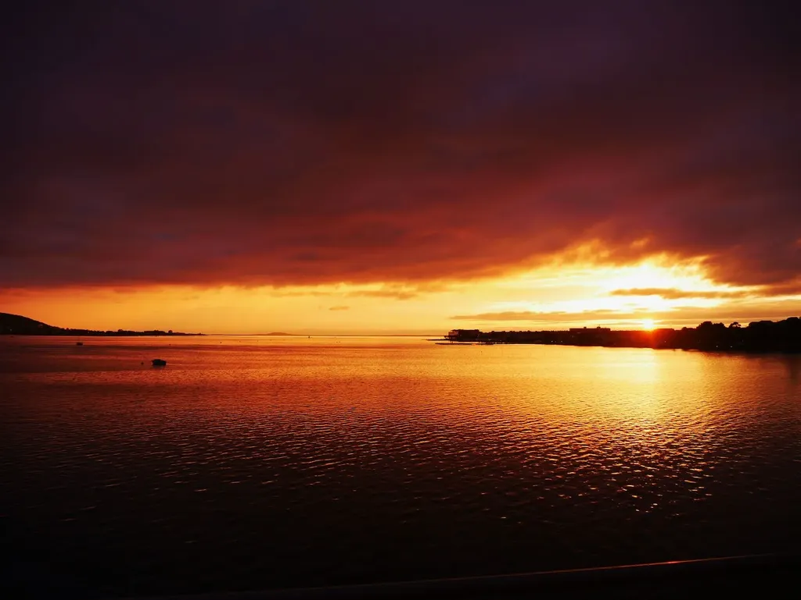
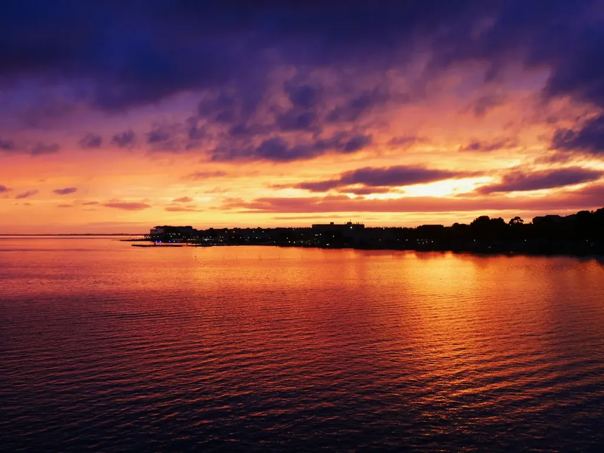
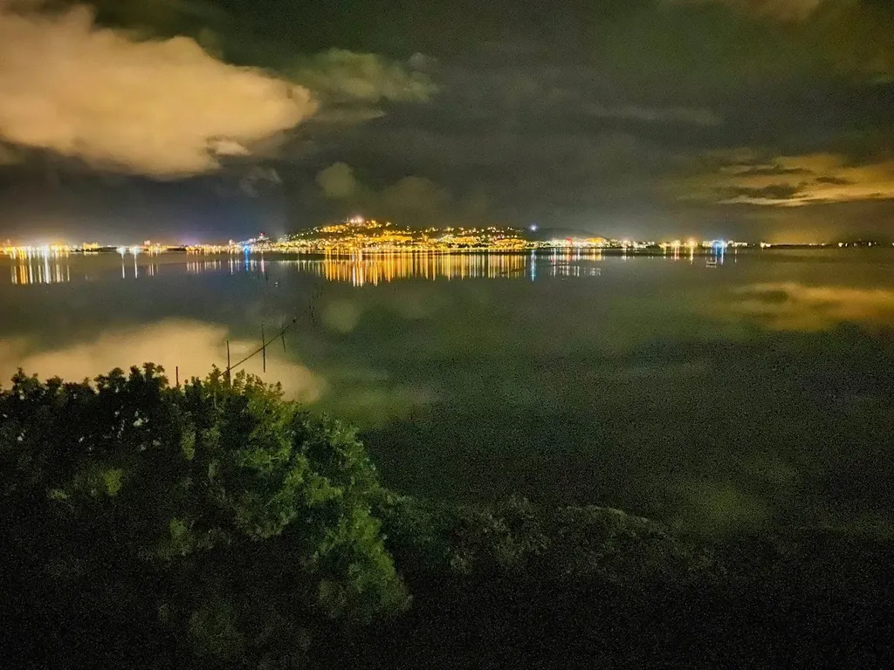

### Mardi 22, Balaruc

Pourquoi préciser bio sur les produits bio ? N’est-ce pas attendu qu’ils soient dépourvus de substances nocives ? Il devrait y avoir au contraire l’obligation de mentionner « chimique » quand nécessaire, exactement comme sur les paquets de cigarettes. Nous consommons à plus soif les faits divers, les mauvaises nouvelles, mais nous refusons qu’elles soient placardées sur les produits que nous ingurgitons.

---

Pourquoi construire des chapelles ? Des coteries avec un grand prêtre en porte-parole, qui se veut bientôt dieu et adoré ? Pourquoi ne pas nous accepter dans nos différences ? Pourquoi à la moindre controverse faire de nos amis des adversaires alors qu’hier ils étaient nos compagnons de route ? J’ai écrit un ravissement sur la contradiction. Sans elle, on s’ennuie et se met à croire à sa propre pensée.

---

Laurent Margantin publie la traduction d’un [texte émouvant](http://oeuvresouvertes.net/spip.php?article4139) de Jizchak Löwy, un ami de Kafka, qui constate qu’il a raté sa vie, une poignée d’année avant de finir déporté. « On se retrouvait fréquemment chez Brod ou chez un autre ami, mais pas pour parler vainement, boire et papoter. Non, cela n’intéressait pas les hommes de lettres pragois. Nous nous retrouvions pour étudier un chapitre de Kant, pour lire des textes, pour discuter sur des thèmes littéraires. » On est loin du compte nous autres.

### Mercredi 23, Balaruc

Lecture d’une [chronique](http://www.bernard-deschamps.net/2019/10/regards-d-enfants-sur-leurs-parents.html) sur mon roman écrite façon patate qui se termine par « La distance avec laquelle il relate les atrocités – qu’il condamne - commises en Algérie par l’armée et par son père, me paraît tellement éloignée du traumatisme que doit éprouver un fils en les découvrant que je me demande s’il s’agit réellement du vécu de l’auteur. Ce n’est pas un des ouvrages majeurs de la rentrée, mais le style est alerte et cela se lit facilement. » Encore un qui n’a rien compris. Sans distance, tu crèves. Mon seul but dans ce livre était de comprendre mon père, de m’en approcher, pas de raconter la guerre d’Algérie, pas de condamner quoi que ce soit, pas de fantasmer une guerre. La pudeur, la retenue, le minimalisme, la sobriété te parlent comme esthétique ? Et je ne savais pas qu’il y avait des ouvrages majeurs dans cette rentrée. Toutes ces âneries fatiguent autant que le silence. Chaque fois que l’Histoire vacille, les arts basculent dans le baroque comme pour rire d’eux-mêmes. Je ne tomberai pas dans ce piège.

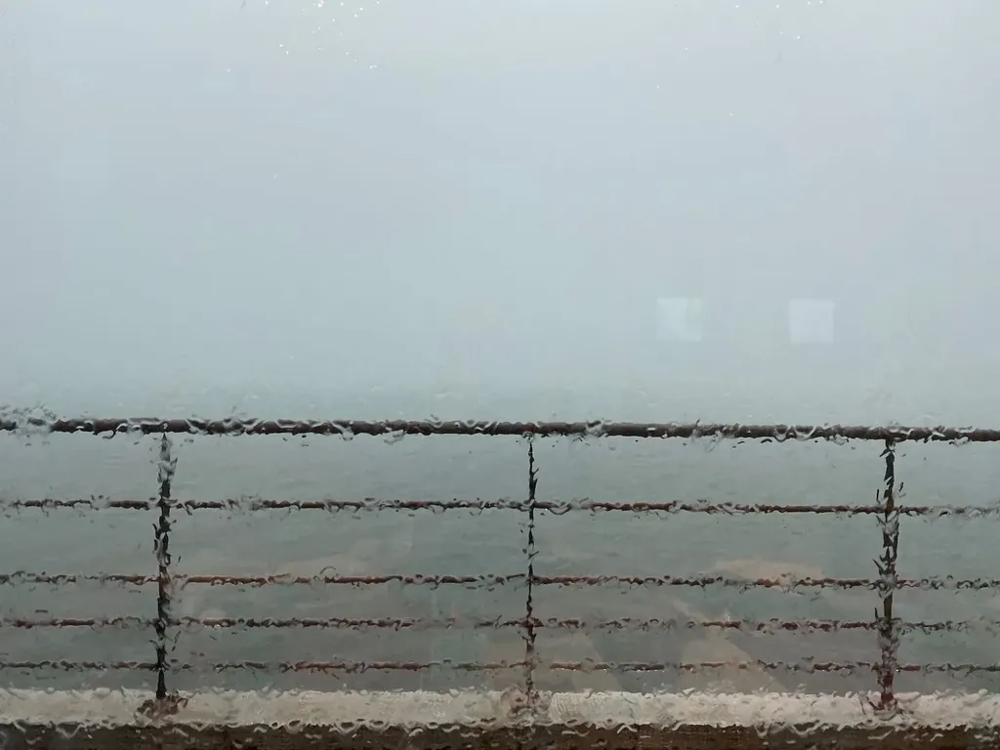

### Jeudi 24, Balaruc

Ce matin, je termine mes *Ravissements*, après en avoir écrit quatre supplémentaires ces derniers jours, et cet après-midi je remonte à vélo pour la première fois, parcourant vingt-cinq kilomètres sur la piste cyclable du tour de l’étang. Mes ravissements s’achèvent avec ma convalescence. Ils ont une tonalité que je ne me connaissais pas. J’ai été heureux de les écrire, mais j’ignore s’ils intéresseront quelques lecteurs. Ce n’est pas le plus important, moins que ma jambe, qui tiraille encore, mais qui sur le vélo s’est bien comportée, sauf quand j’ai dû tourner la tête pour regarder derrière, ce mouvement produisant une torsion de la hanche plutôt désagréable. Lors de ma séance de kiné, Olivier m’a dit que je récupérais à une vitesse incroyable. Peut-être qu’écrire des textes positifs m’a aidé. Et puis la lumière m’a gâté, surtout depuis que je peux la saisir depuis mon bureau panoramique.

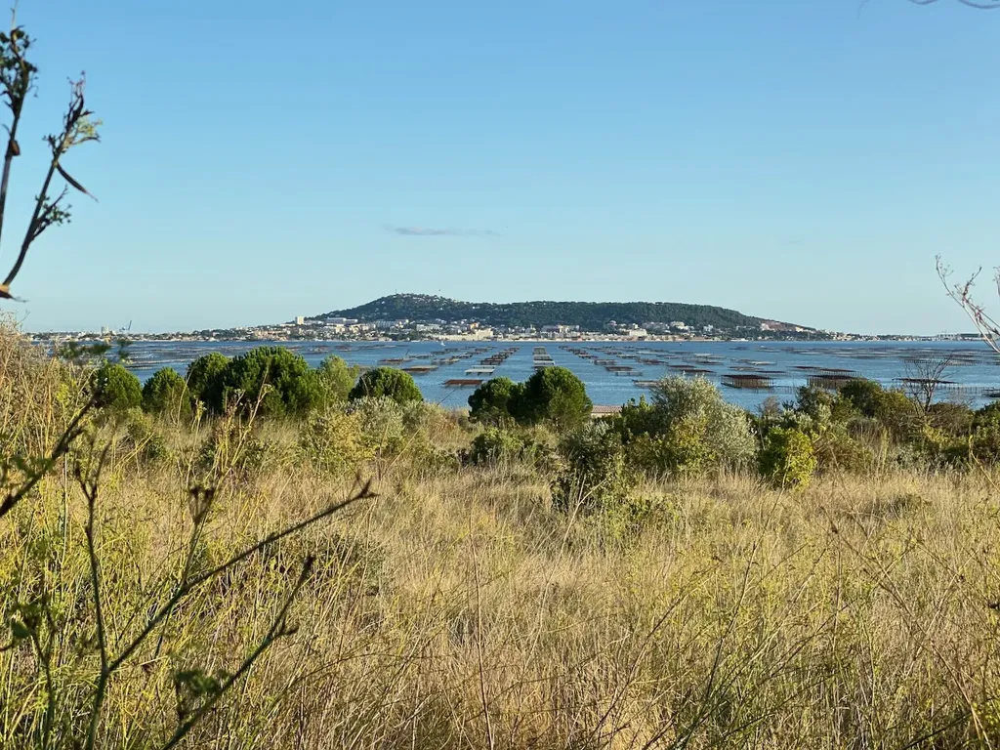

### Vendredi 25, Balaruc

Deuxième sortie vélo, une trentaine de kilomètres, je pousse jusqu’à Mèze, dépasse la ville, rejoins le bord de l’étang dans un éblouissement transparent. Je me suis rarement senti aussi léger, aussi lumineux, dans le bleu pur de l’après la pluie, le bleu sublime d’octobre. Le plaisir du vélo, c’est être en mouvement dans les merveilles du monde, être au bon endroit au bon moment.

Au retour, un peu mal aux bras, au dos, je dois refaire du gainage, mais je n’y pense pas. Je suis seul à la maison, Isa et les enfants partis pour quelques jours. Le frigidaire est vide. Je prends la voiture pour aller faire des courses, une première également depuis la fracture, mais je n’éprouve pas la même délectation qu’à vélo, replongeant dans le flux bruyant. À mon retour, l’étang est cuivre, étal, les Pyrénées déroulées dans toute leur longueur. J’en suis presque triste tant cette beauté est vertigineuse, l’émotion laisse un trou en moi.

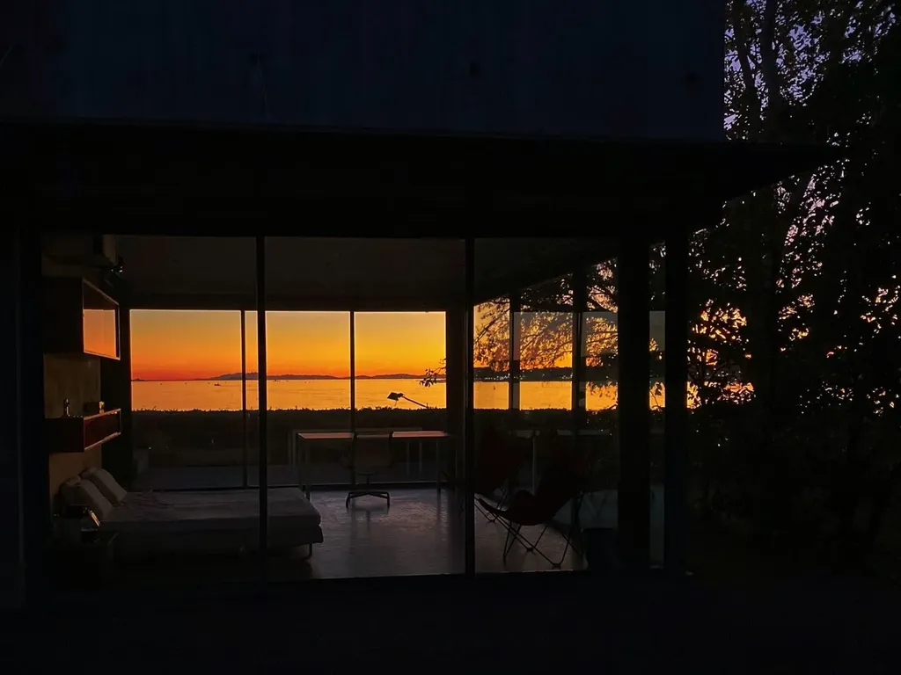

### Samedi 26, Balaruc

La lumière n’en finit pas d’éblouir, une pure merveille qui n’est possible qu’en ces journées d’été indien, quand le moindre rayon de soleil se teinte d’ambre et qu’il frappe l’eau aussi intensément bleue que le ciel. On la croque cette lumière, on la traverse, on s’y baigne. Avec Philippe, nous roulons jusqu’à un endroit où nous n’allons pas d’habitude, un cul-de-sac, un port d’ostréiculteurs, des mas au bord de l’eau, des barques, des bateaux accostés. Sous cette lumière, ce serait pas loin du paradis. Pas de bruit, de vagues clapotis contre les quais, la tiédeur de l’air, les ateliers désertés. Envie de dessiner.

---

Depuis quelques jours, mes robots Instagram tournent et des bookgrameuses me houspillent, comme si elles ne voyaient pas d’un bon œil mon incursion dans leur pré gardé. Je ferais n’importe quoi, ma méthodologie serait bidon… mais alors, pourquoi perdre du temps à s’intéresser à mes bricolages ? Mardi prochain, je publierai [un article pour résumer mes investigations](../10/bookstragram-arnaque-ou-pas.md). Je parlerai des robots utilisés par certains éditeurs et surtout certaines bookgrameuses.

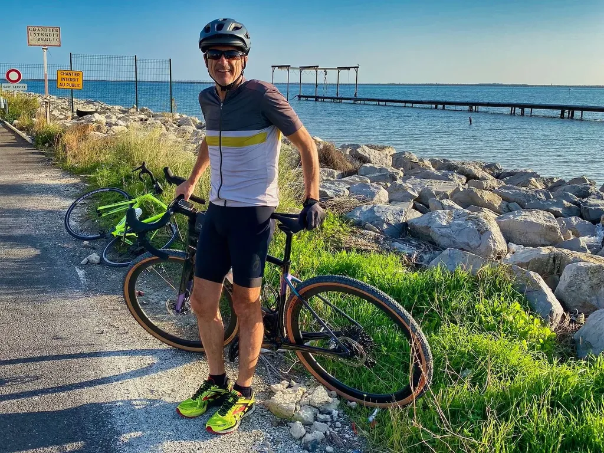
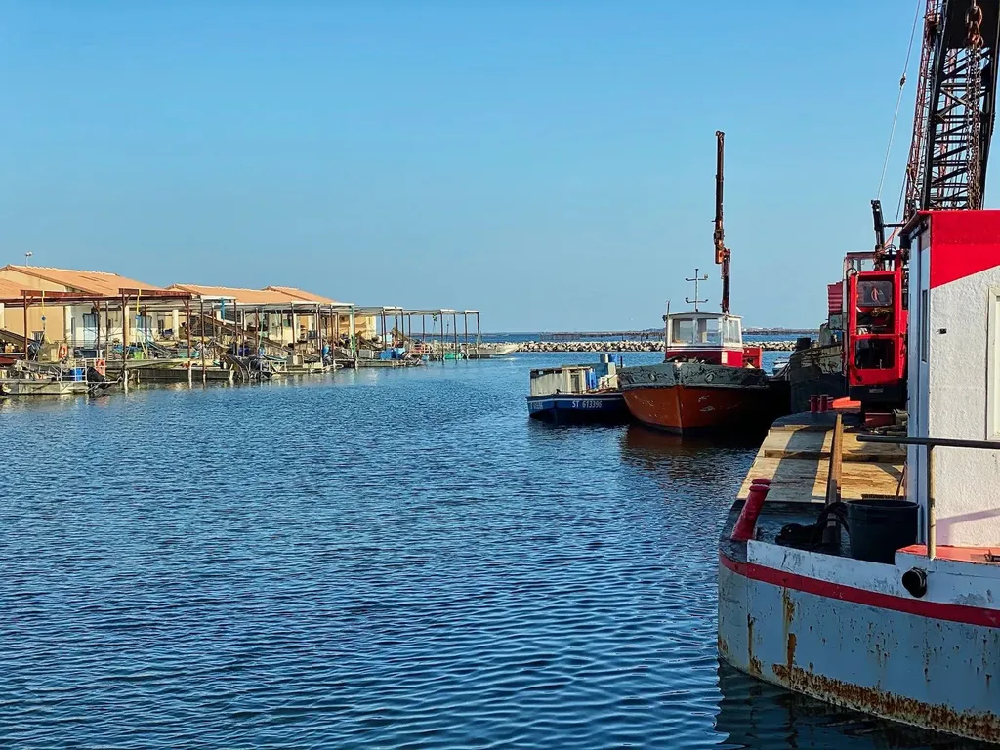
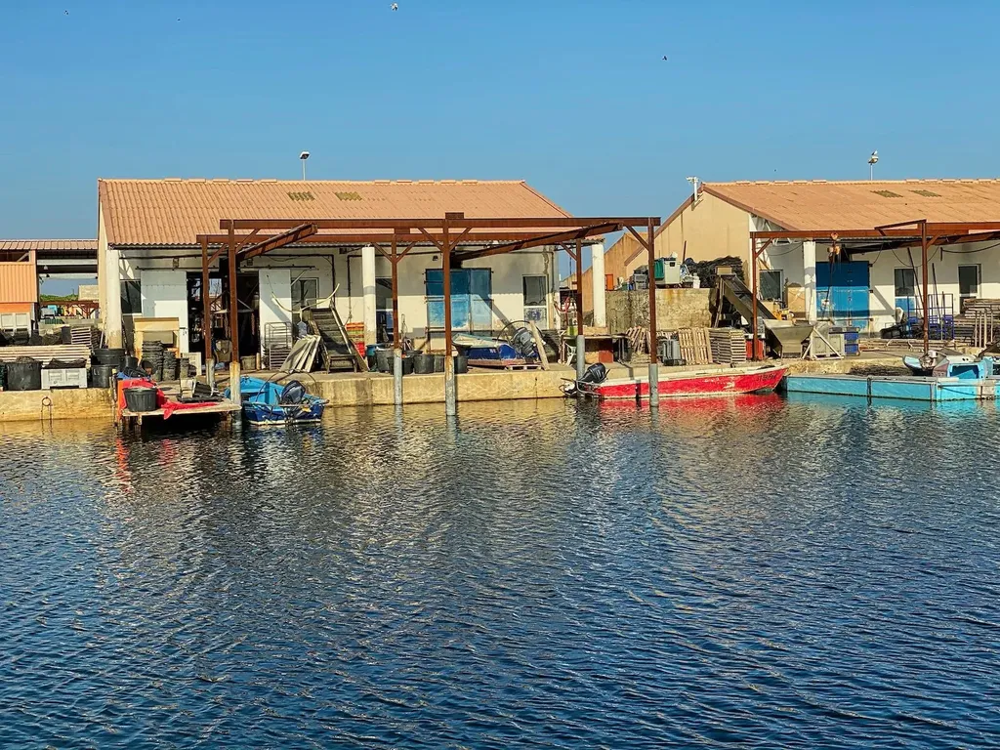

### Dimanche 27, Balaruc

Je ne lis pas de littérature quand j’écris, peut-être parce qu’alors je me sens pris dans le rythme de celui que je lis. Comme je corrige mes *Ravissements*, je m’autorise un retour en Michon. Il écrit : « C’est quelque chose comme ça, l’évidence du sens n’apparaît qu’après l’avoir écrit. » Je me lis moi-même quand je me corrige.

---

Extraordinaire sensation de liberté de pédaler avec des pédales plates style VTT de descente, avec de simples baskets. Est-ce une illusion parce que je retrouve mon vélo après deux mois et que les conditions lumineuses et thermiques sont proches de la perfection ?

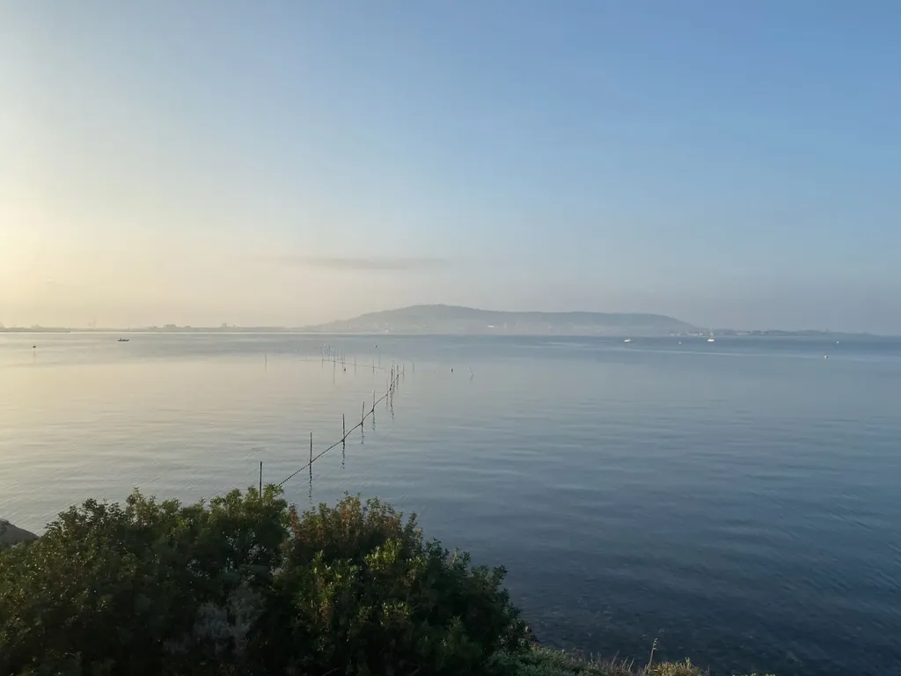
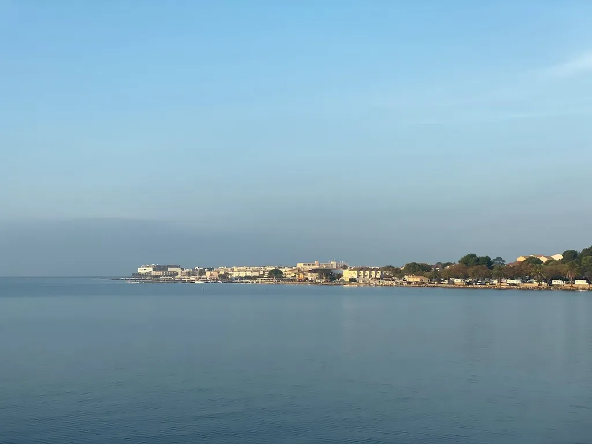
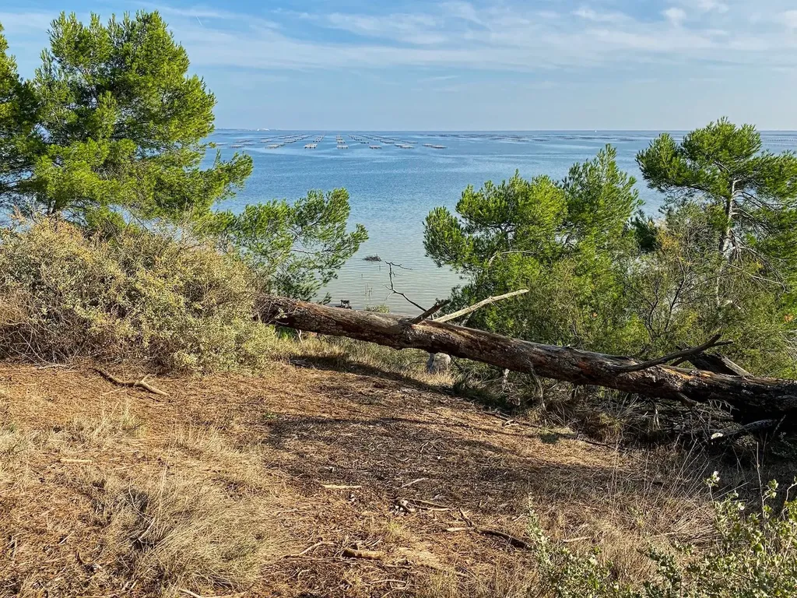
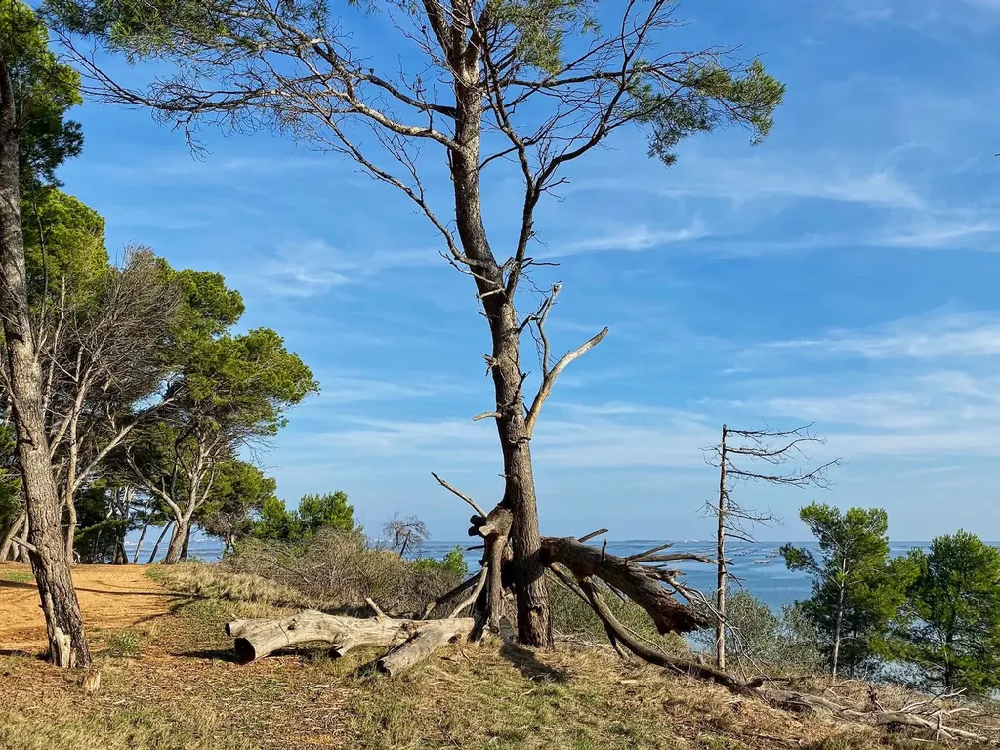
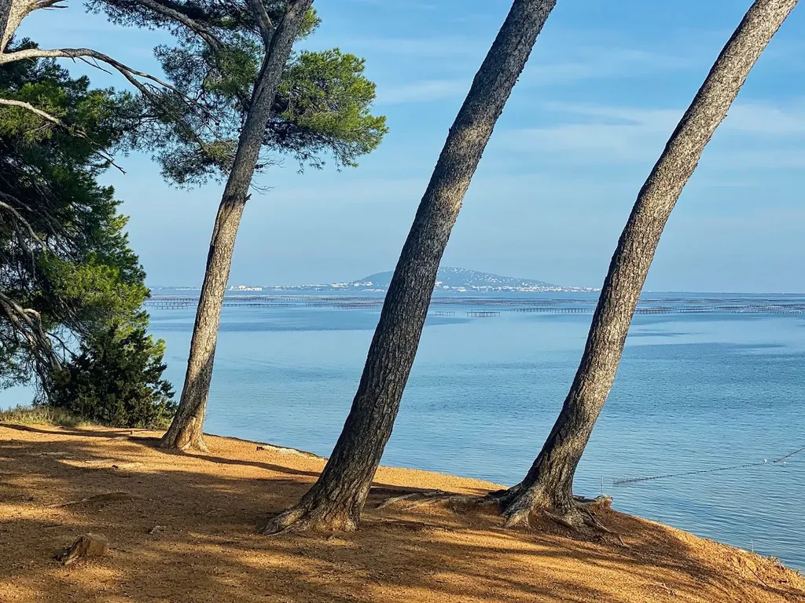

### Mardi 29, Balaruc

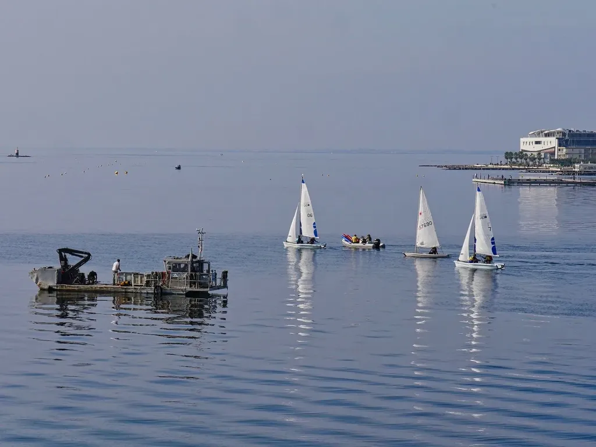

### Jeudi 31, Balaruc

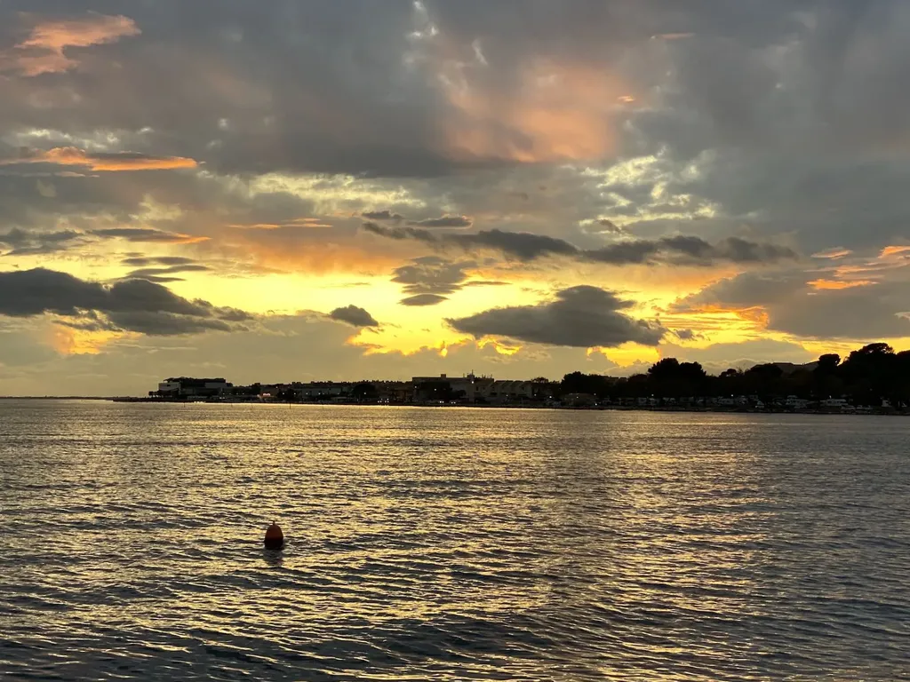

#carnets #y2019 #2019-11-5-8h7
