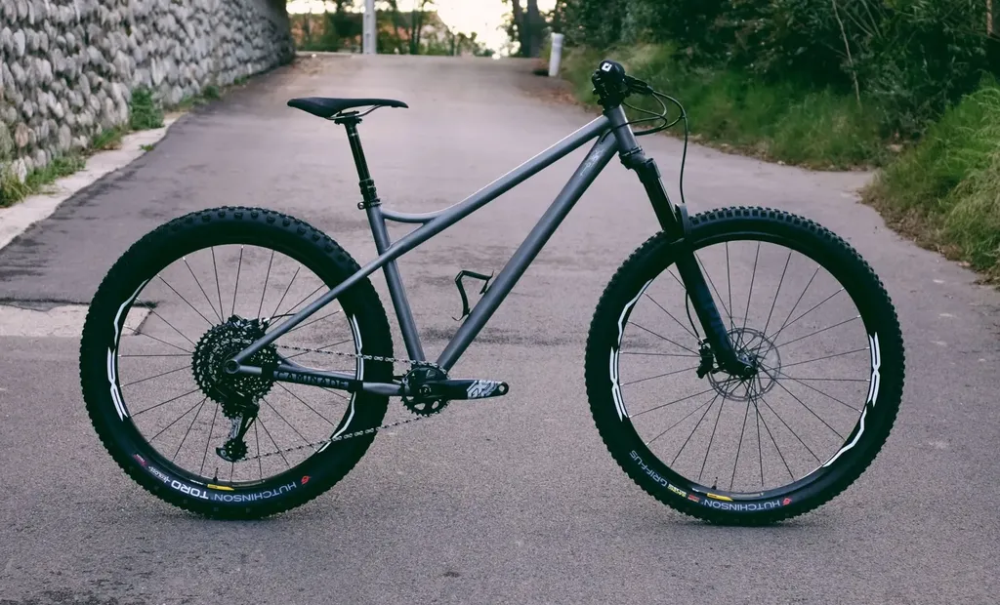
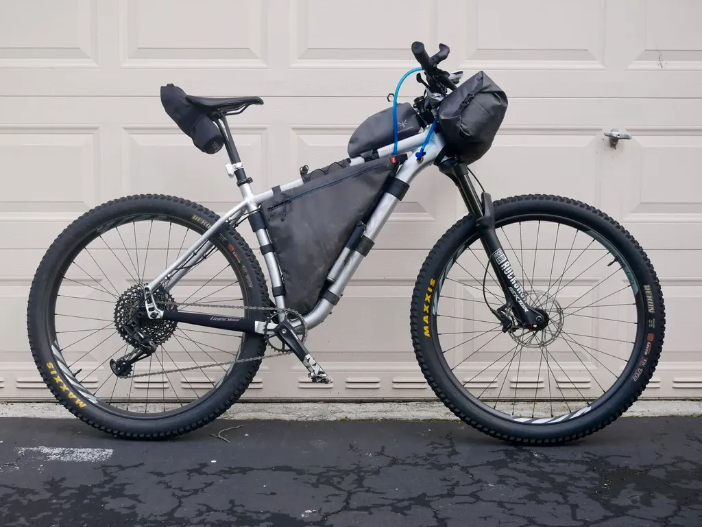

# Bikepacking : ai-je raison de passer au titane ?

J’ai décidé de commander un [Caminade SimpleTrack Titane](https://caminade.eu/simpletrack.titane-572100-21.php), une base qui sera adaptée à mes besoins de bikepackers par l’équipe Caminade. Que je vous explique ma démarche et pourquoi j’en suis arrivé à cette décision onéreuse, mais qui je l’espère m’accompagnera de longues années.

J’écarte l’argument écolo. Le titane est certes recyclable, mais [le procédé Kroll](https://fr.wikipedia.org/wiki/Proc%C3%A9d%C3%A9_Kroll) d’extraction plutôt énergivore n’est pas particulièrement écologique. Le titane ne vaut pas mieux que le carbone du point de vue environnement.

J’écarte aussi l’argument solidité. Certes le titane est en théorie plus résistant que le carbone, mais je n’ai pas l’impression que les bikepackers cassent leurs cadres à tout bout de champ (pas plus que les spécialistes de la descente). Reste que j’ai cassé le triangle arrière de mon VTT tout-suspendu en carbone. Ça arrive, même les cadres en titane peuvent casser. Ma philosophie est simple : je ne pars pas pour des tours du monde. Si mon vélo casse, je rentre chez moi pour le faire réparer (le carbone comme le titane se réparent).

J’écarte l’argument consommer français, parce que je crois à la métalocalité comme je l’ai expliqué très longuement dans *L’alternative nomade*. Nous devons nous entraider d’un bout à l’autre de la planète, collaborer le plus possible, parce que les défis sont planétaires.

### Quel type de vélo

Quand je me suis mis au bikepacking, début 2019 en Floride, j’ai acheté un vélo de milieu de gamme, un [Salsa Timberjack avec un cadre alu 6066-T6](https://salsacycles.com/bikes/timberjack/2019_timberjack_nx_eagle_29). J’ai été conseillé par des bikepackers américains d’expérience et je n’ai jamais regretté ce choix. C’est un vélo idéal pour le bikepacking, avec une position très confortable, un grand triangle de cadre, la possibilité de chausser des pneus 2,6 pouces en 29 pouces, voire du 3 pouces en 27,5 pouces. On peut même le monter facilement en mono pignon.

Après quatre voyages, je ne lui fais que deux reproches, en grande partie inhérent à son niveau de gamme.

1/ Le cadre alu pèse environ 2,5 kg en taille large.

2/ Ce cadre est prévu pour une fourche de 130 (543 mm de long avec un offset de 51 mm). Si une telle fourche est très confortable, je n’ai pas besoin d’un tel débattement en bikepacking, qui se paye par un poids de plus de 2 kg.

Ayant l’habitude de rouler en gravel carbone et VTT tout-suspendu carbone, la lourdeur et le manque de réactivité du Timberjack me font jurer lors des longues montées à la fin de longues journées. J’ai donc décidé de me dégoter un vélo plus léger avec l’objectif de maximiser son confort (la légèreté n’étant qu’un des critères du confort).

> **Annonce** Du coup, je vends mon Timberjack (1 300 €). N’hésitez pas à me contacter. C’est le vélo parfait pour se mettre au bikepacking.

C’est alors posé la question du choix de la géométrie. Rester sur un VTT semi-rigide ou opter pour un monstercross ? Sur les longues distances, la position gravel ne me convient guère, me provoquant souvent des douleurs dans les épaules. Dans les descentes techniques, je ne suis pas non plus très à mon aise avec un cintre moustache. J’adore mon gravel pour sa nervosité, je sais qu’un monstercross comme le Salsa Cutthroat serait plus indulgent, mais je préfère en rester à un cintre VTT comme [la plupart des top performers dans la Tour Divide](../9/a-la-recherche-du-velo-de-bikepacking-ideal.md), alors même que c’est une course réputée peu technique. Par ailleurs, j’ai souvent roulé en compagnie de monstercross et j’ai découvert qu’en descente ils n’étaient pas plus à leur aise que moi en gravel. Les VTT n’ont pas des cintres plats pour rien. Je me sens ainsi plus en confiance et je me moque de la perte d’efficacité en terrain roulant (qui peut être compensée avec des barres de triathlète ou des poignées ergonomiques Spirgrips).

J’ai bien tenté de voir si je pouvais réunir le meilleur des monstercross et des VTT. En jouant avec la géométrie du Cutthroat, j’ai calculé que pour monter un cintre plat je devais choisir une potence de 120 mm, ce qui est beaucoup trop. Il est finalement presque plus simple de monter un cintre moustache sur un VTT semi-rigide comme le fait Lael Wilcox. Mon choix était donc arrêté.

Et cette vidéo ne fait que valider mon choix, le gravel n’apporte de bénéfice que sur le roulant, et pas faramineusement, dès que les chemins se compliquent, le VTT prend le large, et comme en bikepacking on ne sait jamais à quoi s’attendre, je préfère me préparer à toutes les éventualités, les attaquer sereinement.

### Quel type de cadre

Aux États-Unis, j’étais un des rares à rouler en alu. La plupart des bikepackers avaient des cadres carbone, acier ou titane. Sur la Tour divide, le carbone est ultra majoritaire, puis arrive le titane, enfin l’acier.

Le choix du carbone est compréhensible. La réactivité est sans pareille et le poids minimal. En revanche, le carbone ne fait pas de cadeau. Quand on appuie sur les pédales, la force est transmise intégralement aux roues mais de même les chocs nous sont transmis en retour. Voilà pourquoi mon gravel me maltraite durant les longues sorties. Il est joueur, performant, mais pas des plus confortables.

[Jonas Deichmann](https://bikepacking.com/plan/jonas-deichmann-north-cape-to-cape-town-record/), le spécialiste de l’endurance sur route détenteur du record sur la North Cape to Cape Town, m’a définitivement ouvert les yeux au sujet du titane. Il explique avoir abandonné le carbone pour le titane sur longue distance pour des raisons de confort, un vélo en titane bien conçu étant selon lui plus souple, donc plus indulgent pour le cycliste.

Je suis à la recherche de cette indulgence. Je recherche le meilleur compromis poids/confort. Avec un cadre carbone semi-rigide, j’ai sans doute besoin d’une fourche avant et je ne suis même pas sûr que mon dos supporterait l’absence de suspension arrière. Autant dire que si je veux bikepacker en carbone, je peux sans doute le faire avec mon VTT tout-suspendu qui pèse 11 kg (contre 12,7 kg pour mon Timberjack dans sa version optimisée).

Problème du tout suspendu : il possède un triangle de cadre minuscule, le mien de 4 litres environ, et les suspensions avant et arrière augmentent les risques de panne.

J’ai donc commencé par regarder du côté du titane ou de l’acier, tous deux supposés également confortables. Chez Caminade, [le SimpleTrack Acier](https://caminade.eu/simpletrack.acier-57900-9.php) pèse 2,2 kg contre 1,5 kg pour le titane (le prix étant du simple au double). En me tournant vers l’acier, je gagnerais en confort mais pas vraiment en poids. J’ai donc commencé à penser titane, à peser le pour et le contre, au vu de l’investissement non négligeable (et à me souvenir du merveilleux vélo de course en titane que mon père m’avait acheté pour mes onze ans).

Les calculs poids sont assez simples.

* [Cadre alu M5 Specialized Chisel](https://www.specialized.com/fr/fr/chisel-frameset/p/171131?color=264102-171131) (un des plus légers du marché) : 1 350 g. Une fourche hydraulique 100 mm acceptant le 2,6 pouces en 29 : 1 500 g. Total : 2 850 g. Gain par rapport au Timberjack : **1 650 g**.
* [Cadre carbone Specialized Epic HT](https://www.specialized.com/fr/fr/epic-hardtail/p/171127?color=264116-171127&searchText=91320-7004) (un des plus légers du marché) : 915 g. Total avec une fourche hydraulique : 2 415 g. Gain par rapport au Timberjack : **2 085 g**.
* Cadre Caminade SimpleTrack Titane : 1 500 g. Total avec fourche hydraulique : 3 000 g. Gain : **1 500 g**.
* Mais j’ai une bonne chance que le cadre titane soit assez indulgent pour m’autoriser une fourche rigide carbone type [Bombtrack BPC](http://bombtrack.com/parts/forks/bpc-fork/) à 650 g (quitte à utiliser [un cintre Baramid](https://www.baramind-bike.com/fr/cockpit/10-bam-mtb.html)). Poids total : 2 150 g. Gain : **1 950 g**, soit pratiquement l’équivalent d’un cadre carbone avec la promesse d’un confort plus grand et une plus plus grande simplicité, avec en prime un vélo sur mesure.

Est-ce que je fais une grosse bêtise ?

### 36 heures après publication

J’ai commencé à penser vélo sur mesure en lisant [*It’s All About the Bike*](../../2018/12/livre-il-ny-a-que-le-velo-dans-la-vie.md) de Robert Penn, puis de nouveau plus récemment lorsque [Serge Barnel](http://www.gravelbybarnel.fr/) est passé me voir et que j’ai découvert sont magnifique Caminade dont il ne m’a dit que du bien comme de l’équipe de Caminade. La possibilité du titane depuis n’a cessé de m’occuper, mais sans fétichisme, avec autant de crainte que d’attirance. J’ai donc relancé la conversation avec mon article. Je n’aurais peut-être pas dû la provoquer, ma certitude énoncée à la première ligne s’en trouve ébranlée.

Beaucoup de voix se sont jointes à celles de Serge, puis d’autres, dont celles de cyclistes que je respecte aussi, m’ont averti que certains cadres titanes ratés pouvaient être plus rigides que du carbone, d’autres m’ont dit qu’au contraire ils pouvaient être souples comme du caoutchouc au point d’avoir un rendement médiocre, surtout à VTT pour les adeptes du pédalage rapide dont je suis. Un copain m’a dit avoir acheté un cadre titane qu’il a dû revendre au bout de six mois et il m’a donné le conseil le plus terre à terre qui soit, le plus évident quand on veut acheter un vélo onéreux : « Essaie-le d’abord. »

Mais comment essayer un cadre sur mesure ? Partir dans le sur mesure, c’est faire confiance a priori, c’est se fier à une réputation, donc faire confiance au marketing. J’avoue être assez mal à l’aise avec cette démarche, d’autant que Caminade me demande de payer 50 % du vélo avant que nous ne commencions à la dessiner. C’est un peu comme si je faisais un chèque à un maçon avant d’avoir fait le plan de ma future maison. J’en arrive à douter. Tout équipé ce vélo titane finalement ne pèsera guère moins que mon tout-suspendu carbone, sans que j’ai la certitude de supporter la fourche rigide. Il sera mieux adapté pour le bikepacking mais sera-t-il plus confortable ? Je n’ai aucune certitude. La raison me dicte de prendre mon temps, de partir sur une base moins chère, de tenter d’abord de rouler à VTT tout-rigide. Mais suis-je raisonnable ? L’émotionnel brouille le rationnel dans certaines circonstances.

### 48 heures après publication

J’ai passé beaucoup de temps encore à discuter, à regarder des géométries, à calculer les coûts. J’ai rêvé devant deux vélos acier dédiés au bikepacking, le [Bombtrack Beyond](http://bombtrack.com/2020-beyond-plus-adv/) (cadre 2,9 kg) et le [Kona Unit](https://konaworld.com/unit_x.cfm) (2,5 kg). Je me suis alors dit pourquoi ne pas tenter le tout-rigide carbone, après tout voilà ce qu’ils font pour la plupart sur la Tour Divide et ils ne sont pas débiles. Pourquoi ne pas me fabriquer un monstercross sur base VTT.

En choisissant, un cadre carbone Specialized Epic HT et une fourche Bombtrack, je tombe à 1 565 g. Gain par rapport au Timberjack : **2 935 g**, gain par raport au titane : **600 g**. Le vélo complet ne pèserait pas plus de 9,5 kg. Pourquoi ne pas tenter ce minimalisme pour commencer ? Parce que si ça passe pour moi, je n’ai aucune raison idéologique d’opter pour le titane. C’est à mon corps de décider, aussi à mon porte-monnaie (la version carbone me revenant 40 % moins cher).

Le seul hic : le cadre Epic HT n’accepte à l’arrière pas plus de 2,4 pouces, et c’est très juste. Il faut rouler en 2,3 pour être tranquille. J’aimerais avoir l’option 2,6 comme sur le Timberjack. Mais tout choix implique des compromis. Je continue à regarder les cadres. D’ici une dizaine de jours, il me faudra arrêter ma décision. La saison 2020 du bikepacking approche.

#velo #y2019 #2019-12-24-18h16
