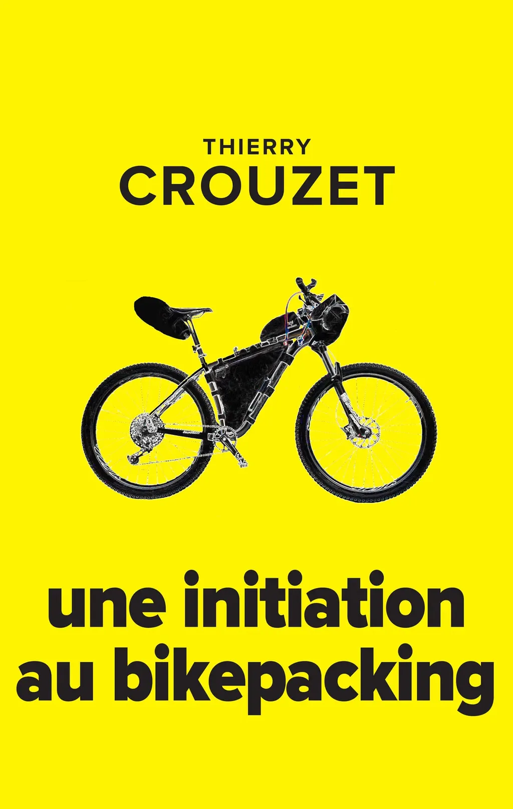

# Une initiation au bikepacking : le livre

[Quand j’ai commencé à écrire sur le vélo](https://tcrouzet.com/2018/11/27/lart-du-velo/), je n’avais pas anticipé que mes textes changeraient ma façon de faire du vélo qui, en retour, influencerait ma façon d’écrire. En l’affaire de quelques mois, j’ai découvert des possibilités magnifiques et rencontré des cyclistes merveilleux.

Ces dernières semaines, j’ai pris conscience que j’avais accumulé assez de matière pour [un livre, où je raconterais mon initiation au bikepacking](https://www.amazon.fr/dp/167615681X?ref_=pe_3052080_397514860), commencée à l’automne 2018 alors que je vivais en Floride. Il m’a semblé que raconter mon parcours, de mes tâtonnements à mes premiers voyages, pourrait inspirer d’autres cyclistes.

J’ai donc repris mes textes, les ai réorganisés, restructurés et peu à peu une narration inattendue s’est imposée, qui m’a conduit à une découverte : le bikepacking est romanesque, et voilà pourquoi je l’aime autant. Il prend nos vies et les propulse dans une autre dimension comme le fait une bonne histoire. Je ne suis pas encore sûr d’avoir saisi toutes les conséquences de cette révélation. Je sens que désormais je pédale pour écrire et que j’écris pour pédaler.

Voilà comment est né [*Une initiation au bikepacking*](https://www.amazon.fr/dp/167615681X?ref_=pe_3052080_397514860). Dans le titre, l’article « une » désigne une initiation parmi d’autres possibles, chacun vivant la sienne, je n’ai pas eu la prétention d’écrire *Initiation au bikepacking* parce que je ne crois pas que ce soit possible, c’est à chacun de raconter la sienne. J’ai ponctué de récit de réflexions sur l’art du vélo et du bikepacking plus spécifiquement. Il est aussi question d’équipement, de configuration, de matériel de camping, de GPS et de cartographie, sans que j’ai écrit un manuel pratique. Je raconte mes choix et les explique. J’ai voulu qu’en lisant ce texte on voyage à vélo.

Les lecteurs de ma série [Born to bike](https://tcrouzet.com/borntobike/) seront en terrain familier, mais peut-être que ce nouvel agencement des textes leur ouvrira des perspectives (pour moi, c’est le cas).

Après avoir sondé quelques éditeurs et devant leurs gros yeux, « Mais de quoi il parle ? », j’ai décidé d’autopublier ce livre de 260 pages. [Il est disponible sur Amazon en impression à la demande pour 18,99 €, livrable sous dix jours en moyenne.](https://www.amazon.fr/dp/167615681X?ref_=pe_3052080_397514860) [Vous pouvez aussi acheter la version ebook.](https://tcrouzet.com/books/une-initiation-au-bikepacking/).

#velo #y2019 #2019-12-22-8h40
