# Février 2019

### Vendredi 1er, Weston

Demain, je serai en train de pédaler dans la forêt d’Ocala et j’apprends que l’[US Navy y lâchera quelques bombes pour s’entraîner](https://www.wesh.com/article/bombs-on-ocala-national-forest-this-weekend/26110575).

### Vendredi 8, Weston

Je suis rentré mercredi matin de mon raid, vanné et heureux. [J’ai passé mon temps depuis à le raconter.](../2/satori-a-lake-lindsay.md)

---

Dans une semaine, je serai en situation illégale aux États-Unis. Le service d’émigration a encaissé les 370 $ pour la prolongation de mon visa, mais ne m’a pas encore signifié son accord, pas plus que son désaccord.

---

Entre le 13 et le 17 mai, je serai à Montréal pour travailler avec les élèves de [Marcello Vitali-Rosati](http://vitalirosati.com/) et d’[Enrico Agostini-Marchese](https://ecrituresnumeriques.ca/fr/Equipe/Enrico-Agostini-Marchese/). Ça me fera du bien de repenser à la littérature.

### Samedi 9, Weston

Promenade du soir à la frontière de la ville. Un tatou traverse le chemin et reste à nous regarder.

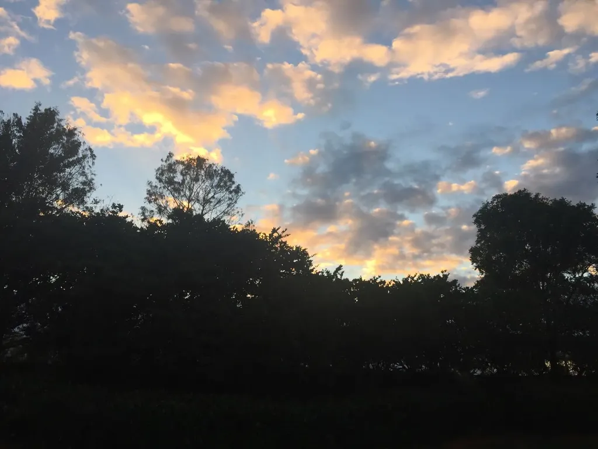

### Dimanche 10, Miami

Musée Vizcaya. Pseudo palais vénitien échoué sur les rives de la baie de Key Biscayne, avec devant une barge de pierres qui lui sert de brise-lames. Une monstruosité néoclassique sculptée par le père de Kalder. Je comprends pourquoi Kalder s’est tournée vers la légèreté.

Combien de générations faut-il pour qu’une famille arrive à sa maturité et produise son génie ? Le fils de combien d’ancêtres suis-je ? Combien de graines se cumulent en moi ? Quel est mon héritage ?

Une belle brise du large. Devant, les kites surfeurs, sans doute les fameux Français dont JM, l’acheteur de mon vélo, m’a parlé. Peut-être est-il là-bas sous une de ces voiles et je préférerais être avec lui que parmi les touristes qui suivent tous le même périple, à la même vitesse, font tous demi-tour au même endroit, photographient le même iguane ocre qui sommeille à la proue de la barge.

Puisque nous suivons tous les mêmes chemins, nous ne sommes pas davantage prêts pour la démocratie que pour la beauté, qui toutes deux exigent de chacun de nous une irréductible originalité. Nous ne sommes pas davantage préparés à lutter contre le réchauffement climatique : nous copier les uns les autres implique la misère pour le monde. Il suffit qu’un andouille dispendieux en fasse rêver des millions et nous avons des millions d’andouilles dispendieux.

Les réseaux sociaux amplifient ce phénomène plus encore que les anciens médias, donnant à chacun de nous le droit d’être un grand andouille d’influenceur. En l’état de leur histoire, ils sont donc la pire chose qui soit pour nous aider à changer de comportement, c’est-à-dire à nous individualiser.

Une foule d’êtres individualisés n’est pas bonne pour le business, car ses membres ne répondent à aucune injonction marketing, mais seulement à des rêves passagers et innombrables, avec une profonde tendance à la contradiction.

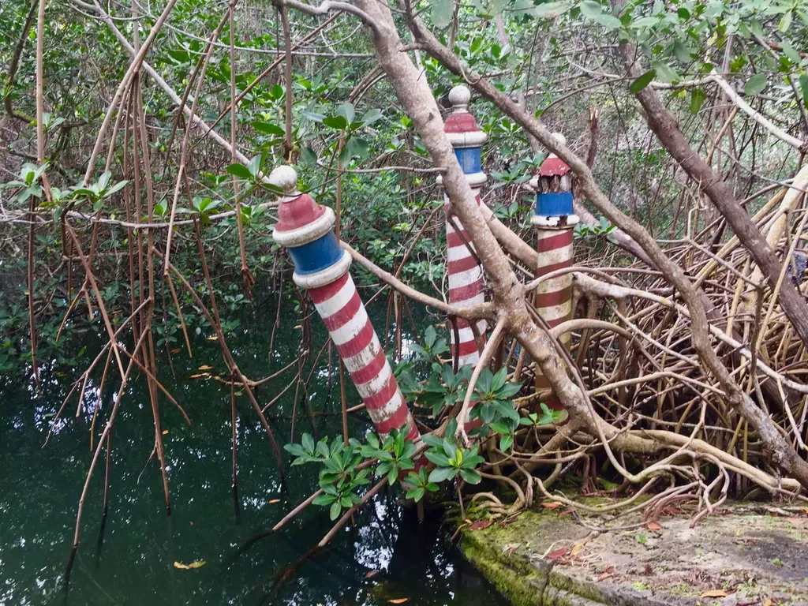
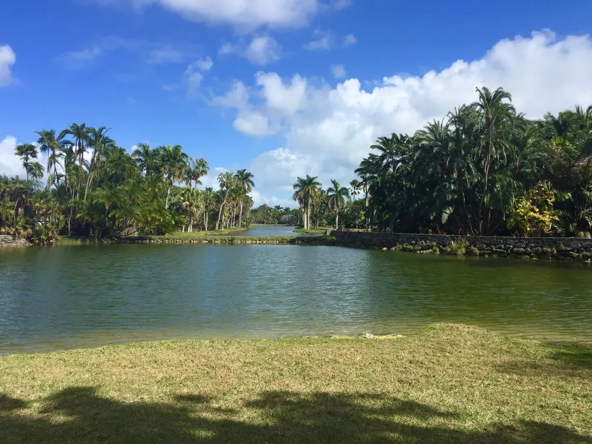

### Lundi 11, Weston

Planté devant mon clavier. Sans énergie, sans désir. Je me suis tendu vers l’HuRaCan, trouvant après la force de la raconter, et je me retrouve vide, dans le même état qu’avant de me lancer dans ce projet, avec la même boule dans la gorge qui me limite depuis mon arrivée en Floride. J’ai pourtant cette suite du *Geste qui sauve* à écrire. J’ai bien envoyé un mail ce matin à son sujet, à un médecin cubain qui a été malade d’Ebola, avec qui je voudrais faire l’introduction de mon récit, mais tout avance au ralenti comme si le monde extérieur s’était aligné sur mon monde intérieur. Sensation qui en soit tend à démontrer la relative véracité du solipsisme. Le monde est au moins autant ce que nous en faisons que ce qu’il fait de nous.

---

Je viens de commander un nouveau serveur linux et de commencer la migration de mon blog. Avant, je m’imposai cette tâche rébarbative tous les ans, puis tous les deux ans. Cette fois, je n’avais pas changé de serveur depuis quatre ans. Je n’ai plus le choix. Tout a évolué, Apache, MySQL et surtout PHP. Peut-être que je ne recommencerai pas avant huit ans. Mais que se passera-t-il quand je n’aurai plus le courage de faire ces mises à jour ? Que se passera-t-il quand je serai mort ? Je ne peux pas ne pas me poser cette question à laquelle je n’ai pas de réponse. Les livres restent, les sites ont une forte propension à l’évaporation. Il faudrait que je cherche un plug-in pour transformer mon site en version statique, en version empaquetable et transmissible avec simplicité, à la façon d’un livre.

### Mardi 12, Weston

Projet de relier à vélo la Méditerranée à l’Atlantique avec le confrère [Lionel Dricot](https://ploum.net/) cet été en passant par le Massif central. Peut-être on écrira en même temps à quatre mains. [Je commence à travailler la carte.](https://drive.google.com/open?id=1_Z5YlQopu7BmxW612bFj7BwBWruvwyis&usp=sharing)

### Mercredi 13, Weston

Toujours pas terminé la migration. Je dois tout réapprendre ou presque. La marche à suivre écrite il y a quatre ans est vérolée comme le sera celle que j’écris en ce moment.

---

Visite chez un *chiropractor* pour ma main gauche qui répond mal depuis mon retour de l’HuRaCan. Mon copain Olivier me dit que c’est peut-être un problème cervical lié au nerf cubital. Le *chiropractor*, lui, ne me fait même pas poser mon t-shirt. Il me pose trois questions, me balance un vibromasseur sur le dos, puis me fait une vague manipulation. « Allez, 85 $, rentrez chez vous et revenez demain. » Quelle arnaque. Ce mec ne doit réussir à soigner que les hypocondriaques.

---

Malgré ma main gauche en galoche, je rêve à de nouveaux raids VTT. Peut-être, refaire l’HuRaCan début mars, avec un nouveau groupe. Aussi je vise avril/mai pour une boucle dans les Appalaches.

---

Je suis devenu un adepte de la conversation point à point. Je passe pas mal de temps à discuter vélo sur Facebook, qui me rend pour cette activité particulière un précieux service. Mettre l’outil à sa place, ne pas espérer de lui qu’il transforme notre vie, mais qu’il nous aide dans quelques-uns de ses recoins.

### Jeudi 14, Weston

Lire les carnets de mes contemporains me fait me sentir proche d’eux, me donne l’impression de vivre le même temps, ou au contraire d’habiter deux réalités inconciliables.

---

Mon site interactif sur Ératosthène s’est évaporé. La base de données est vérolée. Je ne sais pas si j’ai une sauvegarde en France. Ça me fiche les boules, car c’était une mes expériences d’écriture interactive les plus intéressantes. Ma [géolecture](../../page/geolecture) aussi est en train de s’évaporer, parce que pour maintenir une application disponible sur les stores il faut payer, et ne j’ai pas envie de payer, et encore moins envie de sans cesse mettre à jour le code. Donc, ce texte aussi n’est plus accessible.

### Vendredi 15, Weston

Je viens à bout se *Sérotonine*, un roman impossible du point de vue narratif, puisqu’écrit à la première personne par un narrateur qui se laisse mourir, qui finit par ne plus avoir la force de rien. Mais alors, si quelque chose se passe dans sa vie pour le faire changer d’attitude, pour lui redonner au moins l’énergie de raconter, il aurait dû nous le dire, parce que c’est ça l’important, c’est ça que Houellebecq aurait du raconter et qu’il a esquivé, parce que lui a cette force, parce qu’il ne veut pas la partager, parce que finalement il refuse d’écrire un livre important.

### Samedi 16, Brandon

Nous allons en famille et avec des copains français passer le week-end au sud de Tampa, près de deux parcs VTT. Interstate 75 saturée, puis bouchée. Nous la quittons et plongeons dans un pays soudain plus accueillant. Nous nous arrêtons à Parrish pour dévorer des hamburgers succulents dans une caravane adossée à un primeur.

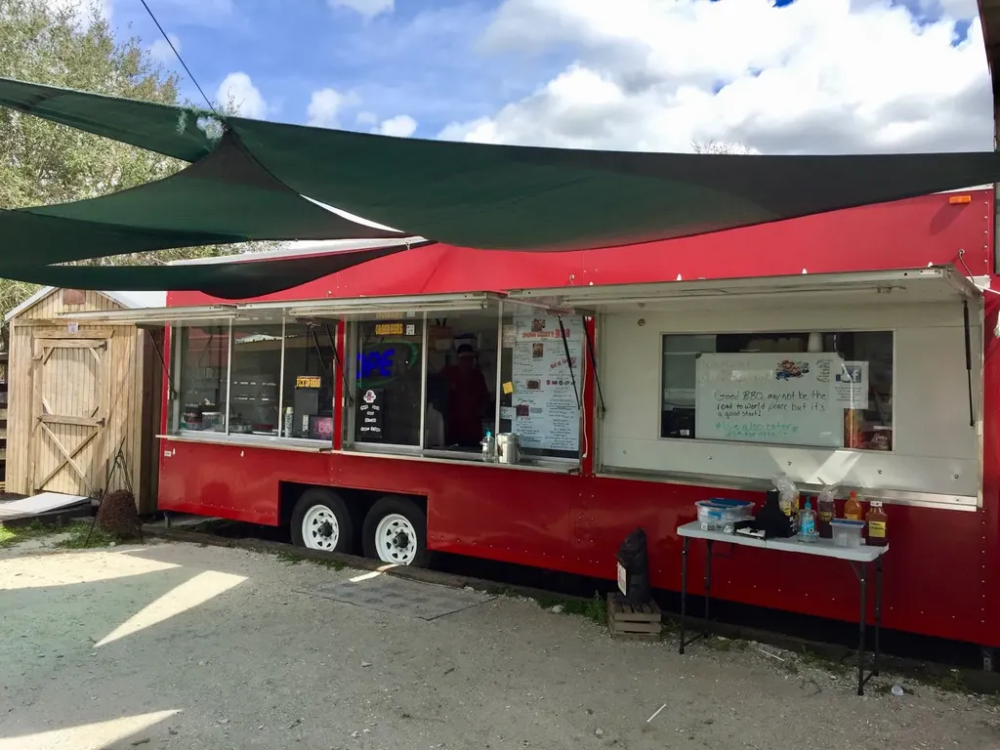

### Dimanche 17, Brandon

Dans la nuit, une idée de roman sur le modèle de *[One minute](../../page/une-minute)*. *L’enterrement* : autour de la tombe, on saute de personne en personne et peu à peu on découvre l’histoire du défunt et des relations qui le liaient au monde.

### Lundi 18, Weston

Après avoir exploré les sentiers d’Alafia, nous nous attaquons à ceux de Boyette, sous une belle chaleur humide, déjà presque étouffante. Ces deux parcs sont tracés sur les vestiges d’anciennes mines de manganèse. Autour de lacs couverts d’une mousse verte fluo, nous escaladons les anciens terrils recouverts d’une épaisse forêt de chênes et de conifères.

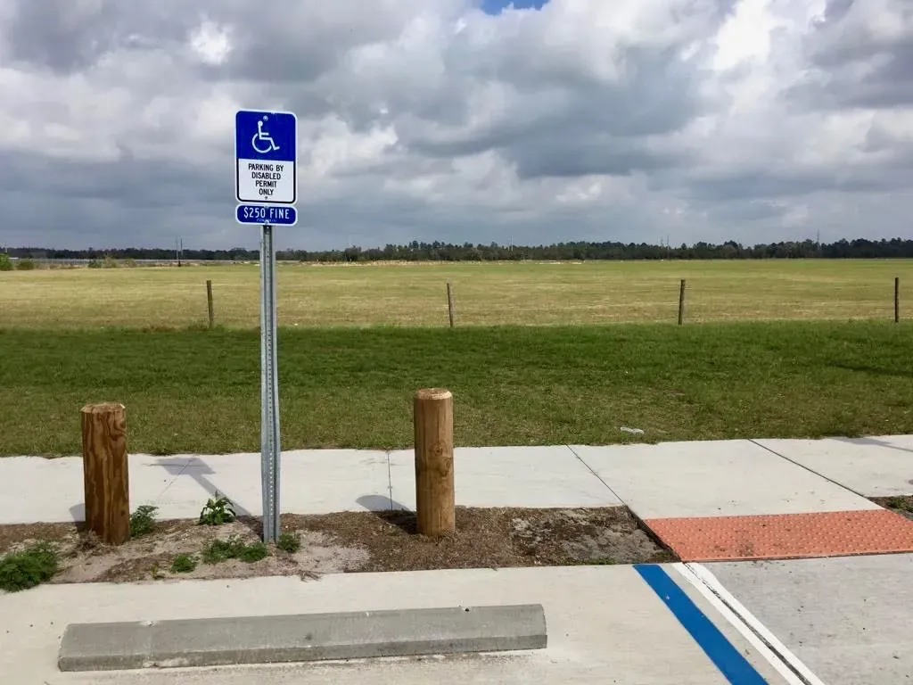

---

Je me rends compte que je n’écris pas parce que la famille occupe mon espace mental et que je m’interdis de parler de la famille. Il y aurait pourtant beaucoup à dire sur la famille, sur les tensions et les combats perpétuels qu’elle implique. Tout le reste n’est que fuite.

### Mercredi 20, Weston

J’ai fait du vélo sous un soleil brûlant. Drôle de février tout de même.

---

Nous traversons l’heure dorée à bord d’un hovercraft. Nous fonçons à la surface des Everglades, dérapons sur l’eau, accélérons, droit vers le soleil plongeant. Magique, mais inaccessible au quotidien, sauf à posséder un hovercraft ou débourser une fortune. Cette nature se dérobe à nous et je ne fais que l’entrevoir quand je fais du vélo. Je voulais écrire un manifeste *Pour un droit au coucher de soleil*, ce sera plutôt quelque chose de plus poétique intitulé *L’heure dorée*. Un jour peut-être. Pour le moment rien ne vient, toujours enlisé dans ce pays au ciel traversé de montagnes nuageuses.

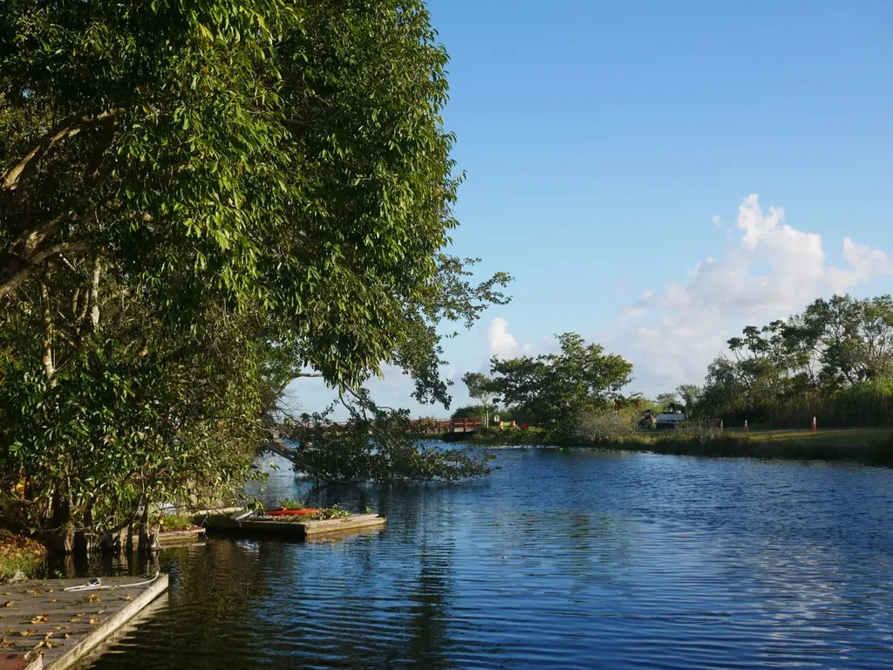

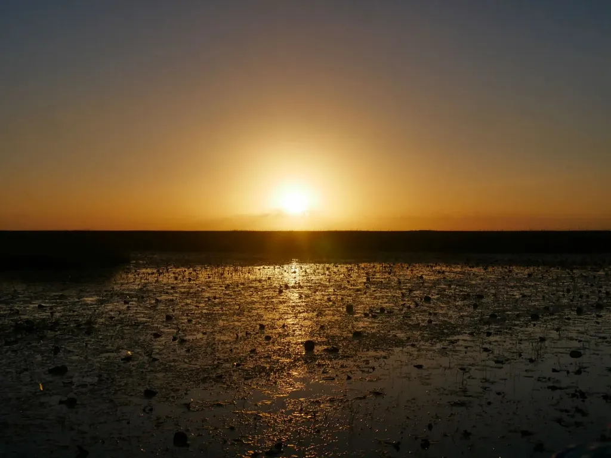
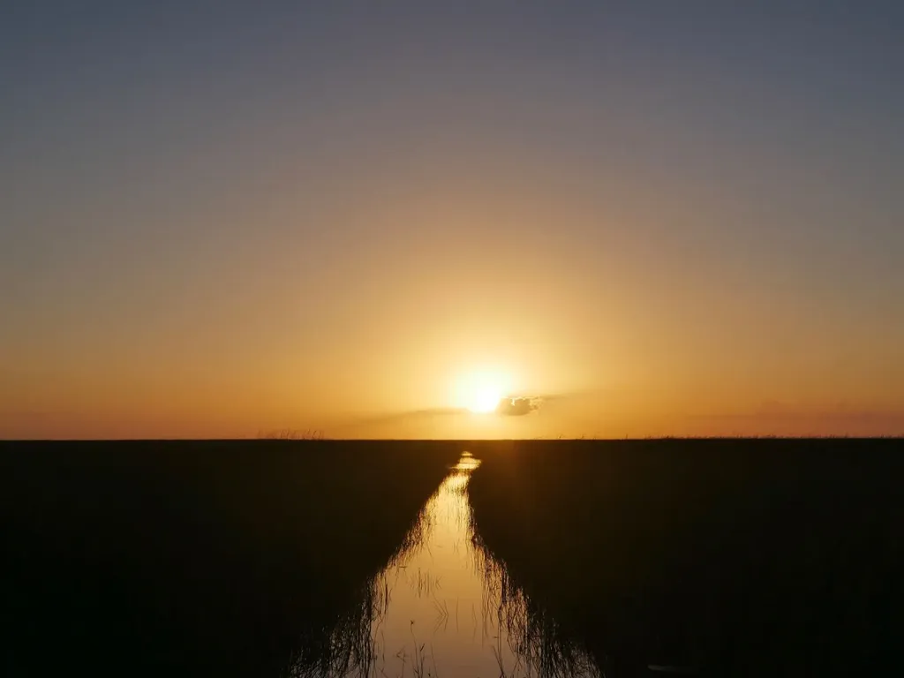
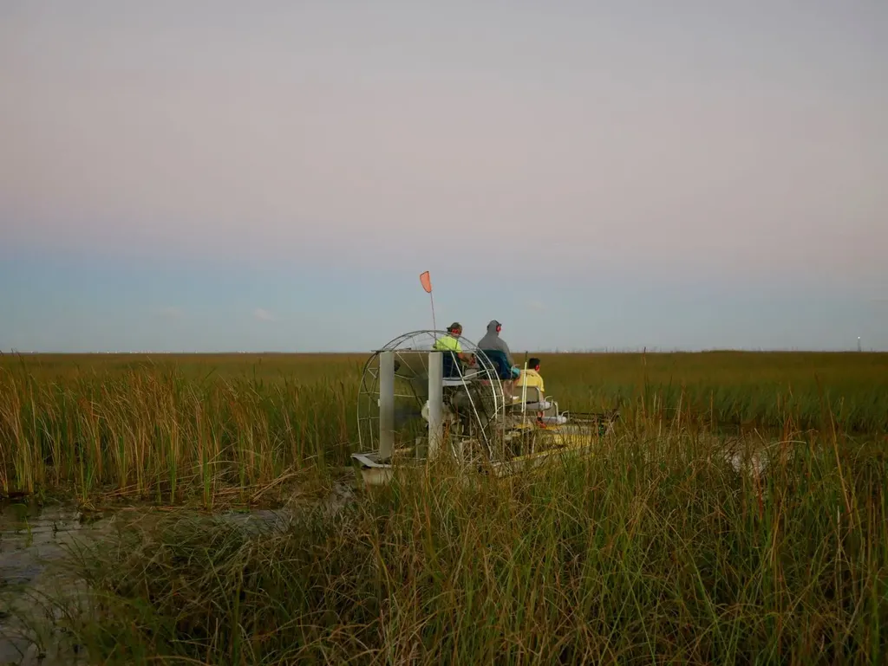
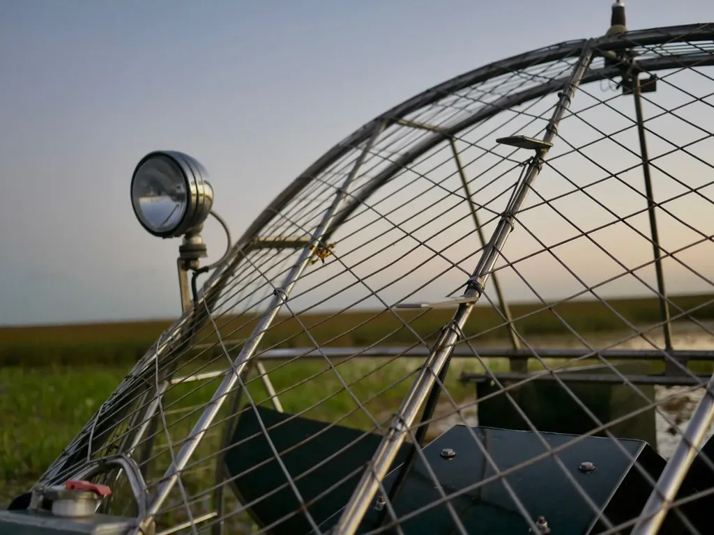

### Vendredi 22, Weston

Depuis notre visite des Everglades, je me gratte. Des moustiques m’ont perforé les bras et les jambes et je fais une belle réaction allergique. À part ça, rien à dire, sinon que je passe encore du temps sur mes histoires de vélos. Quand je ne pédale pas, je rêve mes prochaines sorties.

### Dimanche 24, Weston

« Look! » me dit JP. Un oiseau s’envole sur notre gauche. Mais pourquoi me dit-il ça ? À ce moment je le vois, à cinq mètres de nous, en travers du chemin. Une belle bête. JP avance vers lui, l’alligator recule tout en émettant des bruits de gorge peu rassurants. Je passe devant sa gueule grande ouverte.

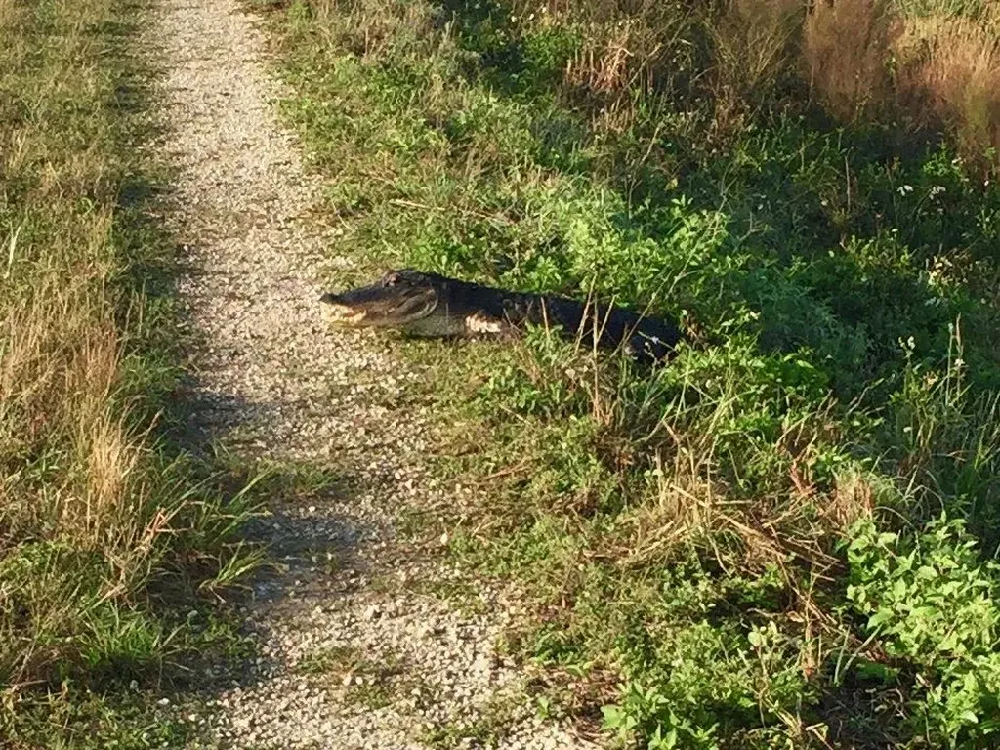

### Lundi 25, Weston

Hier soir, durant la cérémonie des Oscar, j’ai regardé *Free Solo* qui était en train d’emporter le prix du meilleur documentaire. Durant tout le film, j’ai eu les mains moites. Pourquoi [Alex Honnold](https://fr.wikipedia.org/wiki/Alex_Honnold) s’attaque à mains nues aux plus verticales faces rocheuses du monde ? Pourquoi en juin 2017 a-t-il gravi El Capitain dans le parc de Yosemite ?

La réponse d’Isa est directe : il veut se suicider, sinon il se contenterait de grimper avec des cordes. « C’est la mort qui le fait bander. » En effet, cette prise de risque peut paraître inutile, surtout quand on sait que tous les adeptes du free solo finissent par tomber. Alex Honnold a une autre explication : il veut approcher la perfection. Quand il est encordé, il peut prendre des risques, tenter des choses impossibles, il peut se permettre des erreurs et des approximations. En solo sur la face d’El Capitain, pas la moindre hésitation n’était permise, il fallait être pur, parfait, impérial.

Ce désir de perfection est paradoxalement un désir de vie. Alex Honnold ne s’est jamais autant senti vivant que quand il collait son ventre au granit d’El Capitain. Vivant comme peut l’être le peintre, le musicien, l’écrivain, le tennisman, vivant quand un long entraînement amène à l’art, à la beauté, à l’impossible. La mort est toujours présente dans ces moments, même pour moi quand j’écris. Si j’échoue dans mes mots, je tombe, peut-être au sens symbolique, mais la chute risque à tout moment d’être définitive.

Ce désir de perfection est capable de nous sauver collectivement. Il nous pousse, il nous entraîne, il nous donne à rêver. D’un point de vue évolutif, ce désir est bénéfique, même s’il implique la mort de quelques individus. Il nous pousse à exploiter toutes les possibilités, à découvrir des solutions impensables.

Certains d’entre nous ne se contentent par de faire, ils veulent faire aux mieux, par de leur mieux, mais dans un mieux absolu aux limites sans cesse repoussées. Tant que nous entrevoyons ce mieux, nous avançons. Le chemin d’Alex Honnold me donne la pétoche, mais il en dévoile d’autres. Un gars comme lui peut donner des envies de vies. Qu’il meure demain n’y changera rien.

---

Si j’ai eu eu les mains moites durant *Free Solo*, je crois que ça tient plus à l’exploit d’Alex Honnold qu’au film, mais les caméramans étaient là pour le filmer. Pas assez d’escalade pour moi, pas assez de temps long, le film aurait pu durer les 4 heures de l’escalade… Ça serait intéressant de remonter un tel film avec la tonne d’images qu’ils doivent avoir en stock.

### Mardi 26, Weston

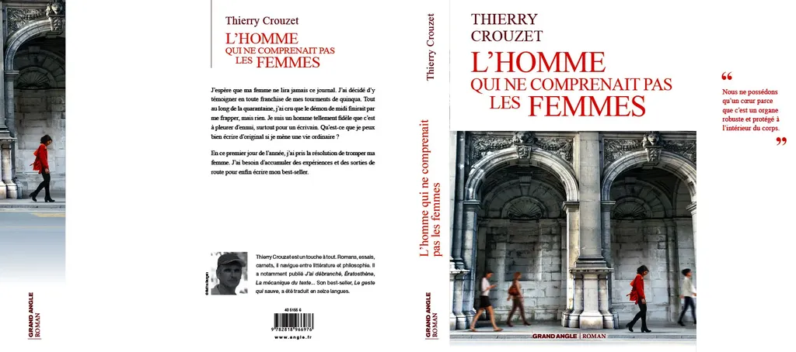

Dans deux mois, je publie *L’homme qui ne comprenait pas les femmes*, le roman écrit avant mon départ en Floride. Mon attachée de presse chez [Bamboo édition](https://www.bamboo.fr/) me demande de répondre à trois questions.

*— Comment passe-t-on d’ingénieur à romancier ?*

— À vrai dire, j’ai commencé à écrire bien avant de devenir ingénieur. À dix-sept ans, j’ai commencé à tenir un journal, puis j’ai écrit des dizaines de scénarios de jeu de rôle, dont *[L’Affaire Deluze](../../books/deluze.md)* qui vient d’être rééditée, puis quelques nouvelles. C’est en troisième année d’école d’ingénieur que j’ai décidé de me consacrer à l’écriture. Je suis donc devenu écrivain et ingénieur en même temps. Bien d’autres ont effectué le même chemin que moi comme François Bon ou Michel Houellebecq. Ce n’est pas un hasard. La technologie et la science dominent notre époque, en bien et en mal. Être scientifique, être technicien nous aide peut-être à mieux voir, ou tout au moins à décoder certains pans de notre présent même si leur lien avec la technologie n’est pas évident. Ce monde ultratechnologique il nous faut apprendre à le vivre, à le supporter, il nous faut donc y écrire des histoires pour y expérimenter des existences qui complètent les nôtres.

*— La plupart de vos ouvrages ont un lien avec le numérique, est-ce votre manière de créer un lien avec vos deux univers ?*

— Le numérique est la technologie reine d’aujourd’hui, celle qui a le plus d’impact sur nos vies, sans doute. Mais c’est plus qu’une technologie, c’est un média, même un nouveau territoire d’expression. Pour moi, c’était doublement irrésistible, autant comme écrivain que comme ingénieur. Je devais aller sur ce terrain, l’explorer, tenter d’y expérimenter de nouvelles possibilités, peut-être y dénicher de nouvelles beautés. À un moment donné, je n’ai plus fait de différence entre numérique et littérature, il était devenu évident que tout cela ne faisait qu’un, c’est-à-dire la littérature d’aujourd’hui (que je n’aime pas appeler numérique, car se serait la réduire à un support, alors qu’elle est tout simplement notre littérature vivante).

*— L’homme qui ne comprenait pas les femmes apparaît comme un ovni quand on lit votre bibliographie. Pourquoi ce changement de cap ?*

— C’est la faute de [Jim](https://www.angle.fr/dessinateur-jim-408.html), mon copain scénariste et dessinateur avec qui nous nous sommes toujours dit que nous devrions faire un truc ensemble, sans jamais trouver un point de convergence. Un jour, il m’explique qu’il crée une collection de roman chez [Bamboo](https://www.bamboo.fr/) et il me demande si je veux bien écrire quelque chose. J’ai commencé par refuser, je n’avais aucune idée qui pouvait lui donner envie d’être mon éditeur. Avec sa série [*Nuit à Rome*](https://www.amazon.fr/Une-nuit-Rome-intégrale-volumes/dp/2818940389/), il a posé son style narratif que j’aime comparé en version cinéma à celui de [Cédric Klapisch](https://fr.wikipedia.org/wiki/C%C3%A9dric_Klapisch) ou de [Richard Linklater](https://fr.wikipedia.org/wiki/Richard_Linklater). Ma réponse : « Je n’écris pas de la littérature intimiste. »

Bien sûr, c’est faux puisque [je publie tous les mois mon journal sur mon blog](../../page/carnets). C’est là que Jim est allé chercher ce qui nous réunit et qui était si énorme que j’étais incapable de le voir. Il a même déniché dans une note de juin 2017 une idée de roman, lancée comme ça, sur laquelle il m’a demandé de réfléchir. Voilà comment *L’homme qui ne comprenait pas les femmes* est né. C’est un roman sous la forme d’un journal. La version mec du *Journal de Bridget Jones*. Tout est imaginé et tout est vrai.

J’y parle de la cinquantaine, de la mort, de l’écriture et bien sûr des femmes. J’ai beaucoup bossé avec Jim. L’écriture a été un jeu. Son regard de scénariste m’a poussé sur des voies inattendues. Sans lui, ce livre aurait été moins drôle, moins cinématographique. Contrairement à la plupart des éditeurs avec qui j’ai travaillé avant, Jim n’a jamais été castrateur. Le texte me revenait avec des idées, des pistes à creuser. Souvent j’éclatais de rire en lisant ses annotations. Je recommence à bosser avec lui quand il veut.

---

Je n’écris pas, je dessine une trace pour ma randonnée de cet été. Je scrute les images satellites, je cherche les lacs, les rivières, les plus beaux villages, les traces laissées par les autres. J’entrevois les possibilités d’un art nouveau. Là où le cyclotouriste avançait en suivant la carte, je la transperce, je la dépasse, je la retourne. J’analyse la topographie à plusieurs échelles superposées. J’ai une approche fractale. Tout cela finira par une simple ligne qui servira de guide et qu’il faudra encore interpréter une fois sur le vélo.

### Mercredi 27, Weston

J’ai toujours mal quelque part désormais. Quand je pars rouler ce matin, il fait une douceur délectable. Je me dis que je me sens exceptionnellement bien. Puis peu à peu j’ai mal au pli inguinal, un frottement, déjà ressenti dimanche, tout ça parce que je porte un nouveau cuissard hors de prix censé être du velours pour mes fesses. Pour de vrai, je ne sens rien à mes fesses, mais l’excès de mousse m’abrase ailleurs. Le vélo implique de perpétuels réglages. Je rêve d’aboutir à un idéal, mais il n’existe pas puisque mon corps se transforme, que je change de route et de position.

---

Je ne culpabilise plus de ne pas écrire. Je me suis fait à cette idée, je me contente de ce journal, c’est peut-être bien assez. *L’homme qui ne comprenait pas les femmes* se profile et je m’en moque comme des innombrables autres romans qui sortiront le même jour et qui ne changeront rien à nos vies. Pourquoi écrire des livres inutiles ? J’ai sans doute atteint l’âge où seul le décisif importe. Le décisif est peut-être là, dans mes paratextes.

### Jeudi 28, Weston

Tant que je suis en Floride, je peux lui imputer mon malaise. Mais ne lui est-il pas antérieur ? Depuis que j’ai terminé le roman sur mon père, en septembre 2017, je n’ai plus rien écrit qui m’engage corps et âme. Peut-être que je ne me remettrai au travail qu’une fois ce texte publié, comme s’il était une étape décisive dans ma vie, une borne à partir de laquelle je partirai dans une direction ou dans une autre, peut-être opposées l’une à l’autre. Cette borne tiendra à la réception du texte. J’ai peur que le silence me plonge plus loin dans le noir.

#carnets #y2019 #2019-3-1-17h35
