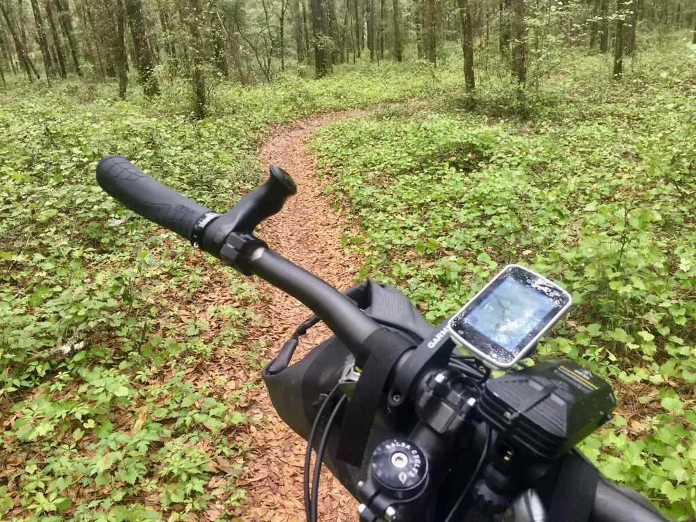
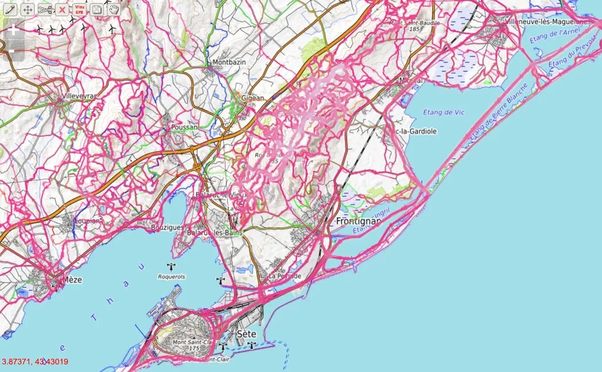
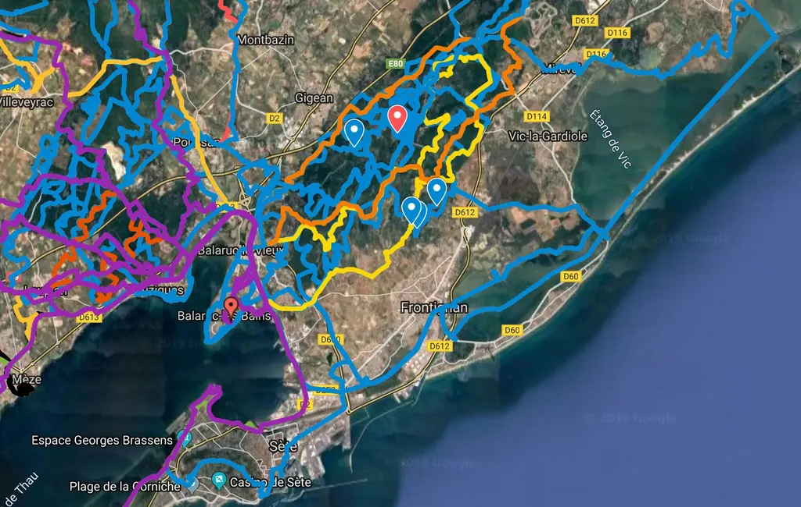
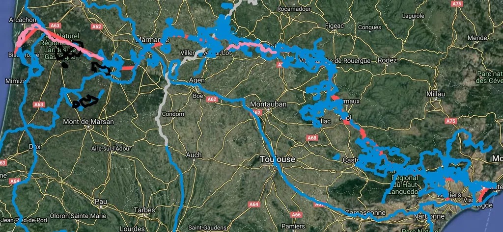

# Éloge du GPS

S’il y a des cyclistes vintage, je suis du genre geek. J’aime mon GPS, je pense même qu’il contribue grandement à la révolution du vélo d’aventure.

J’aime aussi les cartes papier, j’aime les dérouler devant moi, plonger en elles, voyager en imaginaire avec elles, attiré par leurs couleurs pastel, mais j’ai renoncé à les utiliser, que ce soit lors de la préparation de mes sorties ou durant les sorties elles-mêmes.

Au-delà de leur volume, de leur poids, de leur fragilité, de leur coût, de leur obsolescence mécanique, j’ai découvert que la métaphore de la carte comme territoire avait vécu. Plus je roule, mieux je me glisse dans les interstices de la carte, dans les étendues uniformément colorées où elle ne montre rien et où pourtant nous pouvons nous aventurer avec nos vélos de plus en plus performants et polyvalents.

La carte papier, mais aussi électronique, ne peut pas être exhaustive, elle ne peut pas être le territoire. Même les images satellites n’y réussissent pas (ou pas encore). Par le passé, nous nous heurtions à cette évidence. Autour de chez nous, nous connaissions les sentes non cartographiées, mais notre ignorance grandissait au fil de notre éloignement.

Nous en avons fini de dette frustration. Avec mon GPS, je suis partout chez moi. Où un cycliste est passé en laissant une trace flotter dans le cloud, je peux y repasser avec mon vélo. Je ne suis plus prisonnier des routes cartographiées et des itinéraires convenus, je ne suis plus un routier, mais un explorateur.

Le vélo de route a connu son heure de gloire en même temps que les cartes Michelin. Les deux se confondent. Quand la carte est dépassée, le vélo de route n’est plus qu’une pratique de nostalgiques, encore à aduler les exploits de champions qui eux-mêmes perpétuent un rituel par habitude.

Pourquoi la [Strade Bianche](https://fr.wikipedia.org/wiki/Strade_Bianche) s’est-elle imposée en quelques années comme une classique majeure ? Parce qu’elle quitte la route, ne la reprend que pour rejoindre la terre des collines de Toscane. Cette course ne fait que préfigurer celles de l’avenir, des courses qui ressembleront à celles [dont nous parle Albert Londres](https://www.ebooksgratuits.com/ebooks.php?auteur=Londres_Albert) dans son style qui était jubilatoire parce que les courses l’étaient aussi.

La carte ne voit pas le chemin qui s’ouvre en hiver quand la végétation est moins dense, elle ne voit pas le lit de rivière que l’on peut dévaler en été, elle ne voit pas le single que les copains ouvrent pour s’amuser, suivant la sente des sangliers. La carte est indifférente à ma pratique, elle ignore qu’en gravel je peux sortir de la route, qu’en VTT je peux passer partout ou presque, que je peux porter mon vélo, traverser ainsi des torrents ou escalader des montagnes. La carte, c’est le contraire de l’aventure.

Par opposition, le GPS ne nous limite pas. Il autorise des circonvolutions interdites sur la carte, transformant chacun de nous en explorateur. Nous ne cartographions pas. Nous empruntons des traces pour en démontrer la possibilité. Nous sautons du macadam à la terre, de l’herbe à la caillasse. Nous retournons le territoire pour en découvrir les parcelles encore secrètes.

Autant les routes sont numérotées, mesurées, donc en quantité limitée, autant les traces sont infinies, inépuisables. Elles se superposent, s’empilent, se croisent et se tressent. Il suffit de jouer avec un site comme [VTTrack](http://www.vttrack.fr/) pour s’en convaincre. On zoome et ça foisonne, ça pullule, ça invite à rouler, à ajouter sa marque dans ce paysage imaginaire.

La trace est une création collective. Dessiner la sienne implique de superposer celles des autres, de se fier à elles plutôt que seulement aux cartes ou aux images satellites. La plupart des sites de tracer n’ont pas pris en compte cette possibilité. Ils n’ont pas encore adapté la logique Photoshop au cyclisme. [Voilà pourquoi j’en suis réduit à utiliser Google Map.](randos-vtt-ou-autres-comment-creer-une-trace-gpx.md)

En ce moment, je trace un voyage VTT entre Méditerranée et Atlantique en tentant de minimiser les routes. Pour cela, j’ai superposé toutes les traces trouvées qui chevauchent mon périple. Elles dessinent une nuée bleue sur la carte. Alors je les connecte, je les pirate, je les découpe, le les retourne, et peu à peu, profitant de l’expérience de centaines de cyclistes, je pose les grandes lignes d’une aventure.

Les organisateurs de courses ou de raids n’ont plus à flécher les itinéraires, ils n’ont plus à salir les arbres à coups de pinceau, ou le sol à jets de chaux vive. Le fléchage va avec la carte. Il ordonne de tourner à droite et gauche. La trace, elle, n’est qu’une possibilité, qu’une proposition, qui ne vaut que pour nous.

Les courses traditionnelles nous enferment entre des barrières, elles brident notre imagination, nous disent quand il faut boire, nous ravitailler, elle nous transforme en bestiaux en marche vers l’abattoir. La course pro exagère ce défilé macabre. Nous devons dépasser la carte et le territoire pour aller vers la trace et le territoire.

Armée de mes fichiers GPX, je peux partir quand je veux, avec qui je veux. Je n’ai plus besoin de m’inscrire, de prendre un dossard, d’attendre le coup de siffler, de me frotter aux autres pour m’ouvrir un chemin. Je suis seul, sans balise, exceptée la ligne sombre sur mon écran que rien ne m’interdit de quitter si une ouverture se présente. Je pourrais regagner la trace avec aisance, sauter sur une autre, changer de projet. Le GPS me libère, il me rassure aussi, m’offrant la garantie de ne pas me perdre. Pour profiter de sa puissance, je dois disposer d’un vélo aussi versatile que lui, aussi indifférent que lui aux restrictions propres à la carte.

Le GPS autorise le bikepacking hors des routes, hors des chemins balisés, hors de la carte. Il ouvre aux gravel et aux VTT des perspectives [dont personne ne rêvait il y a quelques années](../4/une-breve-histoire-du-bikepacking.md). En même temps, il nous pousse à collaborer, à partager nos traces, à les discuter, à les enrichir de points d’intérêt. Nos traces deviennent les scénarios de nos aventures à vélo. Nos GPS, nos maîtres de jeu.

Comme dans toute partie de jeu de rôle, le scénario a beau être léché, rien ne se passe jamais comme prévu. Disposer d’une trace GPS, c’est tout sauf avoir une sortie sans surprise, déjà parce que le GPS nous amène souvent là où la carte n’est plus, là où s’ouvre le vide, non pas parce que la carte n’est pas assez définie, mais parce qu’aucune carte ne peut rendre l’indicible du terrain.

La trace a enfin une autre vertu : elle m’évite de me laisser attirer par la gravitation des routes, de leurs panneaux, de leurs axes trop évidents. La trace, bien que figée, garantit paradoxalement ma liberté, elle me tient dans la nature, loin des voitures. Sans trace, on finit vite par se retrouver nez à nez avec elles.

#gps #velo #y2019 #2019-3-29-16h55
