# Randos VTT ou autres : comment créer une trace GPX

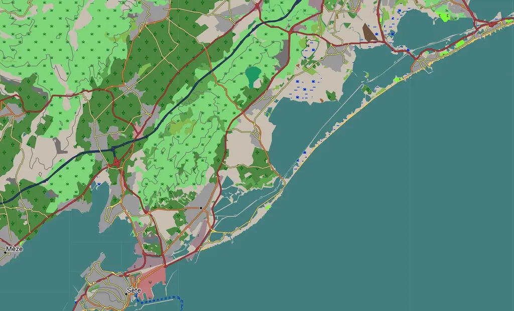

Je compare [le cycliste à l’écrivain](../2/le-velo-comme-ecriture.md) ou aux nomades australiens célébrés par Chatwin dans le [*Chant des pistes*](../../2018/11/lart-du-velo.md), je parle sans cesse de la trace, cette forme d’écriture sur la carte, sur le territoire, je répète que nous découvrons un art nouveau. Comme tout art, il nécessite des outils que je m’efforce de maîtriser.

Mon apprentissage ne s’est pas fait sans mal, je reste à l’écoute des autres cyclistes-cartographes et peu à peu je perfectionne ma boîte à outils. Certains restent fidèles à la carte papier, j’y ai renoncé depuis longtemps. Déjà parce que je transporte un téléphone dans lequel je peux stocker toutes les cartes du monde avec plus de précision que n’importe qu’elle carte papier, parce que d’un clic je me retrouve géolocalisé sur ces cartes, sur lesquelles je peux écrire, tracer mes routes, ajouter des points d’intérêt.

Attention : j’aime les cartes papier, elles me passionnent, ce n’est pas pour rien que j’ai écrit un roman sur *[Ératosthène](../../page/eratosthene)*, le père de la géographie et de la cartographie, simplement je n’imagine plus les trimballer avec moi.

Je ne comprends pas le côté rétro de certains cyclistes, pas plus que ceux qui roulent sur des bécanes en aciers pesant des tonnes et leur brûlant les jambes à la moindre montée. Il y aurait un côté écolo, un côté décroissant, un désir de simplicité. Mais je ne voix pas en quoi l’archaïque et plus simple que le moderne. Pour moi, la simplicité s’exprime dans le minimalisme. Chacune des choses que je transporte avec moi doit remplir le plus de fonctions possible pour un poids minimal. Si je devais transporter un téléphone et des cartes, il y aurait du double emploi.

Certes, un téléphone nécessite une source d’énergie, mais limité à vrai dire. Quand je m’engage dans un raid, mon téléphone est en mode avion. Je ne l’utilise que pour prendre des photos, que pour consulter mes cartes quand je suis perdu, que pour lire avant de m’endormir, éventuellement pour donner des nouvelles à ma famille. Je n’ai besoin de recharger mon téléphone que tous les quatre jours. Au moindre arrêt dans un café ou un restaurant, je le branche, ainsi que mes autres devices et que ma batterie de secours.

En plus de mon téléphone, je suis équipé d’un GPS, mon Garmin 820 ne pesant que 67 g. N’y aurait-il pas double emploie ? En théorie, mon téléphone peut remplacer le Garmin. Problème : il consomme alors bien plus que lui. En mode économie d’énergie, mon Garmin peut me guider durant une dizaine d’heures. Quand je le branche sur ma batterie de secours, plus rien de l’arrête. Renoncer au Garmin, impliquerait de m’équiper d’une batterie de secours plus conséquente que mon [Anker Power Core 20100](https://www.anker.com/products/variant/powercore-20100/A1271012) qui pèse 356 g (je pense que je peux recharger une vingtaine de fois mon GPS avec). Je trimballais en plus une montre GPS/cardio, je m’en suis délesté.

Voici donc pour mon matos embarqué.

### Cartographe de tous les instants

Quand je roule, cours ou même marche, j’enregistre avec mon GPS le parcours, que j’uploade sur [Strava](https://www.strava.com/athletes/18278258) dès mon retour chez moi.

Sur Strava, je peux suivre les sorties des copains et discuter avec eux, je peux surtout récupérer mes propres traces au format GPX (le plus classique format de traces GPS). Je peux aussi télécharger des traces depuis de nombreux autres sites comme [RWGPS](https://ridewithgps.com/), [GPSies](https://www.gpsies.com/), [Utagawavtt](https://www.utagawavtt.com), [OpenRunner](https://www.openrunner.com/), [TraceGPS](http://www.tracegps.com), [VTTour](http://www.vttour.fr/), [TraceDeTrail](https://tracedetrail.com), [VisuGPX](https://www.visugpx.com/), [VisoRando](https://www.visorando.com/), [la-trace](http://la-trace.com/), [ViewRanger](http://www.viewranger.com/fr), [VTTrack](http://www.vttrack.fr/), [Komoot](https://www.komoot.com), [Mountnpass](https://www.mountnpass.com), [Bikemap](https://www.bikemap.net), [Outdooractive](https://www.outdooractive.com/fr/)… Parfois je tombe sur des traces parfaites, le plus souvent elles ne font que me donner des idées de nouvelles sorties. Je dois donc être capable de les bidouiller, voire d’en créer de nouvelles.

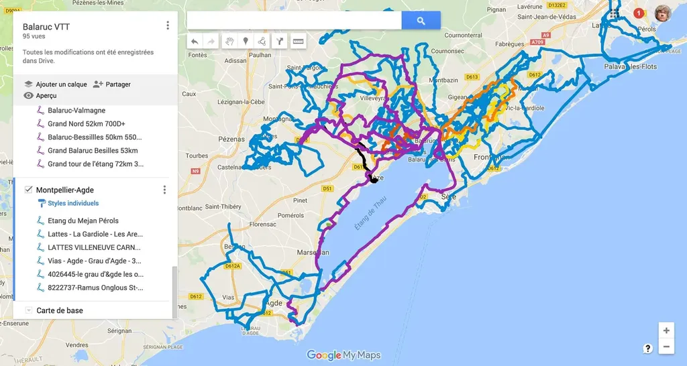

J’ai pris l’habitude d’archiver ces traces sur Google Map, qui offre la possibilité de créer ses propres cartes (depuis le menu Adresses, onglet Cartes). Quand on ouvre un nouveau calque, on peut y importer des fichiers GPX ou KML (format comparable créé par Google). Dans les calques, avec l’outil Tracer de ligne, je commence alors par créer mes propres parcours, en passant parfois par mes traces, souvent par celles des autres, ainsi je découvre de nouveaux chemins, ose des itinéraires plus longs, qui sans l’aide d’un GPS pourraient m’entraîner dans de grosses galères (ce dont ne me protègent pas les GPS, surtout quand j’improvise des traces avec la seule aide des images satellites).

**Astuce** : Google Map ne permet pas d’éditer les traces qui comportent plus de 2 000 points, ce qui est presque toujours le cas quand on enregistre un tracé avec un GPS. Avant l’import d’une trace à éditer, je la réduis à 500 points avec [GPSvisualizer](http://www.gpsvisualizer.com/convert_input#show_advanced&highlight=trk_simplify), ce qui en général suffit pour rester fidèle au tracé original.

Google Map est loin d’être parfait. On ne peut pas découper des traces ou les joindre. L’effacement des points est laborieux. Impossible de connaître la distance entre deux points, tout comme le dénivelé qui les sépare. Il faut donc recourir à d’autres outils.

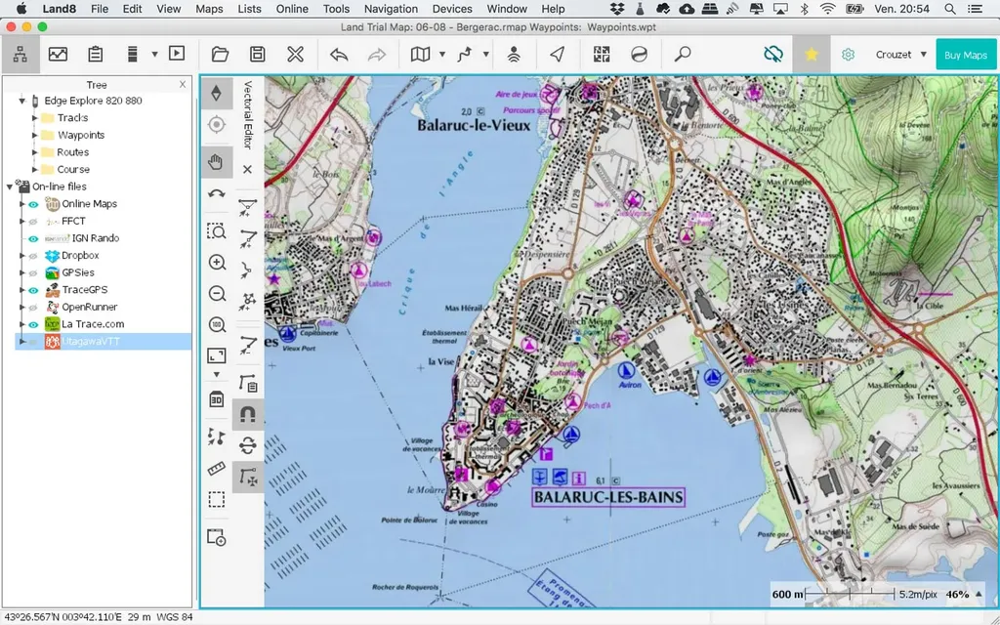

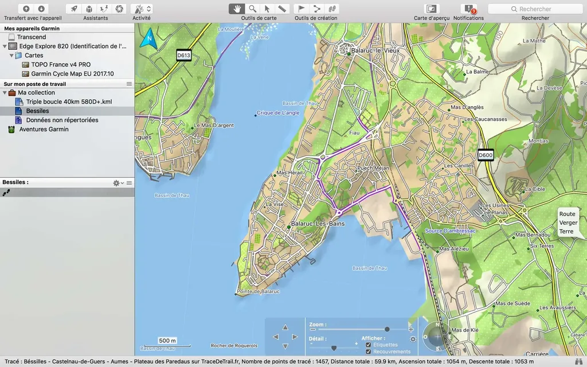

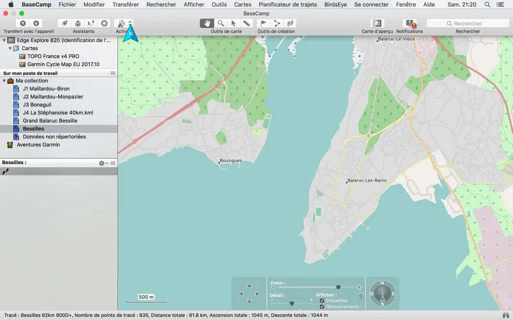

Pour les tâches d’édition, j’utilise le logiciel [baseCamp](http://www.garmin.com/fr-FR/shop/downloads/basecamp) de Garmin, gratuit. Je n’ai jamais testé [QLandkarte GT](http://www.qlandkarte.org), qui ne tourne pas sur mon Mac. Associé aux GPS et applications TwoNav, [Land](https://www.twonav.com/en/software/land) est une sorte de couteau suisse cartographique. Plus puissant et plus souvent mis à jour que baseCamp, il est malheureusement payant dans sa version complète. Comme il est connecté aux principaux sites de partage de traces, je l’utilise quand je défriche des itinéraires en territoires inconnus (on peut faire fa même chose en ligne avec [VTTrack](http://www.vttrack.fr/)).

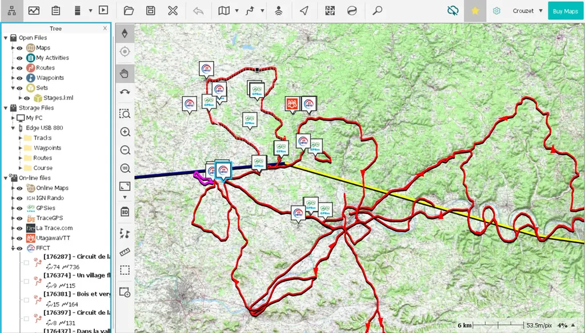

Pour le reste, en faisant des allers-retours entre Google Map et baseCamp, je m’en tire très bien. Depuis Google Map, j’exporte en KML les traces à éditer et les importe directement dans baseCamp, d’où j’exporte en GPX pour réimporter dans Google Map. Depuis baseCamp, je peux aussi directement envoyer mes traces sur mon GPS Garmin.

Sur Google Map, j’apprécie avant tout les calques pour superposer des traces et bien sûr l’accès aux images satellites. Sur baseCamp, j’apprécie la puissance des outils d’édition, la possibilité de charger toute sorte de cartes (IGN, [OpenStreetMap](http://garmin.openstreetmap.nl/), [Opentopomap](https://opentopomap.org)…). Si j’avais les images satellites sur baseCamp ce serait génial, mais encore une fois je n’ai pas envie de payer pour le service BirdsEyes de Garmin. [Quant aux solutions gratuites](https://www.sorcieremonique.com/t23510-visualiser-dans-basecamp-une-image-satellite-avec-une-carte-de-fond-des-courbes-de-niveaux-et-carte-dem), elles me paraissent trop lourdes par rapport à ma méthode import/export entre Google Map et baseCamp.

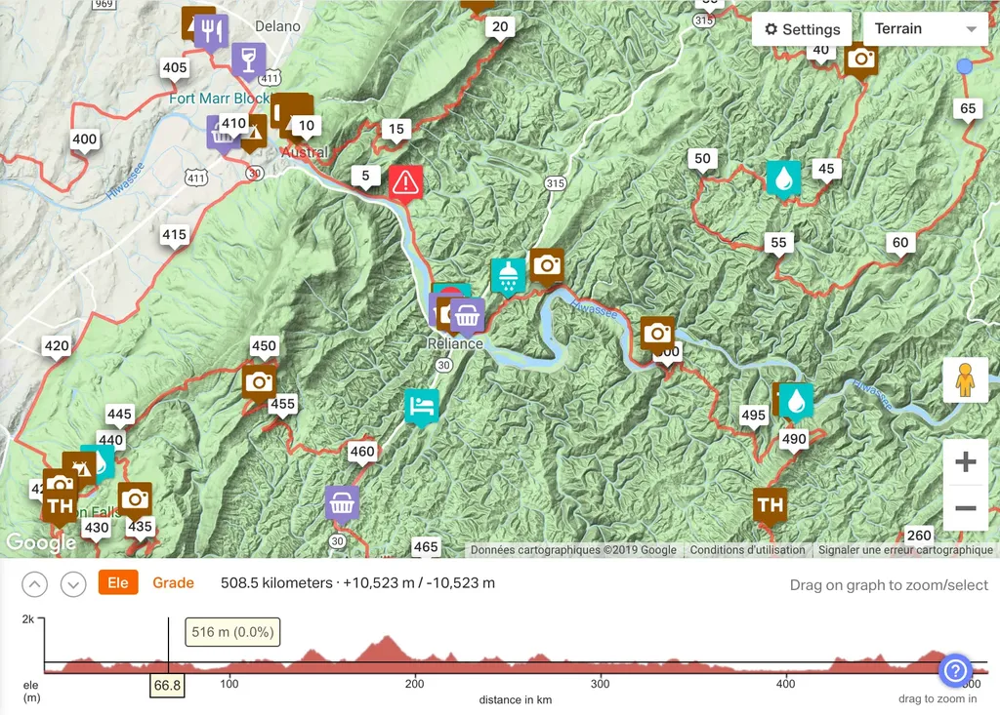

[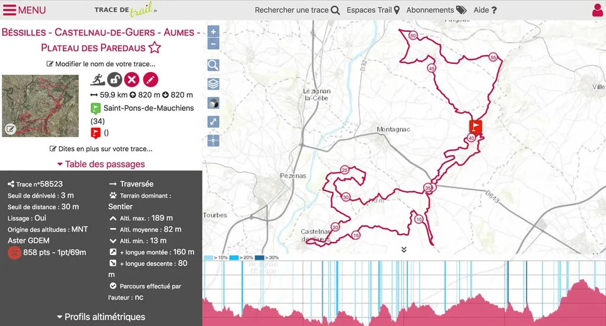](https://tracedetrail.com/fr/user/infos/65893)

Pour analyser une trace, j’ai appris à me méfier de baseCamp. S’il me fournit le kilométrage précis entre deux points, il est plus approximatif pour le dénivelé (en l’état de mes cartes). Je préfère charger mes traces sur [RWGPS](https://ridewithgps.com/), un service de partage de traces doté de nombreux outils d’analyse, même dans sa version gratuite (j’ai un temps utilisé [TraceDeTrail](https://tracedetrail.com) et [ViewRanger](http://www.viewranger.com/fr)). Dans sa version payante, il permet de créer et de partager de belles traces enrichies de points d’intérêt. Aux USA, de nombreux organisateurs de raids utilisent ce service.

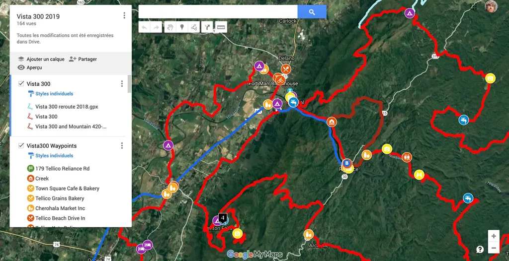

Pour ma part, je fais plus ou moins la même chose avec Google Map. J’ajoute des icônes pour signaler les restaurants, les campings, les points d’eau, les points de vue… Je peux même construire des scénarios en indiquant les endroits où je pense dormir, puis je finis par rendre publiques mes cartes.

**Astuce** [Komoot](https://www.komoot.com/) est un superbe outil d’analyse de traces, sans doute le plus performant, c’est aussi un très bel outil de tracer, le mieux dessiné, avec possibilité de basculer entre cartes et images satellite. Malheureusement, on ne peut pas y superposer des traces, ce qui nous condamne à suivre les chemins cartographiés (symptôme de cette faiblesse, on ne peut y importer les fichiers KMZ de Google). Je ne l’utilise qu’en phase de finalisation d’un parcours.

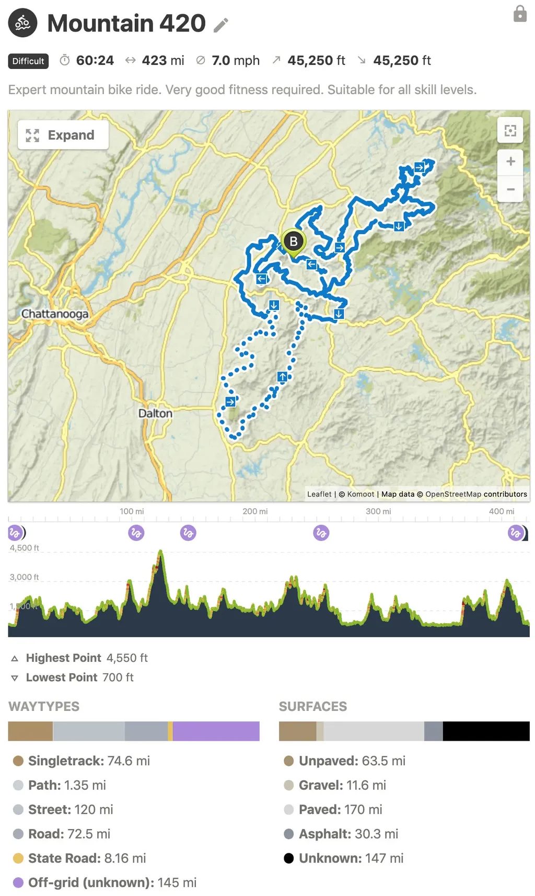

**Astuce** Quand on télécharge baseCamp, aucune carte ne l’accompagne. Si on possède un GPS Garmin connecté à l’ordinateur, baseCamp affichera les cartes disponibles sur le GPS. On peut tromper baseCamp en créant un faux GPS Garmin à l’aide d’une clé USB. Sur cette clé, il suffit de créer un dossier Garmin et d’y stocker les cartes compatibles Garmin. On en trouve un peu partout sur le Net, notamment la [France](http://freizeitkarte-osm.de/garmin/en/france.html), mais aussi [les secteurs de toutes les régions du monde](http://garmin.openstreetmap.nl/).

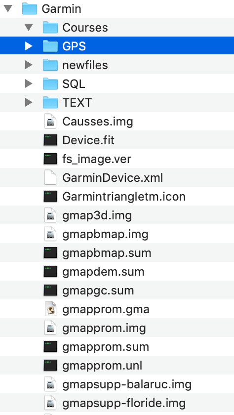

**Astuce** Pour préparer de longs trajets VTT, par exemple une traversée de la France du Sud pour l’été 2019, je charge dans Google Map les traces qui couvrent les régions que j’aimerais traverser, puis je commence à les interconnecter.

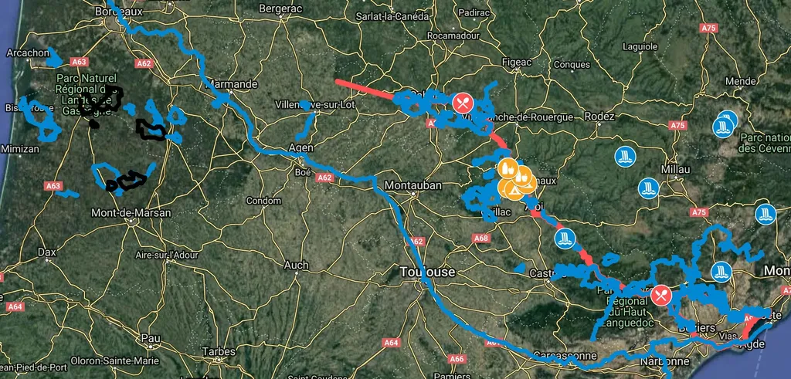

### Sur la route

Une fois ce travail préparatoire effectué, il est temps de prendre la route. Avant d’investir dans un GPS, je naviguais à l’aide de l’application TwoNav installée sur mon téléphone. Elle fait le job, mais je n’aimais pas voir mon téléphone accroché à mon guidon, risquant de l’exploser à la moindre gamelle (sans parler de son autonomie limitée).

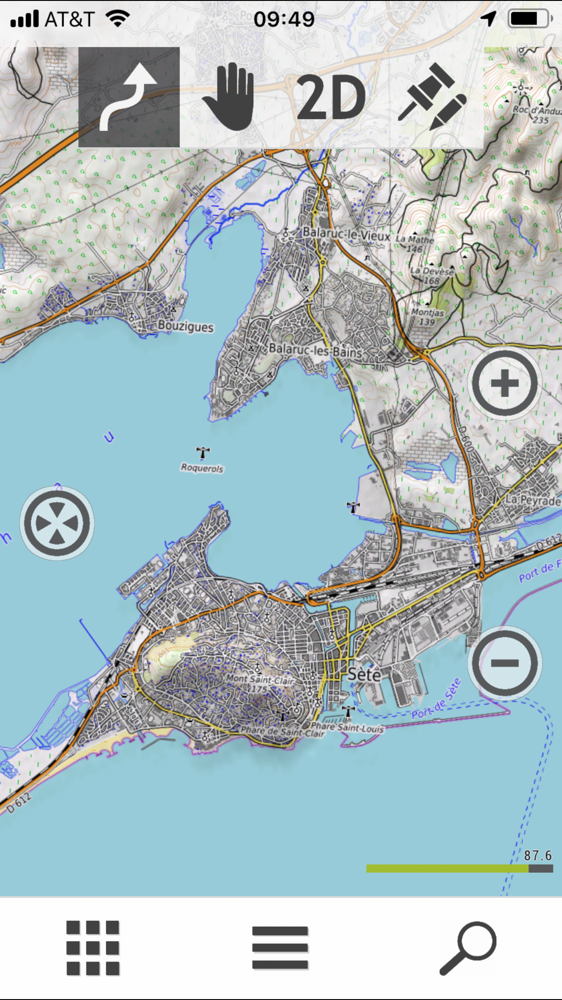

Donc, maintenant que j’ai un Garmin, j’y charge une carte minimaliste [créée à partir d’OpenStreetMap](http://garmin.openstreetmap.nl/). J’ai bien essayé d’utiliser les cartes IGN 1/25 000, mais elles sont si lourdes que le Garmin se traîne, puis elles sont si détaillées que je n’y voyais plus rien. Pour suivre une trace, on n’a pas besoin de détails. Il suffit de choisir un zoom approprié et c’est parti.

Reste que parfois la trace nous conduit dans des impasses, en haut d’une falaise, devant une forêt infranchissable. Pour trouver un nouveau chemin, il est alors important de disposer de cartes détaillées sur son téléphone, bien plus puissant et ergonomique que n’importe quel GPS (donc inutile de débourser une fortune côté GPS - le plus important, c’est son autonomie, sa légèreté, sa robustesse, sa précision).

J’ai testé de nombreuses applications avant de jeter mon dévolu sur [MapOut](https://mapout.app/), où je télécharge les cartes OpenStreetMap dont j’ai besoin ainsi que mes traces (il suffit de les envoyer en pièce attachée à un mail adressé à votrecompe@mapout.me). Je peux même envoyer des fichiers KML avec des points d’intérêt. Ainsi, sur mon téléphone, je dispose de toutes les informations utiles, même en mode avion, même dans les régions les plus reculées. Je peux connaître la distance entre deux points sur la trace, visualiser le profil. Ça m’aide à décider s’il est temps de monter le camp ou si je peux tenter d’atteindre le prochain camping avant d’être carbonisé.

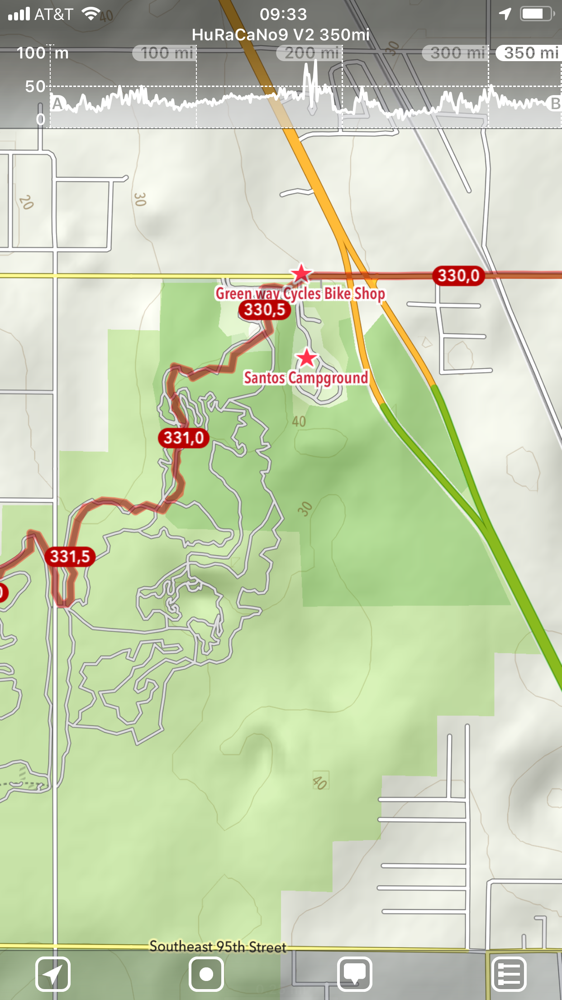

En solution de secours, quand je suis en France, je télécharge les cartes IGN sur l’application TwoNav. Parfois, elles sont plus précises que les OpenStreetMap, mais pas toujours (j’avoue en avoir rarement l’usage).

**Astuce** Pour ceux qui ne veulent pas utiliser baseCamp et possède un GPS Garmin, il est possible de [convertir les fichiers GPX en fichiers FIT](http://www.gpsies.com/convert.do;?language=fr), le format équivalent utilisé par Garmin. Il faut alors copier ces fichiers FIT dans le dossier NexFiles du GPS (quand celui-ci est connecté à un ordinateur). D’après mes tests, Land me semble fonctionner avec la plupart des GPS quelle que soit leur marque.

**Astuce** Retrouver sur mon GPS les points d’intérêt créés sur Google Map n’est pas inuitif. En théorie, je dois exporter ma carte, ou seulement un de ses calques, au format KMZ, puis l’importer dans BaseCamp pour envoyer l’ensemble sur mon GPS, mais pour des traces complexes cette méthode plante mon Garmin 820. Le plus simple est alors de [convertir directement le fichier KMZ en fichier FIT](http://www.gpsies.com/convert.do), puis de déposer ce fichier dans le dossier NewFiles du GPS.

**Astuce** Pour augmenter l’autonomie de mon GPS, je désactive toutes les options inutiles quand je roule, tel le bluetooth, le guidage, le recalcul d’itinéraire. Je réduis au maximum la luminosité de l’écran. Si possible, je bascule en mode économie d’énergie (mon écran s’éteint après une minute). Je ne quitte ce mode que quand il me faut sans cesse changer de route.

### Pour résumer

1. Sur Google Map, je superpose les traces que je trouve, puis je crée de nouvelles traces. Disposer de la vision satellite est très important à ce stade, parce que j’arrive à dénicher des chemins invisibles sur les cartes les plus précises. C’est indispensable pour interconnecter des traces disjointes.
2. Je charge ma trace dans baseCamp. Je peux la couper et la relier à d’autres pour monter de nouvelles ballades à partir de celles existantes. Fonction très utile : je peux inverser le sens d’une trace, [sans avoir besoin d’un site tiers]([http://www.gpsies.com/upload.do?uploadMode=convert&language=fr]).
3. Je précise mon tracé en faisant des allers-retours entre Google Map et baseCamp, tantôt me fiant aux cartes, tantôt aux images satellites.
4. J’exporte ma trace en KML depuis Google Map, avec tous les points d’intérêts, éventuellement les variantes de parcours, puis je l’envoie par mail à MapOut, mon application de secours.
5. J’importe une dernière fois cette trace dans baseCamp pour l’envoyer à mon GPS.
6. À la fin de la sortie, je synchronise mon GPS avec Strava, d’où je télécharge la trace GPX que j’archive sur Google Map. Mes amis peuvent la récupérer puisque je partage [mon Google Map](https://drive.google.com/open?id=1zLrhYUnGmemQb1TIkI6zRwrjTdkwz3KZ&usp=sharing).

**Paradoxe** La technologie peut nous aider à nous réapproprier le territoire, à sortir des sentiers battus, à mieux connaître notre pays. Je ne cesse de m’émerveiller des paysages que nous découvrons quand nous roulons, alors que parfois nous sommes à moins de trente kilomètres de chez nous.

*PS : J’ai publié ce billet en mai 2018, bien avant de commencer ma série [Born to Bike](../../page/borntobike). Je le mets à jour au fur et à mesure de mes découvertes.*

#gps #velo #y2019 #2019-3-21-19h33
