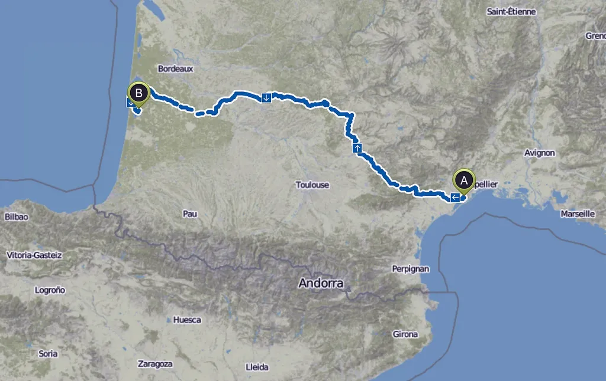
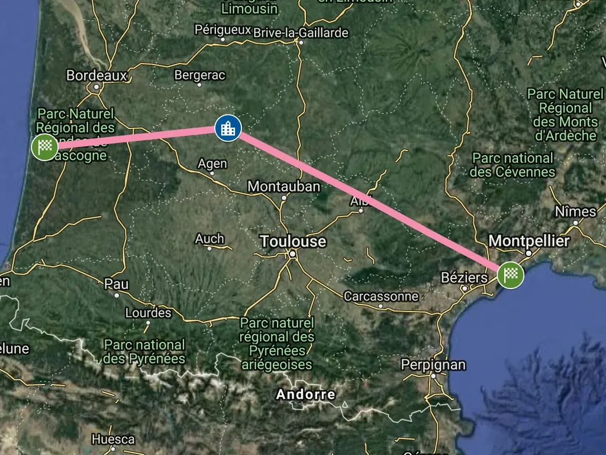
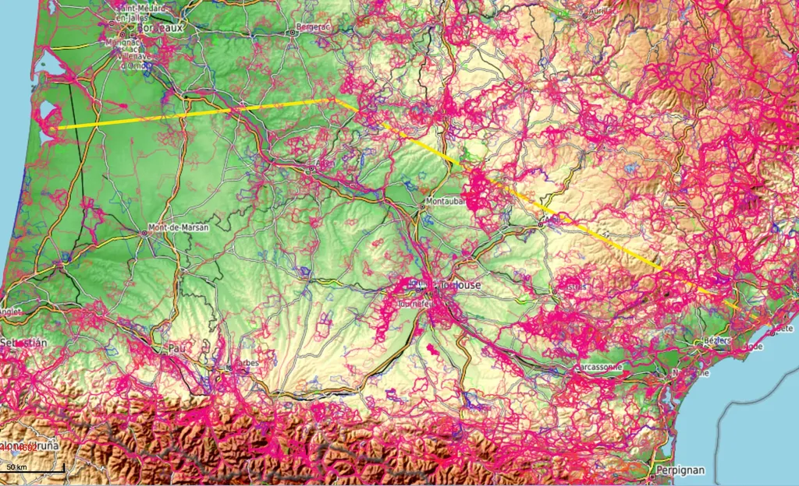
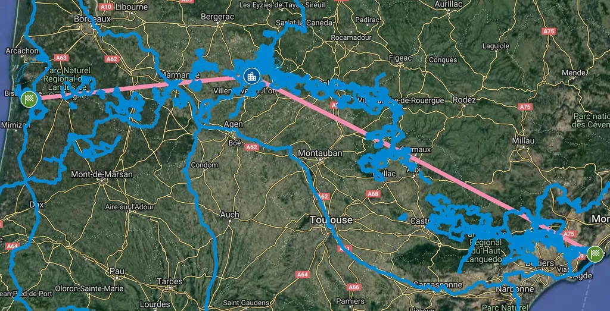
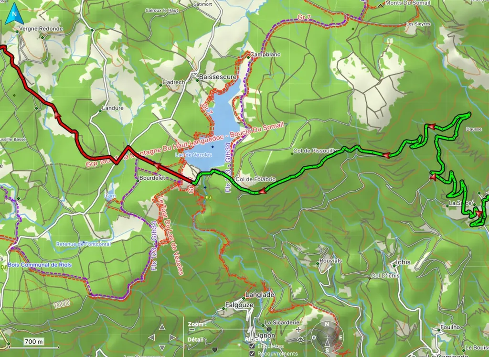
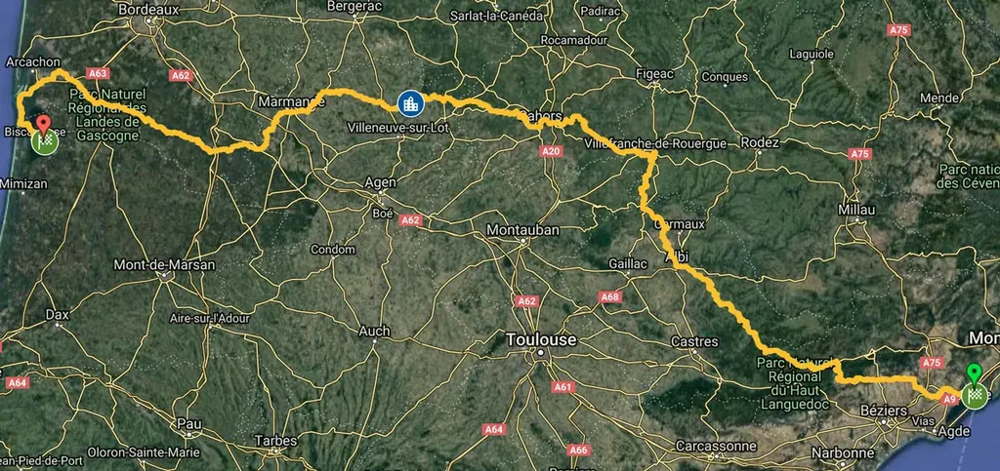
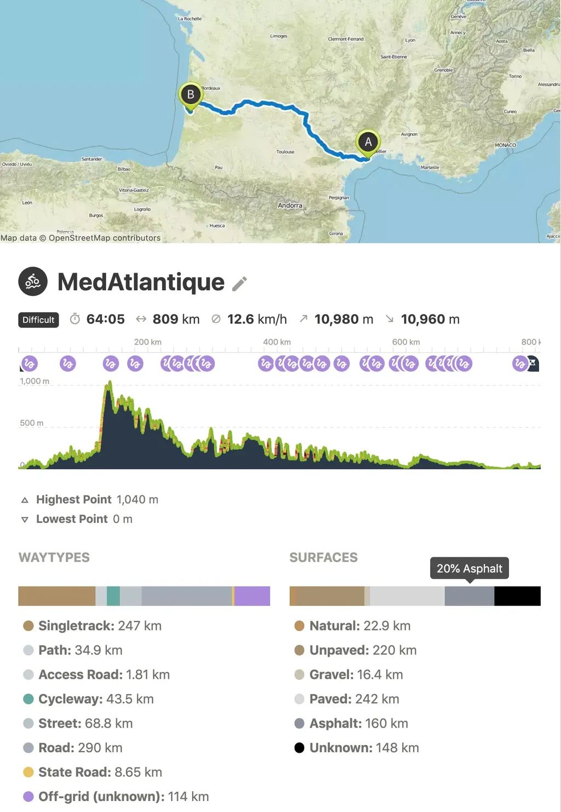
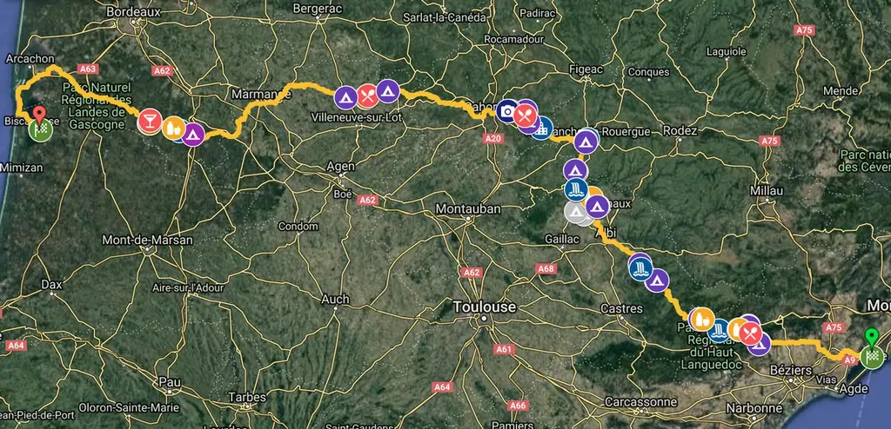

# Bikepacking : Méditerranée-Atlantique

En août 2019, avec le copain blogueur [Lionel Dricot](https://ploum.net/), nous sommes [partis de chez moi, près de Sète, pour nous diriger vers l’Atlantique et Biscarrosse, via les environs de Monflanquin où nous avons effectué une petite halte chez ma belle famille](../8/une-traversee-de-la-france-sud-a-vtt.md). La solution de facilité aurait été le suivre le canal du Midi, mais nous sommes plus pervers. Nous avons toujours envie de nous tenir à l’écart des routes, de suivre de préférence les singles ou les pistes, de grimper, de crapahuter, de nous baigner dans les lacs et des rivières perdues, sans oublier de passer par quelques villages remarquables.
[Vous pouvez vous approprier notre trace, la modifier, la transformer, l’enrichir.](https://drive.google.com/open?id=1_Z5YlQopu7BmxW612bFj7BwBWruvwyis&usp=sharing) Si vous connaissez des chemins sur ce parcours, partagez-les avec moi, j’enrichirai la carte. Nous pourrons peut-être ouvrir une nouvelle sorte de French Divide.

Voici comment j’ai dessiné cette trace.

**1** J’ai créé [une nouvelle carte sur Google Map](https://drive.google.com/open?id=1_Z5YlQopu7BmxW612bFj7BwBWruvwyis&usp=sharing) où j’ai disposé notre point de départ, notre étape intermédiaire et notre point d’arrivée, et j’ai connecté ces trois points en tirant droit.

**2** J’ai exporté ma trace minimaliste en KML, je l’ai convertie en GPX avec [BaseCamp](https://www.garmin.com/en-US/shop/downloads/basecamp), pour la réimpoter sur [VTTrack](https://www.garmin.com/en-US/shop/downloads/basecamp) à qui j’ai demandé d’afficher toutes les traces VTT disponibles (possibilité d’utiliser [OpenTraveller](https://www.opentraveller.net)).

**3** Depuis VTTrack, j’ai ouvert une centaine de traces proches de ma ligne, puis les ai importées dans un calque de mon Google Map.

**4** Un serpent bleu m’a sauté aux yeux, dirigé vers Castres, remontant vers Albi, puis Villefranche-de-Rouergue avant de rejoindre la vallée du Lot. Au cœur de ce réseau, j’ai repéré des endroits célèbres : Pézenas près de chez moi, la sublime vallée de l’Orb entre Roquebrun et Olargues, le lac de Vézoles, Monestiés, Najac, Saint-Cirq-Lapopie…

**5** Par dessus ce réseau, en m’en inspirant, j’ai alors commencé à dessiner mon parcours, sautant de trace en trace, tirant droit quand je n’en trouvais pas. Ce travail a été long mais passionnant, j’avais l’impression de découvrir la France intime, de déjà pédaler. Les traces Google étant limitées à 2 000 points, j’ai peu à peu subdivisé la trace pour pouvoir continuer à la manipuler.

**6** Parfois, j’exportais ces traces pour les réimporter dans BaseCamp. Là, avec la carte IGN, j’ai cherché les chemins qui me manquaient tout en précisant mes itinéraires. J’ai ainsi effectué de nombreux aller-retour Google/BaseCamp jusqu’à obtenir une trace répondant au cahier des charges.

**7** Après avoir rassemblé mes petits, j’ai obtenu un seul fichier GPX que j’ai importé dans [Komoot](https://www.komoot.com/tour/84426566) qui m’a fourni quelques statistiques intéressantes : la distance totale 850 km, le dénivelé total 11 000 m, mais aussi la proportion de chemins/pistes, 80 %, versus celle de routes, 20 %.

**8** Sur Google Map, j’ai ensuite recherché des campings tout au long de la trace ainsi que des points d’intérêt, à commencer par des épiceries, des restaurants et des cafés.

**9** À ce stade, il ne restait plus qu’à pédaler.

#gps #velo #y2019 #2019-4-12-13h13
