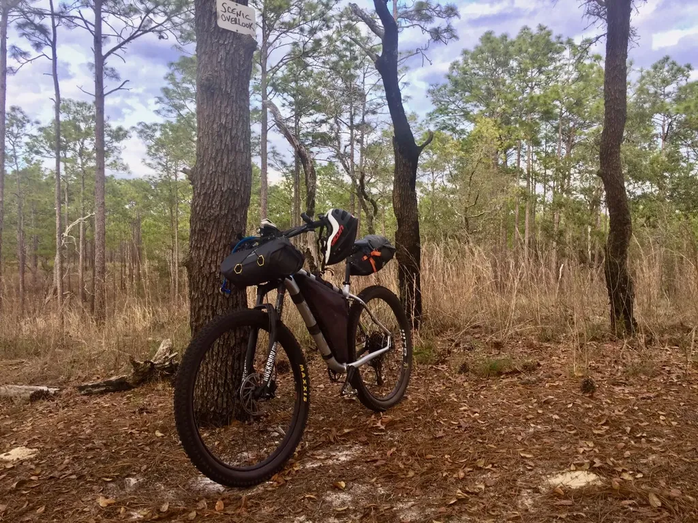
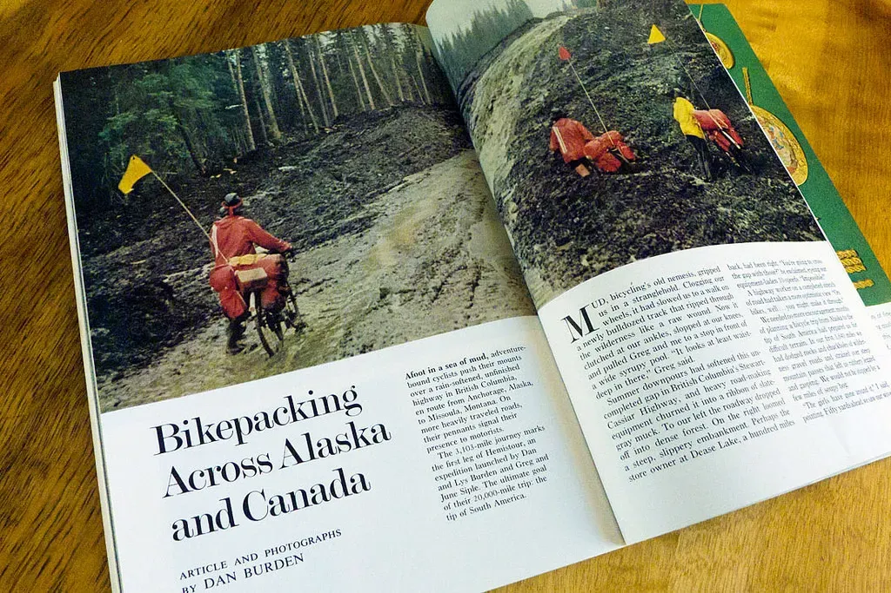
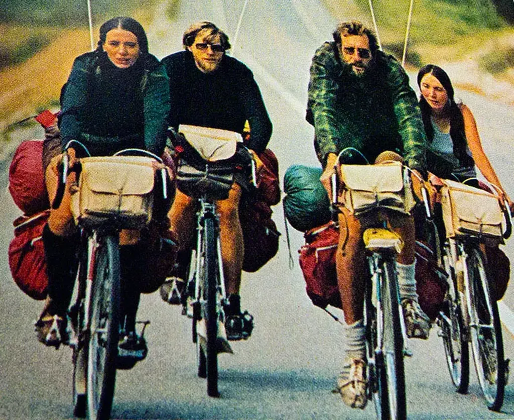
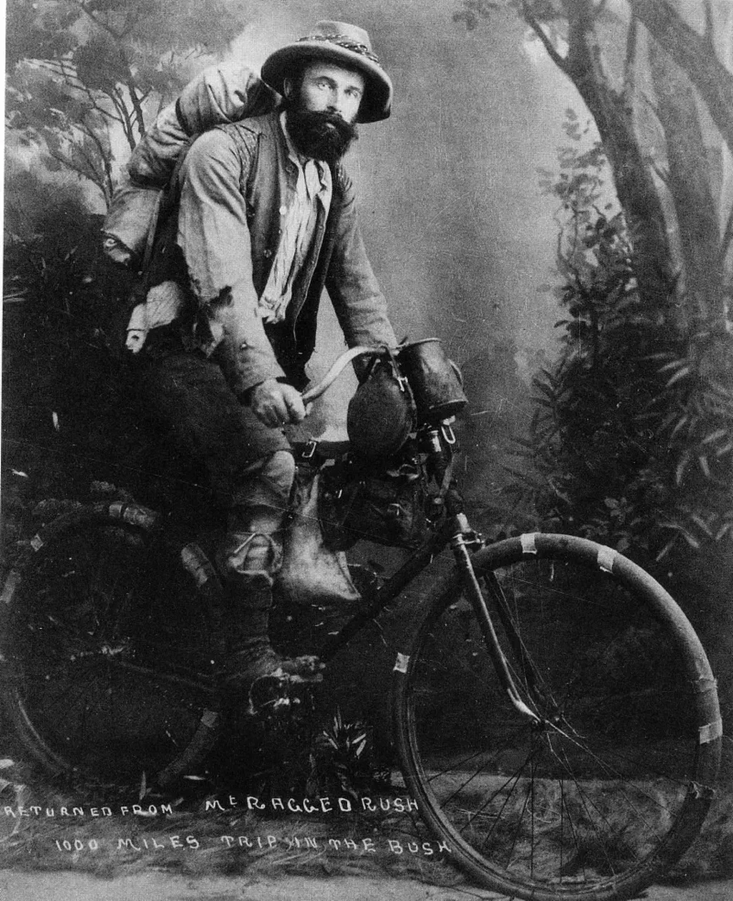
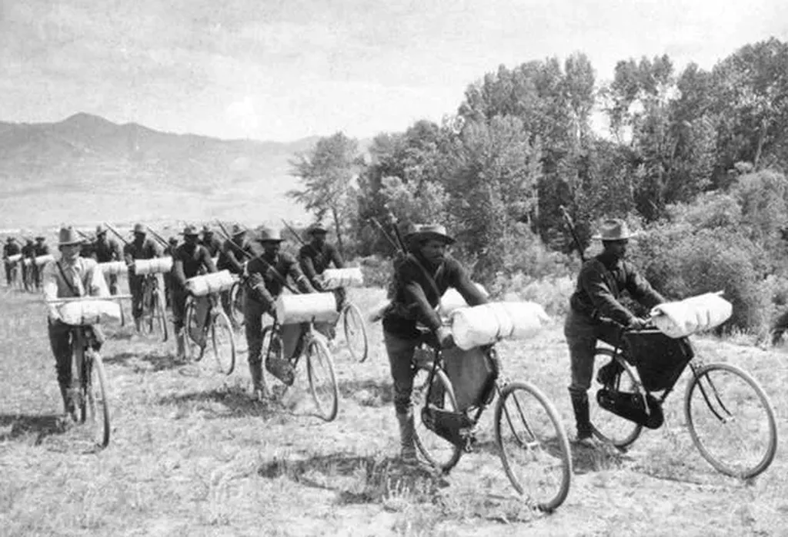
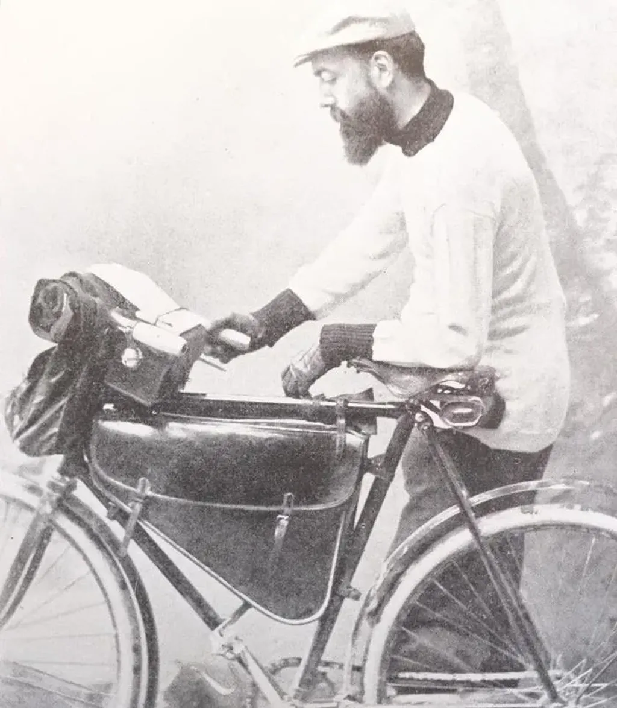
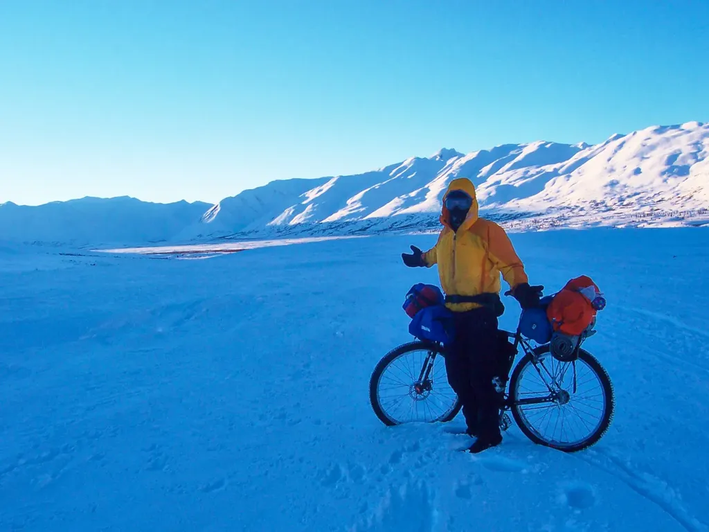
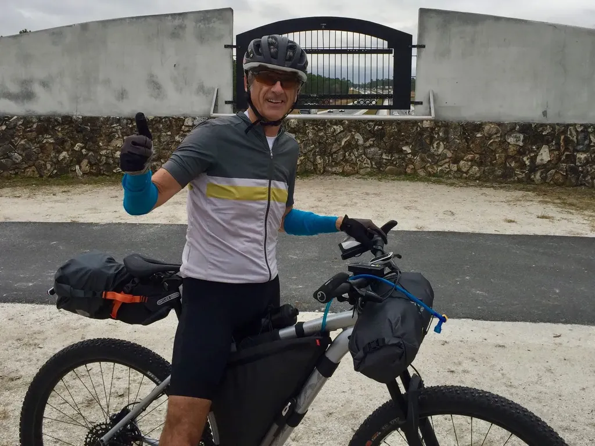

# Une brève histoire du bikepacking

Depuis quand existe le bikepacking ? Je suis si heureux de m’être converti que je me demande pourquoi j’ai tant tardé ? Je ne connaissais même pas le mot il y a quelques mois.

Dans son acceptation actuelle, le mot bikepacking, utilisé pour désigner la randonnée à vélo ultra légère, parfois appelée BUL en français (Bivouac Ultra Léger ou Bike Bivouac Ultra Léger), a été popularisé par le site [Bikepacking.net](http://www.bikepacking.net/) lors de sa création en 2008. Sur ce site, [dans un commentaire moqueur](http://www.bikepacking.net/about/), on peut lire « Nous autres, membres d’[Adventure Cycling Association](https://www.adventurecycling.org/), utilisons ce mot depuis les premières [Bikecentennial](https://en.wikipedia.org/wiki/Bikecentennial) (…) Son usage remonte au moins à mai 1973, quand l’article du cofondateur de la Bikecentennial, Dan Burden, est publié dans *National Geographic*. »

Dans cet article, *Bickepacking Across Alaska and Canada*, [Dan raconte son voyage, celui de sa femme Lys, et de leurs amis Greg et June Siple, entre Anchorage, Alaska, et Missoula, Montana.](https://simplicityvintagecycles.com/2012/10/01/cycling-in-print-iv/) Nos VTT, FatBike ou autres gravel n’ont pas encore été inventés. Dan utilise le mot bikepacking comme synonyme d’un cyclotourisme (*touring* en anglais) qui s’aventure hors route, malgré plus de 20 kg de matos. Dan écrit : « Nous sentions que le paysage nous appartenait, comme il appartenait aux premiers trappeurs et alpinistes. »

Preuve de la popularité du mot bikepacking dans la communauté des cyclotouristes américains, William Sanders publie *Backcountry Bikepacking* en 1980, où il explique l’art de parcourir de longues distances à vélo.

Avant d’aller plus loin dans l’historique, il faut s’entendre sur une définition du bikepacking ? [Bikepacking.net](http://www.bikepacking.net/about/) propose une réponse courte : « c’est du backpaking à vélo », le vélo remplaçant le dos du randonneur, et une réponse plus longue : « Une sortie avec au moins une nuit. Ça peut aller d’un raid sur des singles avec un équipement ultraléger à un long périple hors des routes asphaltées, les vélos super équipés, par exemple lors de la [Great Divide Mountain Bike Route](https://en.wikipedia.org/wiki/Great_Divide_Mountain_Bike_Route) (ouverte en 1997 par l’Adventure Cycling Association). »

La première définition est trop courte pour différencier bikepacking et cyclotourisme, la seconde, plus précise, ce serait du cyclotourisme hors route, indifféremment de l’équipement.

Sur le populaire site [Bikepacking.com](http://www.bikepacking.com/bikepacking-101/) ouvert en 2012, on peut lire : « Le bikepacking est la synthèse du VTT et du camping minimaliste. Il allie les randonnées de plusieurs jours dans la nature et le plaisir de piloter un VTT. C’est explorer des endroits peu parcourus, à la fois proches et lointains, via des singles, des chemins, des routes abandonnées, en transportant seulement le nécessaire. »

Qu’est-ce qui se passe à pied ? Avec son lourd sac à dos, le routard ou le globe-trotter peut se contenter d’aller de ville en ville, prenant le train, l’avion, faisant du stop. Par opposition, le randonneur part dans la nature, il marche, il escalade, il couche dehors, il évite les routes. Le cyclotouriste serait alors la version à vélo du routard tandis que bikepacker serait la version à vélo du randonneur.

[Tom Allen propose une belle distinction](https://tomsbiketrip.com/whats-really-the-difference-between-bikepacking-cycle-touring/) : les cyclotouristes veulent voyager, les bikepackers veulent faire du vélo. J’aime cette nuance. Certains seraient voyageurs (avant tout), d’autres cyclistes (avant tout). Je pense que nous penchons d’un côté ou d’un autre, tout en étant un peu des deux. Pour ma part, je suis un cycliste qui veut s’éclater avec son vélo, loin des voitures, découvrir de nouveaux terrains de jeu. [Le voyage est une part importante du bikepacking, mais le bikepacking ne se réduit pas à lui.](bikepacking-optimisation-electrique.md)

Je doute qu’une définition soit consensuelle. J’ai tendance à penser que le cyclotouriste reste plus lourdement équipé que le bikepacker qui fonce sur route lors d’une [Transcontinental Race](https://www.transcontinental.cc/) (légèreté indispensable pour la vitesse) ou emprunte les chemins techniques d’une [French Divide](http://www.frenchdivide.com/) (légèreté indispensable pour franchir les obstacles). On peut donc être bikepacker sur tous les terrains, avec tous les vélos. C’est la légèreté du matériel de bikepacking qui ferait les bikepackers.

Le bikepacker renonce aux sacoches qui symbolisent de cyclotourisme. Il roule souvent avec un sac de cadre, un attribut assez caractéristique, car il positionne la charge au centre de gravité du vélo pour en maintenir l’agilité. Quand apparaît le premier sac de cadre ?

Pour commencer, le cyclotourisme est aussi vieux que le vélo, même antérieur. À l’origine, [le cycliste est aussi appelé cavalier](http://velotextes.fr/spip.php?article4). Sur sa monture, il accroche des sacoches comme sur son cheval, et comme à cheval il n’a pas peur de voyager. En 1884, le journaliste anglais [Thomas Stevens](https://fr.wikipedia.org/wiki/Thomas_Stevens) s’élance de Californie pour un tour du monde avec un vélocipède. Dès 1890, les voyageurs à vélo se définissent comme cyclotouristes. Quand on regarde les photos d’archive, on découvre qu’ils étaient tous bikepakers, [tel, en 1895, cet Australien avec sac de cadre et sac à dos](http://cyclocult.tumblr.com/post/81691527040/returned-from-mt-ragged-rush-1000-miles-trip-in) ou, en 1896, le journaliste [Maurice Martin](https://fr.wikipedia.org/wiki/Maurice_Martin_(journaliste)), un des fondateurs en 1891 de la course Bordeaux-Paris, qui part en enquête avec son vélo, doté d’un magnifique sac de cadre en cuir. Cette année-là, des [unités d’infanterie à vélo](https://fr.wikipedia.org/wiki/Infanterie_cycliste) sont créées. [Les hommes du 25e régiment d’infanterie de l’armée de terre des États-Unis](https://www.upworthy.com/the-black-soldiers-who-biked-2000-miles-over-the-mountains-and-out-of-american-history) disposent aussi de sac de cadre. L’année suivante, également équipé, [Arthur Richardson se lance dans un tour d’Australie](https://historicalcycleclub.com.au/news/2018/2/18/arthur-richardson). Un peu plus tard, en 1911, [Francis Birtles](https://fr.wikipedia.org/wiki/Francis_Birtles) pédale avec un sac de cadre lors d’un périple de Perth à Sydney. Pourtant, autant que je me souvienne, chaque fois que j’ai croisé des cyclotouristes ils ne ressemblaient pas aux bikepackers des origines, [encore moins aux bergers australiens](https://veloaficionado.com/blog/australias-bicycle-riding-shearers-of-the-early-twentieth-century).

Au tournant du XXe siècle, apparaissent les premiers porte-bagages et les sacoches latérales, quand les cyclotouristes se transforment en campeurs, cherchent l’autonomie, alors que leur matériel est trop volumineux pour les configurations bikepacking de l’époque (la sacoche comme métaphore de la valise). Pendant près d’un siècle, cette configuration ne sera pas remise en cause jusqu’à ce qu’en 1986 survienne un évènement charnière dans l’histoire du cyclisme : [aux États-Unis, les ventes de VTT surpassent celles de vélos de route.](https://www.bicycling.com/rides/a20050866/a-history-of-alaskas-iditasport-bike-race/) En 1987, pour stimuler les vététistes d’Anchorage, Joe Redington les invite à effectuer un aller-retour sur l’[Iditarod](https://fr.wikipedia.org/wiki/Iditarod_Trail_Sled_Dog_Race), une course de 100 miles jusque là réservée aux chiens de traîneaux. Elle devient l’[Iditabike](https://iditasportalaska.com/). Pour mieux rouler sur la neige, les vététistes alaskiens juxtaposent deux jantes, puis en 1994, Simon Rakower commence à fabriquer des jantes de 44 mm, permettant de chausser des pneus plus larges. En 1999, toujours en Alaska, Mark Groneweld et John Evingson fabriquent les premiers fat tires, avec des pneus de 3 à 3,5 pouces. Lors des l’Iditabike et de ses variantes, comme l’[Alaska Ultra-Sport](http://www.iditarodtrailinvitational.com/) de 350 miles, certains concurrents cousent des sacs de cadre, notamment le fameux [John Stamstad](https://en.wikipedia.org/wiki/John_Stamstad), le premier vététiste à se lancer dans les ultramathons.

Pourquoi fabriquer des sacs de cadre à ce moment précis ? Tout simplement parce que [les équipements de randonnée ultra-légère](https://www.randonner-leger.org/wiki/doku.php?id=histoire_de_l_equipement_leger) deviennent de plus en plus performants, ce qui rend inutile les sacoches. Le développement du bikepacking va de pair avec celui de l’[ultralight backpacking](https://en.wikipedia.org/wiki/Ultralight_backpacking), du [thru-hiking](https://fr.wikipedia.org/wiki/Thru-hiking) et de la [MUL (marche ultra-légère)](https://fr.wikipedia.org/wiki/Marche_ultra-l%C3%A9g%C3%A8re), disciplines popularisées en 1992 par le *The PCT Hiker’s Handbook* du varappeur [Ray Jardine](https://en.wikipedia.org/wiki/Ray_Jardine), réédité en 1999 sous le titre [*Beyond Backpacking*](https://www.amazon.fr/Beyond-Backpacking-Jardines-Lightweight-Hiking/dp/0963235931), puis en 2012 par [*Wild*](https://www.amazon.fr/Wild-Cheryl-STRAYED/dp/2264062207/), le livre de [Cheryl Strayed](https://fr.wikipedia.org/wiki/Cheryl_Strayed).

On change de continent, mais on reste avec des Alaskiens. En 2001, Eric Parsons et son ami Dan Bailey traversent à VTT l’Himalaya, traînant derrière eux des remorques avec leur matos. Force est de constater que ce n’est pas une configuration idéale. Eric se souvient avoir vu des sacs de cadre sur l’Iditarod et il demande à un de ses amis, Fort Collins, de lui en coudre un en vue d’un périple de trois mois en Patagonie. En 2005, Eric effectue Alaska Ultra-Sport avec des sacs de guidon et de selle cousus par lui-même. En octobre 2007, il lance [Revelate Design](https://www.revelatedesigns.com/site/our-roots/), le premier fabricant d’équipement de bikepacking, suivi l’année suivante par [Jeff Boatman qui lance Carousel Design](http://www.highsierratopix.com/community/viewtopic.php?t=3635).

Dans le même temps, à la suite de John Stamstad en 1999, des vététistes comme [Mike Curiak](https://www.slowtwitch.com/Interview/The_Journey_of_Mike_Curiak_3311.html) ou [Matthew Lee](https://www.youtube.com/watch?v=xJqSc0lxpxk) décident de faire la course sur le tracé de la [Great Divide Mountain Bike Route](https://en.wikipedia.org/wiki/Great_Divide_Mountain_Bike_Route), ainsi naît en 2008 la [Tour Divide](https://en.wikipedia.org/wiki/Tour_Divide), une épreuve qui n’a plus guère de rapport avec cyclotourisme. En 2010, MiKe Dion rend hommage à ces vététistes de l’extrême dans son documentaire [*Ride the Divide*](https://vimeo.com/ondemand/14028), depuis source d’inspiration pour de nombreux bikepakers (je reprocherai à ce film de ne nous montrer que des routes). Qui dit vitesse implique légèreté et nouveaux matériels. De nombreuses marques apparaissent, notamment [Apidura](https://www.apidura.com) en 2013, après que sa fondatrice, Tori Fahey, ait bouclé une Tour Divide l’année précédente. [« C’est au cours de mon périple du Canada au Mexique que j’ai découvert les paniers et les porte-bagages et que j’ai décidé de ne plus jamais en utiliser. »](https://www.theguardian.com/lifeandstyle/2016/sep/02/on-the-ride-in-africa-i-realised-that-i-could-do-anything) Sa philosophie : « Simplifier le cyclotourisme pour le que les cyclistes passent plus de temps à apprécier leur balade. » En 2016, [Ortlieb](https://www.ortlieb.com/us/products/bikepacking), le leader allemand des sacoches, finit par lancer sa gamme bikepacking, [suivi par Shimano, fin 2018](https://bike.shimano.com/en-US/information/news/discover--the-new-pro-range-of-gravel-bars-and-bags.html).

On découvre dans cette histoire le lien profond entre bikepacking et VTT / fat bikes, on voit combien il est important pour la plupart des bikepackers de pouvoir passer partout, d’où le souci de légèreté. Cela dresse un portait robot du vélo idéal de bikepacking, quelque part entre le gravel et le VTT.

[Aux États-Unis, le mot bikepacking commence à être utilisé à partir de 2008-2010 et ne cesse depuis de se populariser](https://trends.google.com/trends/explore?date=all&geo=US&q=bikepacking), cette popularité étant plus marquée en Alaska et le long du tracé le la Tour Divide, ce qui est en phase avec l’histoire racontée plus haut.

En France, après quelques soubresauts en 2012-2013, peut-être parce que [Highmobilitygear.com](https://www.highmobilitygear.com/) ouvre une rubrique bikepacking et commercialise les produits Revelate Design, le mot bikepacking s’installe dans le paysage numérique et suit depuis l’évolution américaine. En avril 2019, trois régions se distinguent, Rhône-Alpes, Provence-Alpes-Côte d’Azur et Île-de-France. Nous en sommes qu’au début d’un phénomène.

[Le Bikepacking est-il une mode se demande Logan Watts dans son manifeste de 2017 ?](http://www.bikepacking.com/plog/manifesto/) L’arrivée des industriels signe-t-elle la fin du bikepacking ? Bien sûr que non, pas plus que le VTT n’a été tué par son succès. Simplement, nous devons nous attendre à être de plus en plus nombreux sur les chemins, ce qui je pense est une bonne chose pour la société en général. On y expérimente des valeurs comme la solidarité, l’amitié, la fraternité, le respect de soi, des autres et de la nature, ce qui est parfois assez rare par ailleurs. Le bikepacking fait du bien au corps et à l’esprit. Il peut aussi faire du bien au collectif, même à la planète.

Si la randonnée (rouge) et le VTT (orange) voient [leur popularité peu à peu converger](https://trends.google.com/trends/explore?date=all&geo=US&q=bikepacking,backpacking,MTB). Le bikepacking (bleu) reste un phénomène de niche. Affaire à suivre.

*PS : Il s’agit d’une esquisse d’histoire à compléter au fil des découvertes.*

#velo #y2019 #2019-4-1-18h7
