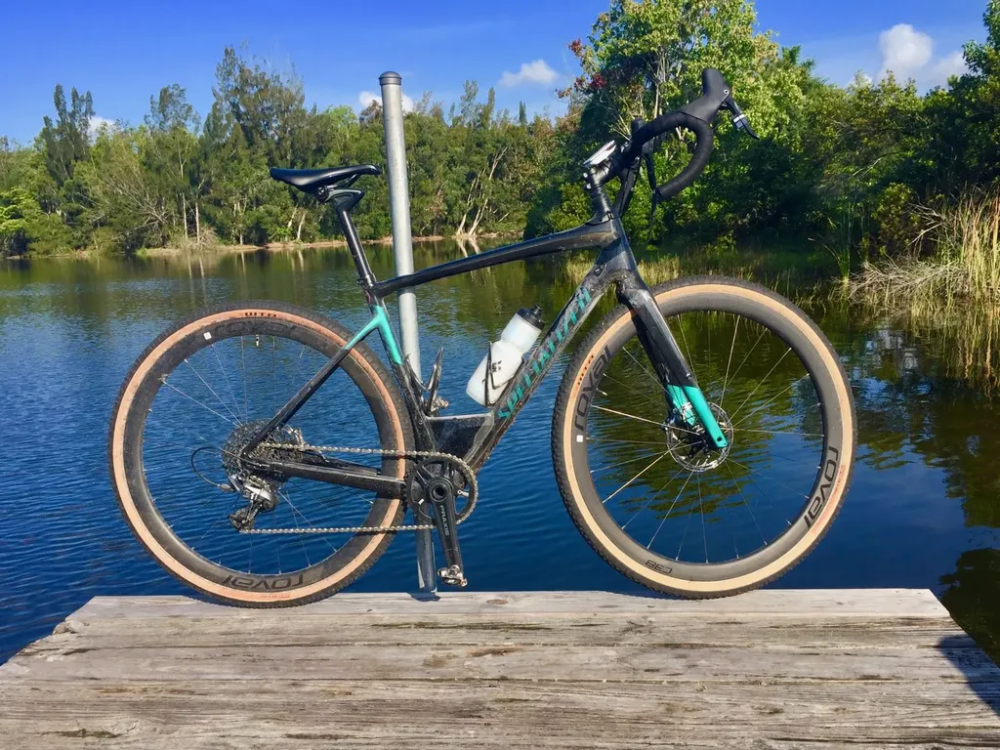
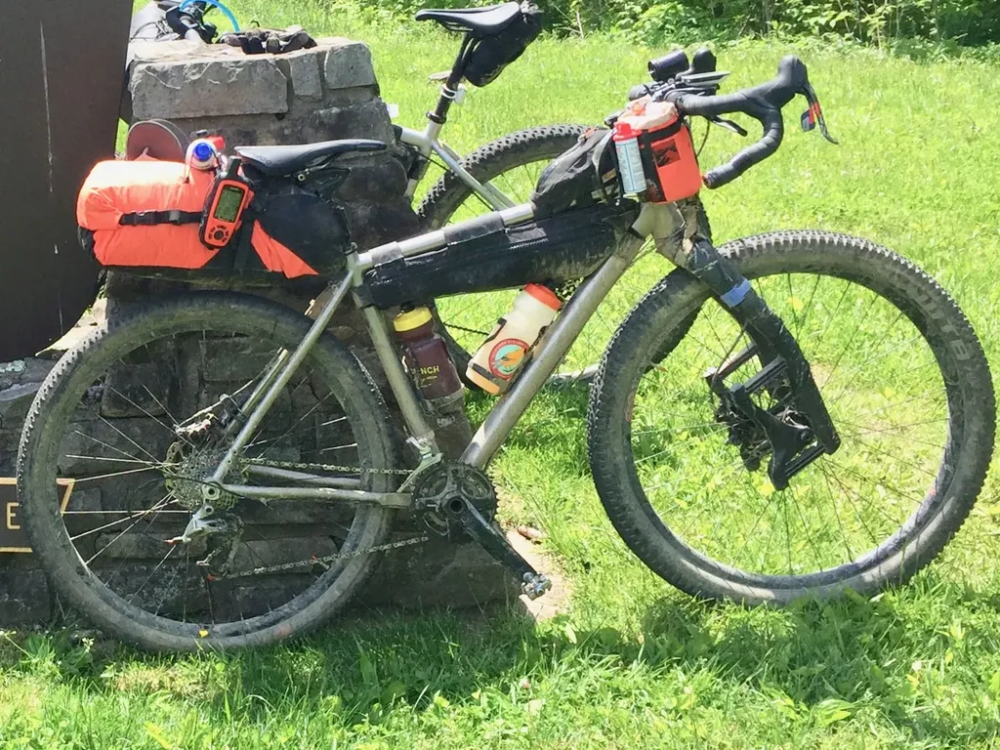
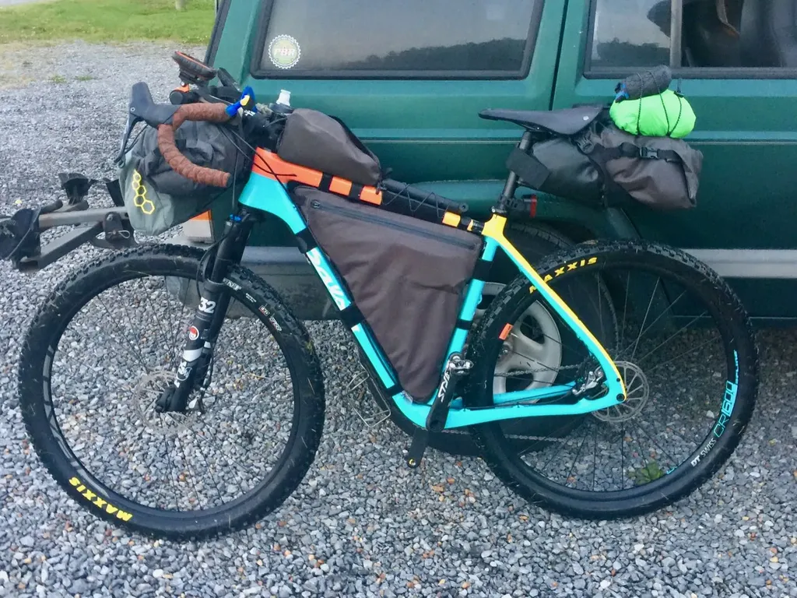

# Le gravel est une mode : la preuve

Il se passe un truc assez dingue dans le monde du vélo. Voici une anecdote. Un mec habite en montagne, il voit une belle piste qui grimpe en face de chez lui, et de l’autre côté j’imagine une belle descente cabossée, et il se demande s’il doit s’acheter un gravel, parce qu’avec son course il ne passera pas. Pourquoi il n’envisage pas un VTT ?

Une autre anecdote. [J’ai participé à un raid bikepacking dans les Smoky Mountains](../5/bikepacking-dans-les-smoky-mountains.md), du genre assez copieux avec selon la formule 500 ou 700 bornes, 10 000 ou 15 000 mètres de dénivelé. Vélo recommandé : VTT. Au départ, nous étions une trentaine. Surprise : environ 50 % des participants ont débarqué avec des gravel.

Dès la première côte humide et pierreuse, les gravel ont été à la peine. Après ils se sont refaits sur les pistes forestières, mais plus tard des singles caillouteux et techniques les ont punis. Résultat : onze abandons, onze gravel.

Le buzz autour du gravel est si puissant que beaucoup de cyclistes ont fini par se persuader qu’on pouvait passer partout en gravel (c’est en ce sens que le gravel est une mode, une sorte d’intoxication mentale). Ils ont peut-être vu [Sagan faire des sauts avec son Diverge](https://www.youtube.com/watch?v=lOiiCpzafWE) ou [Fabio Wibner descendre des pistes de folie avec une vieille pétoire](https://www.youtube.com/watch?time_continue=203&v=_2_nDekAyZY). Devant ces prouesses, ils en oublient de rationaliser, de considérer le gravel comme un intermédiaire entre vélo de route et VTT, une catégorie à part entière, à mon sens définitivement installée dans le paysage cycliste, mais en aucun cas une nouvelle panacée.

Lors de mon voyage dans les Smoky Mountains, j’ai parfois regretté de ne pas être sur mon gravel, mais souvent j’étais heureux sur mon VTT semi-rigide avec un débattement avant de 130 mm et des pneus de 2.6 pouces gonflés à 20 psi. Dans ces conditions, la pire situation dicte sa contrainte. Le VTT était le bon vélo pour cette boucle montagneuse. Pour d’autres périples, un gravel aurait était adéquat. Le vélo parfait n’existe pas.

[J’adore le gravel parce qu’il étend le domaine accessible au vélo de route](../5/un-an-de-gravel-retour-dexperience.md), mais un gravel ne sera jamais un VTT, il ne sera jamais aussi confortable qu’un VTT dès qu’on quitte l’asphalte. Sur un gravel, on reste dans une position course, même quand on relève la potence comme je le teste depuis quelques jours. Malgré mes pneus de 42 mm, je souffre dès que je roule dans l’herbe, je grimace quand je glisse sur les caillasses ou on m’y plante, je chante sur les chemins rainurés qui me vibromassent les bras et les épaules. Les gravel sont faits pour l’asphalte et les pistes plus ou moins bien damées. Quand les racines se multiplient, quand il faut sauter des branches, quand il faut descendre des marches, quand on attaque des descentes engagées ou sableuses, ça se complique. Bien sûr, tout dépend de l’aptitude du pilote, surtout de sa souplesse, mais jamais je ne passerai avec mon gravel dans bien des endroits où je file avec mon VTT.

Je trouve génial que des cyclistes fassent un pas vers la nature, mais pourquoi beaucoup oublient soudain de pondérer avantages/inconvénients des différents types de vélo ? Une question d’habitude, de position, de croyance ? Je n’en sais trop rien, mes copains étant tous [des cyclistes éclectiques](../../2018/12/le-cycliste-eclectique.md). Dans sa montagne, pourquoi le routier de la première anecdote pense gravel et pas VTT ? On lui a lavé le cerveau ou quoi ?

Dans des escalades un peu techniques, je ne suis même pas sûr qu’un gravel soit plus performant qu’un VTT. Un gravel aura toujours moins de grip. La rigidité n’est pas un critère de performance dès qu’on quitte l’asphalte. D’ailleurs, les suspensions arrière font désormais des prouesses. On grimpe plus vite avec des tout suspendus qu’avec des semi-rigides (voilà pourquoi les champions utilisent de plus en plus les tout suspendus dans les compétitions de cross-country).

J’utilise un semi-rigide pour le bikepacking sauvage parce que je le chausse de gros pneus, aussi pour avoir un risque moindre de panne, en aucune raison parce qu’il serait plus performant. Pour moi, qui quitte les routes dès que possible, le VTT semi-rigide est le vélo de voyage idéal. Jamais je ne le troquerai pour un gravel, même si sur les passages asphaltés je ne suis pas favorisé. Avec des cornes, des barres latérales ou des aéroboars, on peut même adopter une position roulante sur un VTT.

Après chacun fait ce qu’il peut. Mes choix tiennent compte de mon corps vieillissant. Un jeune fringant peut pousser un gravel bien plus loin que moi. Reste que pour le cycliste ordinaire le gravel n’est pas le vélo universel. Si chaussé de pneus de route, il est pratiquement aussi performant qu’un vélo de route, jamais il ne rivalisera avec un VTT sur les terrains accidentés, même avec des pneus 42, voire de 50 mm (je ne comprends pas les constructeurs qui commercialisent des gravel limités au 38 mm).

Quand on veut passer partout tout en maximisant son confort, on roule en VTT, un VTT qu’on adapte en fonction du terrain, changeant les pneus, parfois remplaçant la fourche avant par une [Lauf Grit](https://www.laufcycling.com/product/lauf-grit) ou même une fourche rigide, ce qui est jouable avec des pneus d’un bel embonpoint (on a inventé les fat bikes pour la neige, mais ils s’avèrent très confortables sur tous les terrains tout en étant mécaniquement très simples).

D’une certaine façon, le VTT est le vélo le plus polyvalent, le plus universel (pour commencer, il peut aller partout où va un vélo de route, même s’il y va moins vite). Un gravel vient le compléter d’autant mieux si, lui aussi, on le customise en fonction des sorties, adaptant les pneus, changeant la fourche, parfois remplaçant le guidon course par un guidon VTT qui [offre plus d’agilité et de maniabilité](https://www.youtube.com/watch?v=Q6-yz1qJrUc).

Pour mes usages, le gravel a rendu obsolète le vélo de course, trop spécialisé, trop cantonné à l’asphalte. Il conserve l’aérodynamique course, en partie la géométrie course, tout en offrant bien plus de polyvalence. J’adore mon gravel, mais j’en connais les limites. Pour aller partout, pour filer à la vitesse optimale et sans dépense d’énergie inutile, pour donner libre cours à mes rêves de dépaysement et de voyage, j’ai besoin d’un gravel et d’un VTT. Plus je fais du gravel, mieux je connais son domaine de possibilité. Les discours marketing se heurtent au principe de réalité.

Mais qu’est-ce qu’un gravel ? Au minimum, un vélo de course avec un centre de gravité bas et des pneus de plus de 30 mm. Sur mon Diverge, j’ai en prime une suspension de 20 mm dans la potence, une autre de 18 mm dans le tube de selle. Pour certains, c’est déjà une concession inacceptable alors que c’est un prérequis pour mes articulations.

Quand on monte un guidon de VTT sur un gravel, quand on lui ajoute une fourche, a-t-on pour autant un VTT ? Non, on reste toujours dans une géométrie immédiatement reconnaissable, davantage pensée pour la vitesse et l’endurance que pour les acrobaties. Mais la frontière est mince, surtout quand on prend un VTT semi-rigide et qu’on le gravelise en changeant le guidon, en montant une fourche rigide et des pneus moins imposants. Il y a presque un continuum entre ces deux catégories de vélos, continuum qui n’existait pas entre le vélo de route et le VTT, voilà peut-être pourquoi le gravel séduit les routiers (mais moins les vététistes qui souvent ont du mal à comprendre son intérêt puisque déjà ils passent partout dans le plus grand confort).

Il faut revenir au commencement. Le gravel a été pensé pour l’asphalte et les pistes innombrables qui sillonnent les États-Unis. C’est un vélo pour la [Dirty Kanza](https://dirtykanza.com/). Sur ces terrains mixtes, il est le roi incontesté (sur la terre seule, les vététistes XC tiennent les gravel sans difficulté).

*PS : [Ce billet prolonge mon bilan après un an de gravel.](../5/un-an-de-gravel-retour-dexperience.md) Je m’éclate avec mon gravel. En dix mois aux États-Unis, j’ai parcouru environ 8 000 km avec mon Diverge. J’ai écrit cet article pour dénoncer les discours marketing autour du gravel, potentiellement aveuglants.*

#gravel #velo #y2019 #2019-6-3-19h6
