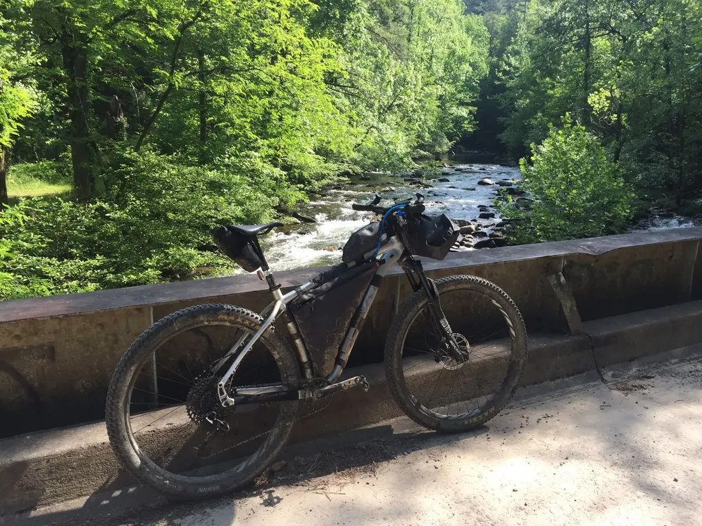

# Le gravel n’est pas le vélo de bikepacking idéal

Alors quel est ce vélo idéal ? Réponse rapide : il n’existe pas. Je pourrais m’arrêter là ou proposer une autre réponse plus utile : c’est le vélo avec lequel on se sent capable de rouler dix à quinze heures par jour, jour après jour, mais même cette réponse est insuffisante.

Avec autorité, certains affirment que le vélo de bikepacking idéal est un gravel, ou un 29er drop-bar genre Salsa Cutthroat, ou un VTT rigide genre Surly Ogre, ou un VTT semi-rigide, ou un fat bike, ou une bonne vieille randonneuse. Ils ont tous raison et tous tort.

Depuis que j’écris sur le vélo, je croise en ligne des cyclistes sûrs d’eux. Ils sont persuadés de détenir une vérité universelle, oubliant que ce qui vaut pour eux ne vaut pas pour les autres, parce que nous avons tous des attentes différentes, aussi des corps différents.

Une anecdote. Un cycliste a mal aux pieds. Un autre lui répond avec assurance « avance tes cales au maximum ». J’interviens pour qu’il argumente. Il répond c’est pour un transfert maximal de puissance. 1/ Le plaignant ne voulait pas augmenter son rendement, mais soulager ses douleurs. 2/ L’idée que plus on avance les pédales, plus on a de rendement [est fausse](../4/etude-posturale-payer-ou-non.md) (imaginez pédaler avec la pointe des pieds). 3/ Ce conseil était donc dangereux, d’autant plus dangereux qu’il était professé avec certitude.

En philosophie, on classerait ces cyclistes sûrs d’eux dans le camp des idéalistes, en gros ceux qui croient qu’il existe des éternels vrais et immuables, qu’une divinité peut révéler à quelques élus. Ces idéalistes ont donc des réponses courtes et définitives, et ils ne comprennent pas pourquoi j’écris autant pour parler de choses aussi triviales que leurs révélations. Je le fais parce que leur dieu ne m’a pas parlé, parce que je tâtonne, parce que je cherche ma voie et tente de comprendre, tout en partageant ma route. J’écris beaucoup parce que l’incertitude n’est ni définitive ni autoritaire. Mes réponses provisoires émergent par le questionnement et la rencontre.

Pour un non-idéaliste comme moi, l’idéal n’existe jamais. Nous vivons dans un monde de compromis et d’imperfections. Dès qu’on oublie ce petit détail, on fait preuve d’autorité, on ne respecte pas ses semblables. C’est notamment valable quand on discute vélo et de bikepacking.

Dans ce domaine, j’en suis à mes débuts, seulement 1 700 km parcourus, raison de plus pour en parler. J’ai participé à [trois évènements bikepacking aux US](#bikepacking) et la diversité des vélos présents était assez hallucinante, depuis des purs gravel jusqu’aux fat-bikes. Avec mon VTT semi-rigide, j’étais finalement situé au milieu de ce spectre.

Mais j’ai compris quelques trucs au passage.

1. Mon vélo idéal dépend du parcours au moins autant que de mes préférences, donc il n’est jamais tout à fait le même, à moins de choisir toujours les mêmes terrains.
2. Quand je m’engage sur une route référencée, d’autant plus dans une course, j’écoute les anciens participants. Si dans leur majorité ils conseillent un type de vélo, je m’en tiens à leur choix, ou vais vers encore plus passe-partout. Je suis très conservateur quand je m’apprête à un voyage bikepacking.
3. Je ne suis pas un spécialiste de l’endurance, je prends garde de ne pas imiter les coureurs. Par exemple, au fil des années, les concurrents s’engagent avec des vélos de plus en plus légers et agressifs sur la Tour Divide, ça ne veut pas dire que je dois faire comme eux.
4. Sur des parcours moins fréquentés, je charge la trace dans [Komoot](https://www.komoot.com/) pour obtenir quelques statistiques sur les surfaces rencontrées. Plus le ratio de singles augmente, plus je penche vers le VTT.
5. Je m’écoute. Sur un terrain donné, un cycliste de 20 ans n’aura pas le même vélo idéal que moi. En priorité, je prends en compte les conseils des cyclistes de ma catégorie.
6. Pour moi, la vitesse n’est pas une obsession, je préfère maximiser le confort. Voilà pourquoi même si j’aime mon gravel, j’ai tendance à favoriser mon VTT semi-rigide en bikepacking (je suis plus confort sur un VTT).
7. J’aime passer beaucoup de temps dans la nature, j’aime défricher des routes, j’aime les singles, je veux donc pouvoir passer partout, je sacrifie donc la vitesse au profit de la polyvalence. Si je partais en Afrique ou en Islande, je choisirais un fat-bike.
8. En bikepacking, on passe souvent beaucoup de temps loin des boutiques de cycle. J’ai besoin d’une machine simple, durable, minimaliste. Pour autant, au nom de cette simplicité, je ne roule pas avec un single speed en ferraille. Je me dis que si je casse ce sera dommage et j’arrêterai mon trip. Je ne suis pas prêt à sacrifier mon confort, notamment la légèreté, au nom de la durabilité. C’est un point que chacun doit pondérer en fonction du type de voyage envisagé.
9. En bikepacking, le vélo ne représente parfois que 50 % du poids du matos. Pour rester agile, surtout en terrains difficiles, je choisis mon matériel de camping avec autant de soin que mon vélo.
10. On peut faire du bikepacking avec tous les vélos, mais certains sont plus adaptés. Par exemple, je préfère un VTT semi-rigide à un tout suspendu parce qu’il dispose un triangle de cadre plus grand et que je peux y loger un grand sac.

Ces points ne sont que bon sens, mais j’ai jugé utile de les rappeler à cause des affirmations ostentatoires de nombreux cyclistes, qui ont tendance à faire de leur pratique une généralité valable pour tous. Ça ne poserait aucun problème s’ils s’exprimaient dans leur coin du bar du commerce, mais ils le font souvent en public, donnant des réponses erronées à des débutants qui, comme moi, cherchent encore leur voie.

#gravel #velo #y2019 #2019-6-6-16h41
