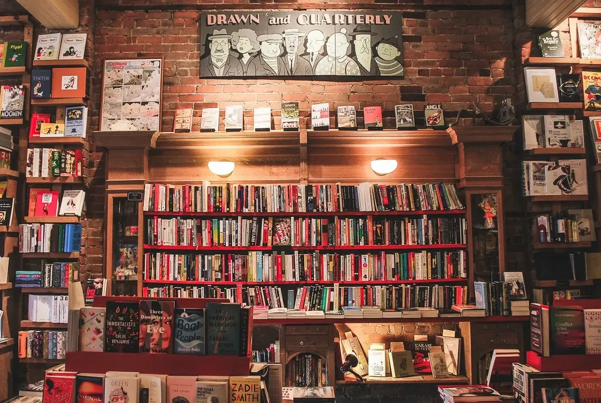

# Retomber amoureux des librairies, une nécessité

À la fin des années 1990, en pleine bulle internet, j’étais si persuadé que le livre papier était mort que j’ai participé au lancement d’une maison d’édition électronique, Olympio, qui se voulait le YouTube du livre (YouTube n’existait pas encore). Quelques millions jetés par la fenêtre plus tard, le projet a capoté, mais je restais persuadé que l’avenir était au tout numérique, au moins jusqu’à ce que j’écrive *[J’ai débranché](../../page/jai-debranche)* en 2011 et que je prenne un peu de recul.

Qu’en est-il aujourd’hui ? [Les chiffres ne cessent de confirmer un mouvement de fond](https://goodereader.com/blog/e-book-news/print-is-doing-just-fine-in-a-digital-world) : les livres papier se portent de mieux en mieux alors que les ventes d’ebooks baissent (résultats pour le marché US, celui qui était l’avant-garde de la transition numérique dans l’édition). Pourquoi cette évolution ? Peut-être parce que trop de numérique tue le numérique et que nous avons besoin d’expériences physiques, la lecture papier en étant une. Peut-être surtout parce que les librairies reprennent du poil de la bête.

Dans un monde dématérialisé, virtualisé, dominé par la recherche éperdue d’une reconnaissance frelatée, elles redeviennent des lieux de rencontre, d’échange, de découverte. Alors que les librairies en ligne ne font que la promotion des best-sellers, par un effet amplificateur de leurs algorithmes, alors que les médias ont tendance à suivre le mouvement, parce qu’ils ne peuvent pas ignorer ce qui marche, alors que les prix littéraires consacrent le marché et non la littérature, les libraires continuent de lire, d’être curieux, de proposer leurs coups de cœur, et plus ils s’engagent, mieux ils se différencient de la concurrence, et mieux ils fidélisent une clientèle elle-même fatiguée du battage médiatique et des produits normalisés. En Angleterre, les éditeurs indépendants ne cessent de voir leurs chiffres d’affaires augmenter parce que des libraires de plus en plus fringants poussent leurs livres (je n’ai pas retrouvé la source).

Dans un monde dominé par les réseaux sociaux qui entretiennent entre nous des liens factices, les librairies nous permettent de nous retrouver, de nous toucher, de nous sourire pour de vrai. C’est con, mais nous avons besoin de chaleur humaine et j’ai toujours retrouvé du réconfort auprès des libraires, même si en tant qu’auteur la quantité de livres en vente me terrifie (je me demande souvent à quoi bon en ajouter un de plus).

Les librairies sont les hubs d’un réseau social de proximité. Elles maillent le territoire, elles court-circuitent le réseau business qui s’est imposé en ligne. Elles donnent davantage de chances aux auteurs de se faire entendre que les devantures numériques. J’en ai encore une fois la preuve avec [mon dernier roman](../../page/mon-pere-ce-tueur). Les retours viennent du terrain, de quelques libraires, que le plus souvent je ne connais pas. Ils ne viennent pas du haut de la pyramide, ils ne viennent pas de Google ou Facebook où désormais il est impossible de se faire entendre sans investir des fortunes.

Pour moi, c’est terminé le rêve de l’auteur indépendant, cette possibilité de tout faire moi-même, de l’écriture à la diffusion. C’est terminé parce que le réseau ne m’aide pas, au contraire, il me noie, il me broie, parce que je n’y claque pas assez de fric, n’y suis pas assez sulfureux, n’y publie pas assez de photos compromettantes et surtout ne passe pas assez de temps à flatter ceux qui pourraient être mes acheteurs. Il impose la surenchère, l’excès, le baroque, là où j’aime le minimalisme. Il est contre l’art et pour un business irresponsable.

Que quelques auteurs réussissent en ligne ne doit pas nous illusionner. Les plateformes ont besoin de mettre en avant quelques réussites pour cacher la vérité : pour la majorité, le net nous enterre prématurément, nous poussant à dépenser une énergie folle pour arracher quelques like. Les plateformes vont jusqu’à laisser fuser des articles comme celui-là, parce qu’elles savent que s’ils provoquent le buzz, cela prouvera leur honnêteté.

Alors que nous reste-t-il à faire, à nous autres lecteurs, à nous autres auteurs ? Nous rapprocher des endroits où il y a de la lumière dans les villes ou même les villages. Retourner dans les librairies, y rencontrer les libraires, d’autres clients, d’autres auteurs. Il nous faut vivre dans le monde que nous aimons et qui nous aime, et cesser de vouloir briller dans celui qui nous vole nos données personnelles pour les monétiser.

Non, je ne vais pas débrancher une fois de plus, je ne vais pas imprimer cet article et le faire circuler sous le manteau. Je continuerai à utiliser les outils numériques, continuerai à bloguer, à discuter sur les réseaux, mais sans illusion, conscient que même ces contenus ne peuvent se propager sans un lien fort avec le terrain, là où je n’ai aucun contact, là où les libraires interconnectent entre eux les amoureux de la lecture, là où Facebook limite mon horizon et me propose de payer pour l’agrandir.

Acheter en librairie, c’est un acte politique et artistique, une réaction à la centralisation croissante du Net, à la dictature des GAFAM. C’est s’opposer à une logique quantitative au nom d’une approche humaine et qualitative. Dans cette affaire, le livre numérique n’est pas en cause, c’est le modèle du Net d’aujourd’hui qu’il faut combattre, un modèle qui après nous avoir fait croire à davantage de liberté nous en retire tous les jours.

*PS : J’ai prolongé ce billet par [une explication plus technique et moins émotionnelle…](../10/auteurs-pas-de-salut-hors-des-librairies.md)*

#edition #coup_de_gueule #y2019 #2019-9-20-10h5
