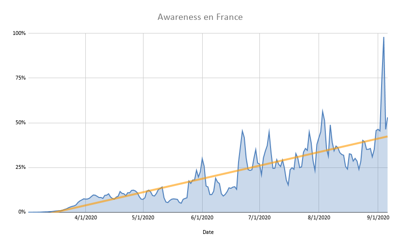
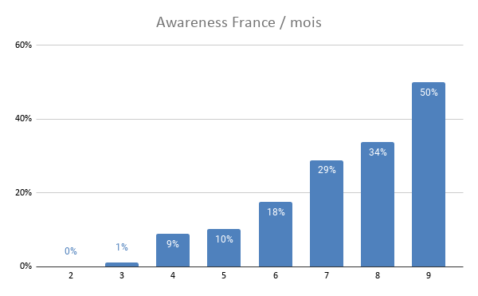
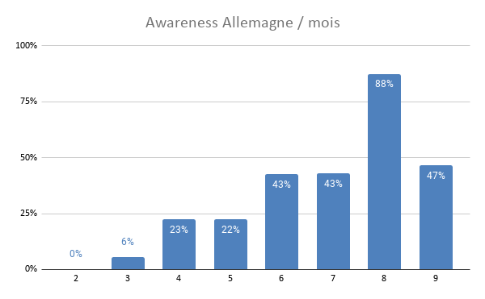
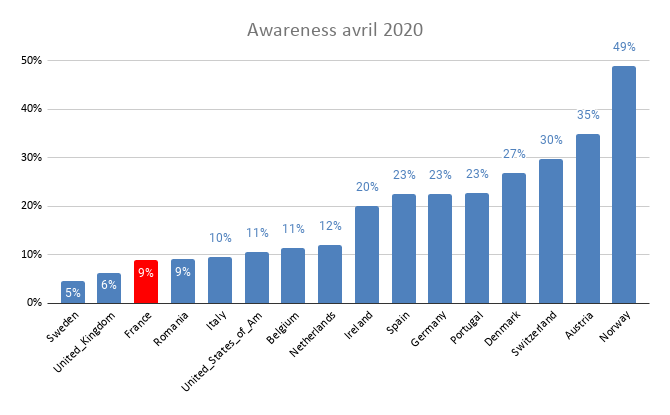
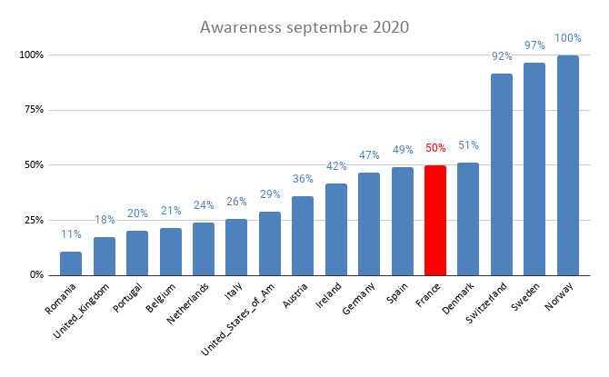
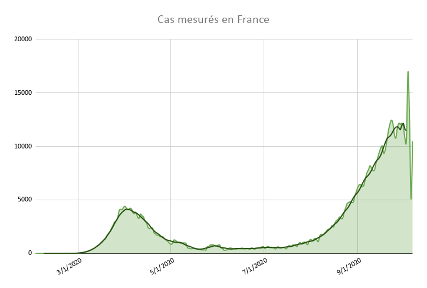
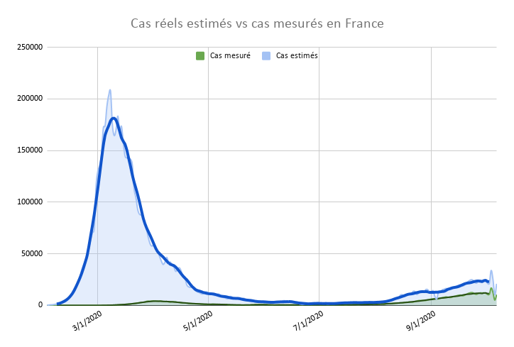

# Pas encore de seconde vague mais un rebond

Comme tout le monde, je suis fatigué par le covid, fatigué par le port du masque en société, par la fermeture des cafés, par les complications, par la crainte pour ma maman et mes amis âgés, j’en ai marre, mais aussi parce que depuis des mois je scrute cette épidémie jusqu’à l’épuisement.

Pour y voir plus clair, pour dépassionner le débat, j’en reviens toujours aux chiffres globaux. On se demande si la France fait bien, si telle ou telle mesure est justifiée. Pour répondre, je me suis concocté un indice que j’ai appelé *awareness*.

C’est quoi l’awareness, c’est à un moment donné, le niveau de conscience qu’un pays, une région, une ville… a de l’épidémie. Une façon simple d’évaluer cette conscience est de comparer le nombre de cas détectés après test et le nombre de cas réels estimés. Si on identifie tous les cas, l’awareness est à 100 %. Si on passe à côté de tous les cas, comme en début d’épidémie, l’awareness est à 0 %.

Estimer les cas réels est loin d’être simple. Pour commencer, il faut revenir à la définition du [taux de mortalité d’une maladie](https://fr.wikipedia.org/wiki/Taux_de_mortalit%C3%A9) ou IFR (infection fatality rate) qui [sert à estimer la proportion de décès parmi l’ensemble des personnes infectées](https://www.who.int/news-room/commentaries/detail/estimating-mortality-from-covid-19?fbclid=IwAR3Ay_pcnQBk4YRKSzPYsKu8svbPL4lkc9_dA2kboaMpAPaIWQPnELxrZP4) (détectées ou non). Ce pourcentage vaut pour toute personne infectée par le virus et donne sa probabilité de décéder. Il ne faut pas le confondre avec le [taux de létalité apparent](https://fr.wikipedia.org/wiki/Taux_de_l%C3%A9talit%C3%A9) ou CFR (Case fatality ratio), qui ne prend en compte dans le calcul que personnes détectées positives (et donc le CFR est toujours supérieur ou égal à l’IFR).

L’institut Pasteur a publié [une étude dans *Science* en juillet](https://science.sciencemag.org/content/369/6500/208), où on peut lire que l’IFR est compris entre 0,65 % et 0,53 % et que, au 11 mai 2020, entre 4,4 % et 5,3 % des Français on été infectés. Cette étude est en phase avec [celle menée aux HUG à Genève sur la même période](https://www.medrxiv.org/content/10.1101/2020.06.10.20127423v1) : IFR estimé de 0,64 %.

Au 11 mai, il y avait donc entre 2,9 et 3,6 millions de Français à avoir été contaminés pour 174 714 personnes testées positives, soit une awareness moyenne depuis le début de la crise comprise entre 4,9 et 5,9 %. Grâce à la formule contaminés\*IFR=morts, on obtient le nombre de victimes, entre 19 000 et 23 000 pour un IFR de 0,65 %, un chiffre proche du nombre de victimes relevé à cette date : 26 643 ([valeur elle-même devant être corrigée par les données de surmortalité](https://www.economist.com/graphic-detail/2020/07/15/tracking-covid-19-excess-deaths-across-countries)).

On peut bien sûr effectuer le calcul à l’envers, à partir du nombre de victimes, en déduire le nombre de cas qui ont conduit à elles. Au 11 octobre, nous avons 32 683 victimes, et donc environ 5 millions de personnes ayant été infectées ou l’étant encore, soit 7,5 % des Français (en utilisant toujours l’IFR de 0,65 %). Avec un IFR de 0,53 %, on aboutit à 6 millions de Français ayant été infectés, soit 9,2 % de la population. Avec une séroprévalence comprise entre 7,5 % et 9,2 % : l’immunité de groupe est encore bien lointaine.

### Comment évolue l’awareness ?

Pour répondre à cette question, il faut disposer jour par jour d’une estimation du nombre de cas réels par opposition aux cas détectés.

Après une infection, il faut en moyenne cinq jours pour tomber malade, cinq jours pour tomber gravement malade, deux à trois semaines pour éventuellement succomber. En gros, il y a en moyenne un mois entre une infection et un décès.

Une autre façon d’aboutir à cette valeur d’environ 30 jours est de mesurer le décalage entre la courbe des tests positifs, donc du moment où on a les résultats, et celle des décès. Il y a un décalage de 21 jours en moyenne. Comme une personne est positive en moyenne cinq jours après l’infection, durée à laquelle on ajoute le délai des tests, on retombe sur ce déphasage de 30 jours.

Quand une personne décède, on peut en déduire qu’un mois plus tôt elle a été infectée en même temps que beaucoup d’autres qui n’ont pas été aussi malchanceuses. Leur nombre dépend de l’IFR (un paramètre qui peut évoluer lentement dans le temps parce que nous soignons de mieux en mieux, voire que le virus évolue). Pour simplifier par la suite, je suppose que l’IFR est fixe et de 0,5 % (valeur basse de l’estimation Pasteur qui en quelque sorte tient compte des progrès dans les traitements). Dans ce cas, pour un mort un jour donné, on a 200 infections un mois plus tôt. Il devient possible de calculer a posteriori le nombre de cas réels, puis de tracer l’évolution de l’awareness de jour en jour.

Cette courbe est chaotique, mais on peut observer une tendance. La France est ainsi de plus en plus consciente au fil des mois, ce qui indique que la stratégie de test marche de mieux en mieux. Début septembre 2020, nous détections environ un cas sur deux, ce que montre mieux la représentation mois par mois.

L’Allemagne a longtemps fait beaucoup mieux que nous, mais nous faisons maintenant jeu égal, sans encore être le pays le plus performant, mais on peut noter nos progrès indéniables entre avril et septembre.

### Seconde vague ou pas ?

Ce travail sur l’awareness a une autre vertu que montrer que la France n’est pas un si mauvais élève. Si on regarde la seule évolution du nombre de cas détectés en France, on peut prendre peur, constatant que nous sommes dans une seconde vague, ce qui justifierait un retour immédiat au confinement total comme certains le réclament.

Mais il faut se garder de paniquer. Cette courbe ne fait que révéler les progrès de notre capacité de test. Elle ne nous dit pas grand-chose de l’épidémie elle-même. Pour y voir clair, il faut s’intéresser aux cas réels. Pour les estimer jusqu’à "moins un mois", on utilise l’IFR et on remonte dans le temps comme pour calculer l’awareness. Pour le dernier mois, je double les cas mesurés puisque l’awareness semble être à 50 % désormais (on détecte un cas sur deux).

En ce début octobre, la situation française n’est pas au beau fixe, mais elle n’est pas aussi alarmante qu’en mars 2020. La tendance reste préoccupante. Le 7 octobre, nous nous retrouvons au niveau du 19 février 2020, mais l’évolution depuis début août paraît linéaire, ce qui signifie que les mesures prises permettent d’éviter un emballement exponentiel sans réussir a éteindre la flambée. Il n’y a pas encore de seconde vague mais un rebond.

Que faut-il faire ? Éteindre le feu ou accepter quelques brasiers ? Après l’incendie gigantesque de Yellowstone en 1988, les forestiers ont révisé leur stratégie de prévention. Jusque là, leur politique était zéro feu. Ils éteignaient le moindre départ jusqu’à ce que l’un d’eux leur échappe et déclenche une catastrophe écologique. Ils ont depuis compris que, pour éviter les cataclysmes, il fallait accepter de petits feux à échéances régulières. Ils ont pour effet de détendre les lignes de tension dans les états critiques (j’évoque tout cela dans *[Le peuple des connecteurs](../../page/le-peuple-des-connecteurs)*). Peut-être est-ce aussi la bonne stratégie pour le covid. Accepter de vivre avec le virus, sans le laisser provoquer un embrasement général et saturer les hôpitaux, mais sans pour autant nous empêcher de vivre. Je n’aimerais pas être au gouvernement.

*PS : J’utilise [les données l’ECDC](https://www.ecdc.europa.eu/en/publications-data/download-todays-data-geographic-distribution-covid-19-cases-worldwide), la source la plus fiable identifiée et qui peut être [corrélée avec les données de surmortalité](https://www.economist.com/graphic-detail/2020/07/15/tracking-covid-19-excess-deaths-across-countries) (corrélation non effectuée dans les graphiques ci-dessus).*
[Bilan bien plus dramatique deux semaines plus tard…](des-mesures-plus-restrictives-sont-inevitables.md)

#covid #y2020 #2020-10-8-10h46
