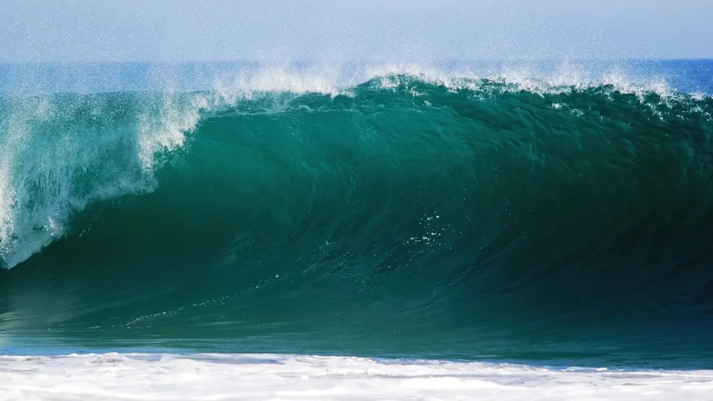
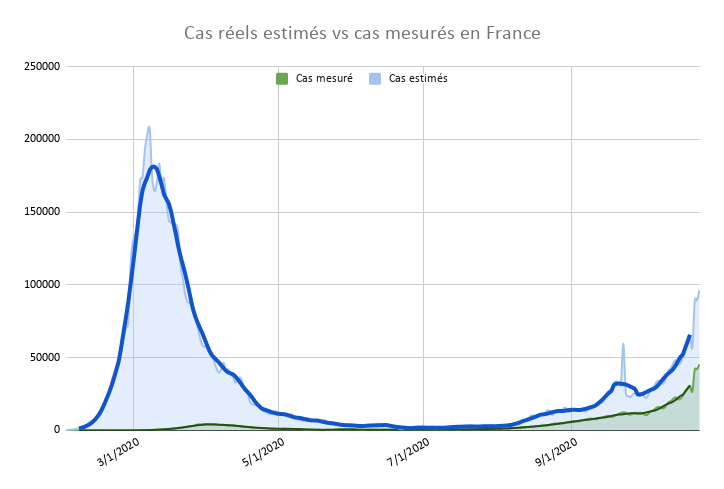
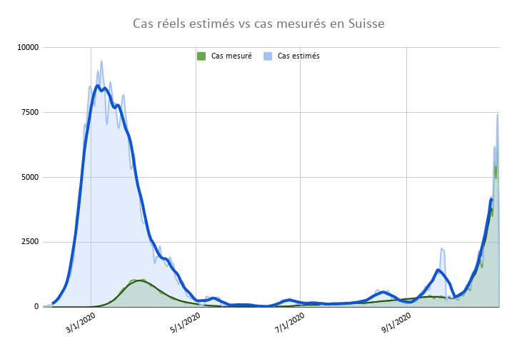
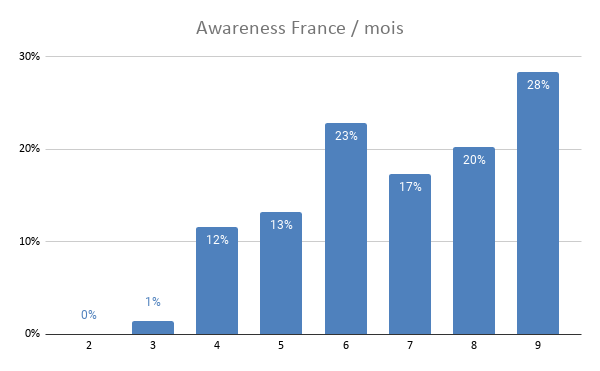
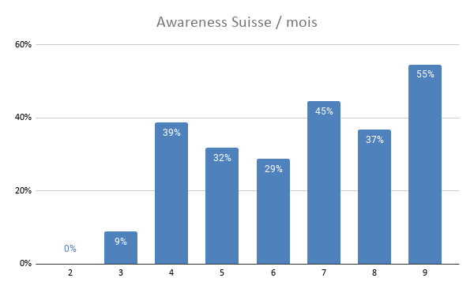
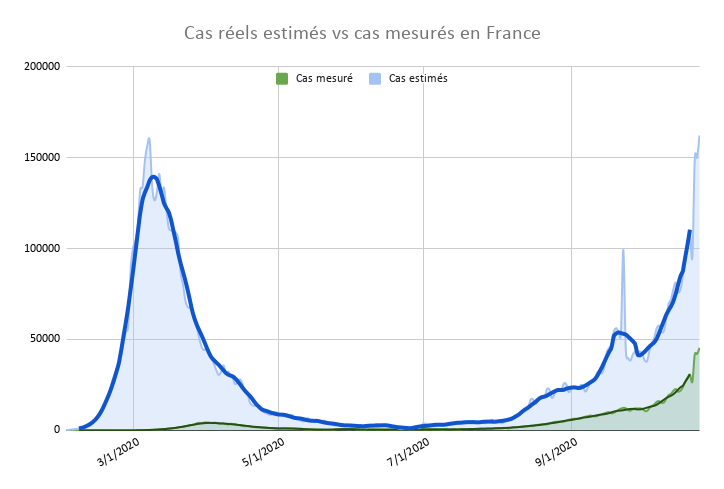
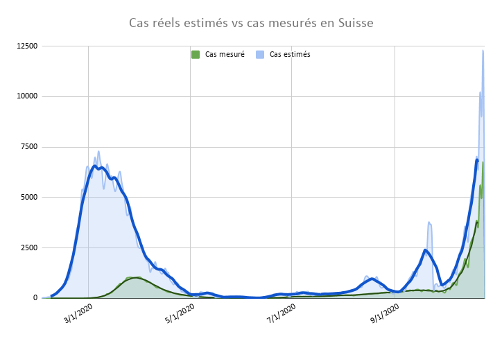
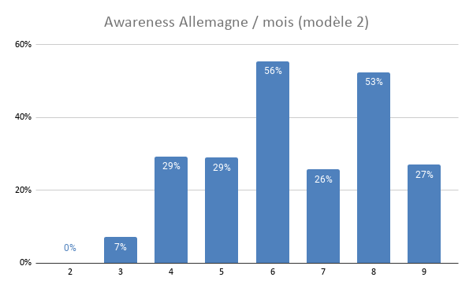
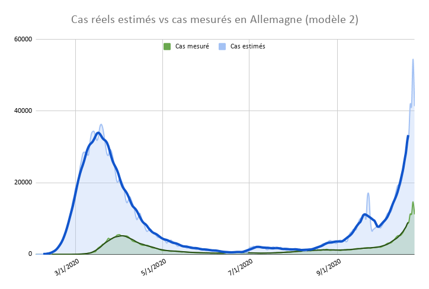

# Des mesures plus restrictives sont inévitables

Le 8 octobre, j’écrivais [« Pas de seconde vague mais un rebond »](covid-ou-en-est-vraiment-la-france.md), en un peu plus de deux semaines la situation a dramatiquement changé.

*Résumé de la méthodologie : il y a un décalage d’un mois entre une infection et un décès éventuel. Connaissant le nombre de décès un jour donné, on peut en déduire qu’il y a eu un mois plus tôt morts\*100/mortalité nouveaux cas positifs, des cas réels par opposition aux cas détectés. L’awareness est le nombre de cas mesurés/le nombre de cas réels. Si on détectait tous les cas l’awareness serait de 100 %. On peut voir comment cette awareness évolue dans le temps. Pour estimer les cas réels du dernier mois, vu qu’on ne connaît pas les décès du mois suivant, on peut utiliser l’awareness pour les extrapoler à partir des cas mesurés. Si l’awareness est de 50 %, cela revient à multiplier par deux les cas détectés. Attention : il s’agit d’un modèle et il a pour seule vertu de décrire rétrospectivement le passé pour mieux juger du présent.*

Si je reprends les mêmes graphiques avec les nouvelles données accumulées et selon la même méthodologie, on constate que nous sommes entrés dans une phase de croissance exponentielle à l’inflexion est évidente. En Suisse, c’est même plus manifeste, la seconde vague crève désormais les yeux.

Mon modèle d’estimation des cas réels reposait sur un taux de mortalité constant de 0,5 %. J’ai tenté de perfectionner ce modèle : [utiliser le taux de mortalité de 0,65 % constaté jusqu’en juin par plusieurs études](covid-ou-en-est-vraiment-la-france.md), puis à partir de juillet appliquer un taux de mortalité plus faible de 0,3 %. Je n’ai pas de source pour cette dernière valeur, mais seulement les déclarations de certains médecins. Avec ces hypothèses, les graphiques sont plus effrayants. Tout d’avord on constate qu’en France l’Awaraness n’a pas autant progressé qu’espéré, plafonnant à 28 % en septembre (on détecte environ un positif sur quatre). En Suisse, on est un peu mieux, détectant environ un positif sur deux.

On peut alors visionner l’évolution des cas réels avec ces paramètres et le portrait n’est pas bon du tout. En France nous sommes au milieu de la vague, alors que la Suisse est frappée par un tsunami.

Dans ces conditions, à moins d’une inflexion brutale d’ici quelques jours, les gouvernements n’auront pas d’autres choix que de nous imposer des restrictions de mouvement beaucoup plus sévères, sinon nos services d’urgence ne tiendront pas le choc (en espérant que ces mesures soient intelligentes et pas infantilisantes).

Mais si nous sommes en phase exponentielle, chaque jour perdu aura des conséquences dramatiques, et prolongera d’autant la situation de crise. Comme nous l’expliquons dans *[Vaincre les épidémies](../../page/vaincre-les-epidemies)*, plus le confinement a été décidé tôt, moins la crise a durée (et moins le PIB a été impacté).

Il est toujours intéressant de regardé ce qui se passe en Allemagne, toujours cité en exemple. La situation est semblable. La seconde vague n’épargne aucun pays et pour beaucoup sera plus forte que la première.

#covid #y2020 #2020-10-25-22h27
