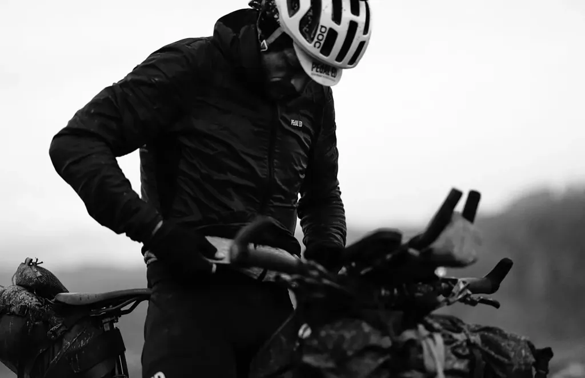
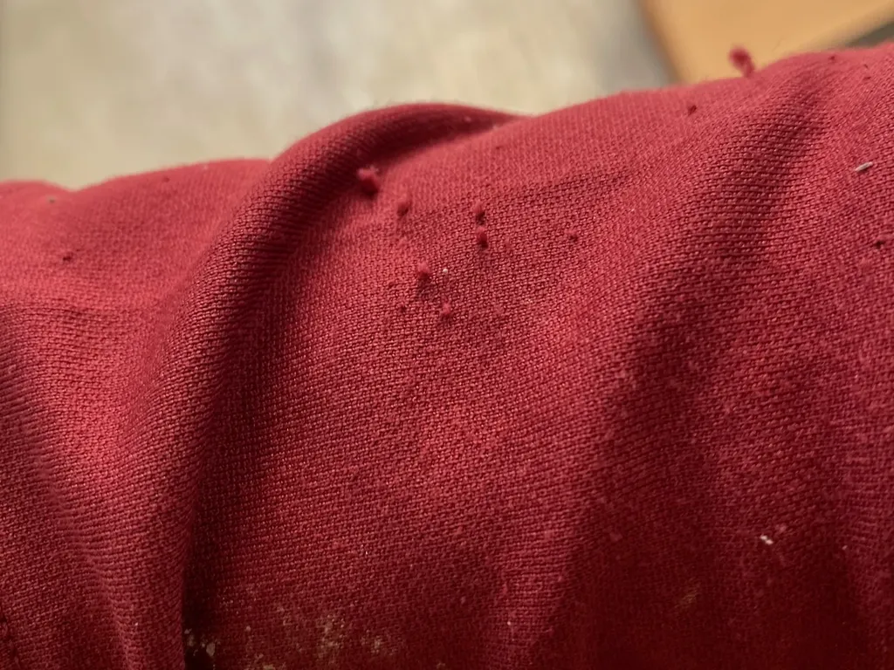
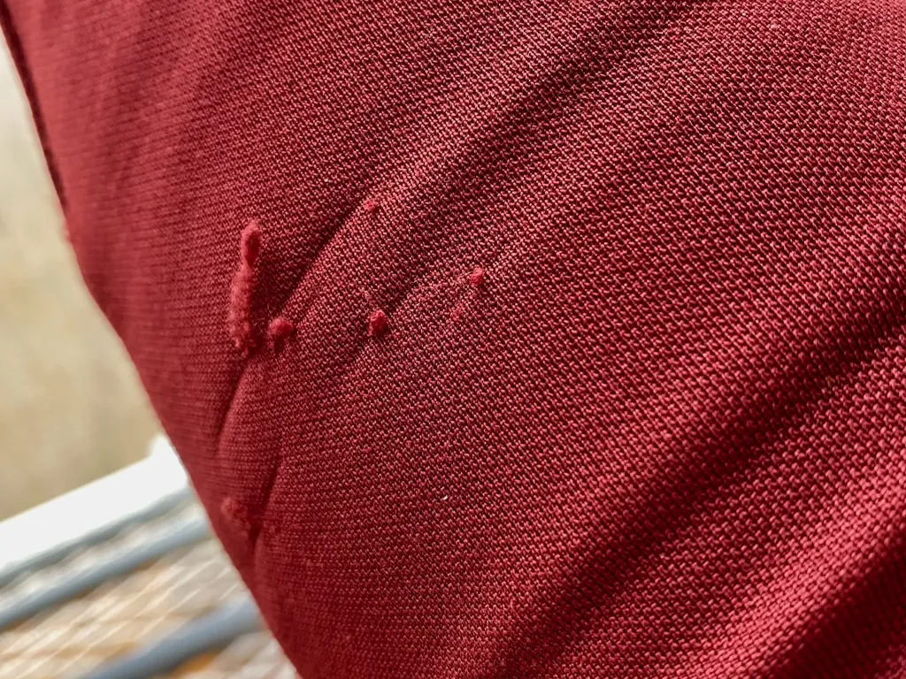

# PEdALED se paye ma tête

Dans le monde des baroudeurs, la boîte japonaise de fringues pour cyclistes fabriquées en Italie a très bonne réputation, notamment parce qu’[elle sponsorise des évènements comme l’Atlas Moutain Race](https://pedaled.com/fr_fr/atlas-mountain-race/). Naïvement, je me suis dit qu’elle proposait des fringues confortables, légères, résistantes…

Comme un copain m’a depuis longtemps vanté [son maillot PEdALED mérinos manche courte](https://pedaled.com/fr_fr/homme-maillot-velo-atlas-boue#gref), j’ai fini par craquer pour un modèle manches longues en amont de mon [grand tour de l’Hérault](../../page/gth) (GTH). J’ai choisi [le modèle Essentiel](https://pedaled.com/fr_fr/homme-maillot-de-velo-merinos-manches-longues-bleu-sarcelle-essential#gref). Il est arrivé dans un emballage luxueux.

Je l’ai mis à l’épreuve fin septembre lors de la GTH, par un temps changeant, passant du glacial au chaud. Il s’est avéré superbement confortable, encaissant parfaitement les brusques variations de température, exactement ce que je cherche pour mes sorties, surtout en bikepacking, mais j’ai vite déchanté.

Il a suffi que mes bras effleurent les branches des chênes verts de la garrigue pour que dès le premier jour elles commencent à s’effilocher. Après deux jours, mon maillot PEdALED paraissait plus élimé que vénérables Ekoy, et même que [mes maillots mérinos manches courtes OrNot](https://www.ornotbike.com/products/merino-hybrid-jersey) que j’ai bien du mal à quitter, tant ils sont confortables et indestructibles.

Mais encore impressionné par le confort du PEdALED Essentiel, j’ai commandé une [veste thermique coupe-vent Tokaido](https://pedaled.com/fr_fr/men-alpha-cyling-jacket-coral-red-tokaido), une magnifique prouesse technologique. Une veste pour les durs comme l’illustre la photo sur le site PEdALED et reproduite en ouverture de ce texte.

Je ne l’ai reçue qu’en rentrant [d’une longue sortie VTT](mini-aventure-teleportation-dans-laude-par-le-train.md) où j’avais remis mon maillot Essentiel. Cette fois, je n’ai pas croisé des chênes verts, mais des graines des gaillets gratteron qui se sont accrochées à mes manches. Quand je les ai décollées, des fils de laine sont venus avec.

En déballant la Tokaido Medium, trop petit pour moi mais c’est un détail, j’ai constaté tout de suite que la moindre égratignure suffirait à la déchirer. Ça m’a énervé, parce que c’est comme partout ailleurs, tout étant bon pour prendre le consommateur pour un couillon, même dans notre petite niche. PEdALED communique sur le côté baroude, suffit de regarder son site, mais nous commercialise des fringues pour la route, car même en gravel nous croisons des branches, pas besoin de faire du VTT engagé, suffit d’un beau petit single étroit, surtout dans nos garrigues griffues. PEdALED propose des fringues pour des cyclistes qui se tiennent à distance de la nature. C’est une marque pour le vélo d’appartement qui passe son temps à nous mentir.

Je vais continuer de porter mon Essentiel, mais je ne sais même pas s’il passera l’hiver. Vous voilà avertis. Ma veste Tokaido est repartie en Italie, sans que j’ose en demander une large, de peur de la déchirer et de jeter 220 € par la fenêtre. Quand j’ai l’impression de me faire entuber, je le dis. Ça peut servir à d’autres et aider la marque à corriger le tir.

PS : [la réponse de PEdALED…](le-foutage-de-gueule-de-pedaled-leur-reponse.md)

#velo #y2020 #2020-10-8-13h35
