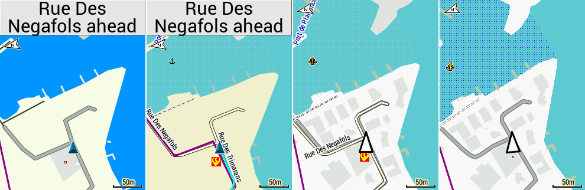

# Pourquoi j’ai racheté un GPS Garmin

Le GPS a révolutionné ma façon de faire du vélo. Il m’a permis de me réapproprier mon territoire, en l’explorant dans ses recoins et sur une étendue bien plus grande que par le passé tout en suivant les traces ouvertes par d’autres, parfois dans des régions inconnues, comme les [Appalaches](../../2019/5/bikepacking-dans-les-smoky-mountains.md) ou [l’Aubrac](../8/bikepacking-brulant-dans-laubrac.md). Pédaler avec un GPS, c’est désormais comme lire des romans, avec le plaisir de la découverte à chaque détour.

Je ne conçois plus de faire du vélo sans GPS, à minima il me permet de partager les traces de mes sorties, aussi de les archiver pour pouvoir les étudier et mieux mémoriser les nouveaux passages découverts, ou réfléchir à de nouveaux itinéraires. Je suis devenu un explorateur, le GPS étant mon cartographe personnel. Grâce à lui, je ne croise plus des routes que par exception, alors qu’avant la gravité du réseau asphalté m’attirait vers les grands axes et le vélo ne me procurait pas autant de plaisir. [Je ne vais pas refaire l’éloge du GPS.](../../2019/3/eloge-du-gps.md)

Aussi j’ai commencé à tiquer quand j’ai vu l’autonomie de mon Garmin 820 fondre, ne dépassant plus les 7 heures, ou quand il lui devenait plus difficile de me guider, avec toujours quelques secondes de retard, si bien que de plus en plus souvent j’étais incapable d’anticiper les bifurcations.

J’ai manqué le vendre au printemps, puis j’ai renoncé, fatigué de sans cesse claquer une petite fortune pour éponger mes désirs de cycliste. Durant [le Tour de l’Hérault](../../page/gth), mon 820 a craché deux journées, tout en m’obligeant à rouler presque en continu branché sur la batterie de secours. J’ai alors décidé de changer la batterie interne, opération au combien délicate, malgré tout réussie.

Lors de la première sortie, je me suis dit que j’étais reparti pour deux ans de tranquillité. Sauf qu’au bout de 2 heures, la nouvelle batterie chinoise, achetée 6 €, a rendu l’âme. Qu’à cela ne tienne, j’ai commandé une batterie chez un autre fournisseur, 16 €, mais cette fois j’ai pété les nappes de l’écran au moment de le reconnecter (j’avais déjà pété les nappes d’un iPad en changeant un écran). C’est sûr, je ne recommencerais plus cette opération qui garantit la crise de nerfs. Et pas question [d’acheter un nouvel écran](https://fr.aliexpress.com/w/wholesale-garmin-820-screen-replace.html) et de tenter une nouvelle fois la réparation.

Mon 820 était bon pour la poubelle et il me fallait un autre GPS. Je m’étais préparé à cette éventualité. La vraie question : pourquoi acheter un GPS quand mon téléphone possède un meilleur écran, plus grand, plus contrasté, tout en disposant d’un GPS presque aussi précis ?

Durant l’été, j’ai pensé utiliser un support pour mobile [Quad Lock](https://www.quadlockcase.com/) jusqu’au moment où j’ai découvert que les stabilisateurs des objectifs des iPhone de dernière génération ne supportaient pas longtemps les vibrations transmises sans ménagement. Trop de témoignages négatifs encombraient les forums pour que je prenne moi-même ce risque.

Il me fallait donc un nouveau GPS. Mon cahier des charges était assez simple.

* Le GPS ne doit pas me coûter un bras.
* Il doit être le plus léger possible.
* Il doit avoir la meilleure autonomie possible.
* Il doit me permettre de suivre une trace sur un fond cartographique (ce qui écarte les modèles d’entrée de gamme).
* Le tactile n’est pas indispensable, car souvent difficile à utiliser avec les gants et finalement peu utile lors des sorties.
* Je n’ai pas besoin d’un GPS couteau suisse car j’ai mon téléphone avec moi, parfait pour toutes les opérations cartographiques compliquées.

Des copains roulent avec des [Wahoo Elemnt Roam](https://fr-eu.wahoofitness.com/devices/bike-computers), dont ils vantent la qualité de l’interface et de l’écran de 2,7 pouces. J’ai hésité, [mais le Garmin 530 l’a emporté](https://www.alltricks.fr/surl/comparatif-compteur-gps-velo). Avec son écran à peine plus petit de 2,6 pouces, il est moins lourd (75 g contre 93), plus autonome (20 heures contre 17), moins cher de 100 €. Comme la taille du 820 ne m’a jamais posé problème, je n’ai pas considéré plus avant le Wahoo, d’autant que je dispose déjà de supports Garmin sur tous mes vélos (et que ceux de Wahoo coûtent 20 € et qu’il m’en faudrait deux en plus). En prime, je dispose de pas mal de cartes Garmin et on en trouve en Open Source (peut-être qu’il existe désormais le même écosystème pour les Wahoo mais je n’en suis pas sûr).

J’ai aussi écarté les Garmin de la gamme Etrex (voir note en fin d’article). J’aurais pu craquer pour le Wahoo Elemnt Bolt, un peu moins cher, plus léger 63 g, une interface plus simple, un écran noir et blanc plus lisible bien que plus petit avec ses 2,2 pouces. C’est son autonomie de 15 heures qui m’a fait lui préférer le 530 (c’est rare que je roule plus de 15 heures durant une seule journée, mais en bikepacking moins je recours à la batterie extérieure, mieux c’est). Il y a aussi le [Karoo 2](https://www.hammerhead.io/pages/karoo2), avec son écran de 3,2 pouces, mais pas disponible, ça règle le problème et beaucoup plus cher, avec seulement 15 heures d’autonomie et un poids conséquent de 130 g. Quand au [TwoNav Trail 2 Nav](https://www.twonav.com/fr/gps/trail-2-bike), il est bien trop lourd avec ses 220 g, en plus d’être hors de prix.

Mon GPS ne me sert qu’à suivre la trace et à l’enregistrer. Dès que je veux me repérer, chercher un passage alternatif, me dépatouiller d’une situation inextricable, je le fais avec mon téléphone bourré de cartes topo, notamment IGN. C’est mon GPS haut de gamme de secours, et je n’ai pas besoin d’un GPS haut de gamme sur mon cintre.

Je viens donc de déballer mon nouveau Garmin Edge 530, un peu plus grand que l’ancien, mais moins épais, avec un écran aussi un peu plus grand. Le port USB a été placé en façade, heureusement, car au-dessous du boîtier c’était compliqué quand je devais brancher la batterie de secours, le sac de guidon venant cogner le câble. Un petit détail, mais qui me simplifiera la vie en voyage.

### Mise en route

Les GPS Garmin n’ont jamais été des plus intuitifs. Leur ergonomie est même catastrophique. Pourquoi tous les réglages ne s’effectuent-ils pas depuis le téléphone puisqu’il est jumelé au GPS ? Je ne cherche pas à comprendre. Une fois mon GPS réglé, je n’aurais presque plus jamais à y toucher (sauf s’il plante, ce qui n’était pas rare avec le 820).

Lors de mon premier test, je charge la trace du Grand Tour de l’Hérault (10 000 points). Il faut pas moins de 10 minutes pour que le 530 effectue des calculs de routage dont je n’ai pas besoin. Mais qu’est-ce qu’il fiche ?

La carte s’affiche enfin, un véritable sapin de Noël illisible, la trace invisible se confond avec la route qu’elle suit devant chez moi. À cet instant, je me vois déjà renvoyer le 530. Si je n’avais pas une longue expérience avec le 820, c’est ce que j’aurais fait. Je comprends mieux pourquoi Wahou a de plus en plus de succès. Mais j’insiste.

Je passe des plombes à désactiver des options pour moi inutiles jusqu’à ce que le 530 arrête de se vouloir plus intelligent qu’il ne l’est. Non, je ne suis pas un automobiliste. Si j’ai une trace, ce n’est pas pour que tu m’amènes ailleurs ou me dises qu’elle ne te convient pas.

Il m’aura fallu une dizaine d’heures de bricolage, puis trois mois d’essais et d’erreurs, avant de trouver ma configuration idéale, mais au final le 530 fait ce pour quoi je l’ai acheté. Si vous n’êtes pas un peu geek, ce GPS n’est pas pour vous.

### Les Cartes

La carte Garmin étant précise mais un peu kitsch, je dois en choisir une autre. J’ai ma petite idée, mais j’effectue quelques tests sur mon ordinateur avec [BaseCamp](https://www.garmin.com/fr-FR/software/basecamp/) (en fait, je copie les cartes sur le GPS ou un disque virtuel simulant un GPS Garmin pour que BaseCamp les reconnaisse).

La carte IGN de la France est beaucoup trop détaillée pour un minuscule écran de GPS (image 2). Elle est mieux au chaud sur mon téléphone. La carte [Openfietsmap Lite](http://garmin.openstreetmap.nl/) reste trop colorée (image 3). Je lui préfère [la version *new style*](http://garmin.openstreetmap.nl/), à la frontière du monochrome (image 4). Reste à voir le rendu sur le 530.

En bord d’étang, la carte Garmin passe, mais parfois elle mange la trace (capture 1). J’aime moins les versions Lite de l’OSM (capture 1 et 2), mais la version new style est plus agréable (capture 4), c’est elle qui met le mieux en évidence la trace, tout en montrant les chemins qui se présentent, ce qui permet souvent d’éviter des erreurs. C’est sans doute une question de goût, et d’usage, j’en conviens. Mais pour aboutir à un tel rendu, j’ai pas mal transpiré.

### Mes bricolages

Je liste mes réglages, au cas où un plantage me forcerait à tout reconfigurer. Ça peut aussi vous aider et j’ai peur d’oublier.

1. Menu > Navigation > Courses > Course Options, je désactive Off Course Warnings, car cette option demande le recalcul de l’itinéraire même quand ce mode est désactivé, ce qui entraîne l’affichage de messages d’erreur à répétition, surtout si le fond de carte utilisé n’est pas routable. Je désactive aussi Turn Guidance car toutes fonctions inutiles multiplie le risques de plantage.
2. Menu > Settings > System > Display, j’active le contraste automatique. Malgrè tout, la trace reste parfois difficile à identifier quand il y a du soleil et que je porte des lunettes polarisantes. Il faudrait qu’elle soit plus épaisse et d’une couleur qui tranche avec celle de la carte. L’idéal serait un fond de carte en légers niveaux de gris. Dans le même menu, je règle le Color Mode en auto pour que l’affichage s’ajuste quand la nuit tombe.
3. Menu > Settings > System > Tones, je désactive les bips qui me casse les oreilles en cas de bugs, genre je suis hors parcours.
4. Menu > Settings > Safety & Tracking, je désactive GroupTrac (je ne fais pas la course avec mes copains, on s’attend en haut des côtes).
5. Menu > Settings > Connetected Features, je conserve le jumelage avec mon téléphone, mais désactive le Wifi (pas très utile quand on roule). Je n’active pas le Battery Safe Mode, car alors il devient impossible de suivre une trace puisque l’écran s’éteint.

Rien de nouveau pour moi, à ce stade. Sur le 530, on dispose de plusieurs profils en fonction du type d’activité (route, vtt, touring…). Pour le moment, j’ai créé un profil NOTRACE, qui reprend les réglages par défaut de Garmin pour le VTT, et un profil TRACE que je dédie au suivi de traces, donc en virant tout ce dont je n’ai pas besoin. J’entre dans les réglages avec Menu > Settings > Activity Profiles, je choisis mon profil et commence le paramétrage.

1. Je désactive les systèmes de positionnement Glonass ou Galileo, pour ne pas sécher trop vite la batterie (si je suis perdu, j’utilise mon téléphone).
2. Comme en bikepacking il m’arrive parfois d’oublier de démarrer l’enregistrement, je fixe le Timer Start Mode en automatique.
3. Garmin a inventé un truc génial dont je n’ai rien à faire : le virtual partner. Ils n’ont rien trouvé de mieux que me faire précéder sur la trace d’un partenaire virtuel représenté par une dérangeante flèche verte, sans qu’aucune option évidente ne permette de désactiver cette fonction. J’ai fini par trouver une astuce en discutant avec d’autres utilisateurs du 530. Dans Data Screens, j’ajoute l’écran Virtual Partner, dont je n’ai pas besoin, mais jute pour entrer dans ses options et fixer la vitesse du partenaire à 0 km/h, ainsi ce bougre reste planté au départ de la trace et n’est pas sans cesse représenté sur mon écran non loin de moi. Je choisis également de ne pas afficher écran.
4. Dans Navigation, je désactive Sharp Bend et règle Navigation Prompts à Text Only.
5. Dans Navigation > Map, je désactive Auto Zoom, Guide Text et Draw Contours (le tracé des lignes de niveau si j’ai bien compris). Je règle Map Visibility à Hight Contrast (sinon l’affichage est illisible). Dans Map Information, je désélectionne les cartes Garmin au profit de [la carte OSM minimaliste avec le moins de chichi possible qui correspond à mon terrain de jeu](http://garmin.openstreetmap.nl/). Plus légère, elle accélère les calculs.
6. Dans Navigation > Routing, je fixe le Routing Mode à VTT, puis je désactive le recalcul du parcours quand je quitte la trace, une fonction insupportable qui ne peut être désactivée que si on choisit certains modes de routage (j’ai mis longtemps à découvrir l’astuce).
7. En général je transfère mes traces depuis BaseCamp, mais j’installe le plugin Komoot pour pouvoir récupérer mes traces au cas où, par exemple si la trace envoyée par BaseCamp crashe le 530, ce qui m’est arrivé une fois ([j’ai écrit un billet pour éviter ce problème](../../2021/10/quand-la-trace-perd-des-points-sur-les-gps-garmin.md))
8. Je désactive l’option ClimbPro, parce que je me moque de savoir que j’attaque une côte, mes jambes le sentent tout de suite. En plus, cette option affiche des messages intempestifs, qui masque la moitié de l’écran, ce qui rend compliqué le suivi de la trace.
9. Dans Setting, Auto Features, je règle Auto Pause à 2 km/h, sinon le GPS n’enregistre pas les poussages à VTT.

### Note sur les Garmin Etrex

On m’a demandé pourquoi j’avais écarté les [Garmin de la gamme Etrex](https://buy.garmin.com/fr-FR/FR/p/518046), plus précisément l’Etrex 20x (50 € de moins qu’un 530). Ce GPS pour randonneurs plus que pour cyclistes dispose d’un système de fixation vélo moins pratique que celui des Edge. Il était beaucoup utilisé par les bikepackers aux US quand j’y étais, souvent plébiscité parce qu’il est vendu avec une carte topographique de type IGN, carte qui comme je l’ai expliqué est sur mon téléphone et n’a rien à faire sous mes yeux quand je roule.

Il est lourd 142 g, nécessite deux piles ou accumulateurs AA, donc 50 g supplémentaires, son écran est vraiment petit pour un usage à vélo, 2,2 pouces, donc il ne répond à aucun de mes critères, sinon par son prix.

On m’a dit que c’était le top en voyage parce qu’avec deux piles de plus, on pouvait tenir 50 heures (seulement trois grosses journée de voyage en été). C’est vrai, mais on arrive déjà à un poids de 242 g auquel il faut ajouter le chargeur AA… Cette solution ne dispense pas d’une batterie externe puisqu’elle reste indispensable pour la frontale, le phare, le feu arrière et le téléphone. Voilà pourquoi j’ai écarté ce modèle, sans parler du coût écologique des piles qu’il faut changer à longueur de sortie.

#gps #velo #y2020 #2020-10-16-19h31
