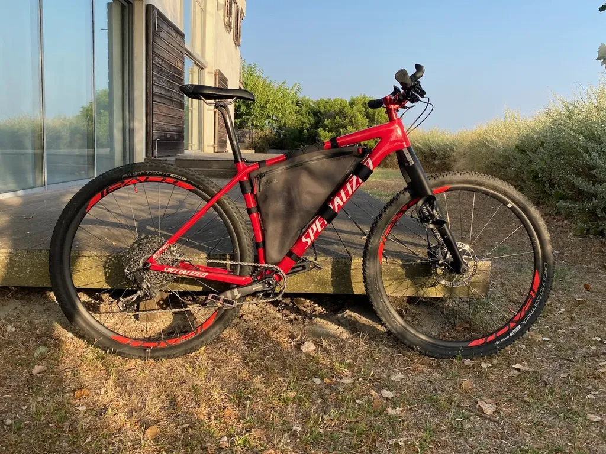
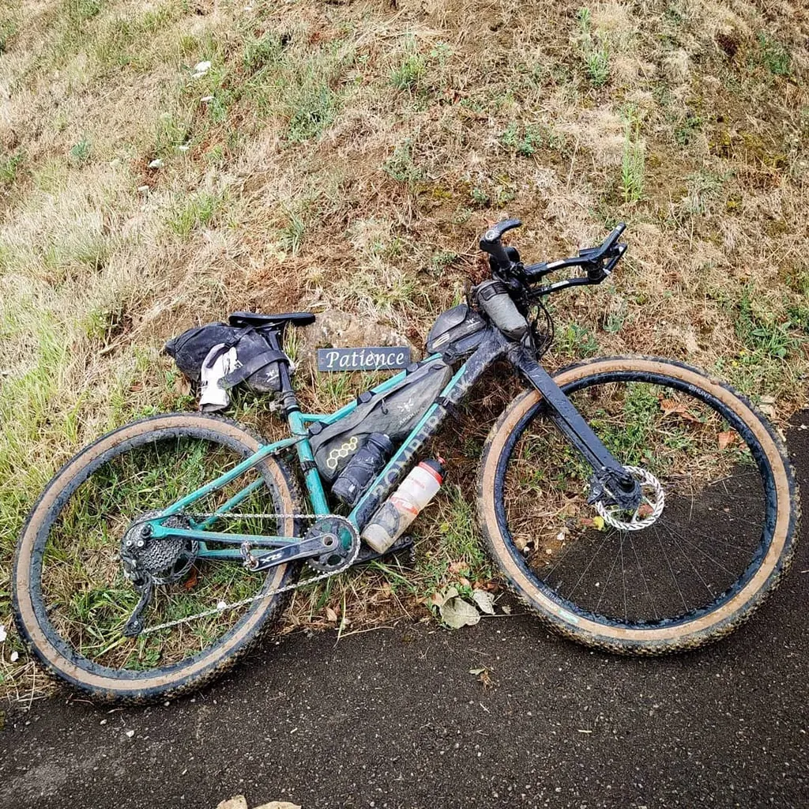
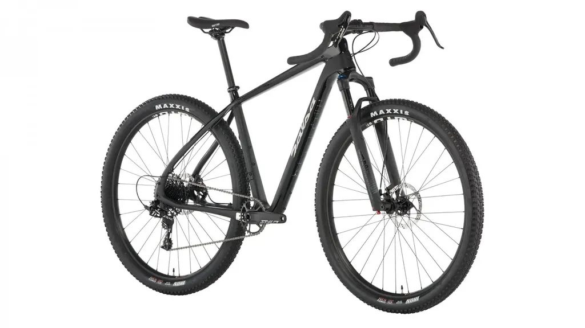

# Pourquoi je ne vends plus mon vélo de bikepacking

Quand je partage mes cogitations, les échanges qui s’en suivent m’aident souvent à préciser mes idées, voire à changer d’avis. Le net social révolutionne le vélo, mais peut-être que depuis toujours les cyclistes se prennent la tête au sujet de leurs bécanes (ça en devient maladif chez moi).

J’avais donc décidé de [vendre mon VTT tout rigide](pourquoi-je-vends-mon-velo-bikepacking-tout-rigide.md) monté en début d’année spécialement pour le bikepacking (moi, j’appelle ça un monstercross). Trois raisons principales.

1. Lors des longues sorties, le tout rigide me provoque des fourmis dans les mains. Même mon gravel avec ses 20 mm de suspension avant est plus confortable.
2. Dans les descentes techniques, je suis bloqué sur les freins pour ne pas en prendre plein les bras ou être éjecté du vélo. Ce n’est pas le pied.
3. Ce vélo se retrouvait coincé entre mon gravel et mon VTT XC tout suspendu et il était moins séduisant que l’un ou l’autre, [même pour le bikepacking](../9/bikepacking-dans-la-tourmente.md), si bien qu’il prenait la poussière dans mon garage.

J’avais donc imaginé le vendre dans l’idée de monter un vélo plus typé, genre un Salsa Cutthroat avec un fourche télescopique de 100 mm. Puis je me suis souvenu de nombreux échanges avec mon ami [Patrick Lamarre](https://www.facebook.com/patrick.lamarre.94). Il ne sera peut-être pas d’accord, mais j’ai l’impression qu’après ses ultras trips bikepacking, [le dernier en date étant la Gravel Tro Breizh](http://www.endorphinmag.fr/podcast_bikepacking), il a moins de fourmis dans les mains et de douleurs dans les bras quand il utilise un cintre droit plutôt qu’un cintre gravel. C’est sans doute aussi pour cette raison que beaucoup de spécialistes de l’endurance en bikepacking privilégient le cintre droit, je pense notamment à [Sofiane Sehili](https://www.instagram.com/sofianeshl/), même si parfois il adopte le cintre gravel.

Plus je fais de gravel, plus j’apprécie le cintre gravel, mais je suis davantage à mon affaire avec un cintre VTT dès qu’il y a un passage un poil technique tout en m’éclatant d’avantage. Grâce aux cornes SQ-Lab, je peux par ailleurs me mettre dans une position quasi gravel quand je le désire, c’est en quelque sorte le meilleur des deux mondes, une façon de maximiser le confort. Sofiane ajoute une troisième position avec les aérobars, une position plus aérodynamique, mais qui aussi aide à détendre les bras.

Mon vélo de bikepacking idéal devenait alors un Cutthroat avec une fourche et un cintre plat ou [un cintre gravel hyper évasé genre Salsa Woodchipper](https://bikepacking.com/index/gravel-bars/). C’est jouable, [même Salsa a un temps proposé cette configuration](https://salsacycles.com/bikes/archive/2019_cutthroat_apex_1_sus), mais alors pourquoi ne pas tout simplement monter une fourche sur mon VTT tout rigide et le transformer en semi-rigide ? J’y ai pensé assez vite, mais je me suis dit qu’ainsi il serait encore plus proche de son grand frère tout suspendu, avec simplement un bénéfice d’un kilo en moins.

C’est en roulant avec un copain équipé d’un VTT enduro que j’ai trouvé la solution. La fourche 100 mm de mon tout suspendu va migrer sur le tout rigide et je monterai une fourche de 120 mm sur le tout suspendu pour le tirer vers l’enduro. Ainsi mon semi-rigide sera parfait pour le bikepacking et le XC cool, mon tout suspendu sera parfait pour les sorties plus courtes, mais plus engagées. En élargissant le champ d’action de mes trois vélos, je pense avoir trouvé la solution pour qu’ils cohabitent. C’est aussi pour moi la solution la moins onéreuse et sans doute la plus confortable, celle qui m’a satisfait tout au long de 2019.

Je rêve d’avoir trouvé la formule idéale, mais je sais que vite je vais me remettre à rêver d’une autre bécane.

#velo #y2020 #2020-10-13-12h9
