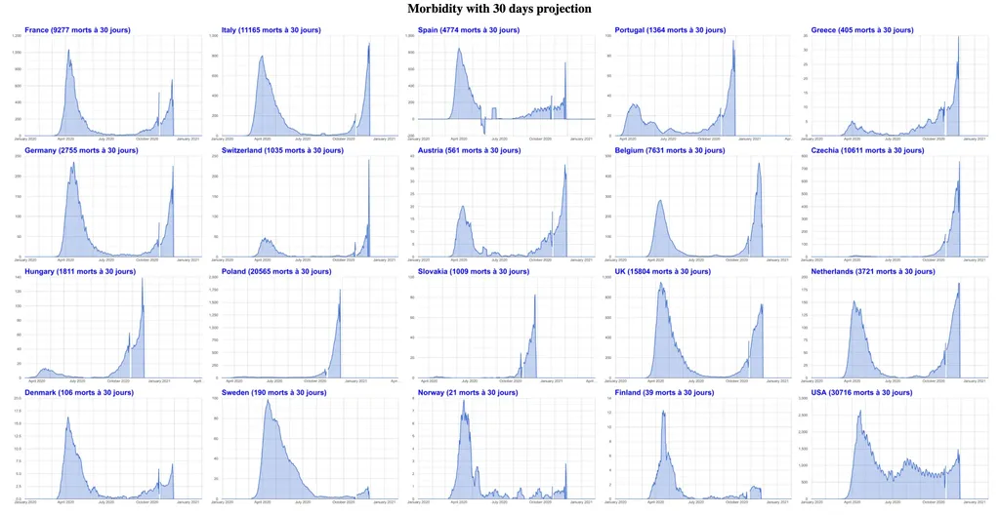

# Un mort du covid toutes les 5 minutes en France

Voilà ce qui nous attend durant les 30 prochains jours, car le confinement ne changera quasiment rien aux décès qui surviendront dans cette période : ils frapperont des personnes déjà infectées.

Comment j’arrive à ce chiffre noir ? J’utilise une méthode que j’ai [mainte fois décrite](covid-ou-en-est-vraiment-la-france.md) : en moyenne un décès survient 30 jours après une infection. Quand on connaît le nombre réel d’infectés un jour donné, on peut en déduire le nombre de décès un mois plus tard en appliquant simplement le taux de mortalité, [fixé à 0,4 % pour le calcul](il-sest-passe-un-truc-etrange-en-europe.md). Si on prolonge les 30 derniers jours, on arrive à un bilan macabre d’un peu moins de 10 000 victimes (9 277 d’après la simulation). J’ai alors divisé le nombre de minutes pour 30 jours par ce score pour arriver à un mort toutes les 5 minutes, une valeur symbolique et pas de nature à rassurer les soignants, car un grand nombre de ces victimes passeront par les urgences, sans parler des patients bien plus nombreux qui seront sauvés.

Si tous les pays d’Europe seront touchés dans les semaines à venir, la France le sera le plus durement avec l’Angleterre, peut-être aussi l’Italie, même si des pays relativement épargnés par la première vague recevront la seconde de plein fouet.

Si le couvre-feu a été efficace, nous devrions voir le nombre d’infections diminuer à partir de la semaine prochaine. Le confinement lui ne commencera à montrer son effet que d’ici deux à trois semaines. Si les deux se cumulent, le confinement pourrait alors être allégé, mais vu la vitesse à laquelle progressent les contaminations, cela tiendra du miracle.

#covid #y2020 #2020-10-29-21h3
