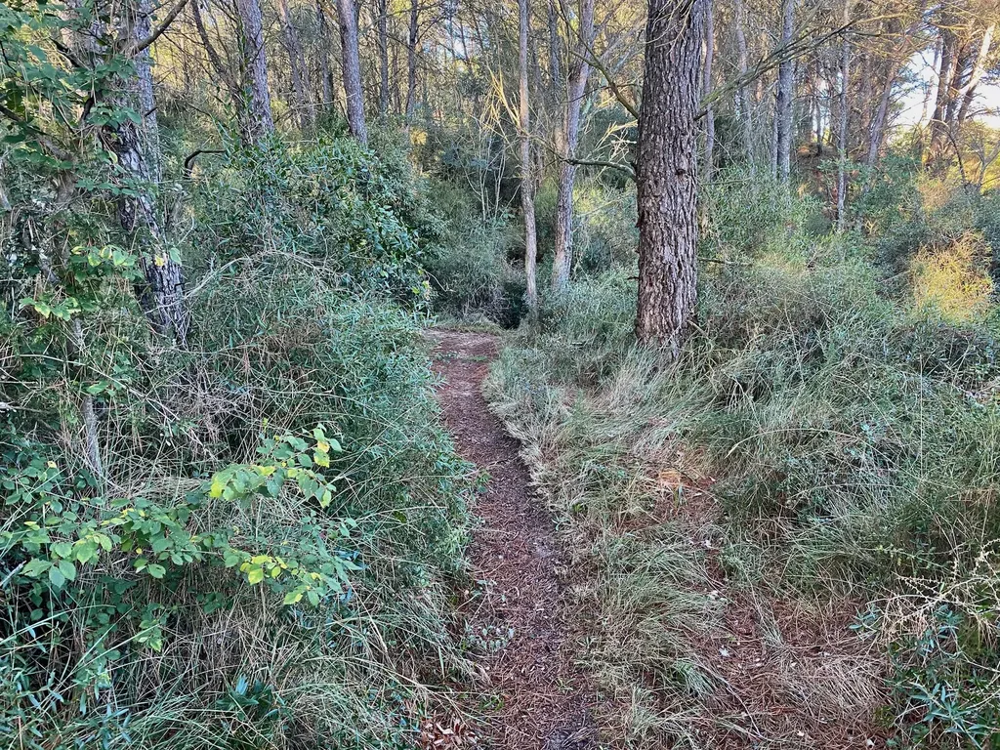

# Pourquoi le GPS révolutionne le vélo

[Après l’article où j’explique pourquoi j’ai racheté un GPS Garmin](../10/pourquoi-jai-rachete-gps-garmin.md), j’ai découvert que beaucoup de cyclistes rejetaient le GPS ou ne l’utilisaient que comme compteur, voire comme sparring partner. Chacun ses usages, mais je voudrais lister les raisons pour lesquelles le GPS a changé ma façon de faire du vélo, pourquoi cet accessoire est intimement lié au développement du gravel et du bikepacking, et au cœur d’une révolution sportive et culturelle.

### La trace

1. Pendant plus de cent ans, on a fait du vélo sans GPS, mais avec le GPS on fait du vélo autrement (on pouvait même faire du vélo sans pneu et avec des roues en bois).
2. La trace sur l’écran du GPS, c’est un trait jaune stabiloté sur [une carte IGN TOP25](https://ignrando.fr/boutique/top-25-serie-bleue.html) qui couvrirait une région, un pays, un continent. C’est un trait qui déborde de toutes les cartes, qui entre dans les zones non cartographiées, qui emprunte des passages nouveaux ou inconnus des cartographes.
3. La trace n’a même pas besoin de la carte puisqu’elle peut résulter de l’assemblage de traces relevées à même le terrain lors des sorties.
4. La trace n’a pas pour but de relier deux points sur le territoire, mais de faire cheminer le cycliste à la manière du traceur, c’est-à-dire avec art.
5. La trace, c’est une histoire écrite par le traceur, qui amène de découverte en surprise, de point de vue en single joueur.
6. Suivre une trace, c’est comme lire un roman d’aventures, c’est même entrer dans l’aventure, la vivre à son tour et pour la première fois, parce que si la trace ne change pas, le territoire, lui, ne cesse de se transformer au fil des saisons.
7. Sur l’écran du GPS, la trace se découvre page après page, bout après bout. Même si on l’a étudiée avant le départ, la mémoire nous fait toujours défaut. Nous ne retenons de la trace que ses grandes lignes comme d’un livre lu il y a longtemps.
8. S’attaquer à une nouvelle trace, c’est toujours avec excitation. C’est du vélo avec quelque chose de plus, un brin d’aventure, et voilà pourquoi la trace est indispensable aux pratiques cyclistes aventureuses. La trace fait l’aventure.
9. La trace est la nouveauté radicale apportée par le GPS : la correspondance en temps réel entre le territoire et la carte. Les autres fonctions du GPS existaient avant le GPS, elles se contentaient de la physique newtonienne alors que [le GPS recourt à la physique einsteinienne](https://www.lemonde.fr/les-decodeurs/article/2015/11/27/comment-la-theorie-de-la-relativite-d-einstein-a-change-nos-vies_4819236_4355770.html) pour représenter la trace et le cycliste au-dessus d’elle. Ce recours à une autre physique est pour beaucoup dans le changement de paradigme introduit dans la pratique cycliste par le GPS, un changement bien compris par les organisateurs des courses d’endurance, mais pas encore des courses traditionnelles, encore dépendantes du modèle newtonien.
10. La trace est la garantie de ne pas retomber dans le trafic, de ne pas se faire aspirer par la gravité du réseau asphalté pensé pour les voitures et les camions. Au contraire, la trace nous tient à distance du bruit, de la pollution, des nuisances de l’ère thermo-industrielle (l’asphalte étant lui-même un pur produit de l’ère thermo-industrielle).
11. La trace prend tout son sens loin de l’asphalte, quand on veut s’en tenir à l’écart avec obstination.
12. La trace nous rend familiers d’un territoire où peut-être nous n’avons encore jamais roulé, elle nous aide à en découvrir les secrets.
13. La trace tient du parcours initiatique, tout au moins d’une initiation à un territoire.
14. Sans la trace, le bikepacking entendu comme voyage à vélo loin de l’asphalte n’existerait pas, et ce n’est pas un hasard si [le bikepacking au sens actuel est né avec les GPS](../../2019/4/une-breve-histoire-du-bikepacking.md) (seul le cyclotourisme peut se pratiquer sans GPS parce qu’il tient de la tradition de la carte papier).
15. Sans la trace, [un 100 miles comme le Gravier Tour](../10/mini-aventure-gravel-de-la-nuit-a-la-nuit.md) serait tout autant impossible, à moins d’une organisation laborieuse, avec des dizaines de bénévoles. Le GPS simplifie l’organisation des courses, des périples, des randonnées. Des créateurs indépendants apparaissent. Des artistes de la trace.
16. Sans la trace, les longs périples devraient être balisés comme les routes avec des panneaux. Il faudrait polluer la nature avec des signes, surajouter à ceux des GR et autres chemins de randonnée. Un travail titanesque, absurde, inutile, d’autant qu’un tel balisage est impossible parce que les traces ne cessent de s’entrecroiser comme les [song lines](https://en.wikipedia.org/wiki/Songline) des aborigènes. Il y a une infinité de traces possibles, donc potentiellement un balisage infini.
17. Sans la trace, il n’y aurait pas d’épreuve d’endurance comme la Tour Divide ou la French Divide, qu’elles soient vécues en mode course ou randonnée.
18. Aucune carte ne peut remplacer une trace, car la moindre trace en traverse plusieurs, et pour un long périple il faudrait transporter une brouette de cartes.
19. Aucune carte papier, ou même numérique, ne peut être exhaustive. Presque toujours les traces prennent des libertés avec la topographie officielle.
20. Avant le livre, les aèdes remplaçaient le livre. Avant les GPS, les guides remplaçaient les GPS. Mais comme on a inventé le livre, pour que les œuvres circulent indépendamment de leur créateur, on a inventé la trace pour libérer les guides, parce qu’ils ne peuvent pas toujours être présents, parce que beaucoup trop de cyclistes peuvent avoir envie de suivre leurs traces. L’invention de la trace, c’est comme l’invention du livre. Alors comme à l’époque de Gutenberg, il y a des réfractaires, mais aussi des millions d’enthousiastes, persuadés que le nouveau paradigme ouvre une histoire nouvelle pour le vélo.
21. Chaque trace est comme un livre dans une vaste bibliothèque, d’où des sites comme [UtagawaVTT](https://www.utagawavtt.com/).
22. La trace fluidifie le voyage, le rend joueur plutôt qu’une fastidieuse affaire de paperasse.
23. Changer de vélo ouvre de nouvelles possibilités pour la trace. Avec l’arrivée du gravel et l’extension du domaine accessible hors asphalte, des traces nouvelles sont devenues possibles, et le gravel se développe grâce à ces nouvelles possibilités. Tous les territoires sont à revisiter.
24. La trace nous démontre que même près de chez nous il y a toujours des découvertes à faire.
25. Aucune trace, même effectuée des dizaines de fois, n’est infaillible. Il arrive que la nature reprenne le dessus, qu’un agriculteur dresse une barrière, que des travaux ou des intempéries bloquent des passages. Le monde change et la trace doit changer pour l’épouser.
26. Sans trace, on répète toujours les mêmes parcours. On lit toujours les mêmes livres et néglige ceux écrits pas les autres. Sans trace, on est condamné à tourner en rond, à moins d’avoir l’âme d’un explorateur.
27. La trace n’est pas contrainte, mais libération. Elle invite à l’exploration, à soi-même devenir traceur.

### L’exploration

1. Il y a un art de la trace comme il y a un art du roman. Le traceur est le pendant du romancier.
2. Le traceur vit la trace sur la carte, il l’anticipe, pour après être toujours surpris par elle. Il travaille en aller-retour entre le territoire et la carte.
3. Avec les cartes et les images satellites, le traceur anticipe les sensations que provoquera la trace, il peut la modeler comme il le ferait d’un texte pour influer sur le ressenti des cyclistes.
4. Il aime rouler au hasard, se jeter dans tous les chemins, rechercher les failles dans la carte. Si lors d’une sortie, il découvre un nouveau passage, il s’en souviendra, mais si les nouvelles possibilités se multiplient, il aura besoin de ramener sa trace sur la carte pour l’étudier, la modifier, préparer de nouvelles explorations.
5. La mémoire ne peut remplacer la trace, surtout quand elle se prolonge sur de longues distances. Arrive toujours le moment où le traceur entre en territoire moins familier, où la trace mène au-delà de la frontière, où toutes les voies ne peuvent systématiquement être parcourues, alors la trace ramenée sur la carte aide à préparer l’exploration suivante.
6. La trace naît toujours de la combinaison d’autres traces, celles du traceur ou d’autres traceurs. Toute trace est une œuvre collective et en ce sens elle doit être partagée.
7. La trace est neuve, mais elle révèle les chemins préexistants. Si le traceur peut revendiquer le titre de créateur, il n’a aucun droit de propriété sur ses propres traces. Qui le souhaite peut les parcourir, les modifier, en intégrer à ses propres créations. On est dans la logique de l’open source. La trace est un don.
8. La trace se représente sur la carte, mais elle s’écrit sur le territoire. Le traceur façonne le monde. La trace a ainsi une dimension politique. Aussi philosophique puisqu’elle implique une façon de faire du vélo.
9. Le traceur a une responsabilité puisqu’il entraîne des cyclistes sur ses pas.
10. Le traceur met de lui dans ses traces, en les rendant fluides ou au contraire cassantes, montagneuses ou au contraire plates. Chaque traceur a son style. Certains rechignent à toucher l’asphalte, d’autres s’y attardent.
11. La trace se construit comme une histoire, tendue vers son climax. Elle n’est pas qu’une affaire de vélo, elle s’occupe aussi de l’état mental des cyclistes pour leur faire vivre des expériences inoubliables.
12. La trace est le scénario d’une aventure, une sorte de scénario de jeu de rôle où les cyclistes entrent dans la peau des aventuriers.
13. Une trace aboutie est sportive, géologique, botanique, esthétique, culturelle, gastronomique… Une trace ne doit négliger aucune de ces dimensions. Elle autorise plus que « le je vais t’en faire chier » propre à de nombreuses épreuves.
14. Le traceur n’oublie jamais que sa trace s’apparente à une partition dont les cyclistes seraient les interprètes, chacun à son rythme, chacun avec ses instruments, chacun selon sa propre philosophie du vélo, quitte a prendre des libertés avec la trace. Elle est une possibilité, en aucune manière un dictat, sauf en mode course, mais pas tant par sa faute que celle des concurrents qui acceptent de se soumettre à une logique quantitative plus que qualitative.
15. La trace se déploie peu à peu, comme un oignon qui couche après couche colonise tout un territoire jusqu’à le circonscrire dans son exhaustivité. Les chemins repérés deviennent autant de mots possibles dans le vocabulaire du traceur. Il ne lui reste plus qu’à les composer pour créer de belles histoires.

#livre_2 #velo #y2020 #2020-11-6-11h38
