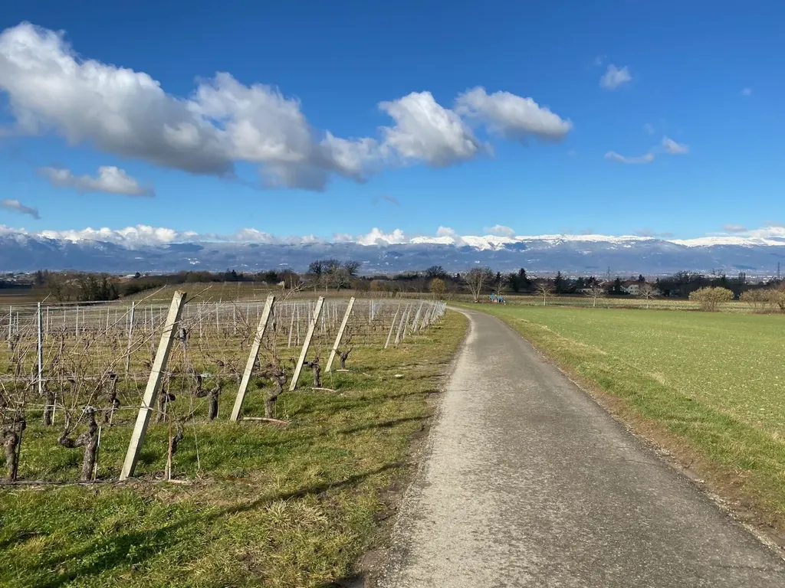

# L’entraide des traceurs

Profitant de ma présence à Genève, [Geneviève Morand](https://www.rezonance.ch/) m’invite à une table ronde sur l’entraide, sous-prétexte qu’entre 2006 et 2010 j’ai écrit trois livres sur les réseaux. Je l’ai prévenue que je ne travaillais plus le sujet, mais elle a insisté, alors je me suis demandé de quoi je pourrais parler, j’ai pensé au bikepacking.

Bien sûr nous nous entraidons sur les forums, partageant nos trucs et astuces, nous nous entraidons quand nous roulons, mais aujourd’hui une nouvelle forme d’entraide à plus vaste échelle apparaît dès qu’il s’agit de tracer des parcours. Si je m’étais contenté d’explorer en solitaire les chemins autour de chez moi, me fiant à ma seule expérience ou à celle de quelques copains, j’aurais fini par tourner en rond, et sans doute par me lasser du vélo, car alors j’aurais été incapable de travailler [sa dimension esthétique](../../2018/12/etre-territoire.md).

Au contraire, j’ai récupéré mes traces, mais aussi celles de nombreux autres cyclistes, traces abandonnées presque inconsciemment sur Strava ou consciemment publiées sur des sites de partages. Une base de données hétéroclite et décentralisée se construit peu à peu dans laquelle nous pouvons piocher pour construire de nouveaux parcours, puis les tester, puis les publier à notre tour.

[Des services de routage automatique](../../2019/9/vtt-gravel-bikepacking-que-vaut-le-routage-automatique.md) tentent d’exploiter ces données pour proposer des solutions automatiques, mais elles restent peu intéressantes et je pense qu’elles le resteront longtemps, car l’approche algorithmique ne permet pas encore de concevoir une trace comme une narration. Parce qu’un voyage à vélo s’écrit comme un roman, avec une introduction, des péripéties, des plateaux et des climax avant d’arriver à une conclusion, idéalement lumineuse.

Un routage automatique tente au mieux de proposer une solution à une équation, nous faisant rouler en priorité sur les types de chemins que nous lui demandons. Si nous sommes à VTT, il ne lui viendra pas à l’idée de nous faire passer par une alternative gravel ou même macadamisée parce qu’elle est sublime. Peut-être des IA concevront un jour des traces superbes, mais à ce moment elles seront aussi capables d’écrire des romans et nous serons entrés dans une autre époque.

Pour l’instant, les traces s’écrivent grâce à un processus d’entraide indirecte, dont des opportunistes cherchent à profiter en commercialisant des itinéraires qu’ils vendent comme leurs créations, alors qu’ils sont typiquement des créations dans la logique des licences open source, chacun ajoutant sa pierre à un édifice construit après des centaines d’années de cheminement. Une trace est avant tout un remix, une œuvre en soi, mais faites de morceaux d’autres œuvres.

Vendre un itinéraire et ne pas le reverser à la communauté est pour moi pas loin de la malhonnêteté, un peu comme quand Apple a construit MacOS sur une base Unix. En revanche, qu’autour d’une trace versée dans le domaine public des services soient proposés, et donc commercialisés, je n’ai rien contre. Mais il me paraît important de laisser à chacun la possibilité de choisir entre suivre une trace à la bonne franquette, s’engager dans une course ou rouler en compagnie d’un guide. Il ne peut y avoir entraide que si au cœur du processus une ressource est donnée en partage, dans le cas du bikepacking la trace et le territoire lui-même.

Bien sûr, tout traceur peut se prévaloir d’être aussi un créateur. Par exemple, pour [le tour de l’étang de Thau](../../2019/11/gravel-le-tour-de-letang.md), en novembre dernier, j’ai coupé à travers un champ abandonné, suivant un vague sente, puis j’ai publié ma trace, qui grâce à ce passage permet d’éviter une route fort dangereuse alors que la voie sud est souvent inondée en hiver. Par la suite, gravellistes et vététistes ont repris ma trace et désormais un chemin est apparu, fruit lui-même de notre entraide sur le terrain. Il ne m’est jamais venu à l’idée de copyrighter ma trace, pas plus que de la tenir secrète pour n’en faire profiter que mes amis proches.

Une trace n’est pas une ressource épuisable, surtout si nous sommes des cyclistes respectueux de l’environnement. Le propre des traces est de pouvoir s’empiler et se recombiner indéfiniment. On n’est pas dans une économie de la rareté, mais de l’abondance, et toute personne qui tente de créer de la rareté dans cette économie lui est nocif (et pas mon ami).

Le bikepacking hors route est donc rendu possible grâce à une entraide à grande échelle qui nous permet d’explorer les biens commun que sont les chemins, et à travers eux la planète entière.

[Elinor Ostrom](https://fr.wikipedia.org/wiki/Elinor_Ostrom) a défini le condition nécessaire à la gestion des biens communs. Avec les traces, nous retrouvons certains des éléments soulevés par elle, mais dans un cadre bien plus lâche. Pour qu’une entraide de ce type fonctionne, il faut :

* Des ressources en partage (traces, cartes, images, récits, vidéos, photos… et territoires publics).
* Des technologies de partage (GPS, plateformes…).
* Un format de partage, les fichiers GPX.
* Des plateformes de partage distribuées et décentralisées de façon qu’aucune ne puisse contrôler les échanges et les monétiser (de fait, il est vain pour les vendeurs de traces de garder leurs créations secrètes).
* L’accès aux ressources est asynchrone (on verse quand on veut, on puise quand on veut, pas besoin de rendez-vous ni même de se connaître).
* Une économie de l’abondance (ou tout au moins renouvelable).
* L’entraide n’est pas organisée, mais elle s’auto-organise.

Je trouve assez excitant que le bikepacking se déploie dans ce cadre favorisant l’intelligence collective, pour beaucoup l’une des seules façons de sortir des crises du vingt et unième siècle. Quand nous voyageons à vélo hors route, nous prouvons par l’exemple qu’il est possible de faire de belles choses lorsque nous travaillons ensemble sans pour autant nous contraindre de manière coercitive. Et peut-être que je me sens libre quand je voyage à vélo parce que je le fais politiquement dans un nouveau monde. Peut-être est-ce aussi pour cette raison que nous sommes souvent très bien accueillis. Nous serions presque des émissaires du futur porteur de bonnes nouvelles.

#livre_2 #velo #y2020 #2020-2-5-14h4
