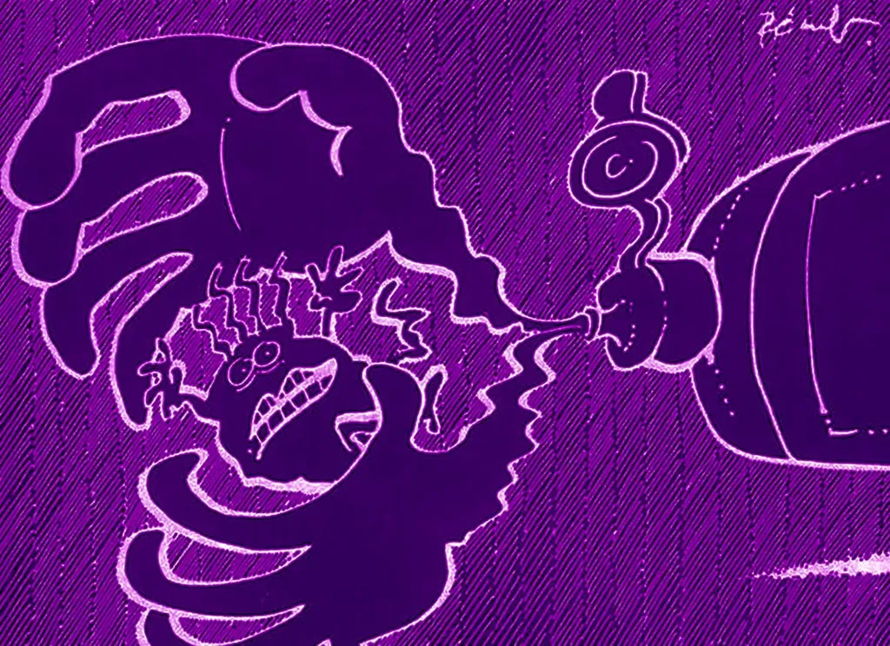
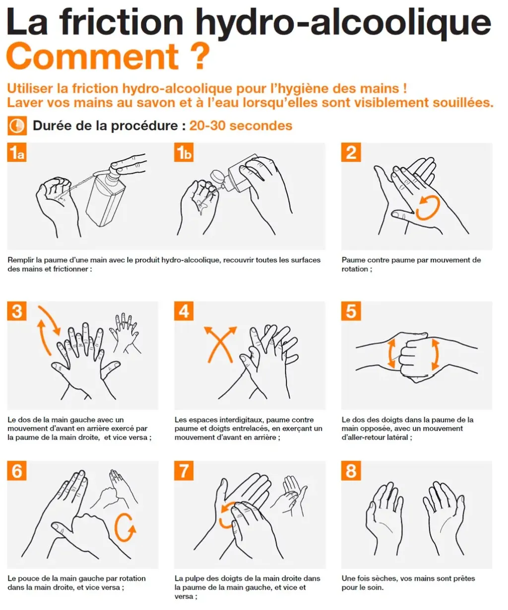
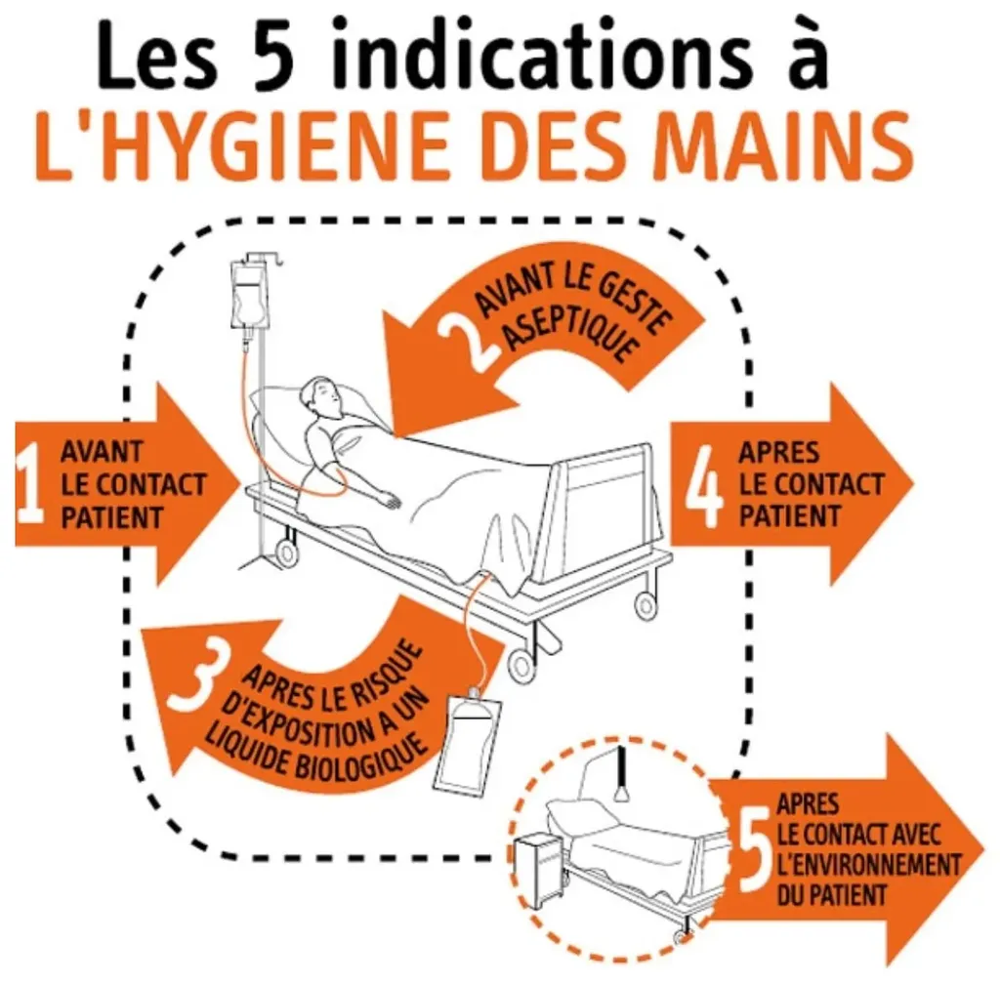

# Arrêtons le grand délire avec les solutions hydro-alcooliques

Par le plus grand des hasards, alors que la crise coronavirus fait rage, je suis en train d’écrire la suite du *[Geste qui sauve](../../page/le-geste-qui-sauve)*, mon livre qui raconte l’histoire du gel hydro-alcoolique et comment l’utiliser. C’est un travail prévu depuis longtemps, longtemps reporté, et auquel je me suis finalement mis depuis le début de l’année. Je ne suis d’autant moins en train de surfer sur la vague que ce livre ne sera publié qu’en 2021 (je n’ai même pas encore négocié avec un éditeur, c’est pour dire).

La pandémie donne un arrière-plan inattendu à mon travail, d’autant qu’il y a désormais pénurie de gel, que les prix flambent sur eBay et qu’on n’a jamais autant parlé du gel, souvent pour dire tout et n’importe quoi, aussi des choses drôles, genre « échange un litre de gel contre Ferrari », blagues drôles pour moi, car, quand j’écrivais mon premier livre en 2013, de telles vannes étaient inimaginables, même si l’épidémie H1N1 avait déjà popularisé le gel (on devrait dire les gels, car il y a autant de versions que de laboratoires). J’ai surtout beaucoup ri devant la vidéo italienne qui montre des mafieux préférer le gel à la cocaïne, le présentant comme une marchandise bien plus lucrative.

Depuis que je vois des recettes folkloriques circuler, je me dis qu’il faut rectifier, prévenir, dénoncer les impostures, surtout quand [des médias officiels comme France 3](https://france3-regions.francetvinfo.fr/bourgogne-franche-comte/coronavirus-covid-19-voici-3-recettes-faciles-fabriquer-votre-gel-hydroalcoolique-1794133.html) publient des trucs qui frisent le ridicule, sortis d’un chapeau de magicien. Comme si trois goûtes d’huile essentielle pouvaient tuer les bactéries et les virus. Si c’était le cas, nous n’aurions tout simplement plus besoin de gel. Et puis, j’ai vu la raison reprendre le dessus, tous les sites d’un commun accord ont pointé vers [les formules OMS](https://www.who.int/gpsc/5may/tools/system_change/guide_production_locale_produit_hydro_alcoolique.pdf?ua=1), mais parfois en titrant n’importe quoi comme *Capital* : [L’OMS propose une alternative au gel hydroalcoolique, en rupture de stock](.https://www.capital.fr/economie-politique/coronavirus-loms-propose-une-alternative-au-gel-hydroalcoolique-en-rupture-de-stock-1363564).

Un petit rappel me paraît nécessaire. Ce n’est qu’en 1995 aux Hôpitaux Universitaires de Genève que Didier Pittet démontre que le lavage des mains au savon, alors la norme dans les centres de soin depuis 1905, prend beaucoup trop de temps. Pour décrocher les bactéries, virus et champignons, il faut deux à trois minutes de friction sous l’eau courante. Or, dans le cadre hospitalier, les soignants qui respectent les normes d’hygiène doivent se désinfecter les mains jusqu’à vingt fois par heure. Faites le calcul, avec l’eau et le savon, il ne reste plus de temps pour pratiquer les soins. Que se passait-il alors ? Personne ne respectait les normes d’hygiène et le taux des maladies nosocomiales avoisinait les 18 %, c’est-à-dire que vous aviez presque une chance sur cinq d’être contaminé quand vous alliez à l’hôpital (ce chiffre grimpait à 40 % dans les pays les plus pauvres). On a alors estimé que ces maladies nosocomiales tuaient environ 16 millions de personnes dans le monde chaque année.

Didier a cherché une solution et il a tout de suite pensé à l’alcool, un produit connu pour être virucide, bactéricide et fongicide depuis 1904. Didier et son équipe avec la collaboration du pharmacien des HUG, William Griffiths, ont alors mis au point une solution hydro-alcoolique, puis une version gélifiée plus pratique à l’usage, et ils en ont fait la promotion dans leur hôpital. Un an plus tard, le taux de maladies nosocomiales avait été divisé par deux, la mortalité d’autant (aujourd’hui ce taux est tombé à Genève sous les 5 %).

Didier commence alors sa croisade mondiale pour la promotion de l’hygiène des mains, notamment en collaboration avec l’OMS. En 2005, lors d’une visite au Kenya, il découvre que les gels y coûtent cinq fois plus cher qu’en Europe. Ça le rend dingue. Il décide de mettre au point une formule open source, la moins chère possible à produire, formule depuis diffusée par l’OMS et qui depuis 2015 fait partie de la liste des médicaments essentiels de l’OMS, en faisant un droit de tous les patients.

J’ai écrit le *[Geste qui sauve](../../page/le-geste-qui-sauve)* pour célébrer Didier, surtout pour célébrer son don. Il n’a pas déposé de brevet, pour sa formule pas plus que pour son protocole d’usage. Comment se frictionner les mains, quand le faire (les cinq moments de l’hygiène des mains), comment faire en sorte que les soignants passent de l’eau et du savon au gel (l’approche multimodale). Et comme Didier avait donné à l’humanité sa découverte, j’ai distribué mon livre en open source. [On peut le télécharger gratuitement dans une vingtaine de langues.](../../page/le-geste-qui-sauve/downloads)

Voilà pour la mise au point historique. L’OMS n’a donc pas soudainement diffusé une alternative au gel comme le sous-entend *Capital*. Cette formule a été pensée pour les pays les plus pauvres, elle sert aussi de base de travail pour tous les laboratoires. Cette formule, ou plutôt ces deux formules, l’une à base d’alcool éthylique, l’autre d’alcool isopropylique, sont en quelque sorte des formules minimales.

Dans ces formules, et dans toutes celles du commerce, l’agent actif est l’alcool. Il faut entre 70 et 80 % d’alcool pour que la solution soit efficace. Donc si on prend 80 cl d’alcool éthylique à 96 %, lui ajoute 20 cl d’eau distillés, on obtient une solution hydro-alcoolique parfaitement efficace. Pas besoin de se compliquer la vie comme on peut le lire partout.

Attention, si l’alcool est plus dosé, la solution marche beaucoup moins bien. Trop dosé, l’alcool incite les bactéries à se recroqueviller sur elle-même et à sporuler. Il ne faut donc pas les attaquer trop fortement si on veut les tuer.

Les formules OMS ajoutent deux composés, qui dans un usage non hospitalier ne sont pas indispensables. Le peroxyde d’hydrogène à 3 %, autrement dit l’eau oxygénée, a pour fonction de tuer les éventuelles spores présentes dans l’alcool ou les flacons. C’est une précaution indispensable, par exemple, quand on fabrique des solutions en Afrique, mais, chez nous, pour un usage ponctuel, on trouve de l’alcool de bonne qualité, de même que des flacons non contaminés (d’autant que notre but est de tuer le coronavirus).

Quant à la glycérine, elle a pour fonction d’hydrater les mains, de rendre la solution plus agréable, ce qui n’est pas indispensable encore une fois quand on ne se frictionne les mains qu’épisodiquement.

Voilà pour la recette : alcool et eau distillée, voire bouillie. Tout en sachant que se frictionner méticuleusement les mains sous l’eau courante avec du savon marche très bien, si on y passe deux ou trois minutes.

En tout cas, me voilà motivé pour écrire ce second livre. Il reste beaucoup de choses à dire sur le gel et la prévention et le contrôle des infections en général, comme nous le démontre la crise coronavirus. Si nous n’apprenons pas, ces pandémies seront de plus en plus catastrophiques.

Dernière remarque : Didier n’a jamais démontré que l’usage du gel hors des hôpitaux avait un quelconque intérêt. C’est notre sens commun qui nous pousse à le croire. En revanche, face à un malade supposé, il est vital de respecter les cinq moments de l’hygiène des mains. Voilà peut-être comment nous réussirons à combattre le coronavirus, en étant rigoureux. Les mains sont toujours le principal vecteur des infections, loin devant les postillons (il est plus important de se frictionner les mains que de porter des masques). Certains hôpitaux semblent l’avoir oublié devenant des nids à coronavirus.

[Pour tous savoir sur l’hygiène des mains, consultez la plateforme farmed…](https://pharmed.datapharma.ch/courses/hygiene-des-mains/)

#covid #pittet #politique #coup_de_gueule #y2020 #2020-3-4-8h57
