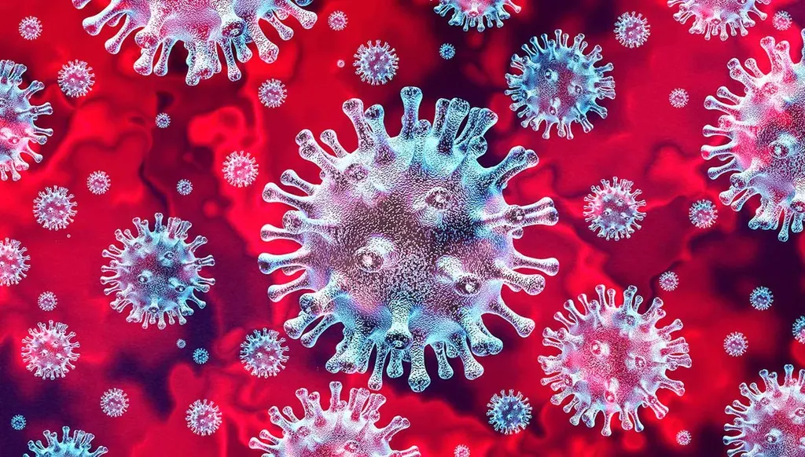

# Les vrais chiffres du coronavirus en France

[Dans mon journal de février](carnet-de-route-fevrier-2020.md), je relate mon passage à Genève chez Didier Pittet, le Pape des solutions hydro-alcoolique et un des plus prestigieux spécialistes de la prévention et du contrôle des infections. Il me dit alors que [le nombre des cas officiels de coronavirus](https://www.worldometers.info/coronavirus/) est largement inférieur au nombre de cas réels (les personnes infectées non encore identifiées).
[Dans un article qui fait le buzz](https://medium.com/@tomaspueyo/coronavirus-act-today-or-people-will-die-f4d3d9cd99ca), Tomas Pueyo propose plusieurs méthodes pour estimer les cas réels. En voici une. Il constate que [la durée moyenne entre l’infection et un décès est de 17,3 jours](https://github.com/midas-network/COVID-19/tree/master/parameter_estimates/2019_novel_coronavirus). Aucune raison de remettre en cause cette information pour la France. Par ailleurs, il constate que le taux de mortalité varie entre 0,5 % pour les pays préparés comme la Corée du Sud et 5 % pour ceux débordés comme l’Italie (mais à vrai dire personne ne connaît avec certitude ce taux de mortalité, c’est la grande inconnue). Si je suis optimiste, je prends une mortalité de 0,5 % pour la France (puisque notre système de santé n’est pas encore débordé). Si donc un jour donné on a un mort, on peut en déduire que 17 jours avant, quand il a été infecté, 200 personnes l’ont été en même temps que lui (=100/0,5).

En France, le 14/3, on décompte 12 nouveaux décès. On peut en déduire que le 25/2, soit 17 jours plus tôt, 2 400 personnes ont été infectées et pas seulement les 10 recensées (bien sûr avec une mortalité plus forte, on obtiendrait moins de cas réels selon cette méthode).

Après ce retour en arrière, on peut revenir vers le présent. Comme en moyenne [le nombre de cas double en France tous les 3 jours](https://www.lemonde.fr/planete/article/2020/03/15/coronavirus-probablement-plus-de-la-moitie-de-la-population-francaise-sera-touchee_6033143_3244.html), on peut se projeter vers l’avenir. Pour le 14/3, on obtient le chiffre vertigineux de plus de un millions de cas réels, avec 153 000 nouveaux cas, ce qui voudrait dire que dans 17 jours nous décompterons 768 nouveaux décès pour un total de 5 793 morts.

[Liens vers le tableau… je le mets à jour tous les soir.](https://docs.google.com/spreadsheets/d/1PqMVPU0VYcDWrUnDh1CsGYr_A7Zk3iZco77X-vToS9Q/edit?usp=sharing)

J’ai compilé [les données officielles](https://fr.wikipedia.org/wiki/Pand%C3%A9mie_de_maladie_%C3%A0_coronavirus_de_2020_en_France) et j’ai appliquée la méthode de calcul décrite ci-dessus [dans un tableau avec lequel tout le monde peut jouer en changeant les paramètres](https://docs.google.com/spreadsheets/d/1PqMVPU0VYcDWrUnDh1CsGYr_A7Zk3iZco77X-vToS9Q/edit?usp=sharing). En haut, en bleuté, j’utilise la machine à remonté dans le temps proposée par Tomas Pueyo. En dessous, je double les cas réels tous les trois jours. En orange, je me projette vers l’avenir. Le nombre de morts est calculé à partir du nombre de nouveaux cas réels 17 jours plus tôt. Bien sûr, le doublement tous les trois jours baissera très vite, parce que les mesures barrières seront efficaces, parce que l’immunité communautaire commencera à bloquer la propagation. On ne peut donc se projeter très loin dans le temps avec cette méthode. En doublant tous les trois jour, le seuil d’immunité communautaire serait atteint fin mars, mais il le sera bien plus tard car la croissante aura diminué d’ici là.

[4,7 % des infectés nécessitent des soins intensifs](https://medium.com/@tomaspueyo/coronavirus-act-today-or-people-will-die-f4d3d9cd99ca) et y restent en moyenne dix jours avant de guérir ou de mourir (ces données sont plus que sujette à caution). Sur un total de [12 364 lits disponibles en réanimation et soins intensifs en France](https://www.lemonde.fr/planete/article/2020/03/15/coronavirus-les-simulations-alarmantes-des-epidemiologistes-pour-la-france_6033149_3244.html?fbclid=IwAR0y_rMXAYZ-40SInI7L8-H5m4gM2CzLq2PNYh-NXEBl278cTm7EqoQLmnE), supposons que 60 % soient libérés pour les malades covid-19 (=7 418). Si on cumule le nombre de malades sur une fenêtre de dix jours, on peut pressentir quand notre système de santé sera saturé (je vous laisse consulter le tableau, ces estimations changent sans cesse). Comme les Italiens, nous basculerons alors en médecine de guerre, ce qui impliquera de filtrer les malades et d’en laisser mourir une bonne partie sans rien faire, sinon les soulager avec de la morphine. Plus le système de santé se tendra, plus le taux de mortalité augmentera (donc les estimations sont plutôt optimistes).

Bien sûr, les hypothèses de Tomas Pueyo ont été beaucoup critiquées. Il ne faut pas les prendre pour argent comptant, d’autant que bien des paramètres sont incertains. Mais j’imagine que notre gouvernement utilise un modèle guère différent pour asseoir ses décisions. Nous verrons bien dans les jours qui arrivent si le nombre de morts est en phase avec celui anticipé (sinon il faudra réviser les paramètres, voire jeter ce modèle à la poubelle).

*PS du 15/3 20h : Ma simulation prévoyait 5 752 cas relevés et 36 morts. Nous avons 5 423 cas et 36 morts. D’autre part, il y aurait 400 patients covid-19 en réa/soins intensifs, donc beaucoup moins que les 1 128 projetés. Deux explications possibles, moins de 4,7 % des patients nécessitent des soins intensifs (il faut faire tomber ce taux à 2 % pour obtenir la bonne projection) ou le taux de mortalité est plus faible que celui utilisé, deux bonnes nouvelles dans les deux cas. Par ailleurs, le gouvernement annonce que le nombre de cas double tous les trois jours, [les données brutes indiquent quatre jours](https://ourworldindata.org/coronavirus) (une valeur qui ne va cesser de varier).*
*PS du 16/3 20h : Ma simulation prévoyait 7 322 cas relevés et 24 morts. Nous avons 6 633 cas et 21 morts.*
*PS du 17/3 21h : Ma simulation prévoyait 8 998 cas relevés et 71 morts. Nous avons beaucoup moins dans les deux cas. [J’ai modifié la simulation pour la rendre plus réaliste.](les-stats-me-soignent-du-coronavirus.md)*
### Annexe : Le bug des élections

Mais pourquoi avoir maintenu les élections. C’est une farce, une offense à la raison. Soit les données dont nous disposons sont bonnes et nous devons minimiser nos interactions, soit les données sont fausses, les calculs bidons et les mesures prises sont inutiles. Mais l’entre-deux est plus que troublant. Il ne fait que révéler des jeux de pouvoir mortifères.

Pour toutes ces raisons, je ne vote plus pour les élections européennes, nationales ou régionales, parce que je ne peux pas cautionner ces comportements qui ne cessent de se répéter, cela d’un bout à l’autre de l’échiquier politique. Et pourquoi ? Parce que notre mode de scrutin majoritaire favorise l’ascension au pouvoir d’ambitieux sans scrupules. Je me suis longuement expliqué dans plusieurs textes, notamment dans *[100 raisons de ne pas voter](../../books/101-raisons-de-ne-pas-voter.md)*, qui loin d’être un pamphlet contre la démocratie tente de réfléchir à une autre démocratie. Il me restait les municipales pour m’exprimer, parce que dans ma petite ville je connais les candidats. Cette fois, ces élections à taille humaine m’ont été confisquées, parce qu’en allant voter j’aurais fait le contraire de ce que les chiffres et le gouvernement lui-même exigeaient (en prime, le second tour sera probablement repoussé).

J’ai eu des retours alarmants en provenance des bureaux de vote. Aucune précaution n’a été prise. Les gens mettaient leurs doigts partout. Un ami m’a dit avoir jeté sa carte d’électeur après avoir voté parce qu’un assesseur l’avait saisie à pleines mains avant de faire de même avec sa carte d’identité.

Le taux le participation s’élève finalement à 46 %. Ce score montre qu’un électeur sur deux aura été irresponsable (en allant voter en pleine pandémie). Beaucoup de gens ont donc été infectés dans les bureaux de vote, c’est une certitude, nous le constaterons dans 17 jours quand nous compterons les mors infectés aujourd’hui. Ces élections n’auraient jamais dû avoir lieu. Nous avons plus important à faire en ce moment que désigner nos roitelets.

#covid #politique #coup_de_gueule #y2020 #2020-3-15-11h8
