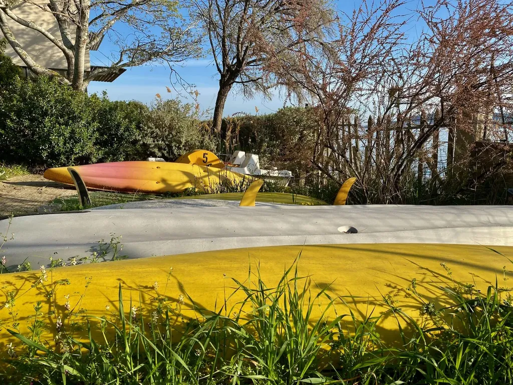

# Journal d’un confiné énervé

Le gouvernement ne nous fait pas confiance, nous ne nous faisons pas confiance, beaucoup ont perdu foi en l’autre et applaudissent les mesures extrêmes. Mais est-ce dans ce monde que nous voulons vivre ? Dans un monde où on se regarde en chiens de faïence ? Où on a peur de l’autre, où on le méprise, où on le suppose par défaut plus stupide que nous ? Où pour survivre on est prêt à sacrifier notre humanité ?

Voilà ce que je prends en pleine figure, voilà ce que j’éprouve, ce que je vis au sixième jour de confinement (ou au septième, ou au cinquième, je ne sais déjà plus). Moi qui d’habitude tiens un journal, [qui le publie tous les mois](../../page/carnets), j’en suis soudain incapable.

Qu’est-ce que je pourrais raconter de ma vie, de notre vie de famille, qui serait différent de la vôtre ? Je ne sors pas, je regarde par ma fenêtre le paysage qui au premier regard est inchangé, mais où rien ne bouge, sauf parfois une voiture, ou rarement un jogger qui défie l’autorité et court au bord de l’étang, comme s’il risquait d’infecter les poissons.

Je pourrais vous parler d’Isa séquestrée dans le studio du jardin où elle cultive son coronavirus, des enfants sur les nerfs qui ne trouvent de salut que dans YouTube et les jeux vidéo, qui parfois vont chercher une belle énergie, Tim à nous faire des brioches superbes, Émile à taguer les murs du garage. Je pourrais vous dire que je meurs d’envie de prendre mon vélo, que je m’en abstiens, non parce que ce serait une mauvaise idée, mais parce que ce serait donner un signal contradictoire à ceux qui ne comprennent pas la notion de distanciation sociale et à qui je ne peux l’expliquer, parce qu’ils seraient capables de me tabasser.

Je pourrais vous parler de mon confinement de privilégier, avec une grande villa, un jardin, je pourrais photographier les jeunes feuilles du printemps, admirer la beauté qui reste à ma porté, l’explosion de la nature qui même entre les pavés de ma terrasse expulse des fleurs, je pourrais faire l’éloge de la contemplation, éloge que je ne cesse de faire en temps ordinaire, mais qui me devient impossible, parce qu’en dehors, à travers les discussions numériques, j’observe des choses hideuse à commencer par la perte de la croyance dans le collectif. Il ne reste plus que soi face aux ordres qu’on accepte de suivre ou refuse. Terminée pour un temps l’idée de construire ensemble, que les autres nous grandissent.

— Tu te réveilles un peu tard.

Voilà ce qu’on pourrait me dire, parce que d’habitude c’est aussi noir. Oui, certes, mais les horreurs qui surgissent cette fois ne sont pas seulement la misère ou la paupérisation, mais le vide sidéral sur lequel reposent nos sociétés. Notre édifice n’a pas de fondation, pas même un échafaudage pour le soutenir, il n’y a que du vide, que du factice, rien à quoi se raccrocher, sinon sa propre survie. Je suis en train de tomber, je manque d’air, ça va de plus en plus vite.

C’est un sentiment qui me traverse, accompagné de rage, de la sensation de gâchis, en rien un tableau de la réalité. J’aimerais être médecin, être auprès des malades, j’aimerais être dans l’action… et alors je vivrais une tout autre histoire, plus dramatique et en même temps plus humaine, car plus solidaire.

Voilà peut-être ce qui me trouble. Le confinement m’empêche de sentir les autres, de percevoir ce qu’ils font pour moi et à quoi d’habitude je ne prête pas attention. Je mesure la solidarité ordinaire par son absence. Les sourires quand je fais mes courses, quand je croise quelqu’un dans la rue, quand je prends un transport en commun. J’imagine quel sera le choc quand tout reprendra comme avant, ce sera pendant un instant comme retrouver la vue, ce sera émouvant, enivrant, puis je n’y prêterai plus attention, parce que l’habitude nivelle les perceptions.

Et le confinement, de par son caractère exceptionnel les réveille, il me surcharge en émotions, je suis à vif, presque comme en voyage dans une contrée lointaine, et tout devient exceptionnel au point d’en être surpuissant, ce qui me pousse à surexagérer mes analyses.

Finalement, je réussis à écrire une entrée de journal, ou une sorte d’entrée de journal. Elle ne dit pas ce que je vis, mais ce que cette vie fait dans mon cerveau, de grosses bulles qui gonflent et ne cessent d’exploser en m’éclaboussant la voûte crânienne.

Le *Lancet* a publié une étude qui montre que l’impact psychologique d’un confinement est loin d’être négligeable, j’en suis en quelque sorte la preuve. [« Obliger les gens à rester longuement confinés chez eux a des effets psychologiques négatifs incluant des symptômes de stress post-traumatique, de la confusion et de la colère. Cela vient réactiver notre répertoire d’émotions de base : peur, colère, frustration. »](https://www.20minutes.fr/monde/2745119-20200321-coronavirus-suisse-durcit-mesures-ecarte-tout-confinement) Je réagis donc bien banalement. Toutes mes idées n’ont aucune importance, des délires provoqués par la confusion. Je me demande pourquoi j’ose les publier, sans doute pris d’un autre délire, celui des vertus du partage, de cette possibilité de reconstruire ce qui s’effondre en même temps. Complètement dingue.

[Lisez aussi le journal de confinement de mon copain Seb Musset…](http://sebmusset.blogspot.com/search/label/confinement)

#covid #politique #coup_de_gueule #y2020 #2020-3-22-7h35
