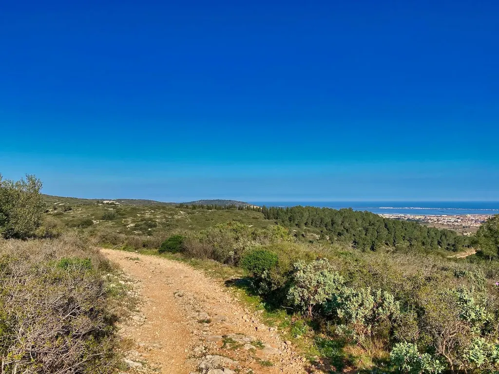

# L’a pas compris le confinement, les flics aussi

L’est un peu neuneu. Je vais finir par le croire en lisant les réactions suite à mon article [pour un droit au vélo en temps de confinement](le-velo-par-temps-de-confinement.md), où le meilleur argument est d’ailleurs donné par Didier Pittet himself dans une vidéo, pas moins que le Pape de l’hygiène des mains et un des plus prestigieux, sinon le plus prestigieux, spécialiste de prévention et du contrôle des infections. Mais désormais tout le monde en sait plus que les spécialistes, parce que le gouvernement l’a dit, le même gouvernement qui a mis deux semaines avant de prendre la mesure de la situation, qui ordonne un confinement total inutile plutôt que faire de la pédagogie, qui nous envoie faire nos courses sans masque et qui refuse de nous dépister.

Mais ce n’est pas le sujet, je ne vais pas y revenir. J’ai tout de même fait un petit tour cet après-midi, pas vraiment plus de deux kilomètres de chez moi. J’en suis revenu dégoûté, avec la certitude paradoxale que le confinement devait être durci, parce qu’autant je n’ai risqué d’infecter personne sur mon vélo, autant j’ai vu des comportements incompréhensibles. Nous avons collectivement un gros problème.

J’ai commencé par faire le tour du village par le bord de l’étang. Je suis très vite tombé sur deux grand-mères assises sur un banc au soleil en train de papoter. Un peu plus loin, une autre femme âgée était installée les pieds dans l’eau tout en téléphonant pendant qu’un bout de choux sous sa surveillance jouait dans le sable.

Distance sociale. Comment expliquer ? Les personnes âgées ne doivent pas avoir de contact, ni entre elles, ni avec les enfants. Ce n’était qu’un début. J’ai doublé des joggers courant côte à côte. Ça passe pour les couples, mais parfois de toute évidence ce n’était pas des couples. Distance sociale, bon sang.

J’ai quitté le bord de l’étang et le silence m’a saisi. Le reste du village était mort, arrêté, le soleil brillait et rien, pas de piéton, pas de voiture. J’ai traversé des quartiers déserts avant de croiser trois nouvelles grand-mères avec deux gamins de cinq ou six ans. Elles n’avaient pas compris n’on plus.

J’ai poussé dans la garrigue d’une beauté époustouflante, les genêts en fleurs crachant leurs fragrances à puissance maximale. J’ai croisé une joggeuse, un vététiste, puis trois couples en train de se balader dans une promiscuité évidente. Peut-être ils couchaient tous les six ensemble. J’avoue que j’ai un peu de mal avec les mœurs des jeunes.

Un peu plus haut, un Kangou déboule, avec deux chasseurs en gilet orange, l’un au volant, l’autre à côté de lui. Ils couchaient aussi sans doute ensemble.

Alors que je rentre, à trois cents mètres de chez moi, une voiture de police arrête un couple avec bébé. Ils échangent de main en main la fameuse autorisation de sortie. Bande d’andouilles. Vous êtes en train de vous passer le virus. Même les forces de l’ordre n’ont pas compris. Si depuis deux jours elles ne cessent de saisir ces feuilles, ça va être un carnage. J’ai foncé sans les regarder, je ne voulais surtout pas que ces deux décérébrés/victimes en uniforme s’approchent de moi.

En moins de deux heures, j’ai vu des dizaines de personnes se passer le virus de main en main avec une insouciance manifeste. Ajouté à cela toutes les photos qui me parviennent en ligne, j’en déduis qu’il ne reste plus qu’à nous interdire tout simplement de sortir de chez nous puisque le concept de distanciation sociale ne passe pas. Je suis juste triste.

Mais pitié, que pour commencer le gouvernement explique à ses hommes et femmes sur le terrain qu’eux aussi doivent maintenir la distanciation sociale. Le confinement est unes mesure de dictature, quand on n’a plus d’autres possibilités.

#covid #politique #coup_de_gueule #y2020 #2020-3-19-17h16
