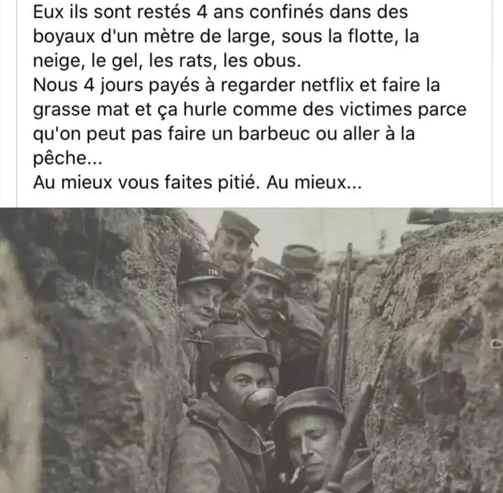

# Le confinement révèle qui nous sommes

En tout cas, si le confinement ne nous révèle pas qui nous sommes à nous-mêmes, il le révèle sans aucun doute à ceux qui nous observent. J’en reviendrai à mon propre cas après quelques détours.

Il y a les philosophes qui se résignent, prennent leur mal en patience, parlent des séries qu’ils regardent et partagent des blagues et des vidéos humoristiques. Merci, sans vous le net serait invivable. Vous me faites du bien. Merci.

Il y a les soldats obéissants. Le gouvernement dit une chose et ils s’y appliquent sans la questionner, quitte à appliquer d’autres règles dès que le gouvernement en change, même si lesdites règles sont dès le début absurdes au regard de l’objectif poursuivi.

Exemple. Le gouvernement a commencé par ordonner la fermeture des restaurants, mais les soldats ont continué de faire leurs courses et d’acheter leur pain et de s’entasser dans les marchés, même si ce comportement rendait quasi impossible le respect des règles de distanciations sociales, les seules règles fondamentales pour lutter contre la pandémie, tout le reste n’étant qu’un habillage judiciaire pour nous contraindre nous autres stupides brebis égarées.

Mais le soldat ne questionne pas l’autorité. Il suit les règles aveuglément. Quand les marchés ont fermé, il a continué d’acheter son pain en boulangerie, au risque de se faire infecter par le boulanger ou par les virus passés de main en main sur son comptoir. Il ne lui est pas venu à l’idée au soldat qu’entre un restaurant et une boulangerie, c’était blanc bonnet et bonnet blanc. Ainsi, il se sacrifie si nécessaire, au nom de la raison d’État. La loi est toujours bonne, et celui qui la conteste est déjà hors la loi.

Parmi les soldats, il y a les ayatollahs, qui s’engagent dans les forces Spéciales de Sanction. Ils traquent les délinquants sur le Net, leur font la morale au moindre dérapage, leur rappellent les bonnes pratiques, alors qu’eux même en ont perdu de vue les raisons premières et les seules qui ont toujours du sens. Peu importe, celui qui déraille doit être rayé, et plus tard peut-être dégommé.

Heureusement, il y a les critiques répartis sur un large spectre, entre les modérés qui relèvent les dérives autoritaires et improductives de nos gouvernements, clan où je range par exemple [Yuval Noah Harari](https://www.ft.com/content/19d90308-6858-11ea-a3c9-1fe6fedcca75), et les extrémistes qui contestent plus ou moins en bloc les bien-fondés des décisions officielles. Par exemple, les supporters du Christ Raoult, [qui initialement exigeaient le dépistage universel au moment où techniquement il était impossible](le-burn-out-frappe-les-confines.md).

Il y a les masochistes. Pour eux, accepter le confinement est une espèce de prouesse, ils ne sont pas loin de se prendre pour des héros parce qu’ils restent chez eux et n’en sortent pas, et tous ceux qui mettent un pied dehors sont des faibles, des pleutres (sauf ceux qui vont acheter le pain quitte à se faire infecter — parce que le masochiste est aussi un peu soldat). Quand j’encourage de faire du sport en solitaire, ils me calomnient, m’accusent de toutes les irresponsabilités (non je ne vais pas acheter mon pain en boulangerie, je le fais moi-même, [courant ainsi cent moins de risques qu’en pédalant à moins d’un kilomètre de chez moi](le-confine-peut-donc-faire-du-velo.md)).

L’un m’a envoyé une photo des poilus dans une tranchée durant la Grande Guerre, me disant que si eux avaient tenu quatre ans, nous pouvions tenir quelques semaines. Il devait se prendre pour l’un de ces combattants, logique depuis que notre Président abuse d’un vocabulaire martial, prétendant que nous sommes en guerre, et donc nous faisant basculer dans une société en guerre, avec tous ses travers.

Les gars, atterrissez, personne ne nous bombarde. C’est nous tous qui nous crachons dessus, au propre et au figuré, et il suffit de se tenir à l’écart les uns des autres pour être à l’abri, et si par malheur on tombe malade, de s’imposer une quarantaine rigoureuse.

En vérité, cette photo de tranchée pose une bonne question à laquelle mon pourfendeur n’a sans doute pas songé : les poilus n’auraient-ils pas mieux fait de se mutiner de part et d’autre de la ligne de front et de mettre fin à la boucherie ? Je pense que oui. Subir la volonté d’État n’a jamais été un gage de santé mentale.

Mon tableau des caractères est nécessairement incomplet. Il y a bien sûr les bienveillants, tout aussi indispensables que les philosophes. Et puis il y a les énervés, où je me situe et où je situe Raoult sans aucune hésitation. L’injustice évidente, l’irrationalité, la bavure d’État nous rendent dingues, quitte à nous faire perdre notre propre lucidité.

Intéressant le parcours de Raoult ces dernières semaines. [Entre le 31 janvier et le 29 février](http://curiologie.fr/2020/03/chloroquine/), comme tout le monde ou presque, il parle du coronavirus comme d’une simple grippe saisonnière. [Il enfonce le clou le 25 février](https://www.youtube.com/watch?v=8L6ehRif-v8&feature=emb_logo) quand il dit qu’il s’agit d’une infection pulmonaire simple à traiter, se vantant d’avoir encouragé les Chinois à tester la chloroquine, ce qu’ils auraient fait avec succès selon la lettre [Breakthrough: Chloroquine phosphate has shown apparent efficacy in treatment of COVID-19 associated pneumonia in clinical studies](https://www.jstage.jst.go.jp/article/bst/14/1/14_2020.01047/_pdf/-char/en). Et cette lettre à l’appui, Raoult enfourche un nouveau cheval de bataille, le coronavirus devenant une affaire sérieuse, d’autant que dans son hôpital des patients meurent malgré une administration de chloroquine.

La situation exige la célérité et nécessite de garder un esprit ouvert et de changer d’avis à tout moment, qualité dont fait preuve Raoult. Mais il montre un défaut évident, il aime s’afficher, aime qu’on parle de lui et n’a-t-il pas trouvé avec cette histoire un merveilleux tremplin. Pour rebondir n’est-il pas prêt à prendre des risques démesurés ?

J’espère que la chloroquine se montrera capable de sauver des vies, nous le saurons vite, mais je ne peux m’empêcher de penser que Raoult a fait un pari médical, ce que j’approuve, car on n’a pas le temps de faire autrement, et simultanément un pari médiatique, ce qui m’effraie, les rêves de gloire ayant tendance à vite consumer les rêveurs.

J’en arrive à mon propre cas. Quand j’enfourche le sujet du sport, quand je me bats pour notre droit à l’exercice en temps de pandémie, quand j’accuse le gouvernement de pratiquer un confinement imbécile et contre-productif, peut-être que moi aussi je surfe sur la vague, que je veux me faire mousser. J’avoue que j’aime être contre l’avis de la majorité, que la majorité me fait peur, que je déteste les mouvements de foule comme les mouvements d’opinion, il me semble important de faire un pas de côté, de regarder couler le fleuve.

On me demande pourquoi je parle de tel ou tel sujet non consensuel plutôt que de me taire. Je parle parce qu’il me faut dire les choses, déjà pour me soulager, mais aussi parce que si je pense ainsi d’autres aussi ou plus ou moins, et la confrontation de nos pensées peut nous aider à mieux penser, à peu à peu ajuster nos positions.

J’écris pour me tenir droit, pour rectifier ma pensée qui sinon suivrait la pente dominante et ne m’appartiendrait plus, et cela je ne le veux pas, ni pour moi ni pour personne. C’est un réflexe constant chez moi. Rester un et irréductible. J’aimerais que nous ayons tous cette volonté de nous tenir à l’écart de toute soldatesque. Voilà mon seul et unique combat.

#covid #politique #y2020 #2020-3-25-8h6
