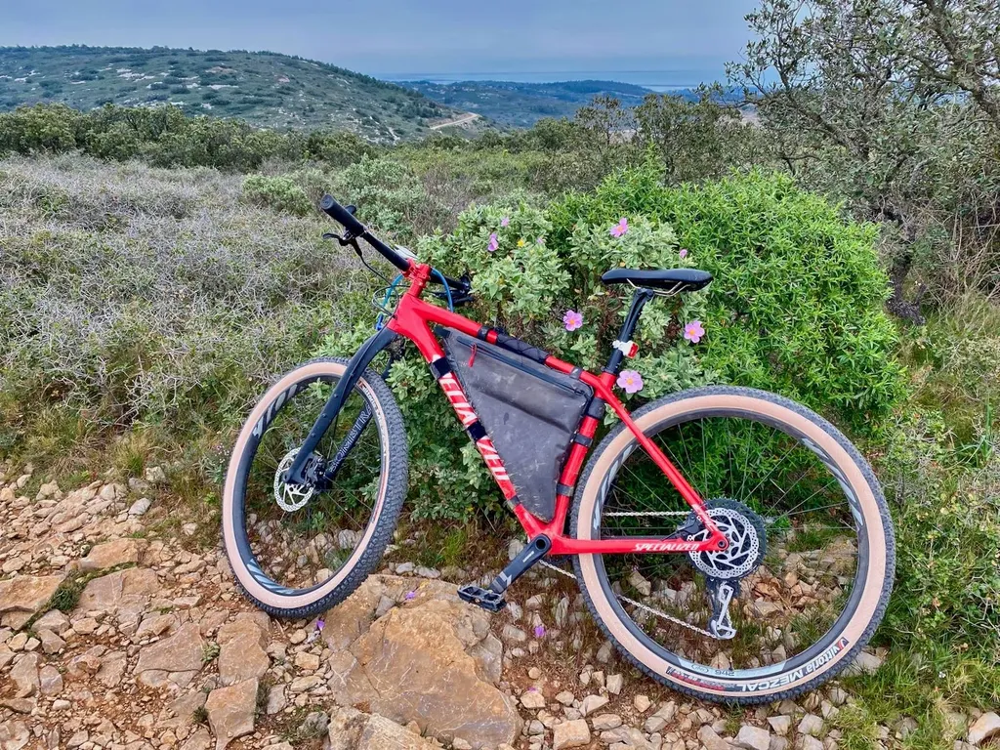

# Le vélo par temps de confinement

Mardi après-midi, il faisait doux, mais gris. On était au premier jour du confinement. La veille au soir, le Président avait dit que nous pourrions continuer à sortir pour faire de l’exercice, du moment que nous respections les mesures de distanciation sociale. J’ai décidé de faire un tour à vélo.

J’ai téléchargé [l’attestation de déplacement dérogatoire](https://www.service-public.fr/particuliers/vosdroits/R55781) qui m’a conforté dans ma décision. J’ai coché la case « déplacements brefs, à proximité du domicile, liés à l’activité physique individuelle des personnes, à l’exclusion de toute pratique sportive collective, et aux besoins des animaux de compagnie. » Et je suis parti.

J’ai de la chance. Une piste cyclable passe devant chez moi, mais je ne l’ai pas suivie dans son sens naturel, me disant qu’elle me pousserait vers là où iraient les autres cyclistes et joggers. J’ai préféré traverser mon quartier, rejoindre le port de plaisance et la route de Sète. Elle était déserte, c’était impressionnant. Je l’ai traversée, j’ai bifurqué sur une petite rue, escaladé une butte, rejoint une autre route, toute aussi déserte, que j’ai coupée et en moins de deux kilomètres je me suis retrouvé sur les sentiers de la garrigue.

J’avais du mal à être tout au vélo. Est-ce que je respectais ou non les consignes gouvernementales ? Mon déplacement serait-il bref ? Mais qu’est-ce que ça signifie bref ? Et à proximité ? En école de journalisme, on apprend à être précis. Le gouvernement a introduit un flou autorisant interprétation. Deux heures est-ce bref ? À dix kilomètres de chez soi est-ce encore à proximité ? On peut répondre oui, non, on peut s’étriper à ce sujet.

[Le point sur la législation, la règles des 1 km…](le-confine-peut-donc-faire-du-velo.md)

Dans les chemins, je n’ai jamais croisé autant de promeneurs et d’autres cyclistes. C’était soudain comme durant les vacances. Les familles se promenaient comme si de rien n’était, mais les gens qui ne vivaient pas ensemble veillaient à se tenir à distance les un des autres. Techniquement, nous ne courions aucun risque de nous transmettre le virus. Et de bon augure, tout le monde se souriait et se disait bonjour.

Peut-être parce que depuis des semaines [j’écris à nouveau sur la prévention et le contrôle des infections](../../page/le-geste-qui-sauve), je restais préoccupé. Je percevais la chape de plomb. Je n’étais plus en train de faire du vélo, mais seulement de l’exercice. Je pédalais sans plaisir, d’autant qu’il faisait de plus en plus sombre et froid.

En rentrant, j’ai regardé une vidéo de [mon héros Didier Pittet](../../page/le-geste-qui-sauve), qui rappelait les règles de distanciation sociale, qui expliquait que bien sûr nous pouvions faire des footings ou du vélo. Mais, en parallèle, les ayatollahs de la bien-pensance exigeaient que nous nous cloîtrions chez nous, que nous respections les autres en rangeant nos bécanes et nos baskets, les mêmes sans doute qui, il y a un mois, se moquaient de moi quand je refusais de leur serrer la main, appliquant déjà la distanciation sociale.

Hier, mercredi, il faisait un temps sublime, et l’après-midi j’ai résisté à rouler, en éprouvant une grande frustration. Ce matin, je lis toujours les arguments des ayatollahs : à vélo, on risque la chute, donc d’encombrer les hôpitaux inutilement. Ça se tient en apparence. Mais arrière-plan de cette réponse prétendument raisonnée, je lis souvent des arguments autoritaristes, la nécessité de respecter la loi, d’obéir point. Les mêmes traitent les autres d’irrespectueux sans se priver de les traiter de cons sans le moindre respect. La violence pointe dans leurs propos, la haine latente prête à exploser, la vague brune prête à nous balayer.

Nous devrions rester cloîtrer chez nous parce que d’autres ne peuvent pas sortir, parce que d’autres travaillent, parce qu’ils n’ont pas le choix, qu’il faut les respecter, et que d’autres souffrent, sont malades. Nous devrions en quelque sorte faire preuve de contrition et de solidarité en nous flagellant. Comme si en temps ordinaire tout allait bien dans le meilleur des mondes. Les ayatollahs enchaînent des arguments moraux qui n’ont plus aucun rapport avec la lutte contre la pandémie. Survient un glissement dangereux vers la pensée extrême comme si la situation de crise levait toutes les inhibitions et autorisait de déverser sa noirceur intérieure sans retenu. Quand quelqu’un m’accuse de ne pas faire preuve de solidarité, je suis toujours sur mes gardes, me demandant comment jusqu’à ce jour il a manifesté sa solidarité aux plus démunies, aux malades, aux pauvres ? N’est-il pas en train de m’accuser de ne pas faire ce qu’il n’a jamais fait et qu’il croit soudain faire en restant chez lui ?

Alors peut-être est-il bon de faire preuve d’un peu de raison. Dans les situations de crise, et notamment durant les épidémies meurtrières comme Ebola, il y a toujours recrudescence de violence parce qu’elle accompagne la peur, parce que certains en jouent, profitant des rues désertes pour commettre leurs exactions, parce que d’autres sont en situation de faiblesse. Les femmes sont souvent les premières à en pâtir avec une augmentation du nombre de viols. Chez nous, déjà, des voyous cassent les voitures des médecins pour voler leur caducée. Et sur les réseaux sociaux, les ayatollahs s’adonnent à cœur joie à la violence verbale. Je ne suis qu’un pauvre con.

Le confinement extrême ouvre la porte à des comportements extrêmes. Il est souvent applaudi par ceux qui avant l’ordre gouvernemental n’ont jamais respecté les consignes de distanciation sociale. Parce que voilà la seule mesure efficace. Et c’est parce que collectivement nous avons été incapables de la respecter que le gouvernement a durci le ton, non pas parce que le confinement est nécessaire pour lutter contre la pandémie. Il est nécessaire quand nous nous comportons comme des imbéciles, continuant à nous entasser dans les transports en commun ou dans les jardins publics ou à faire nos courses avec des mains infectées et sans maque. Voilà l’irresponsabilité.

Quant à l’argument selon lequel à vélo on risque l’accident et de surcharger les hôpitaux il ne vaut pas grand-chose. Chaque année, 11 millions de Français se blessent à la maison, [20 000 décèdent suite à un accident domestique](https://www.sante-sur-le-net.com/sante-quotidien/accidents-vie-courante/accidents-domestiques/), [cent fois plus que les cyclistes](https://www.bfmtv.com/societe/securite-routiere-184-personnes-sont-mortes-a-velo-et-11-en-trottinettesen-2019-1850654.html), la plupart de ces accidents cyclistes mortels survenant en ville ou sur route, pas dans les chemins de campagne. OK, je me suis [fracturé le col du fémur sur un chemin de campagne](../../2019/8/un-auteur-se-fracture-le-femur-pour-faire-parler-de-lui.md), à 500 mètres de chez mes beaux-parents, ça peut arriver à n’importe qui, n’importe quand, n’importe où, même à 50 mètres de chez soi, la chute est toujours stupide, mais je doute que les sportifs compliquent beaucoup le travail des services hospitaliers dans les semaines qui arrivent.

Quand on serre trop la vis d’un côté, ça craque d’un autre. Par exemple, en Iran où l’alcool est interdit, la consommation d’alcool est une des plus fortes au monde. La prohibition n’est jamais une solution, mais la modération. On n’en vient à l’extrémisme que face à l’irresponsabilité et à d’autres extrémismes. À nous de rester modérés, d’appliquer les consignes de distanciation sociale, de minimiser les risques tout en introduisant de la souplesse dans notre organisation de crise, le droit à l’exercice en étant un. C’est ainsi que collectivement nous nous en sortirons.

Oui, certains cyclistes se blesseront durant cette période, mais aussi des bricoleurs du dimanche qui désœuvré chez eux tomberont d’une échelle ou se couperont un doigt, et aussi des automobilistes en allant faire leurs courses parfois inutiles. C’est la vie, on ne peut arrêter la vie, réduire à zéro les risques, surtout pas par des mesures coercitives. Pour lutter contre une pandémie, on a besoin d’intelligence collective selon le modèle de la Corée du Sud, veiller avec rigueur à la distanciation sociale. J’espère que nous le comprendrons et que le gouvernement ne sera pas obligé de nous interdire de faire de l’exercice. Ce serait notre échec à tous, d’autant que l’exercice stimule le système immunitaire, donc nous aide à lutter contre les infections. [D’ailleurs le ministre de la Santé allemand conseille de faire du vélo pour limiter les risques.](https://www.courrierinternational.com/article/vu-dallemagne-face-au-covid-19-le-velo-protege-doublement) J’ai envie de hurler.

[La suite du billet écrite quelques heures plus tard après une petite sortie…](la-pas-compris-le-confinement.md)
*PS : J’ai commencé à appliquer les mesures de distances sociale mi-février quand j’ai appris l’étendue de la catastrophe qui se préparait en Italie. Mais voilà qu’on m’accuse d’irrespect et de tout ce que j’ai dénoncé dans l’article, sans oublier les attaque ad hominem. [Quand la FFC déconseille l’usage du vélo, ce n’est pas un décret gouvernemental, mais un conseil peu argumenté.](https://www.ffc.fr/activite-physique-individuelle-precisions-ffc/) De leur côté, comme les Allemands, [les Belges recommandent l’activité physique](https://www.directvelo.com/actualite/81325/la-belgique-recommande-l-exercice-physique). Mais même notre ministre des sports nous interdit de faire du vélo maintenant. L’émotionnel a pris le pas sur la raison. On en oublie l’épidémie, les causes techniques du confinement et on applique la règle aveuglement et sans discernement. Nous allons tous payer l’irresponsabilité de quelques uns.*

#covid #velo #coup_de_gueule #y2020 #2020-3-19-7h13
