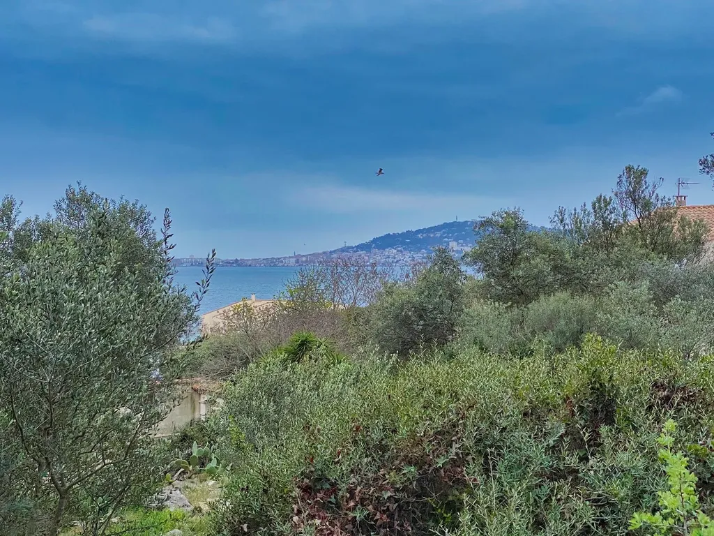

# Vous kiffez le confinement ?

Tous les jours, je me dis que j’en ai fini avec cette pandémie, que j’ai fini d’en parler, qu’il ne me reste lus qu’à me cloîtrer dans le silence, mais non, impossible, toujours des choses me remuent et me poussent à écrire (heureusement que rien ne vous force à me lire).

Parce que comment rester silencieux face à l’anormal, à l’inattendu, à la disruption du monde ? Si je devais me taire, si on m’interdisait d’écrire, je crois que je devrais aussi me couper des news et des discussions, je ne supporterais cette réclusion qu’en ermite. Ce serait peut-être plus sage, parce qu’ajouter de mots à des maux n’a peut-être pour seul effet que d’élever le niveau d’anxiété général. Mais paradoxalement, pour moi, égoïstement, écrire me détend, relâche les tensions comme le yoga pour d’autres. Si je pouvais faire du vélo, j’écrirais moins, mais on m’a plus ou moins interdit cet exutoire sportif et esthétique.

Face à l’anormalité, je ne suis pas sidéré, je réagis, j’éprouve, m’interroge, au point de me demander si nous ne sommes pas en train de kiffer le confinement. Nous nous retrouvons face à nous même, face à nos peurs, face à nos erreurs individuelles et collectives, et tout ça implique des pensées neuves, ou tout au moins en surnombre, qui donnent à nos heures de confinement une épaisseur bien plus importante qu’aux heures de nos journées d’avant. Nous sommes conscients de vivre quelque chose de mémorable comme si nous assistions à la naissance d’un enfant dont nous ignorons tout de la destinée (aucune prophétie pour annoncer son destin et c’est bien plus excitant ainsi).

Nous tenons notre guerre, notre grande aventure collective, celle qui gravera nos mémoires, surtout celle des plus jeunes et qui plus tard se diront « Tu te souviens de 2020 quand on était confinés ? Tu te souviens de la libération ? », et tout le monde s’en souviendra, avec l’impression que cette épreuve aura duré bien plus longtemps que bien d’autres époques de leur vie, parce qu’elle aura été en rupture totale avec une normalité assez terne caractérisée par la répétition.

Nous kiffons le confinement parce que nous sentons son poids historique et biographique. Nous avons été jetés hors d’un film qui jusque là se traînait langoureusement et pas nécessairement vers un avenir radieux et qui soudain s’emballe. Nous avons le sentiment que les cartes seront rebattues à jamais, un sentiment de révolutionnaire, souvent trompeur, mais peu importe, il est puisant, enivrant, pas loin d’avoir une force psychotrope.

Cette ivresse engendre quelques travers, les travers propres à toute révolution, on a le couteau facile et la décapitation n’exige aucun procès. Il suffit que [je touche à un cheveu de Raoult](le-burn-out-frappe-les-confines.md), dont il ne manque pas, pour qu’on me porte au bûcher. Je n’ai pas réfuté, pas plus qu’embrassé, je me suis juste permis de douter, d’être prudent et de relever quelques exagérations [comme de faire croire qu’il était aujourd’hui possible en France de pratiquer des tests de dépistage à grande échelle](https://www.lesechos.fr/economie-france/social/coronavirus-la-france-tente-de-modifier-sa-strategie-de-depistage-1188099).

Mais en pleine révolution, il faudrait choisir son camp, on devrait croire à Raoult ou ne pas y croire. Je suis athée et je ne vais pas commencer à me prosterner devant une nouvelle figure christique, qui si j’étais citoyen d’un autre pays, prendrait l’apparence d’un autre chercheur, peut-être un de ceux qui testent des vaccins ou des antiviraux avec moins de maîtrise du marketing de soi.

La révolution pousse à choisir son camp. C’est assez étrange, parce que la bataille n’est pas censée se dérouler entre nous, mais entre chacun de nous et un virus. Déjà oubliée, cette contingence préliminaire passe au second plan, on en revient au schéma historique traditionnel, à la confrontation de hordes primitives. Je ne suis pas rassuré quant aux conséquences pour après le confinement. Il subsistera des blessures et des traumas dont peut-être on ne voudra pas se souvenir, ou qui au contraire fixeront la mémoire, en coloreront la narration.

Nous kiffons le confinement parce qu’il engendre des excès dignes plus tard d’être moqués ou de devenir le sujet de roman. Nous le kiffons parce qu’il nous bouscule, parce qu’il nous irrigue d’informations auxquelles ne nous intéressons pas d’habitude, parce qu’il s’accompagne du danger de mort indispensable à toute aventure digne de ce nom, parce qu’il est potentiellement tragique, nous le kiffons pour sa simplicité, pour son minimalisme, parce qu’il casse tout ce qui nous emmerde d’habitude — les messes sportives, les messes religieuses, les messes politiques, les messes économiques —, tout cela balayé, on en revient à l’essentiel. Je respire, je n’ai que cela à faire. Me poser, inspirer, expirer. Moi, aussi je kiffe le confinement, parce qu’il s’insinue en moi, y creuse une rivière dont je ne sais pas dans quelle mer elle se jettera.

#covid #politique #coup_de_gueule #y2020 #2020-3-24-7h25
