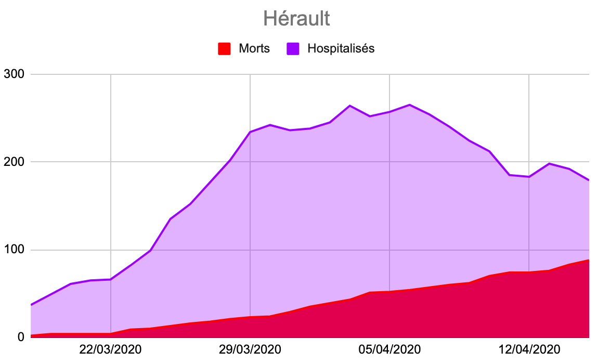

# Covid-19, c’est terminé ?

Tous les jours des informations remontent qui aident à voir la situation sous une lumière nouvelle. L’une des données les plus sensibles est le taux de mortalité du Covid-19.

Initialement, l’OMS a déclaré 2 %, puis 3,8 %, ce qui est gigantesque et ce qu’aucun spécialiste n’a cru parce qu’on surestime toujours la mortalité en début de crise. Mais depuis ce taux n’a cessé d’être rabaissé, ce qui est une bonne nouvelle. [En testant tous les habitants d’une ville](https://www.lemonde.fr/planete/article/2020/04/10/coronavirus-une-etude-allemande-revoit-a-la-baisse-le-taux-de-mortalite_6036206_3244.html), les Allemands ont dénombré les positifs et, en les suivant, ont relevé une mortalité de 0,37 % ([on me signale que les résultats de cette étude sont douteux suite à un problème de méthodologie](https://scilogs.spektrum.de/menschen-bilder/the-heinsberg-study-on-covid-19-another-case-of-insufficient-study-design/)).

[Une nouvelle étude américaine](https://www.economist.com/graphic-detail/2020/04/11/why-a-study-showing-that-covid-19-is-everywhere-is-good-news), plus théorique mais s’appuyant sur des données de terrain, aboutit à une mortalité de 0,1 % ([tout de même dix fois plus que la mortalité de la grippe saisonnière constatée et non sa mortalité estimée par surmortalité](http://h16free.com/wp-content/uploads/2020/04/La-vraie-mortalit%C3%A9-de-la-grippe-saisonni%C3%A8re.pdf?fbclid=IwAR2PiFSShMAKg9W5ow1FY5W1_pNU371n1F2XkaRHWp08Ew-oFkf9J15L6KQ)). À partir du nombre de victimes, on peut donc en déduire le nombre d’infectés, et potentiellement d’immunisés ([à condition que nous puissions construire une immunité durable ce qui est loin d’être sûr](https://science.sciencemag.org/content/early/2020/04/14/science.abb5793), à condition qu’il n’y ait qu’un seul virus, qu’il ne mute pas trop vite… ça fait beaucoup de si, je joue avec des possibilités, je ne cherche pas à prévoir l’avenir, je m’interroge).

Le 15 avril, on compte 17 167 décès en France dans les hôpitaux et les Epad. [Une autre étude](https://www.economist.com/graphic-detail/2020/04/03/covid-19s-death-toll-appears-higher-than-official-figures-suggest), s’appuyant sur la surmortalité mesurée dans les clusters, a estimé que la mortalité réelle pouvait être pondérée jusqu’à 150 %, ce qui inclurait les morts du Covid à la maison. Ce qui nous donnerait potentiellement : 25 millions de Français déjà immunisés (=17167x1,5x100/0,1). On peut refaire le même calcul département par département pour plus de réalisme.

En prolongeant les courbes de victimes de la façon la plus optimiste possible, on devrait décompter début mai environ 22 000 victimes en France. Si on refait le même calcul, on arrive à 33 millions de Français immunisés. On serait donc très proche de l’immunité de groupe [comprise entre 40 et 59 millions d’immunisés](le-coronavirus-infecte-nos-cerveaux.md).

Quand j’ai montré que [l’immunité de groupe était une stratégie dangereuse](le-coronavirus-infecte-nos-cerveaux.md), j’étais parti sur une mortalité de 0,5 %. Si on refait le même calcul avec cette mortalité, on arrive à seulement 6,6 millions de Français potentiellement immunisés, ce qui n’est pas du tout la même affaire.

Il s’agit d’hypothèses, pas d’une description de la réalité. J’en vois déjà qui tomberont sur le gouvernement pour dire que le confinement était la mauvaise stratégie. Je le répète : on supposait un taux de mortalité bien supérieur quand la décision a été prise. Ne refaisons pas l’histoire. Maintenant, si le taux de mortalité est très bas, c’est rassurant pour l’avenir. Mais nous n’avons aucune certitude à ce sujet et le principe de précaution sanitaire s’impose jusqu’à ce que nous ayons des certitudes (au sujet de la durée de l’immunité ou du R0 du virus, par exemple). Une seule chose reste sûre : [poursuivre l’immunité de groupe au départ était une stratégie suicidaire](le-coronavirus-infecte-nos-cerveaux.md), et ça le reste aujourd’hui.

Pour y voir clair, il faudra suivre l’évolution de la situation aux États-Unis et en Suède, deux pays qui ont pris des mesures de confinement laxistes. Les courbes suivront-elles là-bas la même trajectoire que chez nous ?

[Dans le même article référencé plus haut](https://www.economist.com/graphic-detail/2020/04/11/why-a-study-showing-that-covid-19-is-everywhere-is-good-news), je découvre qu’il faut entre 20 et 25 jours entre la contamination et la mort éventuelle. Depuis le début, j’utilisais la valeur de 17,3 jours pour mes simulations. Cela implique qu’il faut attendre presque quatre semaines pour voir les effets d’une mesure, ce que nous sommes tout juste en train de constater pour le confinement en France. Le 15 avril le nombre d’hospitalisés a baissé pour la première fois. C’est la bonne nouvelle que nous attendions : enfin la contamination faiblit (ou plus précisément elle faiblit depuis au moins une dizaine de jours).

Cela signifie que nous commençons à bénéficier du confinement, au moment même où nous serions en train d’atteindre l’hypothétique immunité de groupe. Et il n’aurait en quelque sorte servi à rien. Mais ne commettons pas la même erreur qu’avec Roselyne Bachelot en 2009, accusée d’avoir été trop prudente. Quand des centaines de milliers de vies sont en jeu, on n’est jamais trop prudent. Le principe de précaution sanitaire doit s’imposer. Je préférerais que nous découvrions a posteriori que nous nous sommes confinés pour rien plutôt que nous ne l’ayons pas fait provoquant une catastrophe.

L’urgence est maintenant d’obtenir les résultats d’une étude sérologique pour connaître le niveau d’immunité de la population française. En attendant, on en est réduit à faire des hypothèses à partir de données incertaines.

Reste que plus nous avançons dans la pandémie, plus je me passionne pour son analyse médicale, politique, psychologique… J’en arriverai presque à oublier les contraintes du confinement (tout ça parce que je suis un foutu privilégié qui travaille chez lui, avec sa tête, et qui ne prend aucun risque, oui, je sais).

C’est l’occasion de répondre une bonne fois pour toutes à ceux qui me critiquent de n’avoir aucune autorité pour parler de toutes ces choses. Quel décret m’interdit de réfléchir et de réagir ? Si les citoyens des dictatures ne le faisaient pas, ils resteraient en dictature, et nous-mêmes serions toujours en dictature. Si on attend des hommes de pouvoir qu’ils modifient les règles du pouvoir, on peut attendre longtemps.

[Quand Tomas Pueyo a publié son modèle de la pandémie](../3/des-chiffres-expliquent-le-coronavirus-et-decredibilisent-les-elections.md), les principales critiques, surtout en France, ont été qu’il manquait de légitimité. Plutôt que de juger avec un esprit critique ses idées, on s’en est pris à lui, lui déniant le droit d’avoir un cerveau et de se pencher sur un problème nouveau pour lui, et d’ailleurs assez nouveau pour tout le monde, les spécialistes de l’épidémiologie ayant été les premiers pris de court.

J’ai lu Tomas Pueyo, lui ai piqué une idée qui me paraissait intéressante : si on connaît la durée moyenne entre l’infection et la mort éventuelle et si on connaît le taux de mortalité, on peut en déduire le nombre de cas réels au jour de l’infection. [Ce modèle m’a permis d’anticiper avec une bonne précision la mortalité en France.](https://docs.google.com/spreadsheets/d/1PqMVPU0VYcDWrUnDh1CsGYr_A7Zk3iZco77X-vToS9Q/edit?usp=sharing) Chaque donnée entrée dans le modèle ajustant les prévisions futures.

« Tu es toubib, toi ? De quel droit tu parles de tout ça ? » La réponse est simple : j’ai le droit de me nourrir avec toutes les données que je trouve et que beaucoup de gens me soumettent.

Hier encore, on m’a dit : « Bravo. Tu es interne médecine 5e année depuis mars 2020. » Non, je ne suis pas médecin, mais écrivain avec un passé d’ingénieur et de journaliste. J’ai plongé dans le domaine de la prévention et du contrôle des infections par accident en 2012 quand j’ai rencontré Didier Pittet. J’ai écrit en 2013 *[Le Geste qui sauve](../../page/le-geste-qui-sauve)*, en 2016 *[Résistants](../../page/resistants)*, j’écris en ce moment *Adapter pour adopter*, la suite du *Geste qui sauve*. Depuis toutes ces années, je ne cesse de discuter avec des spécialistes, d’établir des liens entre eux, parfois leur révélant des données de champs connexes qu’ils ne connaissent pas. J’ai fini par avoir une certaine expertise sur ce domaine très spécialisé, mais aujourd’hui particulièrement sensible. J’en sais beaucoup plus sur ce point précis que mes copains médecins de terrain. Voilà pourquoi j’écris autant sur le coronavirus, pourquoi je joue avec les chiffres, pourquoi je décrypte ce que j’entends.

Tout le monde a le droit d’en faire autant.

*PS : Dans l’Hérault où je vis, la situation est bien meilleure qu’au plan national, la baisse des hospitalisations ayant commencé dès le 7 avril. Je peux faire le même calcul. Le 15 avril, on a 88 victimes, ce qui donne 132 000 immunisés pour une population de 1,165 million d’habitants, soit 11 % d’immunisés. On est donc très loin de l’immunité de groupe, ce qui implique que les régions les plus touchées sont beaucoup plus près de cette immunité si tant est qu’elle soit possible.*

#covid #y2020 #2020-4-16-7h52
