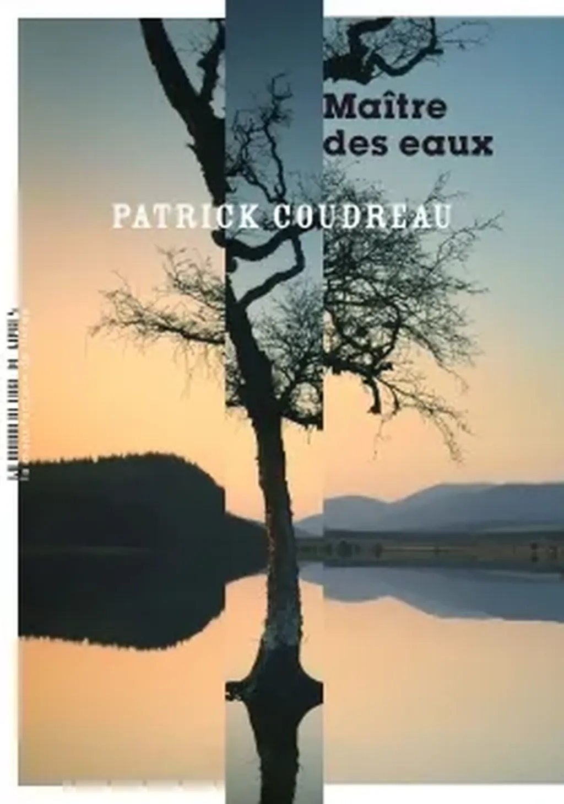

# Fourniaud Coudreau,  ça rime pas pour rien

[*Le maître des eaux*](https://www.lamanufacturedelivres.com/livres/fiche/168/coudreau-patrick-maitre-des-eaux) de Patrick Coudreau, un roman noir, dur comme une noisette, compact comme elle, recroquevillé sur lui-même, sans le moindre gras. Une unité intense avec des dialogues dignes des *Tontons flingueurs*, avec des salauds absolus, un antihéros mi-magicien mi-philosophe et une coulée de miel qui électrise la narration et lui apporte la vie. J’ai pensé aux romans de Chandler et de Simenon, à ces histoires des années 1950, jetées d’un trait, jetées sans effort, sans circonvolutions et détours, comme une histoire vraie à l’opposition du tiré à la ligne cher aux thrillers que définitivement je suis incapable de lire.

J’ai noté un passage de circonstance en temps de confinement, quand nos potentats multiplient les excès de zèle et les mesures liberticides :

> Je suis le maire, ça me confère quelques pouvoirs comme on dit, et on ne s’attaque pas à moi comme ça. Pas même quand on est galonné. Les gendarmes et moi, on marche main dans la main, c’est comme ça que ça fonctionne ; une commune, ça peut pas tourner rond, si les deux autorités se font la gueule et se cherchent des poux dans la tête.

Patrick, tu devrais nous en écrire un tous les mois de petit roman comme ça, sauf qu’on n’est plus à l’époque où ce genre d’histoire venait seule, c’est presque un miracle que tu sois allé la pêcher, puis que Pierre Fourniaud soit venu te pêcher.

Pourquoi je t’ai lu, parce qu’on s’est retrouvé à manger ensemble un soir pluvieux à Montpellier. Pourquoi on a mangé ensemble, parce que Pierre est aussi mon éditeur. Et je me rends compte que j’aime presque toujours les auteurs qu’il publie, comme s’il venait nous chercher dans un continuum à contre temps, ou à contre mode, ou peut-être à contre-poil.

Parfois je me dis que je me tiens au bord de cette mer, assis sur un ponton, les pieds ballants, sans oser y plonger. Quand on commence à connaître un éditeur, ses auteurs, les textes qu’il aime, on peut être tenté de lui donner ce qu’il a envie, pour exister en tant qu’auteur à ses yeux déjà, aux yeux des libraires qui le suivent, puis des lecteurs qui les suivent.

Mais je tiens à rester sur mon ponton, à écrire d’abord ce qui m’importe, et je sens combien c’est difficile, parce que ce qui nous importe nous autres auteurs n’a souvent que peu de rapport avec ce que le marché attend, parce que si tel était le cas nous n’écririons pas, parce qu’écrire n’est pas seulement un moyen de gagner notre vie, et le plus souvent il ne l’est pas du tout. Mais qu’est-ce qu’attend Pierre ? Peut-être que lui-même ne le sait pas, et cette ignorance me plaît chez lui, son attente en creux.

Tout ça pour dire qu’il y a désormais un couleur Fourniaud à laquelle, toi Patrick, tu contribues dans ta forêt imaginaire âpre et sauvage.

#critique #y2020 #2020-4-19-11h43
