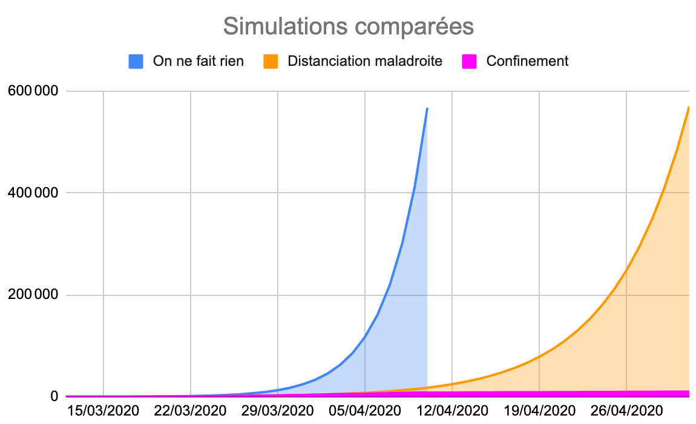
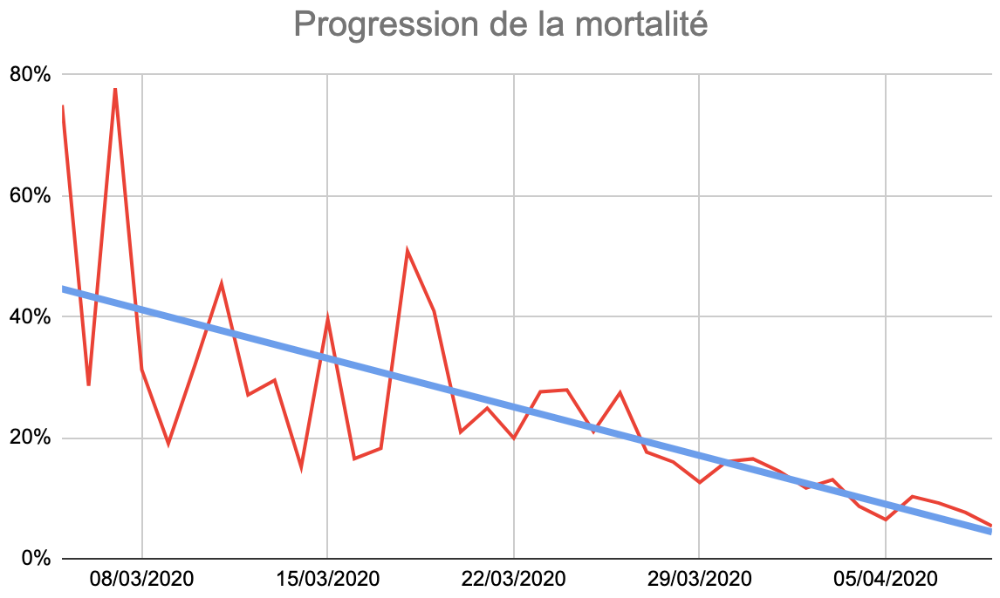

# La stratégie suicidaire de l'immunité de groupe

Le coronavirus infecte nos cerveaux. C’est une conséquence inattendue de la pandémie couplée au confinement que d’engendrer des comportements délirants, [chez les membres du gouvernement](quand-le-gouvernement-nous-ment-preuves.md) et [de l’administration](le-retour-des-milices-chasseurs-a-vos-armes.md), mais aussi chez chacun de nous. Parfois, j’ai l’impression de ne plus reconnaître mes amis tant ils tiennent des propos farfelus, dangereux ou irresponsables.

Je me dis qu’alors moi aussi je souffre du même mal, d’autant plus que j’ai côtoyé une positive pendant plusieurs semaines, et que j’ai toutes les raisons d’être mentalement malade, puisque l’aspect neurologique de la pandémie a été négligé jusque là.

Comme souvent, je vais en revenir aux chiffres, même si je dois admettre que la schizophrénie nouvellement diagnostiquée affecte en priorité notre capacité à traiter des données chiffrées. Je m’y essaie encore une fois, parce que les arguments de bon sens semblent encore moins efficaces désormais.

* Nous ne savons même pas [si une immunité de groupe est possible avec ce virus](https://science.sciencemag.org/content/early/2020/04/14/science.abb5793), nous ne savons pas à quelle vitesse il mute, nous ne savons pas combien de temps dure l’immunité construite par les malades guéris. [L’OMS déclare que très peu de malades développent des anticorps après guérison.](https://www.reuters.com/article/us-health-coronavirus-immunity/who-unsure-antibodies-protect-against-covid-little-sign-of-herd-immunity-idUSKBN21Z2XM) Donc viser quelque chose d’aussi incertain est pour le moins osé. Je pourrais arrêter là cet article.
* Nous n’avons que des estimations de la mortalité du coronavirus. [D’après les données récoltées sur le *Diamon Princess* puis modélisée](https://www.ncbi.nlm.nih.gov/pmc/articles/PMC7118348/), elle s’élèverait à 1,3 %. [Les Anglais l’estiment entre 0,5 % et 1 %.](https://www.bbc.com/news/health-51674743) Une étude Allemande a mesuré [0,37 % dans la ville de Gangelt](https://www.lemonde.fr/planete/article/2020/04/10/coronavirus-une-etude-allemande-revoit-a-la-baisse-le-taux-de-mortalite_6036206_3244.html) où tout le monde a été testé ([mais elle est déjà remise en question](https://scilogs.spektrum.de/menschen-bilder/the-heinsberg-study-on-covid-19-another-case-of-insufficient-study-design/)). [On tombe même à 0,1 % d’après une étude américaine.](https://www.economist.com/graphic-detail/2020/04/11/why-a-study-showing-that-covid-19-is-everywhere-is-good-news) Pour la suite, je pars sur une mortalité de 0,5 %, [celle évoquée par l’institut Pasteur](https://www.nouvelobs.com/coronavirus-de-wuhan/20200421.OBS27790/avec-6-de-la-population-infectee-par-le-covid-19-la-france-reste-loin-de-l-immunite-collective.html).
* À titre de comparaison, la grippe saisonnière tue en France [moins de 1 000 personnes/an](https://www.ined.fr/fichier/s_rubrique/19138/pes470.fr.pdf) ([mortalité maximale de 0,01 %](http://h16free.com/wp-content/uploads/2020/04/La-vraie-mortalit%C3%A9-de-la-grippe-saisonni%C3%A8re.pdf?fbclid=IwAR2PiFSShMAKg9W5ow1FY5W1_pNU371n1F2XkaRHWp08Ew-oFkf9J15L6KQ)). Même si vous prenez la surmortalité hivernale arbitrairement imputée à la grippe de l’ordre de 8 000 victimes (mortalité de 0,1%), on reste en dessous du coronavirus qui est tout sauf une grippette. Le 9 avril, il a déjà fait en France 12 000 victimes ([chiffre très largement sous-estimé](https://www.economist.com/graphic-detail/2020/04/03/covid-19s-death-toll-appears-higher-than-official-figures-suggest)), soit douze fois plus qu’une grippe saisonnière, et ce malgré le confinement. Si vous doutez encore de la létalité du coronavirus, demandez-vous pourquoi notre système hospitalier souffre autant cette année ? Ce n’est pas juste à cause de la négligence du gouvernement.
* Sans aucune certitude pour le moment, le R0 du coronavirus, son taux de reproduction, serait [compris entre 2,5 et 3,5](https://www.francetvinfo.fr/sante/maladie/coronavirus/coronavirus-on-vous-explique-pourquoi-il-faut-etre-prudent-avec-la-notion-de-pic-epidemique_3903993.html). [Une nouvelle étude suppose même un R0 compris entre 3,8 et 8,9.](https://www.futura-sciences.com/sante/actualites/coronavirus-contagiosite-coronavirus-revue-hausse-80498/?fbclid=IwAR1CbO0VXCMo4m11dDrIIEsRzy8an8x9WDqjOime9jpNmIjgHKaiJPwpblw) [La grippe saisonnière a un R0 de 1,3.](https://www.sciencesetavenir.fr/sante/incubation-contagiosite-mortalite-les-mots-qui-comptent-pour-decrire-le-coronavirus_140939) Encore une bonne raison pour ne pas assimiler le coronavirus à une grippe.
* Pour atteindre l’immunité de groupe, il faut que Polulation x (1-(1/Ro)) personnes tombent malades, soient immunisées ou vaccinées, soit pour la France entre 40 millions (R0=2,5) et 59 millions (R0=8,9), ce qui impliquerait entre 200 000 (=40\*5) et 300 000 victimes (=59x5). C’est donc cela que vous souhaitez, vous autres adversaires du confinement, vous autres partisans de la stratégie immunité de groupe ?
* Ces estimations sont bien sûr très optimistes parce qu’elles supposent qu’on puisse encore accueillir tous les malades dans les hôpitaux (ce qui je le rappelle n’est déjà plus le cas pour les résidents des EHPAD). Plus il y a de morts, plus le taux de mortalité monte. Donc, vouloir viser l’immunité de groupe, c’est accepter que 500 000 personnes au bas mot décèdent, [c’est-à-dire accepter de doubler la mortalité annuelle en France](https://fr.wikipedia.org/wiki/Mortalit%C3%A9_en_France).
* Je n’accepte pas un tel carnage. Quand on peut sauver des vies, on essaie de les sauver. Dire que des gens se tuent en fumant, c’est hors de propos, car tout est fait pour les dissuader de fumer, de même pour l’alcool, l’obésité et j’en passe. Quand on pense en médecin, on tente de sauver tous ceux qui peuvent l’être indépendamment de leurs erreurs. Que les gouvernements pensent soudain comme des médecins, je m’en félicite, c’est une première et c’est historique. Pour une fois qu’ils ne mettent pas la priorité sur l’économie.
* La notion de sacrifice de masse est l’apanage des chefs de guerre et des dictateurs. Quand des amis tiennent de tels raisonnements, je suis dans l’embarras. Vouloir poursuivre l’immunité de groupe est criminel, en l’état de nos connaissances. Imaginez s’il faut 500 000 victimes avant de l’atteindre. Vous voulez parier avec vos vies, celles de vos amis, de vos proches ? À un moment donné, cette histoire n’est plus une question de statistique.
* D’après ce que nous avons constaté dans les autres pays, il faut entre deux et trois semaines, pour qu’une mesure infléchisse le nombre de morts quotidien. Il y a nécessairement un temps de latence (parce qu’il faut du temps pour mourir). Pour la suite, je pars sur la base de 15 jours.

* Le 12 mars, lors du premier discours de guerre de Macron, les exhortations à la distanciation émises depuis fin février n’ont pas encore eu d’effet (d’autant qu’elles ont été mal respectées). Depuis le début du mois de mars, on a une croissance quotidienne moyenne du nombre de morts de 45 %. C’est-à-dire que le nombre de victimes double tous les 2,2 jours (=100/45). Pour calculer la mortalité à J jours, il faut appliquer la formule 61x(2^(J-1)/2,2) où 61 est le nombre de victimes au premier jour de la simulation. Le 9 avril, nous aurions 41 000 morts et non 12 000. Le 17 avril, nous aurions atteint l’immunité de groupe avec 500 000 morts (version optimiste, je le rappelle).
* Supposons que la distanciation sociale ait commencé à porter ses fruits mi-mars et que jusqu’à fin mars nous ayons été sur son régime. Le premier avril, on a 4 032 morts. Le nombre moyen de morts ne progressent plus que de 24 % par jour sur ces deux dernières semaines de mars, ils doublent tous les 4,2 jours (=100/24). Sans autre mesure, on continue à ce rythme selon la formule 4032x(2^(J-1)/4,2). Le 9 avril, nous aurions dénombré 15 000 victimes, donc un chiffre proche de celui relevé, ce qui est logique, car les effets du confinement ne se font pas encore trop sentir. L’immunité de groupe version optimiste aurait été atteinte le premier mai.

* Heureusement, nous avons choisi de ne pas suivre l’un ou l’autre de ces scénarios catastrophes. Depuis le début avril, la croissance du nombre de morts est en moyenne de 10 %, mais elle ne cesse de baisser et tend progressivement vers 0 (+5% le 9 avril, donc un doublement tous les 20 jours). L’immunité de groupe est reportée très loin, la mortalité contenue, ce qui nous laisse le temps de soulager les médecins, de désengorger nos hôpitaux, de les adapter, en même temps de tester des traitements, développer des technologies de diagnostic rapide, s’approvisionner en masques et gels hydro-alcooliques, vulgariser la distanciation sociale pour qu’elle devienne efficace et que le confinement puisse être levé le plus rapidement possible sans qu’immédiatement la pandémie flambe à nouveau.
* Nous ne sommes pas en train d’attendre l’immunité de groupe ce qui nécessiterait au moins deux ans avec la stratégie Stop And Go : confiner, déconfiner, reconfiner… Nous sommes en train de gagner du temps pour trouver des solutions pour soigner tout le monde et limiter la casse. C’est une course contre la montre.
* Ceux qui crient à l’inutilité du confinement n’ont toujours pas saisi la notion de croissance exponentielle. J’espère que mes projections les aideront à ouvrir les yeux. À ceux qui crient qu’il y avait d’autres solutions, [j’ai déjà répondu](pourquoi-le-confinement-etait-la-seule-strategie-possible.md).

*PS : Beaucoup d’autres personnes sont fâchées avec les chiffres. Par exemple quand Raoult dit qu’il guérit 91 % de ses mille patients, je ne vois pas où il y a miracle puisque la mortalité est de 0,5 % environ. Ce serait un miracle s’il s’agissait de mille patients en réanimation, ou tout au moins de mille patients très gravement atteints. Parce que sans rien faire, ou du moins sans traitement, 100 %-mortalité des positifs s’en sortent.*

#covid #y2020 #2020-4-10-14h6
