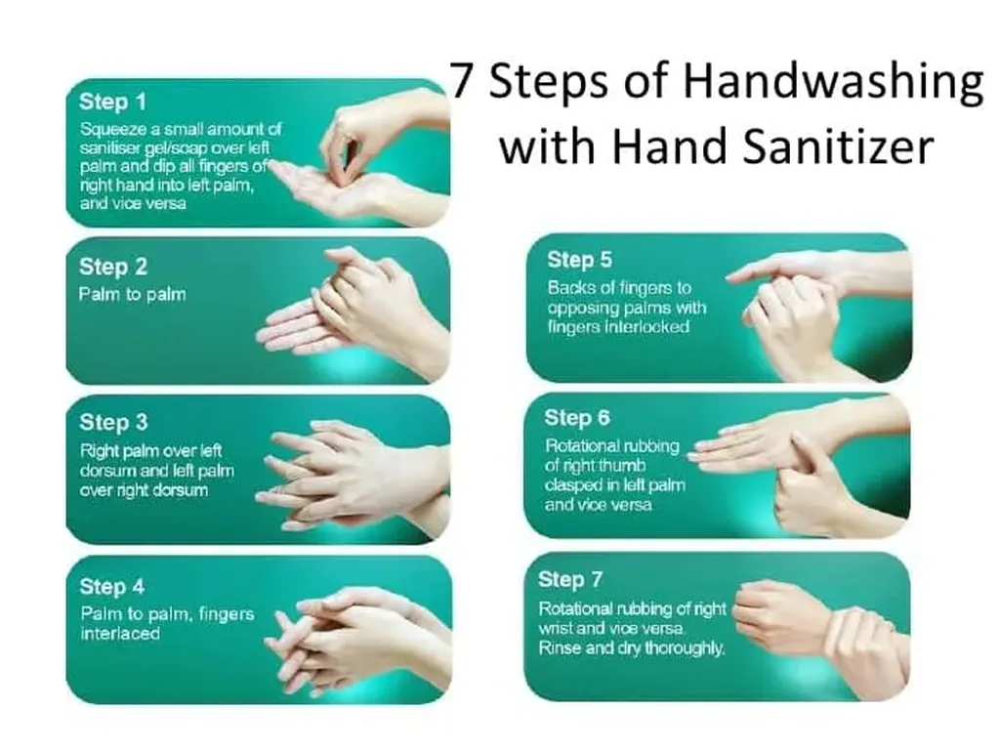

# Le coronavirus met en évidence le clivage privé-public

Suite à [mon explication de pourquoi nous manquons toujours de masques médicaux](pourquoi-pas-de-masque.md), un expert en propriété intellectuelle m’a fait une double objection.

Je résume mon raisonnement : la rupture d’approvisionnement en solutions hydro-alcooliques n’a jamais été totale parce qu’elles sont libres de droits contrairement aux masques au standard médical qui sont propriétaires et produits uniquement par le secteur privé.

### Objection 1 : la complexité

**Fabriquer des masques serait beaucoup plus complexe que des solutions hydro-alcooliques. Mon expert me fait cette démonstration en me décrivant un processus de fabrication de masques nécessitant des machines spécialisées.**

Pour fabriquer leurs gels, les industriels utilisent des membranes de filtrations micro-millimétriques ou ultra-millimétriques à haut débit permettent d’écarter les impuretés, mais aussi les spores contaminantes, ce qui garantit la qualité des produits. De même, ils mixent plusieurs alcools (éthilique, isopropilique…) et antiseptiques comme la [chlorhexidine digluconate](https://fr.wikipedia.org/wiki/Chlorhexidine) ainsi que divers émollients. Ces formulations nécessitent des laboratoires de haute précision, d’autant plus quand il est question de fabriquer des dizaines de milliers de flacons par jour. C’est aussi très complexe.

Tout le génie de Didier, et dans ce cas surtout de William Griffiths, a été d’imaginer une formulation simplifiée en même temps qu’ultra efficace, après des dizaines et des dizaines d’essais. Par exemple, William a eu l’idée d’introduire le peroxyde d’hydrogène pour tuer les spores ce qui rend inutile les membranes de haute technologie et donc pas mal de machinerie. Tout a été fait pour que, après deux jours de formation, un pharmacien puisse lancer sa production à partir de [produits communément disponibles](../3/recette-hydroalcoolique-maison-validee-hug.md) : alcool, glycérol, peroxyde d’hydrogène. **La simplicité n’est pas un fait du hasard mais elle a été recherchée.**

Un masque open source devrait obéir aux mêmes règles : être simple à fabriquer tout en offrant un très bon niveau de protection. Il ne sera sans soute pas aussi performant que des masques nécessitant des machineries complexes, mais il restera très satisfaisant, surtout pour un usage grand public.

Il en va de même pour les formulations hydro-alcooliques. Dans les hôpitaux, même aux HUG à Genève, on n’utilise pas les formulations OMS, mais des produits plus sophistiqués qui tuent un spectre plus large de pathogènes, plus vite, plus durablement tout en protégeant mieux la peau des soignants.

La première objection ne tient pas. Un concept de masque open source doit intégrer dans sa conception la simplicité de fabrication et la possible décentralisation de la production, quitte à utiliser les outils grand public d’aujourd’hui comme des imprimantes 3D.

Les formulations hydro-alcooliques ont été pensées pour les pays pauvres, pour les situations de crise. Nous avons besoin d’un modèle de masque répondant aux mêmes critères, mais aussi des modèles de blouse, de surblouse, de gants et des autres équipements médicaux de première nécessité. Plutôt que de les stocker par milliards, nous devons pouvoir les produire partout quand la demande s’accroît soudainement.

### Objection 2 : les brevets

**Mon expert me rappelle que les brevets ont une durée limitée, souvent de 20 ans. Donc que Didier ait donné ou non les formulations ne changerait rien.**

Un petit rappel chronologique. L’OMS a publié les formulations en 2009. Depuis, grâce à cette publication, une soixantaine de pays pauvres fabriquent des solutions hydro-alcooliques et les soignants sauvent des millions de vies, et désormais c’est le monde qui fabrique ces solutions, sans demander l’avis d’un ayant droit.

Si Didier Pittet n’avait rien fait, nous en serions toujours à utiliser les produits industriels qui même s’ils étaient tombés dans le domaine public seraient trop complexes à fabriquer dans les laboratoires souvent précaires. Nous serions en rupture de stock, dépendant d’un lointain fournisseur relocalisé en Chine.

Comment nous en sortirions-nous en ce moment ? D’où viendraient les solutions que fabriquent les officines ou les parfumeurs ? Nous ferions quoi ? Nous serions en train de fouiller [les archives de brevets](https://worldwide.espacenet.com/patent/search) pour déterrer une formulation périmée, dont nous ne connaîtrions même pas l’efficacité ? Nous serions tout simplement dans la panade comme nous le sommes avec les masques dont certains modèles ne sont plus brevetés. Mais est-ce que ces brevets désormais libres de droits changent quelque chose pour nous, là, tout de suite ? Vous voyez bien que non.

Un produit ouvert, ce n’est pas juste un brevet, c’est toute une philosophie, avec le partage d’une abondante documentation, d’un savoir-faire, de retours d’expériences, de travaux scientifiques de validation, de mise à l’épreuve sur le terrain.

C’est un processus ouvert. Les formulations hydro-alcooliques OMS n’ont pas évoluées depuis 2009, mais rien ne l’empêche et les pays pauvres n’auront pas besoin d’attendre vingt ans pour disposer de cette innovation. Par exemple, le protocole de lavage des mains, partie intégrante du don, est en train d’évoluer vers la méthode [le bout des doigts d’abord](https://www.cambridge.org/core/journals/infection-control-and-hospital-epidemiology/article/revisiting-the-who-how-to-handrub-hand-hygiene-technique-fingertips-first/BB3A23BD9AC25DF05B52DD9F0E4E1F41), dont on a démontré en 2017 qu’elle était plus efficace que celle initialement proposée. Tout cela évolue en continu, sans impliquer sans cesse de nouveaux brevets qui repousseraient l’échéance du domaine public.

Prenons l’analogie informatique : Windows et macOS évoluent sans cesse. Ils ne sont jamais tombés dans le domaine public. Qui voudrait d’ailleurs d’un système d’exploitation d’il y a vingt ans, qui serait figé dans le passé ?

Le Sterillium, le premier gel hydro-alcoolique commercialisé en 1965, est toujours commercialisé, mais c’est un autre produit. Les industriels sont assez malins pour apporter régulièrement des innovations pour que leurs produits gardent une longueur d’avance sur les brevets déposés vingt ans plus tôt.

Un produit breveté qui évolue, et tout produit de pointe doit évoluer, ne tombe jamais dans le domaine public, sauf s’il y est versé sciemment.

En donnant les formulations et les protocoles qui les accompagnent, Didier a fait en sorte que tous les humains soient égaux vis-à-vis de cette innovation indépendamment de ses évolutions, indépendamment de leurs ressources, ici et maintenant.

[L’AFNOR propose un plan open source de masque.](https://masques-barrieres.afnor.org/?_ga=2.109099909.1859290521.1587717282-340244931.1587717282) C’est très bien, ça va dans le bon sens, nous aurons une solution pour la prochaine crise, mais le travail reste immense pour être sûr qu’il s’agit d’une bonne solution, ou même de la meilleure solution possible en l’état de nos connaissances et technologies.

Les formulations hydro-alcooliques ont été testées durant quinze ans avant d’être libérées, avant que leur efficacité et leur innocuité soient démontrées. L’open source ne se résume pas à balancer une esquisse, il faut faire le travail jusqu’au bout, et même plus loin que ne le fait un industriel, car il faut toujours penser à la faisabilité dans toutes les conditions.

Rien de tout cela n’accompagne un brevet quelconque tombé dans le modèle public : risque qu’il soit dépassé technologiquement, risque qu’il soit trop compliqué, risque qu’il ne soit pas suffisamment efficace…

C’est aussi à cette efficacité que sert une solution open source. Elle fixe un standard minimum. Avant que Didier n’entreprenne sa campagne pour l’hygiène des mains, les produits disponibles sur le marché étaient de piètre qualité. Les industriels se sont améliorés parce que le produit en open source était déjà un très très bon produit. Il se passe la même chose avec Windows et macOS face à Linux.

La seconde objection ne tient pas davantage que la première. La question de la supériorité du libre sur le privateur ne fait aucun doute en ce qui concerne la boîte à outils des essentiels de l’humanité. La pandémie Covid-19 nous démontre que le secteur privé est défaillant en temps de crise. Nous ne pouvons pas lui faire confiance dans ces moments.

Retiendrons-nous la leçon ? Je n’en sais rien, je ne peux que l’espérer. Est-ce que nous aurons un vaccin libre, on peut le rêver. [L’OMS invite à créer une ressource commune sans utiliser le mot de bien commun, mais on n’en est pas loin.](https://www.france24.com/fr/20200424-covid-19-l-oms-mobilise-le-monde-sans-les-%C3%A9tats-unis-pour-un-acc%C3%A8s-universel-aux-vaccins) Ce serait le signe que nous changeons d’époque. Les autres mesures ne seront que broutilles, que sparadraps sur jambes de bois.

#covid #y2020 #2020-4-25-8h48
