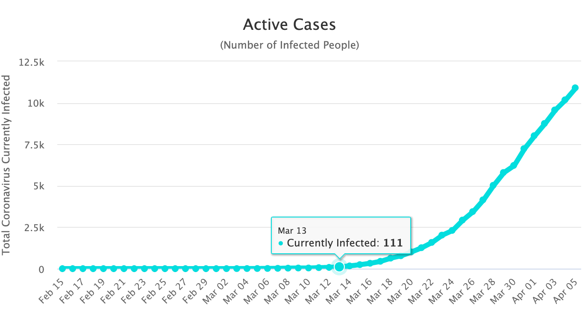
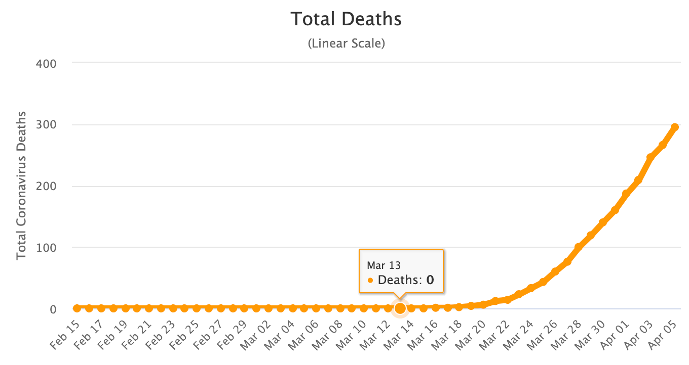
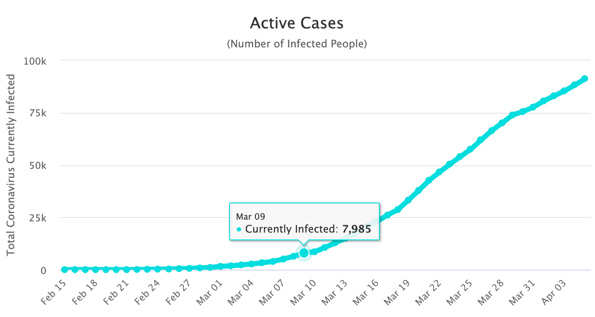
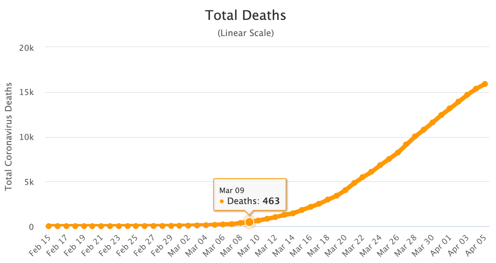

# Le gouvernement bouc émissaire de notre impuissance individuelle

On a le droit, même le devoir, d’être en colère contre le gouvernement, pour ce qu’il n’a pas fait avant la crise pour améliorer notre système de santé, pour le temps perdu pendant, pour les cafouillages, les mensonges sur les stocks de masques, de réactifs… Mais il est aussi important de s’interroger soi-même ? Qu’ai-je fait pour lutter contre la pandémie ? Quelles décisions ai-je prises et quand ? Parce que s’en remettre toujours au gouvernement ce n’est peut-être pas très raisonnable, surtout quand on doute de lui depuis des années.

Pour commencer, il était possible de ne pas voter pour lui. La prochaine fois, pensez-y. Et chaque fois que vous mettrez un bulletin dans une urne, parce qu’en face ce n’est pas mieux, voire pire. [J’ai pris l’habitude de ne pas cautionner une démocratie en perdition.](../../books/101-raisons-de-ne-pas-voter.md) Ça ne veut pas dire que je ne crois pas à la démocratie, bien au contraire, je la respecte trop pour la nier en m’exprimant par un oui/non tous les deux ou trois ans.

Donc, je suis là, moi, responsable, face à une crise et qu’est-ce que je fais de mieux que mon gouvernement ? Tout d’abord qu’est-ce que je fais pour lutter contre les pandémies identifiées. Suis-je vacciné ? Parce que si vous refusez la vaccination, si vous refusez de vous protéger et surtout de faire barrage aux virus connus pour protéger la communauté, vous êtes mal placés pour critiquer l’inaction du gouvernement, vous-même étant inactifs.

Je me place en janvier. Qu’est-ce que j’ai fait ? J’ai acheté du gel hydro-alcoolique, quatre flacons très exactement. En février, je rentre de Genève avec une crève qui ressemble à s’y méprendre à un Covid-19. Je m’isole chez moi, puis j’applique les règles de distanciation sociale. Quand je refuse les bises ou de serrer la main, on se fiche de moi. [Comme il y a déjà rupture de gel, j’achète de l’alcool 90 % pour en fabriquer.](../3/recette-hydroalcoolique-maison-validee-hug.md) Début mars, je confine ma maman de 81 ans, vais lui faire les courses, lui demande de n’approcher personne quand elle sort se promener. Je refuse les invitations des copains au restaurant comme les sorties de groupe à vélo. Et quand Isa tombe malade à son tour, plus d’un mois après moi, donc sans que je sois responsable de sa contamination a priori, nous répétons les mesures de quarantaine à l’intérieur de notre propre famille. Mais je continue autant que possible à faire du vélo, parce que faire du sport est la meilleure façon de stimuler mon système immunitaire.

Voilà ce que j’ai fait. Ce n’est pas extraordinaire. Les Hongkongais ont collectivement et spontanément appliqué ces mesures dès la fin janvier, alors qu’il n’y avait encore aucun cas chez eux, aucun mort. Résultat : quatre victimes au 6 avril. Ok, ils ont ajouté le port du masque, chez eux un comportement installé depuis longtemps. Mais le masque est inutile sans une scrupuleuse hygiène des mains qui doit rester la priorité des priorités.

On parle de l’exemplarité des pays asiatiques, mais on trouve aussi des pays exemplaires en Europe. Au Portugal, le confinement entre en vigueur le 13 mars alors que [le pays ne compte aucune victime](https://www.worldometers.info/coronavirus/country/portugal/), mais les Portugais se sont [autoconfinés et disciplinés depuis une petite semaine](https://www.francetvinfo.fr/sante/maladie/coronavirus/lexemplarite-des-portugais-dans-la-pandemie_3870963.html). Ils ont stoppé l’épidémie avant l’explosion exponentielle. Ils l’ont fait au regard de ce qui se passait chez leurs voisins. Plus on se confine tôt, plus c’est efficace, plus on peut adopter des mesures douces et éviter les lois liberticides. Résultat : 295 victimes au 6 avril.

L’Italie se confine totalement le 9 mars, alors que le pays compte 463 victimes. Nous sommes en pleine explosion exponentielle et elle se prolongera durant plus de deux semaines avant de se calmer. Résultat : 15 887 victimes au 6 avril, malgré un confinement extrêmement dur. Plus on s’y prend tard, plus il faut être contraignant. Le gouvernement italien fait payer à ses concitoyens sa lenteur de réaction.

En France, le confinement entre vraiment en vigueur le 17 mars, alors que nous décomptons 175 victimes. Nous nous y prenons plus tôt que l’Italie, mais bien plus tard que le Portugal ou que l’Allemagne ou que bien d’autres pays. C’est ce que je raconte dans [mon histoire non officielle de la pandémie](pourquoi-le-confinement-etait-la-seule-strategie-possible.md), nous avons perdu potentiellement deux semaines.

La logique finalement est simple : plus on confine tôt, c’est-à-dire quand la courbe est basse et avant l’inflexion de l’exponentielle, plus on peut confiner légèrement et donc moins on perturbe la vie quotidienne et l’économie. Comme en Italie, notre gouvernement nous fait payer son manque de réactivité, allant jusqu’à utiliser des [hélicoptères pour traquer les randonneurs en montagne](https://france3-regions.francetvinfo.fr/grand-est/haut-rhin/colmar/vosges-helicoptere-traque-randonneurs-1811844.html). C’est surréaliste d’en arriver là. Cette simple anecdote révèle un échec de la France toute entière. L’administration nous fait payer son incurie, nous démontre une mesquinerie à s’étouffer de rage.

Mais j’en reviens à nous, à chacun de nous. Étions-nous prêts à réagir à une logique exponentielle ? De toute évidence, nous l’étions moins que les Portugais ou les Hongkongais, et ce n’est pas seulement à cause de notre gouvernement, c’est un peu aussi de notre faute, peut-être de notre habitude à trop compter sur lui, d’attendre qu’il nous donne le droit d’aller pisser. Dans les faits, nous n’étions ni prêts individuellement ni collectivement. Cette double impréparation est le symptôme d’un mal national que nous devrons régler au plus vite.

Parce qu’un autre problème exponentiel nous menace, le réchauffement climatique. Êtes-vous prêts à changer de mode de vie tout de suite pour éviter la crise climatique ? Si oui, pourquoi n’avez vous encore rien changé ? Face à un processus exponentiel, nous sommes très mal équipés intellectuellement. Pour une simple raison : de tels processus nous tuaient par le passé, ne nous laissant pas le temps d’évoluer et d’apprendre.

On peut donc critiquer à plus soif le gouvernement, ça fait du bien, mais il ne faudrait pas oublier l’autocritique, sans quoi le prochain gouvernement sera composé des mêmes hommes et femmes qui n’auront fait aucun travail sur eux-mêmes, et qui commettront les mêmes erreurs que leurs prédécesseurs.

Nous vivons dans un monde complexe, par nature imprévisible, bourré de boucles de feed-back amplificatrices, donc d’exponentielles. Nous devons nous mettre cette logique dans le crâne, très profond, sinon la prochaine crise nous prendra tout aussi au dépourvu. Nous dirons « mais nous avons des masques, des blouses, des je ne sais pas quoi  », et c’est autre chose de vital qui nous manquera et que nous ne saurons pas fabriquer, parce que nous aurons délégué à d’autres notre puissance industrielle.

Et qu’est-ce que la puissance industrielle aujourd’hui ? Pas des usines dédiées à la fabrique de masques ou de blouses ou de respirateurs, mais des usines qui, du jour au lendemain, peuvent s’adapter, changer du tout au tout leur production, grâce à des imprimantes 3D, des robots, du code, des montagnes de code. Des usines souples contrairement à notre administration procédurière.

Nous devons non seulement repenser nos vies pour les préparer à l’imprévu mais aussi notre infrastructure, à commencer par notre infrastructure gouvernementale. Un pays ne peut pas avancer dans ce siècle quand il est gouverné par des administratifs. Mais les critiques dans leur majorité exigent plus d’administration, plus de lucidité de sa part, alors qu’elle est inadaptée à la situation, et demain le sera davantage. Avant de faire le procès du gouvernement, peut-être devrions-nous balayer devant notre porte.

#covid #politique #y2020 #2020-4-6-11h1
