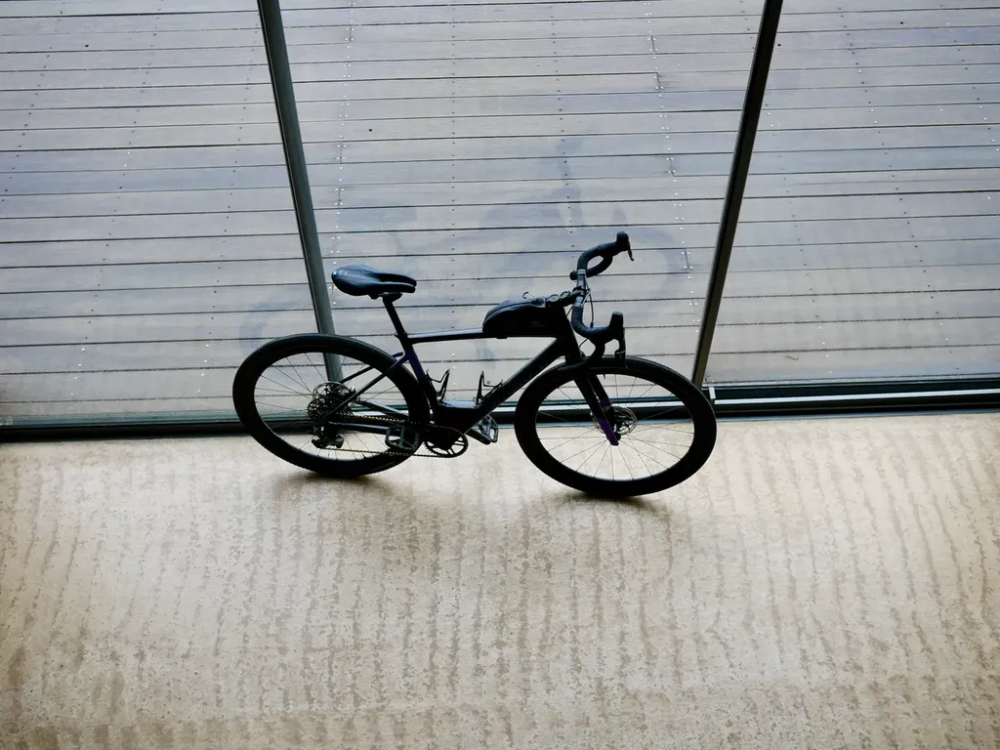

# Lettre à la Fédération Française Vélo

[Quand j’ai écrit ma lettre à Fédération Française de Cyclisme](lettre-a-la-federation-francaise-de-cyclisme.md), je n’avais pas évoqué l’autre fédération, [celle des cyclotouristes](https://ffvelo.fr/), qui pourtant elle aussi avait enfoncé les cyclistes, ne prenant que la précaution de parler au nom de ses adhérents.

J’ai attaqué la FFC parce que son communiqué avait été utilisé contre nous tous, justifiant des verbalisations abusives et les sarcasmes des donneurs de leçons se prétendant citoyens responsables alors que nous autres ne serions que des cyclistes illégitimes et anarchistes. Après ce premier dérapage fédéral, Martine Cano, présidente de la [FFvélo](https://ffvelo.fr/), a rendu publique [une lettre envoyée à la ministre des Sports le 21 avril 2020](https://ffvelo.fr/wp-content/uploads/2020/04/20095-MC-Mme-Roxana-MARACINEANU-Ministre-des-Sports-Deconfinement-Pratique-du-velo.pdf) où elle ne fait pas du vélo mais du patinage artistique.

Après une longue introduction plutôt réjouissante, rappelant des bienfaits du sport santé, on peut lire :

> Les licenciés de notre Fédération fournissent un certificat médical de non contre-indication à la pratique sportive, **ils sont donc mieux suivis médicalement que les "pratiquants libres" en dehors de toute structure fédérale**. Sans risque majeur de santé, ils pourraient renouer avec leur activité favorite sous réserve de mise en place de règles de conduite à tenir qui pourraient évoluer selon l’amélioration des conditions sanitaires du pays.

J’ai accusé la FFC de parler en notre nom alors que nous n’étions pas ses licenciés, cette fois Martine Cano enfonce le clou, se permet de juger de notre santé, nous les pratiquants libres, affirmant par exclusion que nous sommes moins bien suivis médicalement que ses adhérents. 
Mais bon sang, fichez-nous la paix. Que savez-vous de nous ? De quel droit pouvez-vous juger de notre santé au nom d’un certificat médical dont nous savons tous la vacuité et qui n’a pour but que de contenter les assureurs ? Réglez vos affaires entre vous. Nous avons déjà tous des assurances civiles qui couvrent notre pratique sportive amateur et nous n’avons pas besoin de votre licence, ni de votre protection, ni de vos conseils mal avisés. Je ne veux même pas savoir qu’elle est votre philosophie du vélo.

J’ai presque l’impression que vous concevez une fédération comme un petit pays, avec son roi ou sa reine, sa cour et ses vassaux. Je préfère être libre, d’ailleurs je fais du vélo pour me sentir libre comme vous le dite, libre semblant un sale mot dans votre lettre. Si le confinement est aussi difficile pour moi c’est parce que je suis mis en boîte, prisonnier, interdit de respirer, de profiter du monde et de partager mes enthousiasmes avec mes copains et copines. C’est d’autant plus frustrant que cette liberté m’a été retirée sans aucune bonne raison sanitaire, et même pour de mauvaises raisons que vous n’avez pas su défendre au début de la crise et que vous évoquez timidement en introduction de votre courrier.

Vous imaginez même des règles qui réduiraient encore nos libertés après le confinement, des règles qui pourraient à nouveau être mal interprétées par les forces de l’ordre trop zélées et par de nouveaux donneurs de leçon, des règles plus restrictives que celles imaginées par le gouvernement. C’est étrange ? Je n’ai jamais appartenu à aucune fédération et de l’extérieur j’ai l’impression que dans la vôtre on ne cultive pas les valeurs auxquelles j’attache de l’importance.

Heureusement, une autre fédération, [celle des usagers de la bicyclette](https://www.fub.fr/), [se bat depuis le début pour chacun de nous](https://www.fub.fr/fub/actualites/fub-obligee-saisir-conseil-etat-faire-reconnaitre-velo-moyen-transport-legitime). Après avoir saisir le Conseil d’État, elle a réussi à ce que [le gouvernement clarifie sa position](https://twitter.com/oschneider_fub/status/1253838586543321088) et admette que le vélo loisir était autorisé dans le cercle de 1 km et pour une durée d’une heure.

Le plus souvent nous faisons du vélo dans les rues, sur les routes, les chemins, les sentiers. Nous arpentons le domaine public, un domaine où nous avons le droit de nous déplacer sans permis, sans licence, sans autorisation, à notre rythme, sans polluer, sans faire de bruit. Est-ce que notre liberté vous dérange ? Est-ce qu’elle vous fait peur ? En pédalant désobéissons-nous à un dogme civilisationnel ? Sommes-nous des contestataires ? Des subversifs aux comportements séditieux ? J’en viens à me poser cette question parce que je n’ai pas vu la Fédération Française d’Athlétisme nous interdire de courir ou même de marcher, sous prétexte que nous ne serions pas en assez bonne santé. Le vélo fait peur ? Le vélo est révolutionnaire ?

Le civisme, c’est faire ce qui est bon pour soi et les autres, et pas nécessairement ce qu’une fédération ou un gouvernement croit qu’il est bon de faire. Le civisme commence avec la liberté de penser. Il n’y a pas de responsabilité sans liberté. Un cycliste heureux ose prendre les chemins de traverse.

#velo #y2020 #2020-4-28-18h37
