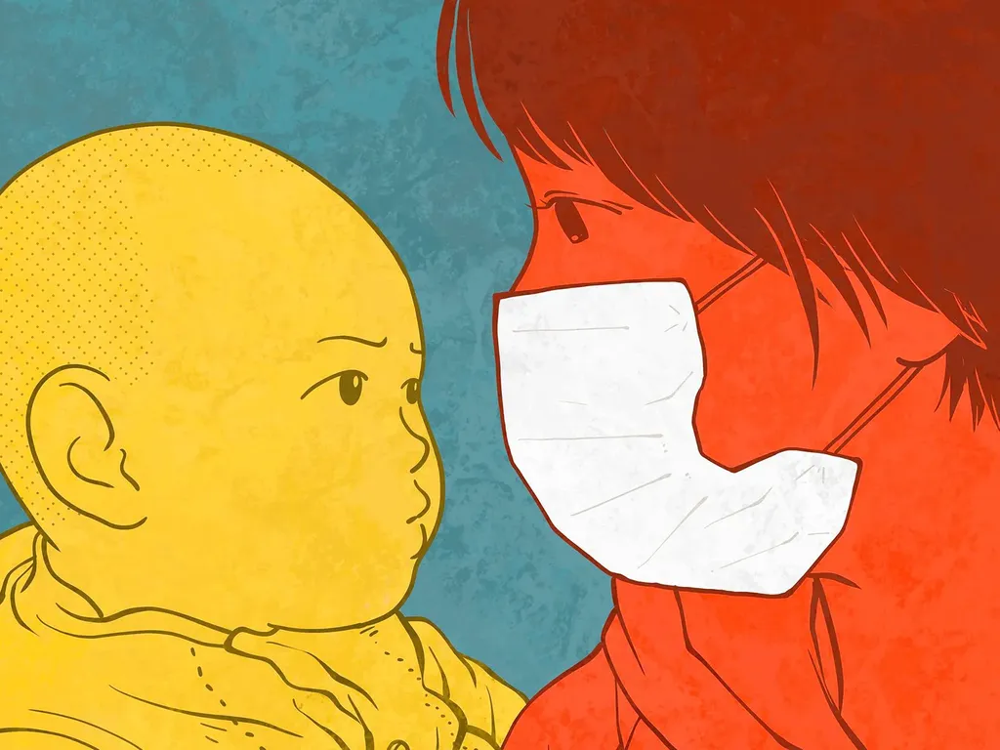

# Voilà pourquoi nous manquons de masques

Sur les réseaux sociaux, un titre change le destin d’un article, et sur le Net en général, et aussi dans la presse. Hier, [j’ai utilisé un titre manifeste](covid-19-pour-un-vaccin-en-bien-commun.md), mais j’aurais pu construire différemment mon article. Alors voici un rewriting qui intéressera peut-être les apprentis journalistes.

---

Presque quatre mois après le début de la pandémie, nous manquons toujours de masques de qualité médicale et nous risquons d’en manquer encore longtemps malgré les promesses du Président. Pourquoi ? La réponse n’est pas celle communément entendue.

Comme la plupart des autres pays, la France a renoncé à son outil industriel et s’est rendue dépendante de la Chine pour s’approvisionner. Conséquence 1. Quand la Chine a besoin de masques, elle les garde pour elle. Conséquence 2. Quand elle retrouve un excédent, elle le vend aux plus offrants et c’est la guerre, les Occidentaux s’entredéchirant pour cette ressource d’un niveau technologique proche de zéro. Très bien joué du côté chinois.

Nous n’avons toujours pas de masques à cause d’une stratégie commerciale qui démontre ses limites (enfin pourrait-on dire). Mais est-ce la seule raison ? Pourquoi les solutions hydro-alcooliques ont-elles été en rupture seulement pour une période réduite ? Pourquoi les pharmacies en proposent-elles à nouveau ?

La réponse est simple : Didier Pittet et son équipe des HUG ont rendu publiques deux formulations hydro-alcooliques en 2009 via l’OMS. Ils ont publié des guidelines pour expliquer leur fabrication et leur utilisation. Depuis plus de dix ans, partout dans le monde, surtout dans les pays pauvres, des pharmaciens préparent des solutions hydro-alcooliques. Pas de brevet, pas de droits, juste un devoir de qualité. Alors quand les solutions ont manqué en Occident, des pharmaciens occidentaux se sont également mis au travail.

Mais aucun masque n’a été versé au compte des biens communs de l’humanité, aucun plan n’a été rendu public, aucune stratégie libre de droits et validée n’a été promue. Résultat : le temps passe et rien ne se passe ou presque. Nous en sommes réduits à fabriquer nos propres masques sans avoir aucune idée de leur efficacité.

Cette histoire démontre la puissance des biens communs en temps de crise, en temps de détresse, en temps d’imprévu. Des temps vers lesquels nous fonçons, nous le savons, parce que nous sommes de plus en plus nombreux, de plus en plus imbriqués, de plus en plus interdépendants dans une biosphère essoufflée. Ne croyons pas que nous réussirons à défaire cet écheveau à moins d’une évaporation soudaine de la moitié d’entre nous. Nous sommes entrés dans un nouvel état de l’humanité et nous avons besoin d’une nouvelle logique si nous voulons survivre. S’appuyer sur un domaine public fort est une nécessité, et même une urgence.

Un problème se pose pour l’avenir immédiat : celui du vaccin qui nous permettra de vivre avec le coronavirus. Sera-t-il un bien privé ou un bien public ? On peut espérer que [si l’Institut Pasteur le met au point en premier](https://www.larecherche.fr/covid-19-biologie-sant%C3%A9/%C2%AB-notre-vaccin-est-fond%C3%A9-sur-une-strat%C3%A9gie-connue-%C2%BB), il aura le génie visionnaire de le libérer. Mais quid si c’est un industriel ? Les États pourraient le forcer à rendre publique sa découverte. Un Bill Gates pourrait acheter le brevet et le libérer. Mais sinon nous nous retrouverons dans la même logique qu’avec les masques.

Le choix des biens communs est-il une utopie ? Didier Pittet l’a fait avec les formulations hydro-alcooliques, des milliards perdus pour lui, Jonas Salk l’a fait pour le vaccin de la polio, encore des milliards perdus, Christian Drosten vient de le faire pour son test de dépistage du coronavirus, encore beaucoup d’argent perdu. Mais perdu pour qui ? Pour quelques individus pendant que l’humanité y gagne. Ces donateurs méritent que nous élevions leur statue, méritent d’être nos héros, méritent que les États assurent leurs besoins et financent leurs recherches. Voilà ceux qui doivent être nos prix Nobel.

Il ne s’agit pas d’une utopie, mais d’un problème d’éthique individuelle et collective. Aussi de la façon dont nous jugeons du succès, célébrons nos contemporains. Tant que Jeff Bezos fera plus fantasmer que Pittet, ou Salk, ou Drosten, notre monde tournera de travers. Nous devons réviser notre conception du héros contemporain. Alors peut-être vivrons-nous dans un monde plus respirable.

---

Je n’ai strictement rien dit d’autre que dans l’article précédent, mais c’est un tout autre article. J’en ai fini pour l’exercice de style. Je suis curieux de voir s’il sera davantage lu. Je suis donc en train de faire une expérience éditoriale, en open source, puisque j’affiche mes intentions. Reste que ce que je dis me paraît de la plus haute importance pour l’avenir. Je suis prêt à me répéter s’il le faut.

#covid #y2020 #2020-4-24-7h0
