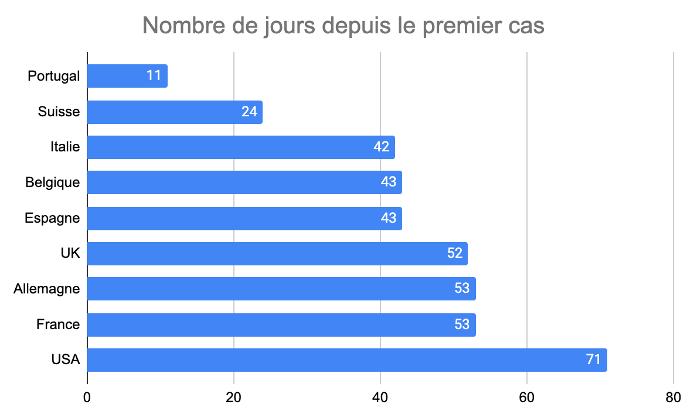

# Pourquoi on a confiné trop tard

J’ai tenté de montrer que [le confinement était la seule solution envisageable pour combattre la pandémie](pourquoi-le-confinement-etait-la-seule-strategie-possible.md), donc de défendre le gouvernement en ce sens, me faisant accuser d’être un macroniste, ce qui doit bien faire rire mes connaissances et mes lecteurs habituels, mais je n’accorde pas pour autant un blanc-seing au gouvernement dans la gestion de la crise.

Dans ma défense, j’ai indiqué qu’il y avait eu un retard à l’allumage. [Le Premier ministre a déclaré le 28 mars](https://www.bfmtv.com/mediaplayer/video/edouard-philippe-je-ne-laisserai-personne-dire-qu-il-y-a-eu-du-retard-sur-la-prise-de-decision-s-agissant-du-confinement-1234506.html) : « Chacun pourra apprécier les moments où les gouvernements ont pris cette décision, mais je ne laisserais personne dire qu’il y a eu du retard sur la prise de décision s’agissant du confinement. » Je suis désolé, mais je vais non seulement le dire mais le démontrer.

Par rapport à nos voisins et principaux partenaires, au regard du nombre de morts ramené à notre population, nous avons pris la décision en quatrième position, derrière le Portugal champion incontesté, l’Allemagne et la Belgique. Si d’autres on fait mieux que nous, on aurait pu mieux faire, ne serait-ce que gagner quatre jours en annulant le premier tour des municipales, quatre jours c’est énorme face au développement exponentiel d’une pandémie (entre le discours de Macron le 12 mars et le 17 mars, le nombre de victimes a triplé).

Par rapport à l’apparition du premier cas, seuls les États-Unis ont fait pire que nous (sachant qu’il ne sont pas totalement confinés).

Par rapport à la première victime, nous sommes encore médiocres, seuls les États-Unis et l’Espagne étant plus lents que nous. Même l’Italie, alors qu’elle a reçu l’épidémie frontalement bien avant nous, a été plus rapide dans sa décision. Ces graphiques nous montrent en outre pourquoi l’Allemagne et le Portugal font mieux que nous, ils ont était tout simplement plus rapides. Leurs systèmes de santé ne sont pas nécessairement meilleurs, mais leurs gouvernements sont plus agiles (et aussi leurs administrations).

Ne serait-il pas temps de reconnaître vos erreurs, d’admettre une fois pour toutes qu’en face de vous il subsiste quelques cerveaux allumés ? [Dans cette histoire, la Chine nous a démontré où conduisaient les méthodes d’intoxication.](le-mensonge-chinois.md) On ne peut pas faire mieux ?

#covid #politique #y2020 #2020-4-9-7h6
