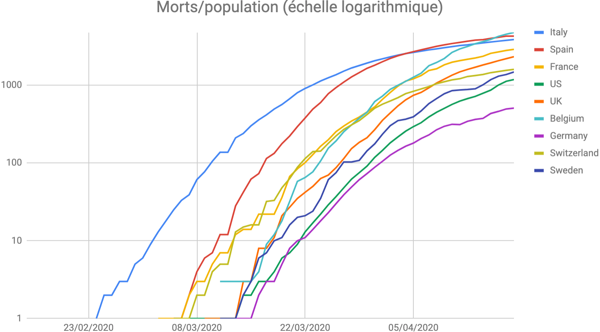
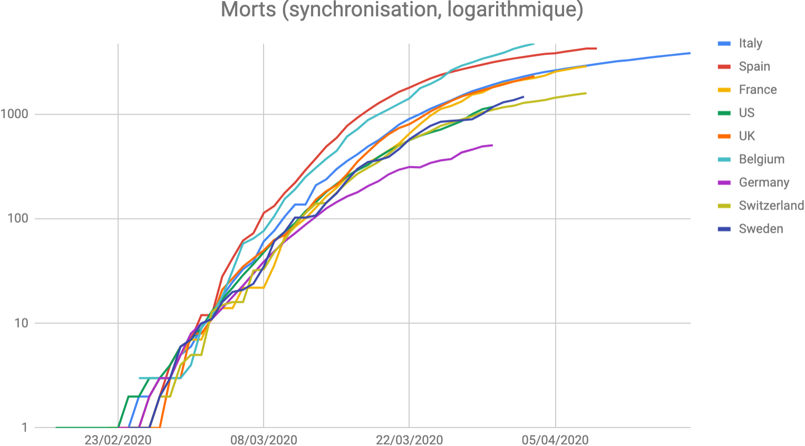
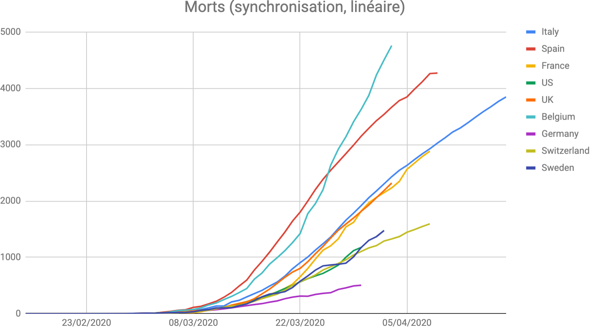

# Une preuve de l'inutilité  du confinement ?

N’oubliez pas le point d’interrogation à la fin du titre de cet article. Je n’affirme rien, je m’interroge, mais les données qui nous remontent de l’ensemble du monde commencent à parler et à nous raconter une [histoire inimaginable quand nous avons décidé de confiner](pourquoi-le-confinement-etait-la-seule-strategie-possible.md).

[À force de regarder les courbes des différents pays](https://www.worldometers.info/coronavirus/#countries), je me suis dit qu’elles se ressemblaient toutes. Pour essayer d’y voir plus clair, [j’ai chargé les données globales de morbidité](https://github.com/CSSEGISandData/COVID-19) et j’ai commencé à les comparer pour l’Italie, l’Espagne, la France, la Belgique, les US, le Royaume-Uni, la Suisse, l’Allemagne et la Suède (les nombres de cas n’ont pas d’intérêt puisqu’ils dépendent des tests effectués ou non).

J’ai choisi ces pays parce que certains sont nos voisins, parce que les US ont une politique de gestion de la crise chaotique et que la Suède fait confiance à ses citoyens, ne leur imposant que peu de contraintes (on est à l’opposé du confinement à la française). Pour que les données soient comparables, je les ai pondérées par rapport à population des pays. J’ai alors commencé à tracer les courbes, retrouvant les graphiques publiés partout, mais avec la capacité de jouer avec ([vous pouvez m’imiter](https://docs.google.com/spreadsheets/d/1-pal9ZwhwtSA1kr0sH8POnrKsNPMM0rRnpqlN3ax5aY/edit?usp=sharing)).

### Morts/pop - linéaire

On voit tout de suite les trois mauvais élèves : Espagne, Belgique, UK… Leurs courbes coupent et dépassent celles des pays entrés en crise avant eux. Quand on se contente de ce graphique, on en conclut que la Belgique est l’âne de la classe et l’Allemagne, comme d’habitude, la meilleure élève.

### Morts/pop - logarithmique

Passer à une échelle logarithmique permet de niveler les écarts de mortalité et de mieux comparer les courbes, donc les évolutions, ce qui nous intéresse plus que les chiffres dans l’absolu. Ce changement de perspective révèle que plus la pandémie commence tard dans un pays, moins il décompte de morts (seuls les mauvais élèves contredisent cette observation).

Les US et la Suède ont pratiquement la même évolution, avec des politiques pas très éloignées, mais ces évolutions ne diffèrent guère de celles des pays qui confinent.

On voit que la France et la Suisse ont initialement leur destin lié, jusqu’à ce que la Suisse, malgré un confinement moins strict, se mette à faire mieux que la France, ce qui semble démontrer que l’efficacité du confinement dépend de la bonne volonté des citoyens et non de la répression exercée sur eux (on peut même penser que la répression à la française a un effet contre-productif — on pourrait appelé ça le syndrome de la prohibition).

L’Allemagne s’en tire mieux parce que, au regard de sa population, la pandémie y commence bien plus tard, donc mécaniquement avec une mortalité plus faible, et elle garde cet avantage. Difficile de dire que c’est sa politique de dépistage qui a compté dans cette histoire ni la qualité de son système hospitalier. La courbe allemande ne nous montre pas que l’Allemagne fait mieux que les autres pays. Elle est juste moins touchée parce que touchée plus tard. Ce qui peut-être sous-tiendrait la théorie selon laquelle le virus s’atténue avec le temps (parce qu’il se transforme, parce que nous allons vers l’été, parce que son R0 est très élevé, sa mortalité très faible… les hypothèses explicatives ne manquent pas).

Il « semblerait » donc que le point de départ des courbes détermine leur évolution plus que les politiques de santé. C’est assez étrange.

### Synchronisation - logarithmique

Pour essayer de mieux comprendre ce phénomène, j’ai fait glisser les différentes courbes pour qu’elles coupent toutes en même temps la ligne des 10 morts/100 000 habitants.

On voit à nouveau que l’Espagne et la Belgique s’en tirent moins bien et que l’Allemagne s’en dire mieux (un facteur 10 d’écart est loin d’être négligeable).

Mais une chose est assez étonnante : les courbes suisse (confinement doux), US (confinement anarchique) et suédoise (pas de confinement) sont pratiquement superposées, comme si des politiques différentes conduisaient aux mêmes résultats. Pire, l’Italie et la France font moins bien avec des politiques bien plus liberticides (mais en étant entrés en crise plus tôt).

### Synchronisation - linéaire

L’observation précédente est plus criante sur une échelle linéaire. Italie, France, UK sont sur le même bateau, tout comme Suède, US et Suisse.

De ces observations graphiques, on pourrait sans doute hâtivement conclure que plus un pays entre tard en crise mieux il s’en tire. On peut aussi se dire qu’un pays entre tard en crise parce qu’il a été prévoyant, [mais la Belgique et l’Allemagne ont été aussi rapides](quand-le-gouvernement-nous-ment-preuves.md) pour des résultats opposés.

L’autre conclusion : ce n’est pas le confinement qui serait efficace, mais l’attitude des citoyens, voire l’attitude du virus lui-même.

Mais qui est finalement le bon élève ? Le pays parti tôt dans la crise mais qui, plus elle avance, rejoint ceux partis tard. Non, ce n’est pas l’Allemagne. Sur le graphique mort/pop logarithmique, elle reste à sa place, avec une courbe pas franchement différente de l’Italie. La Suisse fait mieux que tous les autres. Partie en même temps que la France, elle rejoint peu à peu la Suède, sa courbe coupant à la baisse celles de plusieurs pays partis plus tard dans cette course morbide.

Est-ce un hasard ? Non, la Suisse, et Genève en particulier, héberge l’équipe la plus compétente au monde en contrôle et prévention des infections, une équipe qui influence les décisions politiques, une équipe impliquée médiatiquement. Je ne suis peut-être pas très objectif, puisque j’y ai des amis, puisque j’écris sur eux depuis des années, mais les résultats sont là. Une crise sanitaire ne doit pas être confiée seulement à des épidémiologistes, qui travaillent en laboratoire le plus souvent, voire uniquement sur des modèles mathématiques, mais à des spécialistes de la prévention, qui se battent au quotidien pour réduire les infections dans les hôpitaux. En temps de pandémie, la planète entière devient un hôpital, et c’est à ces spécialistes qu’il faut demander de décider des politiques de santé publique (le port du masque n’est conseillé en Suisse qu’en cas de contact rapproché, quand la distanciation sociale est impossible).

J’insiste sur ce point parce qu’en France nous entendons tous les spécialistes s’exprimer, sauf ceux dont c’est le domaine de compétence (mais amis suisses me citent Jean-Christophe Lucet, Pierre Parneix…).

Maintenant, faites ce que vous voulez de ces courbes. Je les trouve intrigantes. Elles posent des questions non dénuées d’intérêt mais ne donnent aucune réponse.

*PS1 : Je pense toujours que [le confinement était la moins pire stratégie possible lorsque nous l’avons prise](pourquoi-le-confinement-etait-la-seule-strategie-possible.md). Je ne suis pas en train de me contredire avec cet article construit à partir de données bien ultérieures. Si nous découvrons que le confinement a été inutile, ou peu utile, il faudra simplement le reconnaître. [Le fait est qu’après le confinement le taux de morbidité a fortement baissé.](le-confinement-nous-a-sauve-la-peau.md) Mais corrélation ne veut pas dire causation. Était-ce à cause du confinement, comme je l’ai supposé initialement, ou d’autres facteurs ? L’article d’aujourd’hui laisse entendre la possibilité d’autres facteurs qui probablement n’ont rien à voir avec une immunité de groupe, c’est-à-dire l’autre stratégie qui était possible quand nous avons confiné. Par ailleurs, j’ai toujours été contre le confinement à la française, préférant de loin l’approche douce, que j’ai toujours défendue. Un truc semble évident : cette pandémie n’a probablement pas un développement exponentiel, ce que nous avons longtemps pensé, ce qui a induit tout le monde en erreur.*
*PS2 : La suite, en Suède notamment, nous montre que le confinement était bel et bien nécessaire, que sans confinement l’épidémie tarde à s’essouffler. On a aussi la confirmation que le développement n’est pas durablement exponentiel.*

#covid #y2020 #2020-4-20-10h7
