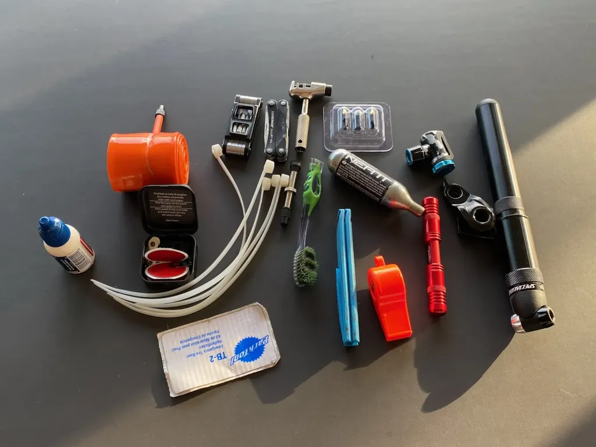
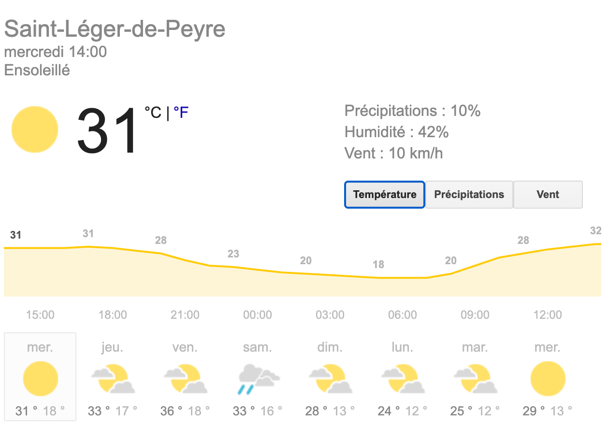
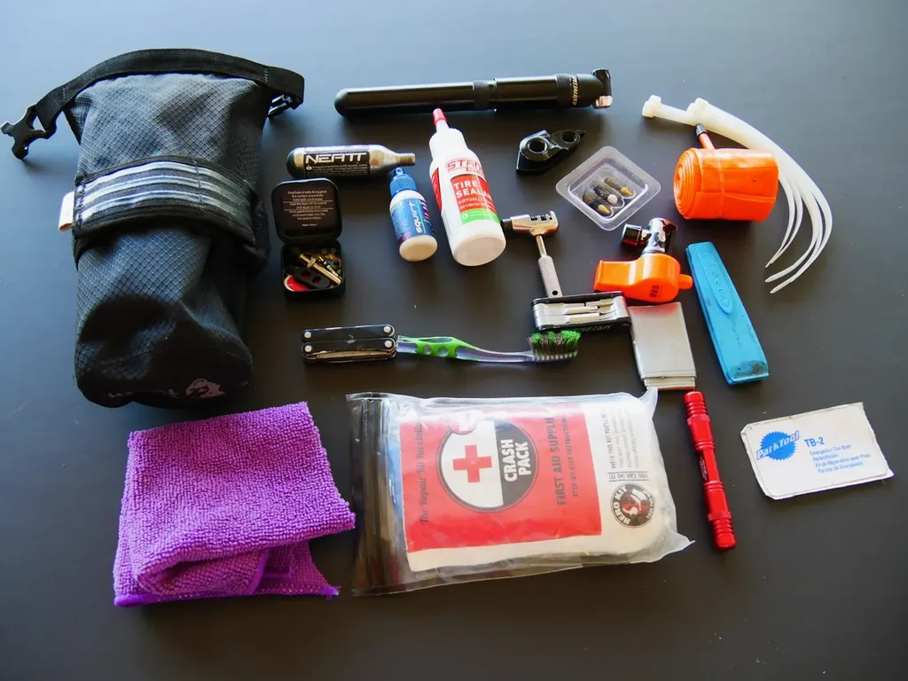
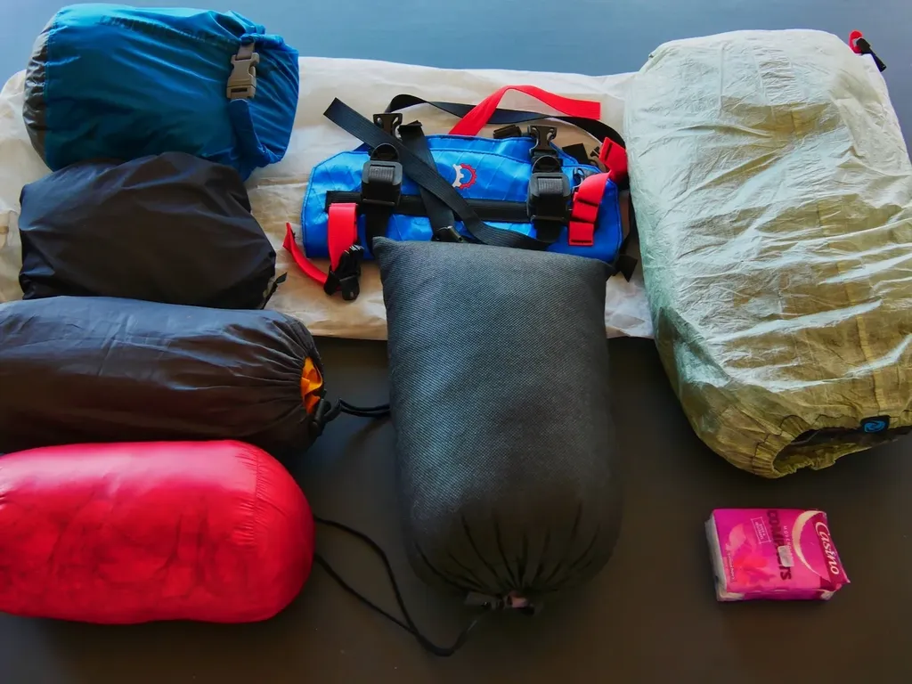
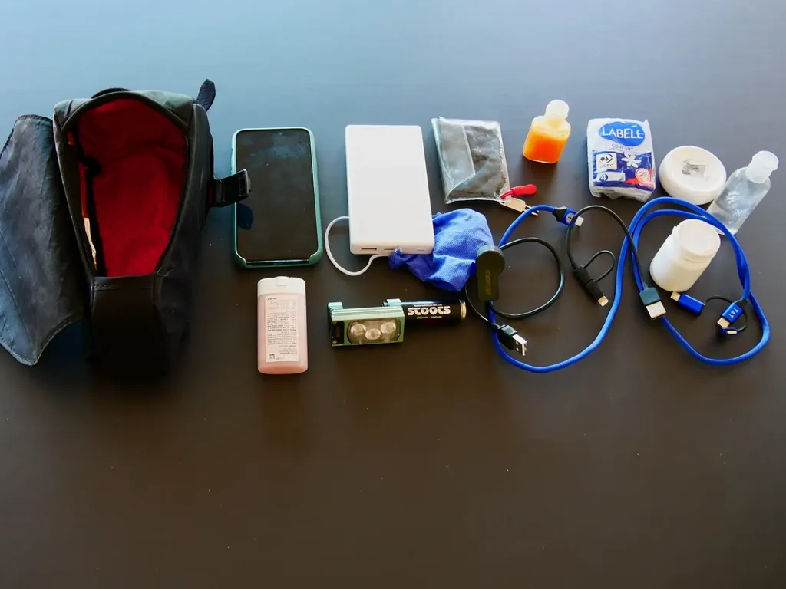
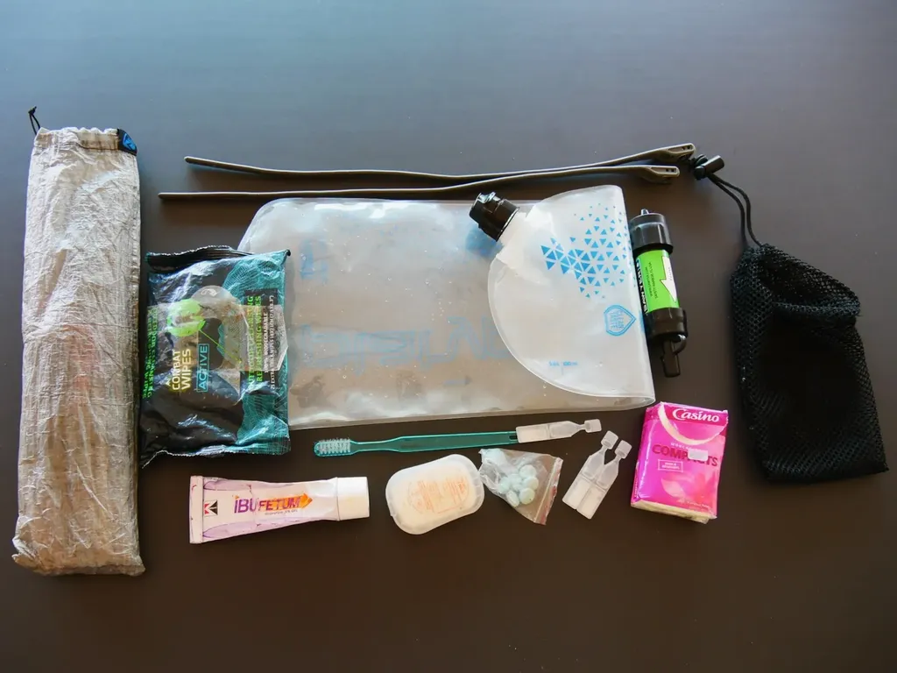

# Config Bikepacking : Houblon Tour 2020

Excepté une petite nuit dehors à l’occasion du solstice d’été, je n’ai pas encore bikepacké cette année, à cause du covid, à cause de trop de boulot, à cause de la vie. Ce week-end, je m’autorise une petite escapade de trois jours dans l’Aubrac, à l’occasion du Houblon Tour organisé par l’équipe de [Hors Traces Aventures](https://www.hors-traces-aventures.fr/).

Il fera chaud, même très chaud, ce sera la grande difficulté de ce parcours taillé pour les gravels, prévu en trois étapes pour un total de 330 km pour 6 200 mètres de dénivelé selon [VisuGPX](https://www.visugpx.com/), de quoi se faire mal aux jambes, avec pour récompense des haltes dans des brasseries, en espérant qu’elles serviront autre chose que de la bière parce que moi et l’alcool ça ne le fait pas.

Je n’ai guère fait évoluer [la config initialement prévue pour le Grand Tour de l’Hérault](../4/configuration-bikepacking-gth.md). Sur mon Epic HT version monstercross, j’ai monté des pneus de 2,1 pouces, Ground Control à l’avant, FastTrack à l’arrière. Pas très gravel tout ça, mais j’aime mon confort en bikepacking. J’ai quelque peu optimisé mon outillage et surtout je vais expérimenter une nouvelle façon de m’abreuver.

Lors de mes précédents voyages, je transportais une poche à eau de 3 litres avec une pipette ainsi qu’une gourde pliable d’un demi-litre (poids à vide 175 g). Dans la poche, je mettais des pastilles d’électrolyte et, en fin de journée, je ne supportais plus leur goût, rêvant d’eau pure. Je ne remplissais la gourde d’un demi-litre qu’au dernier ravitaillement pour avoir de l’eau claire au camp.

Cette fois, j’expérimente une configuration différente. J’ai installé sur ma fourche un [porte-bidon Arundel](https://withspirit.fr/home/1047-arundel-looney-bin-porte-bidon.html), compatible avec les bidons classiques, mais aussi avec toute sorte de bouteilles, car sa largeur est ajustable. J’y loge un bidon de 750 ml et, dans mon sac de cadre, je place une poche à eau de trois litres qui ne contiendra que de l’eau claire pour remplir le bidon où j’ajouterai ou non de l’électrolyte. J’aboutis à un poids à vide identique.

Je ne transporterai rien sur moi, pas même mon téléphone. Poids total de la config 15,3 kg auxquels s’ajouteront au départ 800 g de céréales, gels et électrolytes. Vu que des points d’eau sont régulièrement disponibles, je ne transporterai jamais plus de 2 litres d’eau. Je serai dans tous les cas sous les 20 kg, ce qui est ma limite haute acceptable.

Ma sacoche outils placée sous la selle pèse 838 g, mon sac de guidon 2 267 g, mon top tube bag avec l’électronique et des bricoles 894 g, mon sac de cadre avec notamment la poche à eau et les sardines et le piquet de ma tente sera à 796 g, soit un matos bikepacking d’un poil plus que 5 kg avec le GPS, son support, la lumière arrière… (en version printemps/automne, il faut ajouter près d’un kilo).

#velo #y2020 #2020-7-29-14h20
