# Juillet 2020

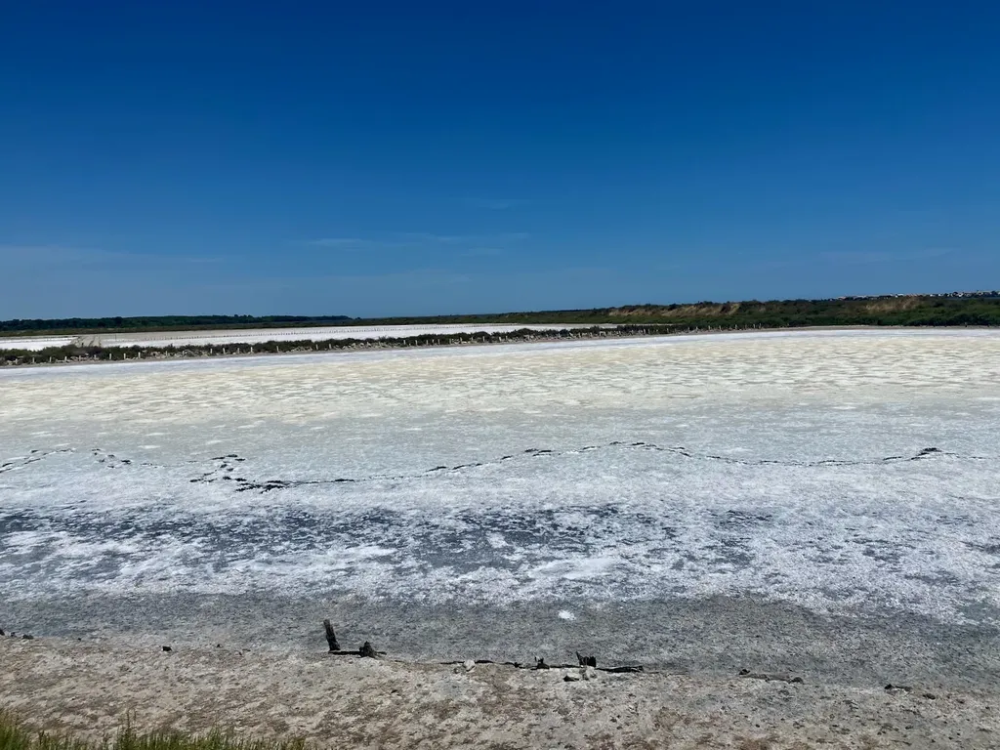

### Jeudi 2, Balaruc

Je bataille pour terminer le premier jet d’*Adapter pour adopter*, qu’aujourd’hui j’ai peut-être renommé *L’effet Pittet*, titre initial du *Geste qui sauve*. Une fois ce travail bouclé, je poursuis dans cette affaire de santé publique et tente d’écrire la vie de Didier durant le covid, de son point de vue, un travail quasi romanesque.

### Vendredi 3, Balaruc

Malgré la tempête émotionnelle, je me sens léger comme au bord d’un renouveau mystérieux.

---

J’ai consulté un psy durant ma déconnexion, une expérience peu saillante, qui ne m’a pas fait bouger. Je tente à nouveau l’expérience, pour essayer de me comprendre, de m’accepter, peut-être gagner en sagesse, je n’en sais rien, mais c’est sans objectif littéraire, seulement pour moi, je ne devrais même pas en parler.

### Samedi 4, Balaruc

Quand j’écris, je ne pense plus que j’écris, à pourquoi j’écris, j’écris, c’est tout, et c’est ainsi que ça devrait être. Je parle d’écriture quand je suis en crise littéraire, pas quand je suis dans la littérature. [Petit écho à la lettre apériodique de Philippe Castelneau.](https://castelneau.substack.com/p/rien-que-du-bruit-33)
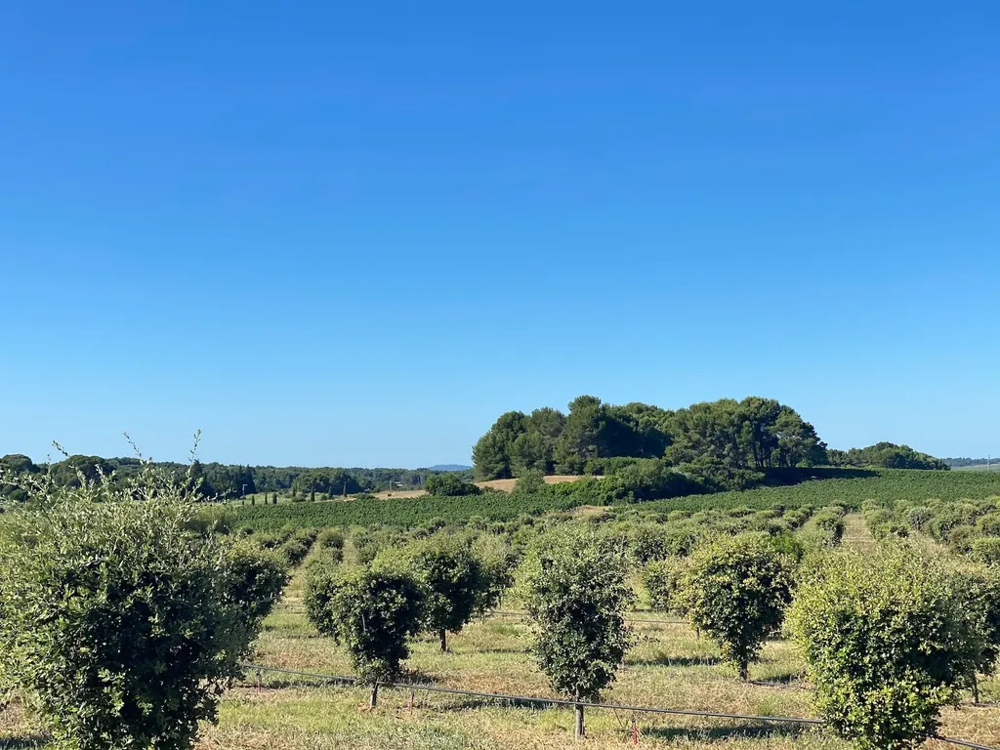
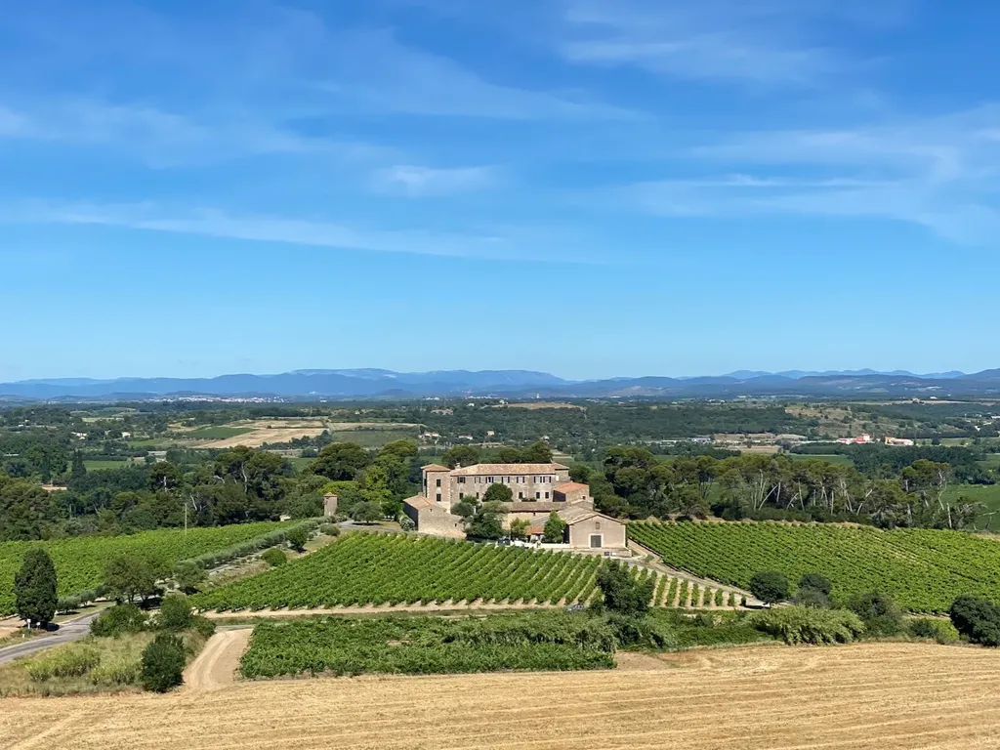
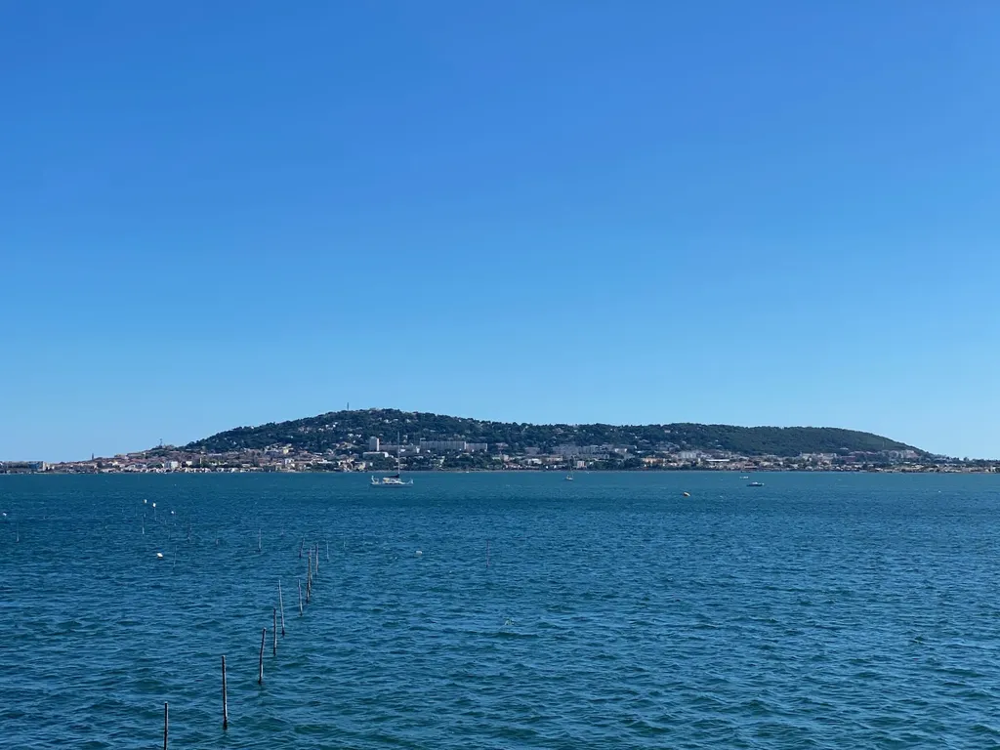

### Dimanche 5, Balaruc

Relire mon journal me fait du bien et m’encourage à persévérer dans l’exercice. [Les puritains anglais](https://www.pepysdiary.com/) utilisaient leur *diary* pour s’examiner eux-mêmes, pour effectuer le travail que l’église était devenue incapable de prodiguer. Je devrais les imiter, avancer d’un pas de plus dans l’interrogation ouverte de moi-même. Partager ma vie, c’est donner à d’autres le moyen d’étendre la leur. Voilà le but de l’art, voilà pourquoi il nous est indispensable, sans lui nous ne menons qu’une vie, avec lui nous nous démultiplions.

---

Enfant mon grand-père paternel m’a fait découvrir notre presqu’île, un grand-oncle m’a initié au vélo et à la mécanique, mon oncle à la peinture et à l’art, l’électricien du coin à l’électronique… Et votre père ? me demande ma psy. Il a été absent de mon éducation et en même temps hyper présent, sinon je n’aurais pas écrit sur lui. Il m’a sans doute initié à la vie, à sa philosophie de vie, une philosophie peut-être trop égoïste. Mais en quoi savoir cela, mettre des mots sur le passé, peut m’aider à devenir un homme meilleur ? Ma psy émet des interprétations sur tel ou tel fait de ma vie. Je lui réponds : oui, peut-être, mais d’autres explications pourraient convenir. Il n’existe pas de vérité, toute histoire est à interpréter.

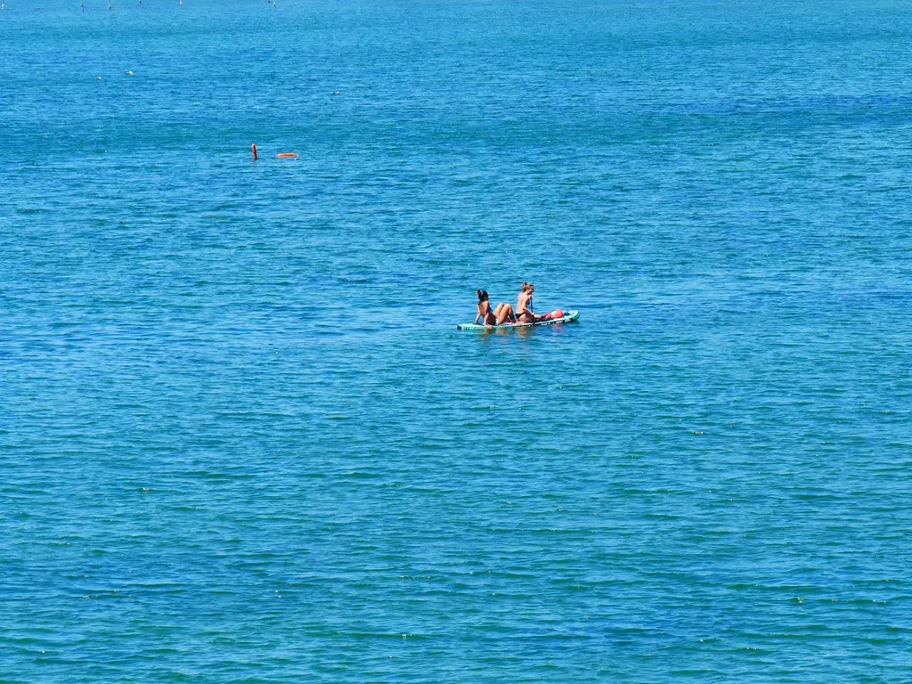

### Lundi 6, Balaruc

Nuit de mal au ventre, de douleur, de pas de repos, nuit venteuse, d’abord brûlante, puis plus respirante, mais nuit bruyante de bourrasques au dehors et au dedans, sous une lune claire, un étang irisé et les lueurs de la ville au loin où j’attrape le passage d’un train de voyageurs, un filament vermiforme au pied de la montagne. Et maintenant, je dois plonger dans la peau de Didier, écrire en son nom, à sa place, comme si j’étais lui.

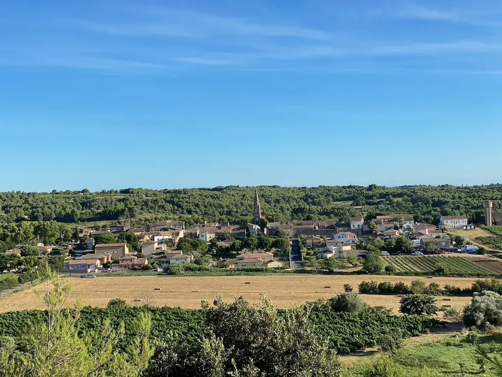

### Mardi 8, Balaruc

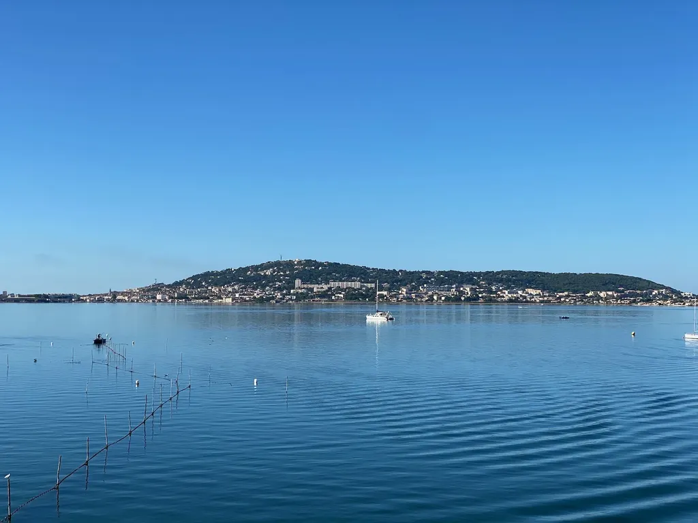
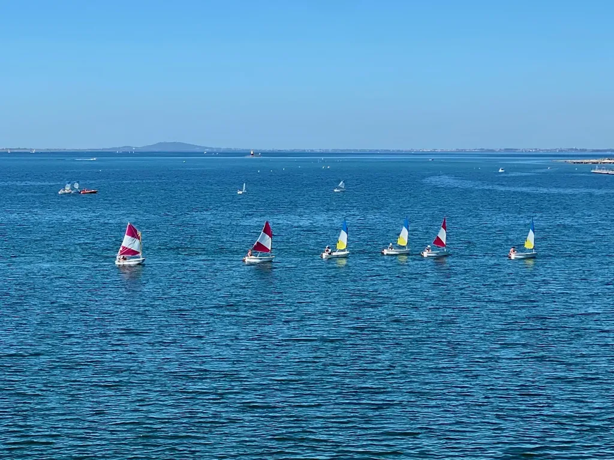

### Jeudi 9, Balaruc

Petite promenade pour m’aérer les neurones. Quand j’arrive au centre du village, des tables dressées, plusieurs centaines de vieux au coude à coude en train de manger et de chanter. Cluster en prévision. J’anticipe une rentrée de septembre plus que compromise. C’est du grand n’importe quoi. Les gens ont déjà tout oublié. La rationalité n’est pas notre fort.

### Vendredi 10, Balaruc

Plus de 50 000 signes écrits en ghostwriter, on dirait que je n’ai qu’à assembler un puzzle dont les pièces sont déjà découpées. Je ne retranscris pas des entretiens que j’aurais mené avec Didier, j’écris à partir de son agenda et de la chronologie du covid, puis je lui envoie pour validation mois par mois. Ce sera un livre de moi, signé par lui et moi, mais du pur Crouzet, dans le style de mon journal.

---

Je serais un autiste émotionnel. Mais qu’est-ce que ça signifie ? À quelles émotions serais-je insensible ? Il me semble bien les connaître [les six émotions primaires](,https://fr.wikipedia.org/wiki/%C3%89motion), les éprouver à longueur de temps, parfois avec une puissance si démesurée que j’en perds le souffle. Les émotions secondaires me sont tout aussi familières, je n’ai rien d’un psychopathe.

On me reproche sans doute de ne pas faire cas de ces émotions. Qu’est-ce que je fais quand j’écris ? Ou peut-être je n’en parle que par écrit, ce qui serait une traduction intellectuelle des émotions. Mais il ne faut pas écrire pour croire que l’écriture est intellectuelle, alors qu’elle jaillit d’elle-même, souvent elle me déborde et m’emporte où je n’ai pas pensé aller. Je crois que je suis une bombe émotive, c’est bien mon problème, et une bombe doit apprendre très jeune à se contrôler, sinon elle explose en plein vol.

### Samedi 11, Balaruc

Nous avons deux offres pour le livre en ghostwriter, aucune de petits éditeurs branchés, aucune d’éditeurs historiques, mais deux d’éditeurs dynamiques qui comme par hasard gagnent de l’argent. Nous nous disons autant aller vers le plus offrant, qui par son engagement financier nous démontre sa motivation. Les négociations commencent, heureusement Lilas gère.

### Dimanche 12, Balaruc

Quand j’étais enfant, mon père aimait nous amener au sommet du mont Saint-Baudille, dernier contrefort des Cévennes. Ce matin, nous y sommes allés à vélo.

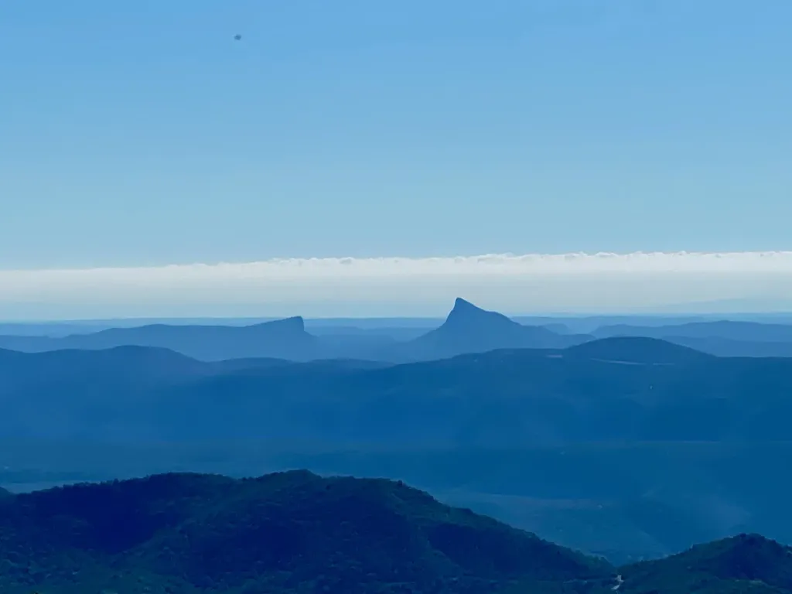

### Mardi 14, Balaruc

*The Signal* : je tombe hier soir au hasard sur ce film, un petit chef-d’œuvre d’histoire réticulaire, structuré à la perfection pour un cerveau tordu comme le mien, assez proche de ma nouvelle [*La femme qui semait des livres*](https://ours-editions.kkaoss.net/produit/la-femme-qui-semait-des-livres/), publiée aujourd’hui par L’Ours pour la modique somme de 2 €.

### Jeudi 16, Balaruc

Je prends conscience peu avant minuit de la date, l’anniversaire de la naissance de mon père. Il aurait eu aujourd’hui 84 ans, un âge respectacle, mais pas indécent.

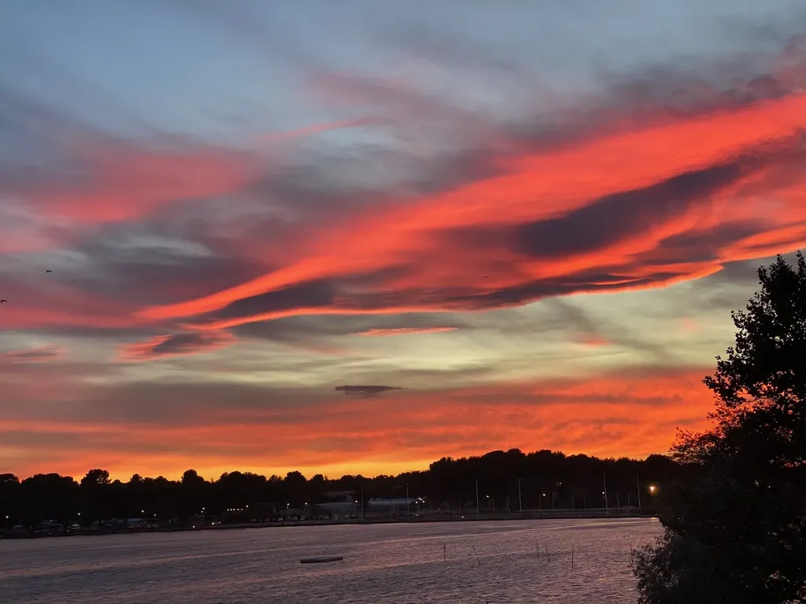

Samedi 18, Balaruc

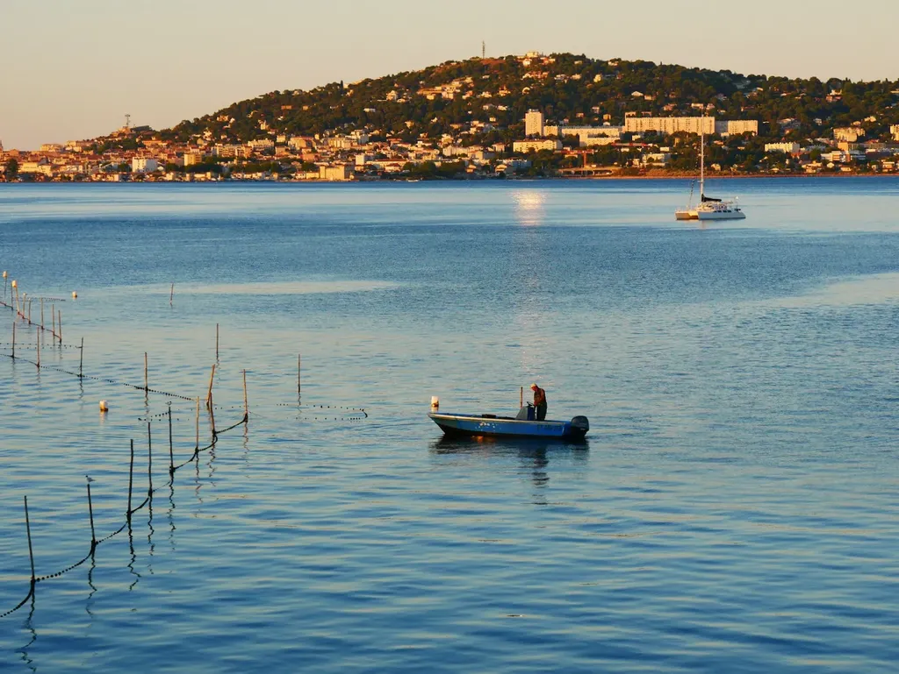
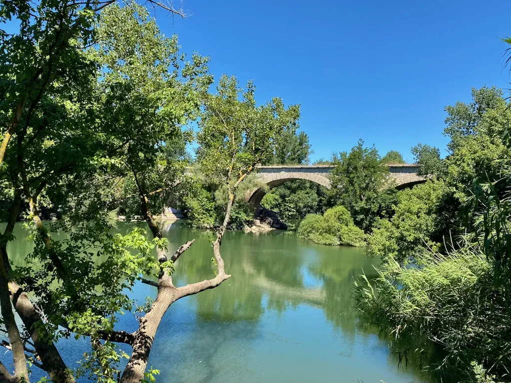
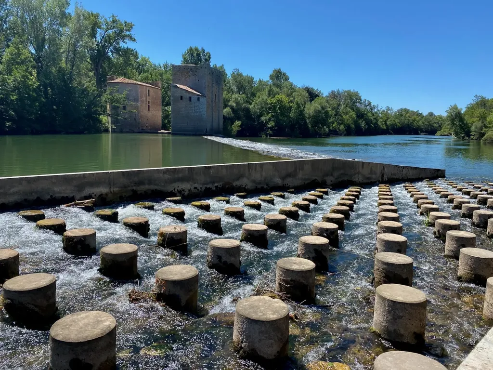

### Dimanche 19, Balaruc

Quand je rentre de pédaler, les enfants m’ont préparé un repas pour fêter avec deux jours d’avance mon anniversaire. Petits moments de bonheur avant la sieste, où nous filons tous, après avoir trop mangé.

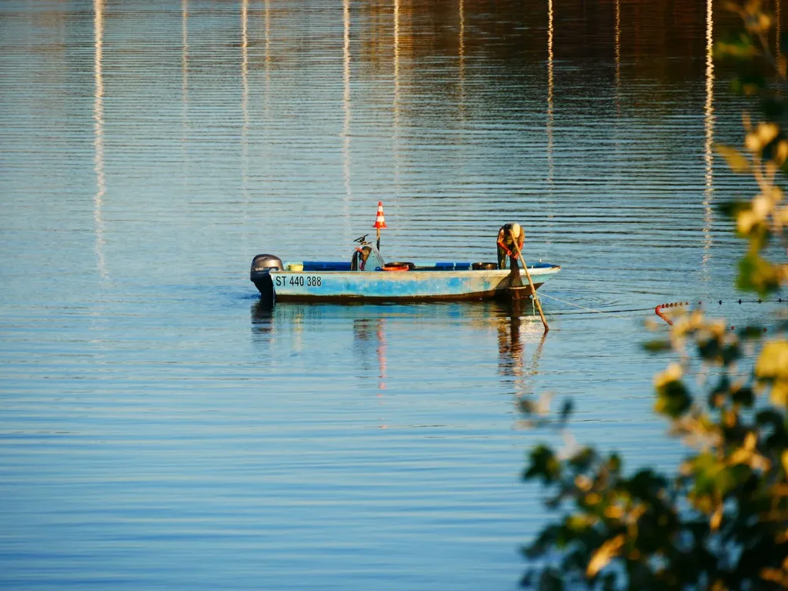

### Lundi 20, Balaruc

J’ai écrit la moitié du livre dans la peau de Didier Pittet, soit 150 000 signes en deux semaines. Nous avons décidé de le publier avec Hugo Doc, oui Hugo qui s’est fait connaître avec la romance, qui désormais se diversifie, qui nous a fait une belle offre en se montrant très réactif. Remise du manuscrit le premier septembre, envoie à l’imprimerie le 20, sortie le 22 octobre.

En attendant, j’ai rarement écrit un texte aussi exigeant mentalement, puisque j’entrecroise la chronologie mondiale du covid, avec un focus sur les situations suisses et françaises, j’y intègre l’agenda de Didier, que j’ai parcouru avec lui en juin jour par jour, j’y glisse des réflexions issues de nos échanges par mail et WhatsApp durant les six derniers mois, notamment à partir de mi-mars des notes audio qu’il m’envoyait, ainsi qu’à Patrick Chappate qui lui sort une BD à la rentrée, puis je glisse tout ce que je sais sur le passé de Didier, puis j’ajoute mon grain de sel philosophique et politique, parce que cette espèce de roman où je dis « je » à la place de Didier restera mon livre, et je le revendiquerai comme tous ceux publiés en mon nom seul. Je me mets au service de Didier, parce que c’est lui, parce que nous sommes amis, parce que c’est pour la bonne cause et parce que c’est le moment.

---

Ma psy me dit que je travaille trop, que je fuis quelque chose. Quand je lui dis que je m’éclate dans le travail, elle me dit que je ne laisse pas de place pour les autres dans ma vie.

### Mercredi 22, Balaruc

J’écris jusqu’à en perdre le sommeil. Je n’ai aucun recul, presque pas le temps de me relire, je cavale et les choses continuent de tomber d’elles-mêmes, mais avec un travail documentaire incessant, alors même que j’ai suivi au jour le jour la crise covid. Est-ce que le texte rendra ce moment si particulier de notre histoire ?

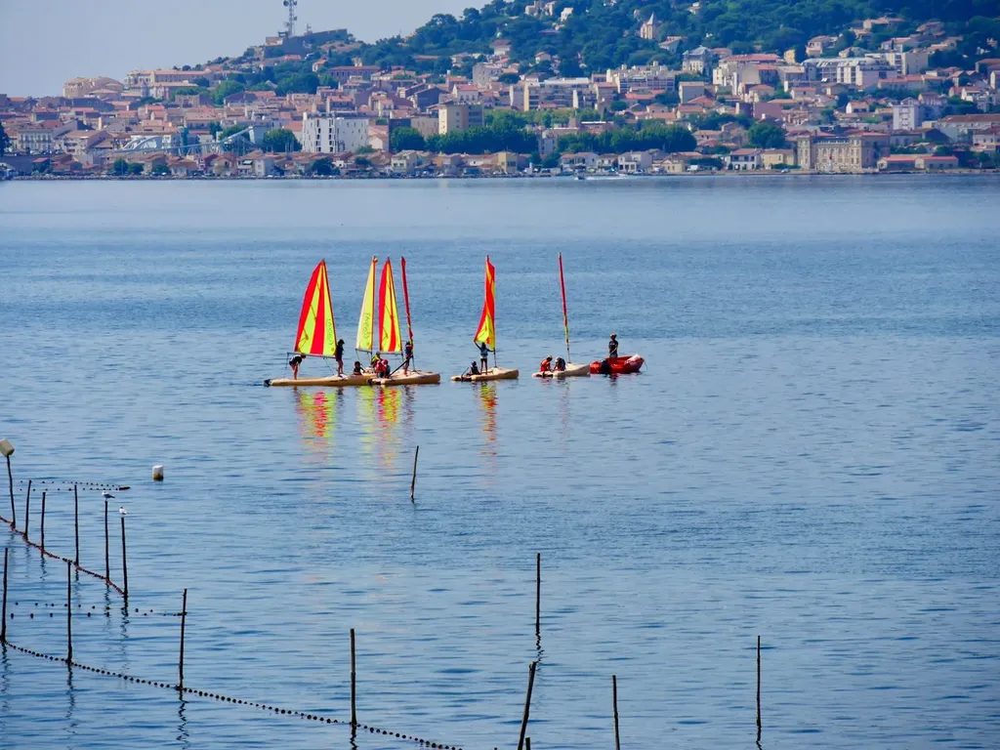

### Jeudi 23, Balaruc

Je me prépare mon bol de céréales-fruits du matin et France Info balance de l’accordéon, style musette, à la mode au début des années soixante et qui chaque fois que je l’entends me hérisse le poil, et c’est depuis toujours, va savoir pourquoi je suis allergique à cette musique, elle me fait mal, me donne la gerbe, je ne connais rien de pire, même le disco. Peut-être son côté rétrograde, passéiste.

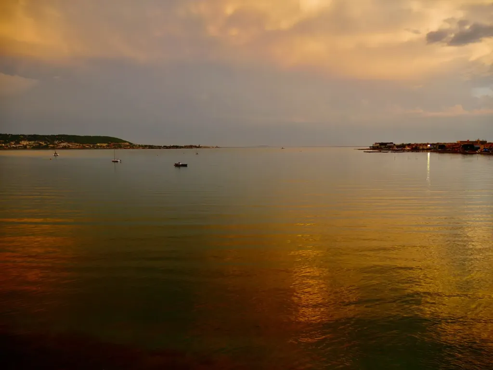

### Samedi 25, Balaruc

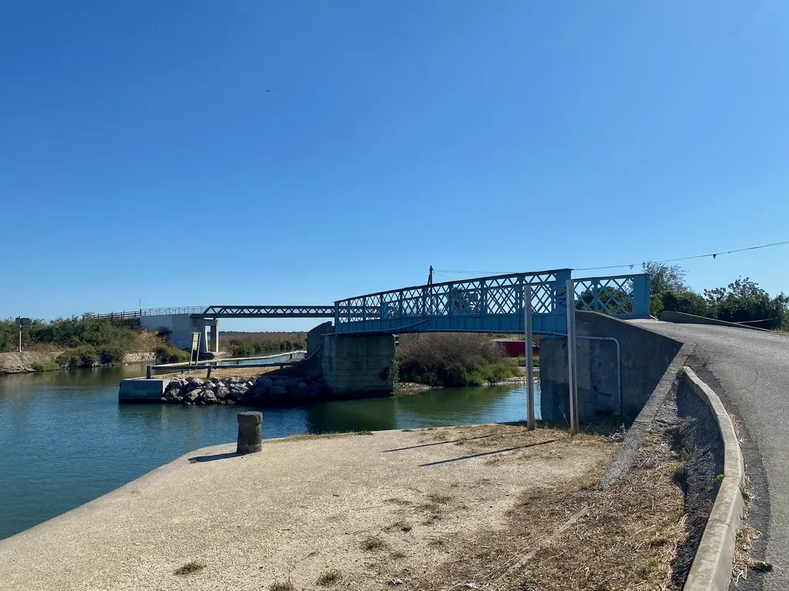
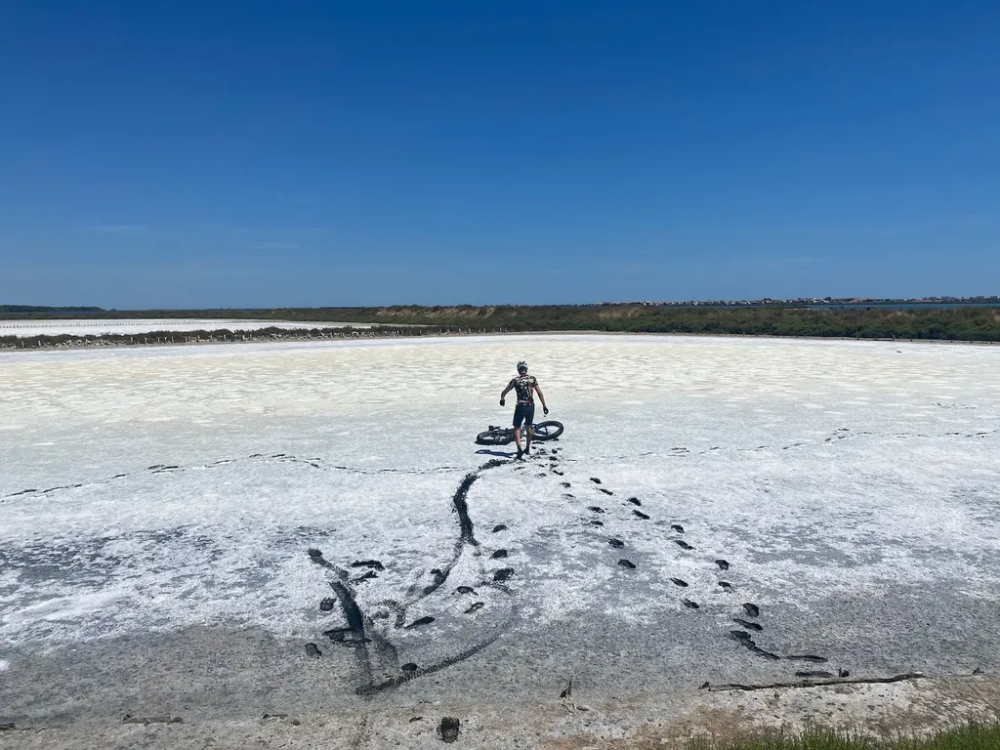

### Mercredi 29, Balaruc

J’écris, écris, fais du vélo, prévois des travaux à la maison, travaille en pointillé avec l’équipe scientifique montée par Didier pour créer un modèle permettant de comparer la réponse des différents pays face à l’épidémie. Leur approche systématique, méthodique, me rappelle pourquoi j’ai fui l’industrie quand j’étais jeune ingénieur. J’aime plonger dans le code, quitte à tout recommencer, j’aime écrire, attaquer tout de suite. Eux planifient, accumulent les sources, les épluchent. Moi j’aurais déjà commencé à construire la base de données, y injectant les indices issus d’autres bases, quitte à ce que la découverte d’autres sources bouleverse mon travail. L’action m’intéresse plus que son résultat.

### Jeudi 30, Balaruc

Mal à la tête toute la nuit, je me réveille avec un début de sinusite à la veille de [trois jours de bikepacking assez intenses](bikepacking-brulant-dans-laubrac.md), voilà qui ne s’annonce pas bien, sans parler de la canicule au programme. L’année dernière à la même époque, j’ai aussi fait une sinusite, encombrement assez fréquent chez moi en été, peut-être causé par les bains dans l’étang, où j’évite pourtant de plonger la tête.

---

J’ai désormais écrit le journal 2020 de Didier jusqu’à début juin. Le livre se terminera fin juin avec le début de la mission Macron dont il a la présidence. Intéressant travail pour moi. Me mettre à sa place, mais aussi prolonger sa pensée, lui donner des idées qu’il décide d’embrasser. Une complicité sincère s’est engagée entre nous depuis *Le Geste qui sauve*. C’est une belle aventure. Dans ce texte, Didier sera lui-même par son agenda, il y sera édifié comme personnage romanesque et j’y serai à travers cette part romanesque de lui. Le livre s’appellera *Vaincre les épidémies*.

#carnets #y2020 #2020-8-21-8h29
